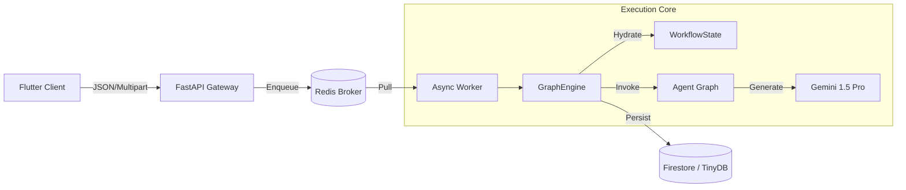

# Cognitive Quorum V3.2 (2026)

**Structured, Auditable, and Deterministic AI Orchestration.**

> **Status:** Phase 8/9 Hardening (V3.2)
> **Architecture:** Modular Async Monolith with Panel Fusion
> **Philosophy:** Zero-Magic, Fail-Fast, Strict DTOs.

Cognitive Quorum is a specialized AI orchestration platform designed for high-stakes cognitive labor—scientific peer review, legal auditing, and strategic analysis. Unlike generic chatbot frameworks, Quorum enforces a **Strict Object Mode**, ensuring that every step of the AI's reasoning is validated, persisted, and auditable.

---

## 🚀 Key Features (V3.2)

### 1. The "Zero-Magic" Manifesto
We reject "black box" agent frameworks. Quorum uses explicit, deterministic Python code:
*   **Strict Pydantic V2**: Every agent input/output is a typed **DTO**, not a dictionary.
*   **Zero-Fallback**: Configuration (Prompts, Rules, Models) must be explicit in the Database. No hardcoded defaults.
*   **Fail-Fast**: The system crashes immediately (`AppException`) on invalid configuration or schema violations.

### 2. Panel Fusion (The "Senate")
We replaced sequential agent chains with a **"Fused Panel"** architecture:
*   **Committee of One**: A single "Deep" model (Gemini Pro) assumes multiple personas (Logician, Falsifier, Profiler) in one pass.
*   **Fan-Out Pattern**: The Engine splits the Panel's output into discrete domain models for downstream consumers.

### 3. Modular Async Monolith
The system decouples **User Interaction** from **Cognitive Reasoning**:
*   **API (FastAPI)**: Handles HTTP requests and enqueues jobs (< 50ms).
*   **Worker (Arq/Redis)**: Executes deep reasoning tasks (10m+) without timeouts.
*   **Client (Flutter)**: A "Thick Client" that polls for real-time updates.

---

## 🏗️ System Architecture



For a deep dive, see **[System Architecture](docs/architecture.md)**.

---

## 📚 Documentation Index

### Core Architecture
*   **[Master Architecture](docs/index.md)**: The authoritative system reference.
*   **[Management Architecture](docs/management_architecture.md)**: System Config, Tenants, and RBAC.
*   **[Data Management](docs/data_management.md)**: Database strategies & Zero-Fallback mandate.

### Cognitive System
*   **[Structured Cognitive Architecture](docs/structured_cognitive_architecture.md)**: Panel Fusion, BARS Scoring, and the 12-Agent Pipeline.
*   **[Workflow Data Architecture](docs/workflow_data_architecture.md)**: Data contracts and the **Fan-Out Pattern**.
*   **[Prompt Engineering](docs/prompt_engineering.md)**: The "Sandwich" Strategy and Thinking Tokens.
*   **[JSON Flattening Hazard](docs/json_flattening_hazard.md)**: DTO mitigation strategies.

### Implementation & Verification
*   **[Simplified Verification Strategy](docs/simplified_verification_strategy.md)**: "Zero-Magic" testing guide.
*   **[Test Strategy](docs/test_strategy.md)**: Strict DTO testing & System Config mocking.
*   **[Seed Data & Sync](docs/seed_data.md)**: The SSOT for System Configuration.
*   **[Startup Protocol](docs/alku.md)**: Critical context for contributors.

### Development Standards
*   **[Product Roadmap](docs/product_roadmap.md)**: Phase 8 (Complete) -> Phase 9 (Strict DTOs).
*   **[Flutter Development Guide](docs/flutterpromptohje.md)**: Frontend standards.

---

## 🛠️ Technology Stack

*   **Language**: Python 3.14+ (Async) & Dart 3.5+
*   **Frameworks**: FastAPI, Arq, Riverpod 3.0+
*   **Database**: TinyDB (Local) / Firestore (Cloud)
*   **LLM**: Google Vertex AI (Gemini 2.0 Pro Exp)
*   **Tools**: `uv` (Package Mgmt), `ruff` (Linting), `presidio` (PII)

---

## 📦 Getting Started

### Prerequisites
*   Python 3.14 (Recommended: Use `uv`)
*   Docker & Docker Compose
*   Flutter SDK (3.27+)

### Installation

1.  **Clone & Setup Backend**:
    ```bash
    git clone https://github.com/launis/quorum.git
    cd quorum
    uv sync
    ```

2.  **Environment Setup**:
    Create `.env` based on `.env.example`:
    ```env
    GOOGLE_API_KEY=your_key
    ENABLE_VERTEX_SEARCH=true
    ```

3.  **Run Infrastructure**:
    ```bash
    docker-compose up -d redis
    ```

4.  **Start Services**:
    ```bash
    # Backend + Worker + Client (Simulated)
    ./run_local.bat
    ```

---

## 🛡️ License

**Proprietary / Confidential.**
(C) 2024-2026 Risto Launis / Cognitive Quorum Team.
All rights reserved.