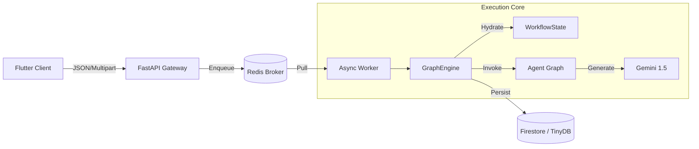

# Cognitive Quorum V2.9 (2026)

**Structured, Auditable, and Deterministic AI Orchestration.**

> **Status:** Production / Stable (V2.9)
> **Architecture:** Modular Async Monolith
> **Philosophy:** Zero-Magic, Strict Typing, Deterministic Execution.

Cognitive Quorum is a specialized AI orchestration platform designed for high-stakes cognitive labor—scientific peer review, legal auditing, and strategic analysis. Unlike generic chatbot frameworks, Quorum enforces a **Strict Object Mode**, ensuring that every step of the AI's reasoning is validated, persisted, and auditable.

---

## 🚀 Key Features (V2.9)

### 1. The "Zero-Magic" Manifesto
We reject "black box" agent frameworks. Quorum uses explicit, deterministic Python code:
*   **Strict Pydantic V2**: Every agent input/output is a typed Schema, not a dictionary.
*   **Centralized Hooks**: All external logic (Search, Math, PII) is registered in `backend/core/engine.py`.
*   **No "Implicit" State**: State is passed explicitly via the `WorkflowState` blackboard.

### 2. Modular Async Monolith
The system decouples **User Interaction** from **Cognitive Reasoning**:
*   **API (FastAPI)**: Handles HTTP requests and enqueues jobs (Response &lt; 50ms).
*   **Worker (Arq/Redis)**: Executes deep reasoning tasks (run times of 10m+) without timeouts.
*   **Client (Flutter)**: A "Thick Client" that polls the DB for real-time updates using **Riverpod**.

### 3. Cognitive Assembly Line
12 Specialized Agents work in a deterministic graph:
*   **Guard**: Presidio-based PII redaction.
*   **Analyst**: RAG-based evidence extraction.
*   **Logician**: Toulmin Argument Mapping.
*   **Falsifier**: POA (Popperian) Stress Testing.
*   **Judge**: BARS (Behaviorally Anchored Rating Scales) Scoring.

---

## 🏗️ System Architecture



For a deep dive, see **[System Architecture](docs/architecture.md)**.

---

## � Documentation Index

### Core Architecture
*   **[Master Architecture](docs/architecture.md)**: The authoritative system reference.
*   **[Architecture Analysis](docs/architecture_analysis.md)**: Breakdown of the "Modular Async Monolith".
*   **[Management Architecture](docs/management_architecture.md)**: Admin & Studio routing.
*   **[Data Management](docs/data_management.md)**: Database & Lifecycle strategies.

### Cognitive System
*   **[Structured Cognitive Architecture](docs/structured_cognitive_architecture.md)**: The "Mind" and "Spine" philosophy.
*   **[Prompt Engineering](docs/prompt_engineering.md)**: The "Sandwich" caching strategy.
*   **[API Models & Schemas](docs/api_models.md)**: Reference for `WorkflowState` and Agent IO.
*   **[Workflow Data Architecture](docs/workflow_data_architecture.md)**: Data contracts and flow.

### Implementation & Verification
*   **[Simplified Verification Strategy](docs/simplified_verification_strategy.md)**: "Zero-Magic" testing guide.
*   **[Test Strategy](docs/test_strategy.md)**: Detailed Backend/Frontend test commands.
*   **[Seed Data & Unidirectional Flow](docs/seed_data.md)**: Configuration management.
*   **[Hooks & Tools](docs/hooks.md)**: Deterministic function reference.

### Development Standards
*   **[Product Roadmap](docs/product_roadmap.md)**: Current status and future plans.
*   **[Flutter Development Guide](docs/flutterpromptohje.md)**: Frontend standards.

---

## 🛠️ Technology Stack

*   **Language**: Python 3.14 (Async) & Dart 3.5+
*   **Frameworks**: FastAPI, Arq, Riverpod 2.6+, GoRouter
*   **Database**: TinyDB (Local) / Firestore (Cloud)
*   **LLM**: Google Vertex AI (Gemini 1.5 Pro)
*   **Tools**: `uv` (Package Mgmt), `ruff` (Linting), `presidio` (PII)

---

## 📦 Getting Started

### Prerequisites
*   Python 3.14 (Recommended: Use `uv`)
*   Docker & Docker Compose
*   Flutter SDK (3.27+)

### Installation

1.  **Clone & Setup Backend**:
    ```bash
    git clone https://github.com/launis/quorum.git
    cd quorum
    uv sync
    ```

2.  **Environment Setup**:
    Create `.env` based on `.env.example`:
    ```env
    GOOGLE_API_KEY=your_key
    ANTHROPIC_API_KEY=optional
    ```

3.  **Run Infrastructure**:
    ```bash
    docker-compose up -d redis
    ```

4.  **Start Backend Services**:
    ```bash
    # Terminal 1: API
    uv run uvicorn backend.main:app --reload

    # Terminal 2: Worker
    uv run backend/worker.py
    ```

5.  **Start Client**:
    ```bash
    cd client_app
    flutter run -d chrome
    ```

### Running Tests
See **[Test Strategy](docs/test_strategy.md)** for details.
```bash
# Backend
uv run pytest

# Frontend
cd client_app && flutter test
```

---

## 🛡️ License

**Proprietary / Confidential.**
(C) 2024-2026 Risto Launis / Cognitive Quorum Team.
All rights reserved.