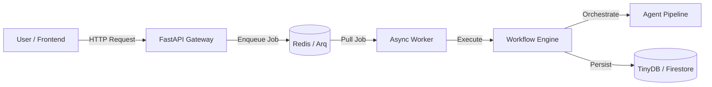

# Cognitive Quorum V2.5

**Structured, Auditable, and Deterministic AI Orchestration.**

Cognitive Quorum is a Modular Monolith architecture designed to perform complex cognitive labor—such as scientific peer review, legal auditing, or strategic analysis—with a level of rigor that generic "chatbots" cannot achieve.

V2.5 resolves the "Black Box" problem of Agentic AI by separating **Cognitive Strategy** (defined in a database) from **Execution Structure** (enforced by strict Python code).

---

## 🚀 Key Features

### 1. The Cognitive Assembly Line
Instead of a single agent trying to "do it all", Quorum pipes data through **12 Specialized Agents**:
*   **GuardAgent**: Sanitizes inputs and blocks prompt injection.
*   **AnalystAgent**: Grounds claims in evidence ("Chain of Trust").
*   **LoogikkoAgent**: Maps arguments to Toulmin structures (Claim, Data, Warrant).
*   **FalsifierAgent**: Actively attempts to disprove hypotheses (Devil's Advocate).
*   **CausalAgent**: Distinguishes correlation from causation using **DoWhy**.
*   **JudgeAgent**: Renders final verdicts based on a strict scoring matrix.
*   *(And 6 others: Detector, Overseer, Panel, Coach, XAI, Archivist)*

### 2. Hybrid Intelligence ("The Spine")
We do not trust LLMs to do math or handle PII. Quorum offloads high-stakes tasks to **Deterministic Hooks**:
*   **Privacy**: Microsoft **Presidio** for PII masking.
*   **Stats**: **DoWhy** for Causal Inference.
*   **Search**: Google Custom Search for fact-checking.
*   **Memory**: **ChromaDB** for RAG (Retrieval-Augmented Generation).

### 3. Strict Type Safety
Quorum is an "Anti-Hallucination" engine.
*   **Pydantic V2**: Every agent output is validated against a strict schema (`typing.Annotated`).
*   **Self-Correction**: If an LLM generates invalid JSON, the engine catches it and forces a retry with error feedback.
*   **State Management**: A monolithic `WorkflowState` object ensures data integrity across the pipeline.

---

## 🏗️ System Architecture



---

## 🛠️ Technology Stack

*   **Language**: Python 3.14 (PEP 649 Compliant).
*   **Core**: **FastAPI**, Pydantic V2.
*   **Tooling**: **uv** (Package Management), **Ruff** (Linting/Style).
*   **Async Processing**: **Arq** (Task Queue), **Redis** (Broker).
*   **Observability**: **Logfire** (Distributed Tracing).
*   **Database**: **TinyDB** (JSON-based, portable) + Firestore (Production).
*   **AI Model**: Google **Gemini 1.5 Pro** / **Gemini 2.0 Flash**.

---

## 📦 Getting Started

### Prerequisites
*   Python 3.12+ (managed via `uv`)
*   Google Gemini API Key
*   Docker (for Redis)

### Installation

1.  Clone the repository:
    ```bash
    git clone https://github.com/launis/quorum.git
    cd quorum
    ```

2.  Install dependencies (using **uv**):
    ```bash
    uv sync
    ```

3.  Create a `.env` file:
    ```env
    GOOGLE_API_KEY=your_key_here
    GOOGLE_SEARCH_API_KEY=optional
    GOOGLE_SEARCH_CX=optional
    LOGFIRE_TOKEN=optional
    ```

### Running the System

1.  **Start Infrastructure** (Redis):
    ```bash
    docker-compose up -d redis
    ```

2.  **Start the API**:
    ```bash
    uv run uvicorn backend.main:app --reload
    ```

3.  **Start the Async Worker**:
    ```bash
    uv run backend/worker.py
    ```

4.  **Access the System**:
    *   **Frontend UI**: [http://localhost:8501](http://localhost:8501)
    *   **API Docs**: [http://localhost:8000/docs](http://localhost:8000/docs)

---

## 📚 Documentation

Detailed documentation is available in the `docs/` directory or via the built site.

*   **[System Architecture](docs/architecture.md)**
*   **[Cognitive Whitepaper](docs/structured_cognitive_architecture.md)**
*   **[API Reference](docs/reference.md)**

To build the docs site locally:
```bash
uv run mkdocs serve
```

---

## 🛡️ License

Private / Proprietary.
(C) 2025-2026 Risto Launis / Cognitive Quorum Team.