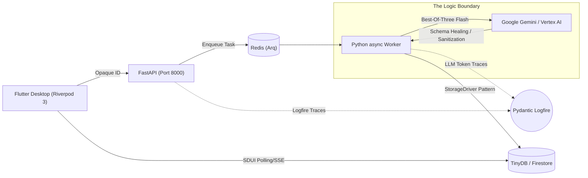

# Cognitive Quorum (V2.9 / Phase 9 Enterprise Edition)

**Structured, Auditable, and Deterministic AI Orchestration.**

> **Status:** Phase 9 Hardening (2026 SOTA)
> **Architecture:** Compound AI System, Event Sourcing DAG Orchestrator, Server-Driven UI
> **Philosophy:** Zero-Magic, Fail-Fast, Strict Rust-Core Pydantic DTOs, Zero-Math UI.

Cognitive Quorum is a specialized AI orchestration platform designed for critical cognitive expert work, such as scientific peer review and statutory auditing. Unlike traditional LLM chatbots, Quorum is a "Compound AI System" that forces AI behavior into a deterministic structure. The mathematics of decision-making are disassembled into machine-readable atoms (Micro-CoT) and stored for traceability (Forensic Sovereignty), while protecting system integrity through five architectural pillars.

---

## 🚀 The 5 Pillars of Architecture (V2.9)

### 1. System Context & Core Invariants
Quorum abhors "Black Boxes" and silent failures. All cognition is forced into a deterministic form:
*   **The Zero-Compromise Pledge & Universal Fail-Fast:** All I/O passes through strict Pydantic V2 / Freezed models (`extra="forbid"`). If data is malformed or missing, the system crashes immediately (`AppException`). Duct-tape solutions and silent fallbacks are strictly prohibited.
*   **Opaque ID Hydration (AliasEngine):** The LLM never sees real database UUIDs, only deterministic anchors (e.g., `a0`), preventing token bloat and hallucinations.
*   **Hybrid UI Sanitization & Dual-Reporting (RFC 7807):** LLM responses are sanitized in the Python layer ("The Sandwich") before reaching the UI. Errors are always reported both visually and via deep forensic logging (Logfire).

### 2. Data Seeding & Ontology
The system is data-driven, not code-driven. AI rules, allowed models, and vocabularies are defined centrally in the `seed_data.json` file (Single Source of Truth).
*   **Polymorphic Rule Routing:** Rules are automatically routed as dynamic Pydantic validation via a unified `PromptBlock` model.
*   **Semantic Localization:** AI behavioral guidance and linguistic nuances ("performative lexicons") are injected as data, not hardcoded logic.
*   **The Y-Funnel Pre-Hook:** Data migrations are handled via Pre-Hooks before model validation, keeping Domain Models clean from legacy logic.

### 3. Cognitive Orchestration Engine
The brain that connects the static ontology to dynamic LLM execution with maximum fault tolerance and speed.
*   **TDA Best-Of-Three Flash:** Instead of single, heavy "Pro" models, the system dispatches 3 parallel requests to fast models (e.g., Gemini Flash) and requires a 2/3 majority vote for the results. This eliminates timeouts and guarantees 98% self-consistency.
*   **Provider-Agnostic Static-First Caching:** Static instructions are packed at the beginning of the prompt and dynamic variables at the end, ensuring over 95% Context Caching hit rates regardless of the model provider (Vertex AI / Anthropic / OpenAI).
*   **Unified Model Multiplexing:** Models are swapped dynamically on the fly without code changes via the LLMClient.

### 4. Server-Driven UI & Presentation
The Flutter client application (`client_app_v2`) is a completely "dumb" rendering engine with zero business logic or AI computation (Zero-Math UI).
*   **The De-Generator Execution Paradigm:** The UI handles only human-readable Markdown. The backend `PromptCompiler` wraps the data in XML envelopes, preventing Prompt Injection attacks and manual prompt engineering.
*   **Strict ICU Markdown Parity:** Layout and colors are purely the responsibility of the UI. The backend serves only semantic content, ensuring 100% visual parity between the Flutter interactive display and the static PDF generation.
*   **Null-Safe State Synchronization:** SDUI models are exhaustive, and the frontend must not attempt to patch missing fields with hidden fallbacks like `SizedBox.shrink()`.

### 5. Resilience & Observability
The system is shielded from LLM service degradation and network anomalies to guarantee stable execution.
*   **Transient Error Resilience:** The system distinguishes between 503/429 network errors and semantic errors, routing the former to an automatic Exponential Backoff queue (Arq Worker/Redis).
*   **LLM Schema Validation Healing:** If the LLM returns broken JSON, the system reflects the error back to the LLM (`PydanticValidationError`), forcing the model to "heal" its own response on the fly.
*   **App Error Boundary:** A single UI component failure does not crash the entire application. Instead, it visually isolates the error, rendering a targeted barcode-like error card (Red Screen Mitigation).

---

## 🏗️ System Architecture



---

## 📚 Documentation

All up-to-date and technical master documentation lives alongside the codebase:

* **[Architecture Documentation (V2.9 Directory)](docs/architecture/)**: The absolute Single Source of Truth for system components.
* **[Agent Rules (Config)](.agents/rules/)**: IDE-level enforced directives for code quality assurance (Pydantic Strict Typing, Zero-Compromise, Universal Fail-Fast).

---

## 🛠️ Technology Stack

*   **Languages**: Python 3.14+ (Strict) & Dart 3.27+
*   **Frameworks**: FastAPI, Arq, Riverpod 3.0+, Freezed
*   **Databases**: TinyDB (Dev) / Firestore (Production) + Redis (Arq)
*   **Infrastructure**: Docker, Logfire Instrumentation
*   **Tooling**: `uv` (Package Mgmt), `ruff` (Linting), `mypy` (Typing)

---

## 📦 Getting Started

1. **Dependencies**: `uv`, Docker
2. **Installation**:
   ```bash
   git clone https://github.com/launis/quorum.git
   cd quorum
   uv sync
   ```
3. **Infrastructure Setup**: Boots Redis for asynchronous task queuing.
   ```bash
   docker-compose up -d redis
   ```
4. **Backend Servers & Worker (Startup Script)**:
   ```bash
   ./run_local.bat
   ```

*(Note! Modifying test data "Seeding" is strictly governed via `uv run python backend_v2/seed/run_seed.py local` to prevent direct manual edits, ensuring Opaque ID workflows remain uncorrupted and the SSOT remains untouched.)*

---

## 🛡️ License

**Proprietary and Closed-Source.**
Copyright (c) 2026 Risto Launis. All Rights Reserved.
No permission is granted to use, copy, modify, or distribute this software under any circumstances.