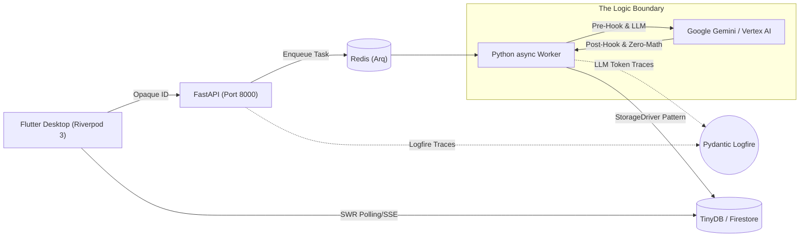

# Cognitive Quorum (V2.9 / Phase 9 Enterprise Edition)

**Structured, Auditable, and Deterministic AI Orchestration.**

> **Status:** Phase 9 Hardening (2026 SOTA)
> **Architecture:** Event Sourcing DAG Orchestrator, Storage Driver Pattern, Riverpod SWR
> **Philosophy:** Zero-Magic, Fail-Fast, Strict Rust-Core Pydantic DTOs, Zero-Math UI.

Cognitive Quorum on erikoistunut asiantuntijajärjestelmä (Specialized AI Orchestration Platform) kriittiseen kognitiiviseen asiantuntijatyöhön, kuten tieteelliseen vertaisarviointiin ja lakisääteiseen auditointiin. Toisin kuin perinteiset LLM-chatbotit, Quorum pakottaa jokaisen tekoälyn askeleen **Strict Object Modeen**, missä päätösten matematiikka puretaan koneellisiksi atomeiksi (Micro-CoT) ja tallennetaan jäljitettäväksi (Forensic Sovereignty).

---

## 🚀 Key Features (V2.9 Arkkitehtuuri)

### 1. The "Zero-Compromise" Manifesto
Quorum inhoaa "Mustia Laatikoita". Kaikki kognitio pakotetaan deterministiseen muotoon:
*   **Strict Pydantic V2 (Rust-Core)**: Kaikki I/O kulkee Pydantic-mallien läpi `extra="forbid"` turvalla varustettuna.
*   **Fail-Fast & RFC 7807**: Järjestelmä ei koskaan "korjaa hiljaa" (SizedBox.shrink tai try-except pass). Virheet kaatavat yksittäiset solmut näkyvästi `AppException` (RFC 7807) virhekehyksillä pitäen muun prosessin pystyssä.
*   **The Hook Layer**: Tekoälymallit eivät itse luo omien pyyntöjensä rakenteita sorkkimalla rajapintoja vapaasti. Järjestelmä kokoaa (Jinja2) työnkulut lennossa, ampuu LLM-kutsun asynkronisesti erillisen Client-abstraktion yli, ja puhdistaa vastaukset "Algorithmic Tyranny Kill Switch" mekanismin läpi estäen teorialaiskuuden.

### 2. Event Sourcing DAG Orchestrator
Eroon perinteisistä peräkkäisistä purkkaliitos-putkista. Asynkroninen moottori `services/orchestrator/dag_executor.py`:
*   **Event Sourcing**: Jokainen ajon vaihe (`TraceEvent`) tallentuu historiikkiin, mahdollistaen rehydration-tilat ("Kesken jääneet työt").
*   **Storage Driver Pattern**: Järjestelmä ei sitoudu suoriin yksittäisiin tietokantoihin (Koodi tukee lennosta lokaalia `db_v2.json` TinyDB-ajuria tai pilven Firestorea). Uutena V2:ssa, yli 100 KB raskaat tekoälytulokset ohjataan automaattisesti Blob Storageen keventäen rajapintoja.
*   **Arq Worker (Redis)**: Raskaat API-puhelut LLM:lle lähetetään aina HTTP 202 Accepted -jonoon FastAPI-prosessin tukehtumisen estämiseksi.

### 3. Desktop-First Flutter (App)
*   **Zero-Math UI**: Käyttöliittymä ei koskaan laske tekoälyn XAI-värejä, keskiarvoja tai numeerisia korrelaatioita (Backend-For-Frontend palvelee ne valmiina `ReportLayoutDTO` -pakettina).
*   **Riverpod 3.0 & SWR**: Ei latausympyröitä (Loading Spinners). Nollalatenssin dynaaminen reititys kätkee verkkopyynnöt asynkronisesti ruutujen taustalle koodigeneroidulla Optimistisella UI:lla.
*   **Infinite Canvas**: Työnkulkujen ja parametrien (SystemInspector) muokkaaminen asuu asiantuntijoille suunnatulla rajattomalla vuokaavio-alustalla (`InteractiveViewer`), hyläten jähmettyneet listat ikkunoistaan.

---

## 🏗️ Järjestelmäarkkitehtuuri



---

## 📚 Dokumentaatio

Kaikki ajantasainen ja tekninen Master-dokumentaatio asuu koodikannan osana:

* **[Arkkitehtuuridokumentaatio (V2.9 Hakemisto)](docs/architecture/)**: Ehdoton Single Source of Truth järjestelmän komponenteista (DAG, The Hook Layer, Storage Driver, yms.).
* **[Agenttien Säännöstöt (Config)](.agents/rules/)**: IDE-tason pakotetut direktiivit koodin laadunvarmistukseen (Pydantic Strict Typing, Flutter Isolate Mandate ja V2 SWR-säännöt).

---

## 🛠️ Teknologiapino

*   **Kielet**: Python 3.14+ (Strict) & Dart 3.27+
*   **Frameworkit**: FastAPI, Arq, Riverpod 3.0+, Freezed
*   **Tietokannat**: TinyDB (Dev) / Firestore (Tuotanto) + Redis (Arq)
*   **Infrastruktuuri**: Docker, Logfire Instrumentointi
*   **Työkalut**: `uv` (Package Mgmt), `ruff` (Linting), `mypy` (Typing)

---

## 📦 Käynnistys

1. **Riippuvuudet**: `uv`, Docker
2. **Asennus**:
   ```bash
   git clone https://github.com/launis/quorum.git
   cd quorum
   uv sync
   ```
3. **Infrastruktuurin pystytys**: Käynnistää Rediksen asynkronisla jonotuksia varten.
   ```bash
   docker-compose up -d redis
   ```
4. **Taustapalvelimet ja Työntekijä (Startup Script)**:
   ```bash
   ./run_local.bat
   ```

*(Huom! Testidatan muokkaus "Siementäminen" suoritetaan säännösteltynä komennolla `uv run python backend_v2/seed/run_seed.py local` estäen suoran manuaalisen muokkauksen jotta Opaque ID -työnkulut eivät korruptoidu.)*

---

## 🛡️ License

**Proprietary and Closed-Source.**
Copyright (c) 2026 Risto Launis. All Rights Reserved.
No permission is granted to use, copy, modify, or distribute this software under any circumstances.