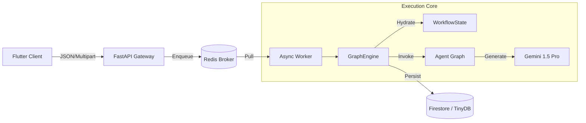

# Cognitive Quorum V5.1 (2026)

**Structured, Auditable, and Deterministic AI Orchestration.**

> **Status:** Phase 9 Hardening (V5.1)
> **Architecture:** Modular Async Monolith with Panel Fusion
> **Philosophy:** Zero-Magic, Fail-Fast, Strict DTOs.

Cognitive Quorum is a specialized AI orchestration platform designed for high-stakes cognitive labor—scientific peer review, legal auditing, and strategic analysis. Unlike generic chatbot frameworks, Quorum enforces a **Strict Object Mode**, ensuring that every step of the AI's reasoning is validated, persisted, and auditable.

---

## 🚀 Key Features (V5.1)

### 1. The "Zero-Magic" Manifesto
We reject "black box" agent frameworks. Quorum uses explicit, deterministic Python code:
*   **Strict Pydantic V2**: Every agent input/output is a typed **DTO**, not a dictionary.
*   **Zero-Fallback**: Configuration (Prompts, Rules, Models) must be explicit in the Database. No hardcoded defaults.
*   **Fail-Fast**: The system crashes immediately (`AppException`) on invalid configuration or schema violations.

### 2. Panel Fusion (The "Senate")
We replaced sequential agent chains with a **"Fused Panel"** architecture:
*   **Committee of One**: A single "Deep" model (Gemini Pro) assumes multiple personas (Logician, Falsifier, Profiler) in one pass.
*   **Fan-Out Pattern**: The Engine splits the Panel's output into discrete domain models for downstream consumers.

### 3. Modular Async Monolith
The system decouples **User Interaction** from **Cognitive Reasoning**:
*   **API (FastAPI)**: Handles HTTP requests and enqueues jobs (< 50ms).
*   **Worker (Arq/Redis)**: Executes deep reasoning tasks (10m+) without timeouts.
*   **Client (Flutter)**: A "Thick Client" that polls for real-time updates. See the **[Client Application README](client_app/README.md)** for details.

---

## 🏗️ System Architecture



For a deep dive, see **[System Architecture](docs/architecture.md)**.

---

## 📚 Documentation Index

The `docs/` directory serves as the central repository for the platform's detailed architectural, theoretical, and operational documentation.

### Theoretical Foundation
Cognitive Quorum is built upon a hybrid evaluation framework designed to address the psychometric paradox of reliability and validity in assessing AI-era cognitive skills. It employs a bipartite architecture: an analytical tier that maximizes reliability via structured rubrics anchored in established cognitive taxonomies, and a holistic tier that maximizes validity by utilizing an ensemble-based multi-agent system. By deliberately balancing strict systematic analysis with dynamic adversarial debate, this framework moves beyond mere rule-following to effectively identify context-dependent, human-directed strategic mastery and critical agency in human-AI collaborative processes.

### Technical Architecture
At its core, Cognitive Quorum operates as a "Zero-Magic" Modular Async Monolith that fundamentally decouples cognitive logic from execution mechanics. The system is compartmentalized into "The Spine," a deterministic Python-based orchestrator (FastAPI and Arq) enforcing strict data integrity via Pydantic V2 and a Fail-Fast protocol, and "The Mind," where all agent behaviors, scoring matrices, and workflows are dynamically governed as configuration data within a Single Source of Truth architecture. To ensure performance without sacrificing deep analysis, the execution layer leverages "Panel Fusion" to handle multiple specialized cognitive roles concurrently within single inference steps, while delivering real-time state updates to a robust Server-Driven UI (SDUI) Client.

To combat LLM hallucinations and ensure epistemic integrity, the architecture implements a rigorous "3-Tier Grounding" mechanism. Large Language Models are actively utilized not just for text generation, but as autonomous retrieval agents: they proactively formulate search hypotheses to scour the web via search hooks, perform real-time fact-checking with deep integration into Vertex AI Grounding for precise URL citations, and cross-reference all reasoning against an internal vector database of organizational knowledge.

### Core Architecture
*   **[Master Architecture](docs/index.md)**: The authoritative system reference.
*   **[Management Architecture](docs/management_architecture.md)**: System Config, Tenants, and RBAC.
*   **[Data Management](docs/data_management.md)**: Database strategies & Zero-Fallback mandate.

### Cognitive System
*   **[Structured Cognitive Architecture](docs/structured_cognitive_architecture.md)**: Panel Fusion, BARS Scoring, and the 12-Agent Pipeline.
*   **[Workflow Data Architecture](docs/workflow_data_architecture.md)**: Data contracts and the **Fan-Out Pattern**.
*   **[Prompt Engineering](docs/prompt_engineering.md)**: The "Sandwich" Strategy and Thinking Tokens.
*   **[JSON Flattening Hazard](docs/json_flattening_hazard.md)**: DTO mitigation strategies.

### Implementation & Verification
*   **[Simplified Verification Strategy](docs/simplified_verification_strategy.md)**: "Zero-Magic" testing guide.
*   **[Test Strategy](docs/test_strategy.md)**: Strict DTO testing & System Config mocking.
*   **[Seed Data & Sync](docs/seed_data.md)**: The SSOT for System Configuration.
*   **[Startup Protocol](docs/alku.md)**: Critical context for contributors.

### Development Standards
*   **[Product Roadmap](docs/product_roadmap.md)**: Phase 9 (Complete) -> SDUI Meta-Programming.
*   **[Flutter Development Guide](docs/flutterpromptohje.md)**: Frontend standards.

---

## 🛠️ Technology Stack

*   **Language**: Python 3.14+ (Async) & Dart 3.5+
*   **Frameworks**: FastAPI, Arq, Riverpod 3.0+
*   **Database**: TinyDB (Local) / Firestore (Cloud)
*   **LLM**: Google Vertex AI (Gemini 2.0 Pro Exp)
*   **Tools**: `uv` (Package Mgmt), `ruff` (Linting), `presidio` (PII)

---

## 📦 Getting Started

### Prerequisites
*   Python 3.14 (Recommended: Use `uv`)
*   Docker & Docker Compose
*   Flutter SDK (3.27+)

### Installation

1.  **Clone & Setup Backend**:
    ```bash
    git clone https://github.com/launis/quorum.git
    cd quorum
    uv sync
    ```

2.  **Environment Setup**:
    Create `.env` based on `.env.example`:
    ```env
    GOOGLE_API_KEY=your_key
    ENABLE_VERTEX_SEARCH=true
    ```

3.  **Run Infrastructure**:
    ```bash
    docker-compose up -d redis
    ```

4.  **Start Services**:
    ```bash
    # Backend + Worker + Client (Simulated)
    ./run_local.bat
    ```

---

## 🛡️ License

**Proprietary and Closed-Source.**
Copyright (c) 2026 Risto Launis. All Rights Reserved.
No permission is granted to use, copy, modify, or distribute this software under any circumstances.