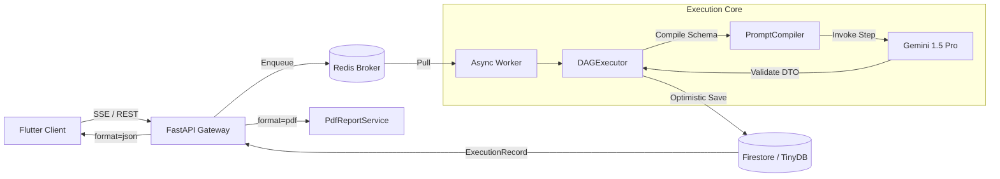

# Cognitive Quorum V5.1 (2026)

**Structured, Auditable, and Deterministic AI Orchestration.**

> **Status:** Phase 9 Hardening (V5.1)
> **Architecture:** Zero-Deploy DAG Orchestrator & Omni-Channel Renderer
> **Philosophy:** Zero-Magic, Fail-Fast, Strict DTOs.

Cognitive Quorum is a specialized AI orchestration platform designed for high-stakes cognitive labor—scientific peer review, legal auditing, and strategic analysis. Unlike generic chatbot frameworks, Quorum enforces a **Strict Object Mode**, ensuring that every step of the AI's reasoning is validated, persisted, and auditable.

---

## 🚀 Key Features (V5.1)

### 1. The "Zero-Magic" Manifesto
We reject "black box" agent frameworks. Quorum uses explicit, deterministic Python code:
*   **Strict Pydantic V2**: Every step's input/output is a typed **DTO**, not a dictionary.
*   **Zero-Fallback**: Configuration (Prompts, Rules, Models) must be explicit in the Database. No hardcoded defaults.
*   **Fail-Fast**: The system crashes immediately (`AppException`) on invalid configuration or schema violations.

### 2. Zero-Deploy DAG Routing
We replaced sequential hardcoded agent chains with a dynamic **Directed Acyclic Graph (DAG)** workflow:
*   **Data-Driven Pipelines**: Workflows and Prompts are defined in `seed_data.json`, meaning new evaluation criteria can be added without modifying backend code.
*   **PromptCompiler**: Compiles dynamic Pydantic DTOs prior to execution based on the visual blocks requested, ensuring absolute schema conformity from the chosen LLM.
*   **Omni-Channel UI**: The backend no longer ships formatting. It ships pure Data Models (`ExecutionRecord`) alongside an explicitly frozen snapshot of UI hints, allowing Flutter, Flat/CSV files, and PDF Generators to render with 100% parity.

### 3. Modular Async Monolith
The system decouples **User Interaction** from **Cognitive Reasoning**:
*   **API (FastAPI)**: Handles HTTP requests, generic SDUI view rendering, and enqueues jobs (< 50ms).
*   **Worker (Arq/Redis)**: Executes deep reasoning DAGs (10m+) without timeouts.
*   **Client (Flutter)**: A reactive client (Riverpod) that polls Server-Sent Events (SSE) for real-time DAG node progression updates. See the **[Client Application README](client_app_v2/README.md)** for details.

---

## 🏗️ System Architecture



---

## 📚 Documentation Index

The `docs/` directory serves as the central repository for the platform's detailed architectural, theoretical, and operational documentation.

### Core Architecture & Protocols
*   **[Master Architecture AI Orchestrator V2](docs/Arkkitehtuurimäärittely_%20AI-orkestraattori%20V2.md)**: The authoritative system reference for the backend Python Engine.
*   **[Universal Routing & Hooks V2](docs/Architecture_Universal_Routing_and_Hooks_V2.md)**: Deep dive into the Zero-Deploy workflow mappings, $inputs routing, and strictly typed interceptor hooks.
*   **[Output Generation Pipeline](docs/output_generation_pipeline.md)**: The lifecycle of generating and rendering `ExecutionRecord` states.
*   **[Holistinen Mestaruus](docs/Holistinen%20Mestaruus.md)**: The theoretical foundation of psychometric assessment, balancing system-1 and system-2 cognition.

### Development Standards & Tooling
*   **[Antigravity Prompting](docs/antigravity_prompting.md)**: Required protocols for AI-assisted development context.
*   **[Flutter Prompt Instructions](docs/flutterpromptohje.md)**: Mandatory rules for Client-side Flutter/Dart generation.
*   **[Product Roadmap](docs/product_roadmap.md)**: Phase 9 (Hardening) status.
*   **[Test Strategy](docs/test_strategy.md)**: Strict DTO testing & System Config mocking patterns.

---

## 🛠️ Technology Stack

*   **Language**: Python 3.14+ (Async) & Dart 3.5+
*   **Frameworks**: FastAPI, Arq, Riverpod 3.0+
*   **Database**: TinyDB (Local) / Firestore (Cloud)
*   **LLM**: Google Vertex AI (Gemini 2.0 Pro Exp)
*   **Tools**: `uv` (Package Mgmt), `ruff` (Linting), `mypy` (Typing)

---

## 📦 Getting Started

### Prerequisites
*   Python 3.14 (Recommended: Use `uv`)
*   Docker & Docker Compose
*   Flutter SDK (3.27+)

### Installation

1.  **Clone & Setup Backend**:
    ```bash
    git clone https://github.com/launis/quorum.git
    cd quorum
    uv sync
    ```

2.  **Environment Setup**:
    Create `.env` based on `.env.example`:
    ```env
    GOOGLE_API_KEY=your_key
    ENABLE_VERTEX_SEARCH=true
    ```

3.  **Run Infrastructure**:
    ```bash
    docker-compose up -d redis
    ```

4.  **Start Services**:
    ```bash
    # Backend + Worker + Client (Simulated)
    ./run_local.bat
    ```

---

## 🛡️ License

**Proprietary and Closed-Source.**
Copyright (c) 2026 Risto Launis. All Rights Reserved.
No permission is granted to use, copy, modify, or distribute this software under any circumstances.