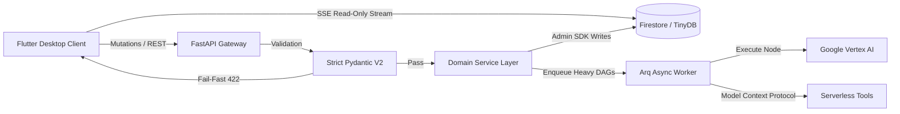

# Cognitive Quorum (2026 Enterprise Edition)

**Structured, Auditable, and Deterministic AI Orchestration.**

> **Status:** Phase 9 Hardening (2026 SOTA)
> **Architecture:** Zero-Deploy DAG Orchestrator, Flat MVC (BFF), Firebase CQRS
> **Philosophy:** Zero-Magic, Fail-Fast, Strict Rust-Core Pydantic DTOs.

Cognitive Quorum is a specialized AI orchestration platform designed for high-stakes cognitive labor—scientific peer review, legal auditing, and strategic analysis. Unlike generic chatbot frameworks, Quorum enforces a **Strict Object Mode**, ensuring that every step of the AI's reasoning is validated, persisted, and auditable.

---

## 🚀 Key Features (2026 SOTA)

### 1. The "Zero-Compromise" Manifesto
We reject "black box" agent frameworks. Quorum uses explicit, deterministic Python code:
*   **Strict Pydantic V2 (Rust-Core)**: Every step's input/output is a strongly typed **DTO** using `model_validate_json` and `extra="forbid"`. No silent dict coercions.
*   **Firebase CQRS**: The Flutter UI is strictly **Read-Only** regarding the database, subscribing only to real-time streams. All structural mutations route through the FastAPI Service layer.
*   **Fail-Fast**: The system crashes immediately (`AppException` RFC 7807) on invalid configuration, missing fields, or unauthorized access attempts.

### 2. Zero-Deploy DAG Routing
We replaced sequential hardcoded agent chains with a dynamic **Directed Acyclic Graph (DAG)** workflow:
*   **Data-Driven Pipelines**: Workflows and Prompts are defined in `seed_data.json`, meaning new evaluation criteria can be added without modifying backend code.
*   **The Anti-Mirror Protocol**: AI agents operate in parallel, insulated from each other's outputs during target human evaluations, preventing LLM mathematical groupthink.
*   **Model Context Protocol (MCP)**: AI agents use The Tool Loop for real-time empirical validation, with absolute fact-checking traces frozen in `XAIEvidenceBox` audits.

### 3. B2B SaaS IAM & Security
*   **Passkey-First Auth**: Passwords are legacy fallbacks. Security relies on cryptography, Riverpod Re-Auth Interceptors, and real-time Step-Up MFA (TOTP) natively evaluated from JWT `amr` claims at O(1) speed.
*   **Opaque Stripe IDs**: All database keys are strictly obscure (e.g., `org_[a-zA-Z0-9]{8,}`). Human-readable keys are forbidden at the database layer.
*   **Saga Pattern Deletions**: Deleting user accounts delegates anonymization and entity removal to Arq Redis Background Workers (`202 Accepted`), maintaining global audit traces.

### 4. Adaptive Flutter Edge (Desktop-First)
*   **Zero-Latency UI**: The frontend utilizes Stale-While-Revalidate (SWR) for instantaneous state changes without full-screen loading spinners.
*   **The Isolate Mandate**: Parsing 100MB JSONs or 5000-row CSVs never touches the UI thread. It is completely offloaded to Dart `Isolate.run()`.

---

## 🏗️ System Architecture



---

## 📚 Documentation Index

### Core Architecture & Protocols
*   **[Arkkitehtuurimäärittely: The Modular 2026 Engine](docs/index.md)**: The authoritative master reference, broken down into an MkDocs-style directory tree.
*   **[EPIC: B2B Multi-Tenant IAM Säännökset](docs/epic/B2B%20SaaS%20IAM-arkkitehtuuri%202026.md)**: Zero-Trust policies, User Settings, and Role Matrices (ROOT/ADMIN/MANAGER/MEMBER/VIEWER).
*   **[Flutter Architecture Protocol](.agents/rules/02_flutter_desktop.md)**: Rules for optimizing Desktop-First Flutter applications, Riverpod SWR, and GoRouter Stateful Navigation.
*   **[Antigravity Prompting](docs/antigravity_prompting.md)**: Universal System Rules for Agentic AI Coding, enforcing the Zero-Compromise Pledges.

### Development Standards & Tooling
*   **[Tier Verification Protocols](docs/hardeningback.md)**: Audit checklists for Python Backend (Strict Typed Dicts, Aneamic Routers).
*   **[API Reference](docs/reference.md)**: Model definitions, routing logic, and database schemas.

---

## 🛠️ Technology Stack

*   **Language**: Python 3.14+ (Async) & Dart 3.27+
*   **Frameworks**: FastAPI, Arq, Riverpod 3.0+
*   **Database**: TinyDB (Local) / Firestore (Cloud)
*   **LLM**: Google Vertex AI / OpenAI (With Strict JSON Schema via Pydantic)
*   **Tools**: `uv` (Package Mgmt), `ruff` (Linting), `mypy` (Typing)

---

## 📦 Getting Started

### Prerequisites
*   Python 3.14 (Recommended: Use `uv`)
*   Docker & Docker Compose
*   Flutter SDK (3.27+)

### Installation

1.  **Clone & Setup Backend**:
    ```bash
    git clone https://github.com/launis/quorum.git
    cd quorum
    uv sync
    ```

2.  **Environment Setup**:
    Create `.env` based on `.env.example`:
    ```env
    GOOGLE_API_KEY=your_key
    ```

3.  **Run Infrastructure**:
    ```bash
    docker-compose up -d redis
    ```

4.  **Start Services**: (Runs Backend, Arq Worker, and Client)
    ```bash
    ./run_local.bat
    ```

---

## 🛡️ License

**Proprietary and Closed-Source.**
Copyright (c) 2026 Risto Launis. All Rights Reserved.
No permission is granted to use, copy, modify, or distribute this software under any circumstances.