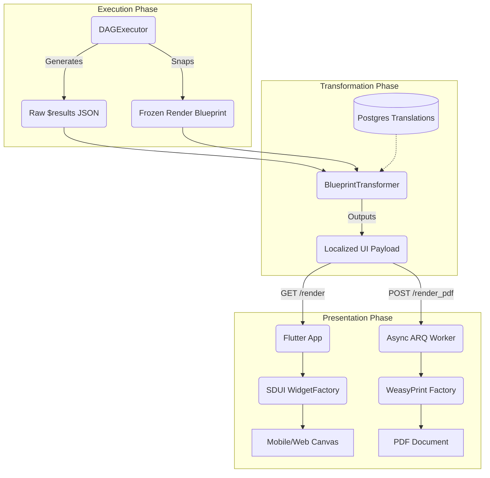
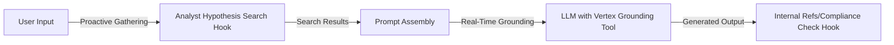

# System Architecture Specification: Universal Routing & Hooks (V2)
**Date:** March 2026
**Status:** Deployed (Stable)
**Scope:** Core Backend Execution Pipeline (`backend_v2/hooks/`, `seed_data.json` DAGs, and Omni-Channel SDUI)

---

## 1. Executive Summary

This document serves as the definitive scientific and technical specification for the "Heart" of the Quorum V2 Architecture: The Universal Routing pipeline, the deterministic Hook Ecosystem, the Structured Cognitive Architecture, and the **Zero-Deploy Server-Driven UI (SDUI)** rendering engine.

The primary objective of the architecture is to systematically eliminate volatility and inherent hallucination risks, by completely **decouple cognitive processing from presentation logic**.

V2 fundamentally reconstructs the pipeline around three core principles:
1.  **Strict Pydantic Enforcement (Fail-Fast):** All data state validation, filtering, math, and constraint verification have been forcefully migrated out of the LLM context into deterministic Python CPU logic. If data does not strictly match the expected semantic structure, the system terminates execution via an RFC 7807 error.
2.  **Universal Data Routing (DAG):** Information flows exclusively across explicit paths mapped in the system configuration database (`depends_on` and `input_mappings`), ensuring downstream nodes receive unbroken, raw intelligence from upstream expert systems.
3.  **Semantic Display Flow (Zero-Deploy UI):** The AI engines ("The Brain") produce only raw, structured JSON data. The final layout, charts, and localization are determined entirely by declarative **Render Blueprints** stored in the database, allowing infinite UI variations (Flutter, PDF) without a single line of frontend code deployment.

---

## 2. The Core Architecture: Spine vs. Mind vs. Display

V2 strictly enforces a **Unidirectional Data Flow** where the "DNA" of the system is isolated from the executing machinery and the final presentation tier.

### A. The "Spine" (Execution Layer)
* **Role**: Orchestration, State Management, and Type Enforcement.
* **Feature (Strict Object Mode)**: Data is passed between agents as strictly typed Pydantic V2 models, never as loose dictionaries. The GraphEngine (Python) provides deterministic execution but contains zero "hardcoded" intelligence.

### B. The "Mind" (Cognitive Layer)
* **Role**: Reasoning Strategy and Criteria.
* **Location**: The database acts as the single source of truth (SSOT). The Engine reads these values to construct prompts, allowing Administrators to tune the system without code deployments.
* **Components in DB**:
  * **System Config**: Defines Global Evaluation Penalties and Model Strategies (e.g., `fast`, `deep`).
  * **Polymorphic PromptBlocks**: Fuses directives and evaluation matrices. Includes mathematical **Strictness Levels (0-100)** to dynamically calibrate AI attitude, and **Theory-Grounded URLs** to fetch external frameworks.

### C. The "Display" (Omni-Channel Rendering Layer)
* **Role**: Visualizing raw cognitive data gracefully across multiple platforms.
* **Mechanism**: The `BlueprintTransformer` merges the raw cognitive outputs (`$results`) with declarative visual instructions (`render_blueprint`).
* **Clients**: A Flutter SDUI `WidgetFactory` and a Server-Side Async PDF Generator. Both strictly consume the identical localized JSON payload.

### D. Strict DTO Pattern (The "Air Gap")
To prevent LLM hallucinations of system metadata (timestamps, IDs) and guarantee relational integrity:
1. **LLM Output**: The model generates a lean **PROPOSAL** (DTO) comprising only raw data (e.g., scoring arrays).
2. **Python Authority**: The Agent's Python code acts as the **AUTHORITY**, catching the DTO, validating boundaries, and injecting system metadata (Run ID, Timestamp).
3. **Domain Promotion**: The enriched object is promoted to a full Domain Model before persisting to the database.

---

## 3. Universal Data Routing & Courtroom 3.0

The execution engine in V2 interprets a dynamic Directed Acyclic Graph (DAG), resolving variables (`$inputs`, `$step_node_X.output`) at runtime. The premier example of this architecture in production is the `workflow_courtroom_20_full_audit` pipeline.

### 3.1 Strict PromptBlocks
All plain-text "Role Matrices" were programmatically destroyed to eliminate token bloat and LLM confusion. Agents now rely exclusively on concise PromptBlocks paired with a strict `{{SCHEMA_EXAMPLE}}` JSON blueprint injection.

### 3.2 Dynamic Input Ingestion
Raw inputs (PDFs, chat logs) are intercepted by the orchestration engine. Instead of hardcoding instructions for specific filenames into prompts, the system uses **Universal Routing**: a pre-hook injects an `ai_description` header dynamically determined by the workflow configuration directly into the document string. Any generalized AI agent can thus process any input natively without workflow-specific prompt hacks.

### 3.3 The Fan-Out & Upstream Experts
The initial tier of execution processes the context:
-   **Step 1-3 (Ingestion):** Process raw text strings, authenticate security perimeters, and retrieve external domain contexts.
-   **Step 4-12 (The Fused Analysts):** Independent experts execute highly specialized cognitive functions. 
    *   `step_analyst` processes Vertex Search data into rigorous, sequenced hypotheses (`HYP-N`).
    *   `step_profiler` evaluates cognitive biases.
    *   `step_logician` builds Toulmin Argument schemas out of the primary input text.
    *   `step_falsifier` attempts to actively destroy the analyst's hypotheses by locating Popperian failures.
    *   `step_causal_analyst` constructs counterfactuals.

### 3.4 The Grand Unifier (The Judge) & Late Reporting
At node 13 (`step_judge`), the architecture reaches its first convergence point. The `JudgeInput` Pydantic model absorbs this 360-degree data panorama and derives a unified categorical scoring matrix.

By explicitly routing the Upstream Experts directly into the downstream output generators (`$steps.step_analyst.output`), V2 ensures PDF reports and SDUI dashboards contain exact structured fallacies and raw search quotes uncovered deep inside the DAG runtime without routing them through intermediate summary nodes.

---

## 4. The SDUI Rendering Architecture (V6 Pipeline)

To achieve the "Zero-Deploy" UI, the output generation pipeline entirely isolates the layout from the cognitive engine.

### 4.1 The Blueprint Immutable Snapshot
When a DAG workflow initiates, the `DAGExecutor` reads the `render_blueprint` from the workflow definition and explicitly saves a snapshot of it inside the `ExecutionRecord`'s `frozen_context`. This guarantees that if a system administrator retroactively changes a report layout, historical executions map perfectly to the UI they were generated under.

### 4.2 The Universal Transformer Hub
The `BlueprintTransformer` service acts as the bridge between raw data and the final UI. It operates synchronously and performs the following tasks:
1. **Hydration:** Merges the `render_blueprint` layout components (e.g. `1d_gauge`, `2d_matrix`) with the specific data paths from `$results`.
2. **Graceful Degradation:** If an LLM node failed to produce a requested data point for a graph, the transformer logs a `VALIDATION_FAILED` (Dual-Reporting) but safely injects `null` or `0.0` to prevent UI Red Screens.
3. **Layer 5 Late-Binding Localization:** Reads the client's `Accept-Language` header and actively translates dynamically sourced texts (like matrix axis labels) from the database into the final JSON payload.

### 4.3 Omni-Channel Parity Flow



Because both Flutter and the PDF Generator physically ingest the exact same JSON payload from the `BlueprintTransformer`, UI parity is mathematically guaranteed.

### 4.4 Advanced Blueprint Components
The blueprint system allows deep analytical routing native to the V2 architecture:
* **2D & 3D Matrices:** Automatically route X, Y, and Z axes to separate upstream expert outputs (e.g. `X: $steps.logic.score`, `Y: $steps.emotion.score`).
* **Evaluation Notes Panel:** Extracts the LLM's qualitative `evaluation_notes` and displays them side-by-side with numerical graphs.
* **Global Bibliography Footer:** A centralized hook scans the entire deep nested `$results` tree for `citation_reference` keys, aggregates them, deduplicates them, and prints a single academic bibliography at the end of the report, preserving visual cleanliness.

---

## 5. Dynamic Prompt Engineering (Polymorphic Injection)

Prompt engineering is an architectural discipline in V2. The `PromptBuilder` dynamically assembles prompts from database components, schemas, and runtime state.

### The "Sandwich" Composition Model

```mermaid
classDiagram
    class PromptBuilder {
        +build_prompt() string
    }
    class DirectivesLayer {
        System Mandates
        Agent Identity
    }
    class ContextLayer {
        {{HISTORY_TEXT}}
        {{PREVIOUS_STEP_OUTPUTS}}
        {{GOOGLE_SEARCH_RESULTS}}
    }
    class CognitiveLayer {
        Evaluation Matrices
        Strictness Vectors
    }
    class OutputLayer {
        {{SCHEMA_EXAMPLE}} JSON
    }
    
    PromptBuilder *-- DirectivesLayer
    PromptBuilder *-- ContextLayer
    PromptBuilder *-- CognitiveLayer
    PromptBuilder *-- OutputLayer
```

1. **Directives Layer**: System Mandates and Agent Identity, fetched directly from the database's component library.
2. **Context Layer**: Injected State (`{{HISTORY_TEXT}}`), Upstream Evidence (`{{PREVIOUS_STEP_OUTPUTS}}`), and External Data (`{{GOOGLE_SEARCH_RESULTS}}`).
3. **Cognitive Layer**: Evaluation Matrices retrieved from the DB, transformed into formatted Markdown rubrics, combined with strictness vectors.
4. **Output Layer**: Strict JSON Schema (`{{SCHEMA_EXAMPLE}}`) automatically generated from the agent's Pydantic DTO models.

---

## 6. The Hook Ecosystem: CPU-Bound Determinism

To minimize expensive LLM token ingestion and enforce absolute mathematical and security certainty, the V2 framework executes modular Python routines (`Hooks`) across the workflow Lifecycle. All hooks exist within `backend_v2/hooks/` and strictly adhere to the `AppException` Fail-Fast standard.

### 6.1 Front-Door Validation and Security
Before any AI model is activated, the context data undergoes vicious mathematical processing:
-   **`check_banned_phrases`**: Dynamically queries the NoSQL DB for "Banned Phrases". If a hit occurs, throws a `SecurityViolationError` HTTP 400.
-   **`sanitize_text`**: Standard regex-based PII redaction layer. 
-   **`verify_structure`**: Character array counting. Rejects payloads under 100 characters.
-   **`input_processing`**: Normalizes modalities. Converts Base64 PDFs using `PyMuPDF`. Parses legacy questionnaires. Injects universal `ai_description` headers. Can trigger the V2 `ChatParserService`.

### 6.2 Heuristics and Quantitative Measurement
LLMs are notoriously bad at "calculating" bias or word lengths natively. This is moved entirely to CPU math.
-   **`metrics`**: Employs classical NLP math to parse `inputs` for Total Word Counts, Average Sentence Lengths, and calculates the absolute mathematical "Input Control Ratio" between Human and AI strings.
-   **`linguistics`**: Executes raw string matching arrays against user input (e.g. locating "synergy"), cataloging performative buzzwords.

### 6.3 Governance: Zero-Hallucination & Penalty Execution
The crown jewel of the V2 mechanism protects the output from LLM distortion:
-   **`verify_citation_integrity`**: The ultimate anti-hallucination safeguard. Forces the Analyst and Falsifier to supply exact `quotes`. The hook scans originating inputs; if quoted text does not exist precisely in the raw data, the internal `integrity_score` drops. If this score falls beneath the system threshold, the API gracefully degrades the citation to `null` and logs the hallucination (Dual-Reporting) without crashing the pipeline, adhering to the Fail-Fast Protocol.
-   **`inject_step_metadata`**: A pre-hook that injects deterministic system context (e.g., `execution_id`, `initiator_id`, ISO timestamps) directly into the step's execution state. This ensures robust auditability by associating every LLM payload securely with its orchestrating system process without relying on the LLM to hallucinate run IDs.
-   **`score_penalties`**: Evaluates boolean flags generated across the expert pipeline (e.g. `post_hoc_rationalization` applied by the Falsifier) and multiplies the Judge's ultimate grade by administrative penalty scalars entirely outside the LLM purview.

### 6.4 CoT String-Tuple Pre-Parsing (Decimal Override)
To combat the mathematical collapse of probabilities toward whole integers inherent in LLM JSON Mode (Structured Outputs bias), V2 employs the **CoT String-Tuple Hack**. 
- **Prompt Injection (`prompt_compiler.py`)**: The engine strategically injects a directive into the text-based `justification` field, forcing the LLM to process its Chain-of-Thought (CoT) reasoning *before* outputting a strict string tuple at the exact end of the property (e.g., `||DECIMAL: 4.2||`).
- **Hook Interception (`scoring.py`)**: The `normalize_matrix_scores` hook intercepts the execution state payload, uses regex to extract the nuanced decimal from the `justification` string, and forcefully overrides the LLM's integer-biased matrix value. The hook then cleanses the justification string for the database.
This guarantees robust fractional precision (e.g., 3.8, 4.2) without violating pure Pydantic typing or destructively altering the UI schemas.

---

## 7. Information Retrieval & 3-Tier Grounding Architecture

Information retrieval is explicitly segregated to prevent context collapse:



1. **PROACTIVE - Analyst Hypothesis Search (`search.py` Hook)**: *Generative Evidence Gathering*. An independent pre-hook intercepts Analyst hypotheses, extracting strings > 3 chars, and searches the web via a dedicated Vertex AI LLM (handling 429 Quotas via Backoff). Snippets are typed into `search_result` Pydantic models.
2. **POST-HOC - Internal Knowledge Base (`references.py` Hook)**: *Compliance Checking*. Executes asynchronously at the end of the workflow to aggregate generated text and cross-reference against local organizational policies (e.g., Brand Book).

---

## 8. Data Integrity & Hazard Mitigation

The architecture revolves around eliminating data drift.

### Hazard: Database-to-Agent Schema Drift
**Solution: Static Resolution & Hydration**
Every step defines an `inputs` mapping (routing map). The Engine retrieves the Pydantic Input Schema and inflates raw JSON into it. If a key is missing or a type mismatches, the engine immediately crashes (`AGENT_SCHEMA_VALIDATION_FAILED`). A static audit block verifies set-math alignment (`provided_keys - schema_keys`) to ensure JSON configs and Python definitions never drift.

### Hazard: "Level Skipping" (JSON Flattening)
**Solution: DTO Simplification and Post-Process Healing**
LLMs often flatten heavily nested JSON. In V2, we request much flatter Data Transfer Objects (`AnalystOutputDTO`). Additionally, the `post_process` method acts as a string-matching Structure Healer to deterministically rebuild nested structures if the LLM attempted to dump them to the root scope.

---

## 9. Conclusion

The Quorum V2 Architecture constitutes a massive paradigm leap from "Instructed" GenAI to "Deterministic, Schema-Driven, DAG-Routed" Software Engineering.

By explicitly severing the AI's cognitive graph computation from its aesthetic presentation layer, the system guarantees 100% computational integrity. Pydantic hooks handle all counting, API querying, and penalization, while dynamic Render Blueprints effortlessly route the resulting raw scores to universal Omni-Channel interfaces (mobile, web, and PDF) without requiring code deployments. The system maximizes the LLMs' intended utility (semantic analysis) while rigorously protecting the structural reliability of the platform.
