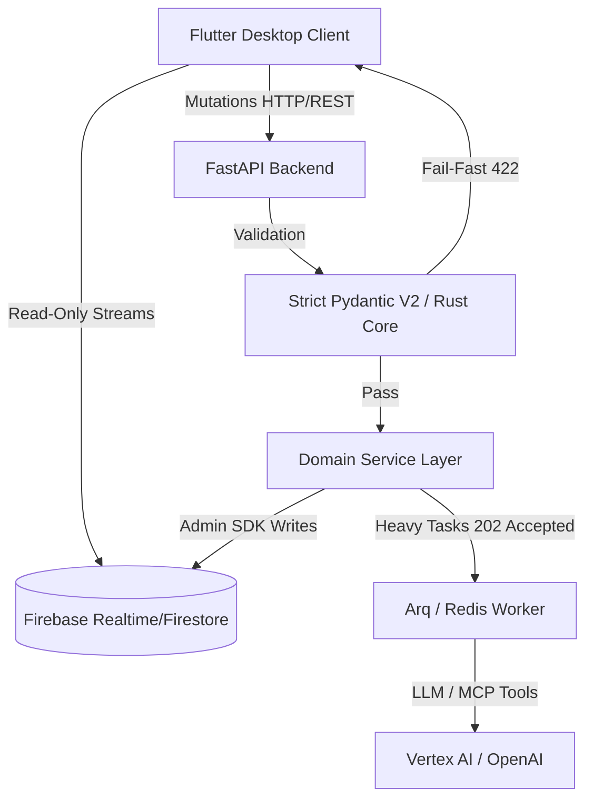
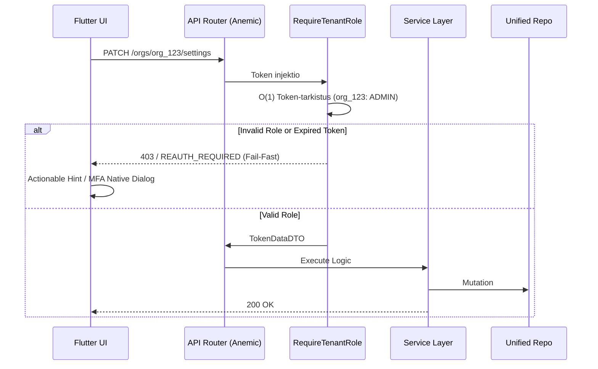
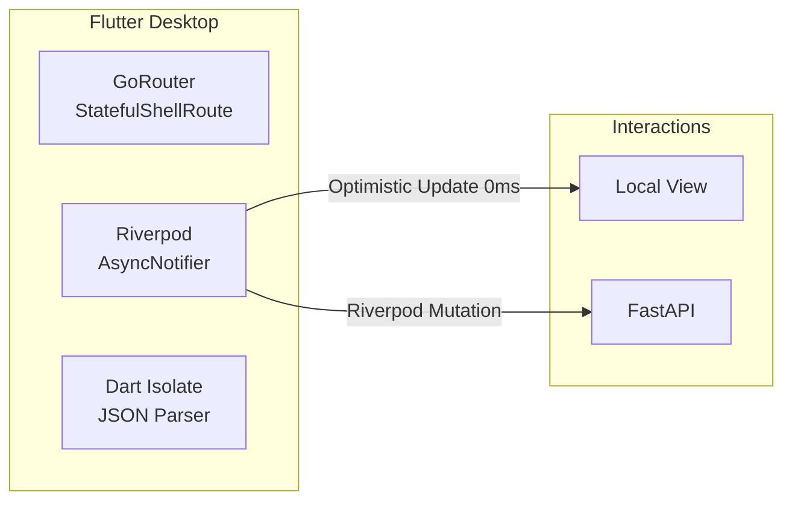

# **ARKKITEHTUURIMÄÄRITTELY: Komponenttipohjainen AI-orkestraattori (Enterprise V2.5)**

Tämä dokumentti määrittelee dynaamisen, täysin litteän (Flat MVC) ja sataprosenttisesti auditoitavan tekoälyorkestraattorin ydinarkkitehtuurin B2B SaaS -ympäristöön vuonna 2026. 

## **1. Arkkitehtuurin Ydinfilosofiat (2026 Mandates)**

1. **Firebase CQRS (Read/Write Separation):** Flutter-käyttöliittymä on tietokannan suhteen täysin **Read-Only**. Se käyttää Firebase SDK:ta ainoastaan lokaalien nollaviiveen striimien kuuntelemiseen. Kaikki tilamutaatiot kulkevat Python FastAPI -backendin kautta.
2. **The Zero-Compromise Pledges (Fail-Fast):** Niellyt virheet (`try-except pass`) ja vaimennetut ohitukset asettamalla oletusarvoja puuttuvalle datalle (`score = 0.0`) ovat kiellettyjä. Jos tieto puuttuu tai on viallista, backend nostaa välittömästi `AppException(RFC 7807)` -luokan virheen ja suoritus katkeaa.
3. **Strict Pydantic V2 (Rust-Core):** Data puretaan suoraan Rust-ytimessä (`MyModel.model_validate_json`). Tilusoluja säädellään muuttumattomina (`frozen=True`) ja hallusinaatiot estetään hylkäämällä ulkopuoliset avaimet (`extra="forbid"`). Polymorfinen reititys hoidetaan aina O(1) tason `discriminator` -kentillä.
4. **Background Workers (The Arq Mandate):** API on asynkroninen muttei blokkaava. Raskaat DAG-ketjut, tekoälyn prosessointi ja massatuonnit (Excel/CSV) siirretään välittömästi `Arq / Redis` taustajonoon palauttaen `202 Accepted`.
5. **Kognitiivinen Riippumattomuus (The Anti-Mirror Protocol):** Tekoälyagentit suoritetaan työnkuluissa rinnakkain varjeltuna The Blind Audit -protokollalla, missä ne eivät koskaan näe saati arvioi rinnakkaisten tekoälyjen tuotosta lopullisessa ihmisdatan arviossa.
6. **Opaque Stripe ID Mandate:** Yksikään tietokanna-avain ei saa yrittää olla ihmisluettava luonnollisella kielellä. Tunnisteet noudattavat turvallista rakennetta (esim. `org_[a-zA-Z0-9]{8,}`). URL-slugit eristetään puhtaasti kosmeettisiksi.

---

## **2. B2B SaaS IAM & Turvallisuusmandaatit**

Identiteetti, asiakaseristys ja pääsynhallinta on toteutettu vahvalla Zero-Trust -mallilla, joka eliminoi manuaaliset tietokantahaut token-validoinneista litteillä leimoilla (Custom Claims).

### **A. Passkey-First ja Proaktiivinen MFA**
Ensisijainen tunnistautumisinfrastruktuuri rakentuu modernin FIDO2 Passkey -kirjautumisen ympärille. Monivaiheinen tunnistautuminen (MFA) todennetaan lennosta O(1)-nopeudella JWT-tokenin `amr`-leimasta (Authentication Methods References). Rivi reitittimessä `RequireMFA()` pakottaa Frontendin nostamaan lokaalin jatkotunnistautumishaasteen nollaviiveellä ilman täyden sivun uudelleenlatausta.

### **B. Käyttäjäroolit ja Oikeusmatriisi (Custom Claims)**
Firebasen injektoimat leimat dekoodataan asynkronisesti sekä backendin suojauksissa (Guards) että Frontendin Riverpod-muistissa (SWR). Riverpod degradittää työtilat lokaalisti, kätkien painikkeita (`SizedBox.shrink()`), joihin käyttäjällä ei ole valtuuksia.
* **ROOT:** Globaali pääkäyttäjä (System Admin), ei The Tenant -eristyksen rajoissa.
* **ADMIN:** Tenantin täysimittainen omistaja (Laskutus, SSO Enterprise Mappings, Poistovalta).
* **MANAGER:** Kognitiivisia DAG-työnkulkuja rakentava asiantuntija.
* **MEMBER:** Ajoja (Executions) käynnistävä asiantuntija.
* **VIEWER:** Strict Read-Only -oikeus lokien ja tulosten (TraceEvent) silmäilyyn.

### **C. Modernit Yritysominaisuudet (B2B)**
SaaS-alusta suojaa yritysdataa aktiivisesti:
* **Saga Pattern Tilinpoistossa:** Käyttäjää poistettaessa (oikeus tulla unohdetuksi) API laukaisee taustalla Arq Workerin, joka pyyhkii PII-datan järjestelmästä riisuutuen pelkkään orpoon Opaque ID -tunnisteeseen turvatakseen globaalien XAI-ajolokien historiallisen eheyden.
* **Device Fingerprinting:** Mahdollisuus evätä API-tasolla toisten laitteiden Refresh Tokenit.
* **Tekoälyn Opt-Out (Consent):** Yritys voi nappia painamalla asettaa API-kerrokseen Zero-Data-Retention -leiman, estäen kaiken Tenant-datan valumisen OpenAI:n/Anthropicsin globaaleihin opetusmalleihin.
* **API-avaimet (PAT):** Ohjelmallisiin tuonteihin tarkoitetut skriptiavaimet nojaavat vahvaan Step-Up MFA -varmennettuun salakirjoitukseen heti ensimmäisellä vilkaisulla esitettynä.

---

## **3. Esityskerros (Adaptive BFF - Flutter & Riverpod)**

Koko käyttöliittymän arkkitehtuuri nojaa **Desktop-First** ja **IDE Pro-Tool** -filosofioihin. Käyttäjä on asiantuntija, eikä hänen työnkulkuaan saa katkaista kokoruudun siirtymillä tai piinaavilla lautas-animaatioilla.

1. **Stateful Nested Navigation (GoRouter):** Työpöytänäkymän päänavigaation on ehdottomasti nojattava `StatefulShellRoute` -rakenteeseen. Asiantuntijan monimutkainen alasvetovalikko-tila tai Infinite Canvas -näyttö ei rikkoudu, jos hän piipahtaa sivupalkin kautta katsomassa asetusvälilehteä. "InitialData" (`$extra`) objektin syöttäminen GoRouterin yli uuteen tilaan on täysin kielletty – GoRouter käsittelee vain luunkovia Opaque ID -avaimia.
2. **Zero-Latency IAM UI (SWR & Optimistic Updates):** Asetusikkunat (Teema, Kieli, Työtilat) käyttävät puhdasta Stale-While-Revalidate (SWR) -matriisia. Käyttöliittymä vastaa nollaviiveellä välittömästi, kun Riverpod-mutaatiot puskevat verkkopyynnöt asynkroniseen tausta-ajoon – estäen perinteiset ja raskaat koko ruudun peittävät latausanimaatiot kokonaan.
3. **The Isolate Mandate (Ei Pääsäikeen Bukkauksia):** Satojen megatavujen RAG-raportit tai massiiviset 5000 rivin CSV-vienti/tuonnit koodataan ehdottomasti ohittamaan UI-säie, siirtyen luonnostaan rinnakkaiseen `Isolate.run()` asynkroniseen dataparserointiin. Suorituskyky pidetään teräksisenä 144Hz PC-näytöillä.

---

## **4. Kognitiivinen Monikielisyys (The 5-Layer Strategy)**

Järjestelmä viipaloi ihmisten hallintakielen ja kielimallien kognitiivisen ytimen toisistaan.

1. **Compile-Time l10n (`.arb`):** Vain järjestelmän kiinteät UI-solunut (Otsikot, Navigaatio).
2. **Runtime Payload:** Pydanticin DTO-rakenne ohjeille `translations: {"fi": "Syyttäjä...", "en": "Prosecutor..."}`.
3. **English-Only Mandate (The Deep Engine):** Tekoälyn järjestelmätason luokittelumandaatit ja System Prompt -konfiguraatiot pitää aina ohjelmoida englanniksi laadun maksimoimiseksi, pakottaen mallin `reasoning_trace` askelluksen englantiin. 
4. **Temporal Standard:** Numerot, ajat ja desimaalit matkustavat backendin ja tietokannan välillä primitiivinä ISO-8601 UTC -standardissa ja ne kääntyvät ihmiskielelle Dart ICU -kirjastoilla lokaalissa.
5. **Translation Hooks:** JSON-objekteihin generoitu tekoälyvastaus suodatetaan Blueprint Service -kerroksessa myöhäisellä sidonnalla. Malli ei itse käännä JSON-avaimia jotta Pydantic v2 validaatio ei pirstaloidu.

---

## **5. Työnkulkujen Orkestraatio (DAG) & Suoritusmoottori**

Quorumin todellinen voima asuu tietokantapohjaisesti ohjatuissa suunnatuissa syklittömissä verkoissa (`Directed Acyclic Graph`), joissa yksittäisten arviointimatriisien säännöt yhdistyvät täydellisesti erotettuun logiikkakerrokseen.

```mermaid
graph TD
    A[$inputs.chat_log] --> B(Parser/Normalizer Hook)
    B --> C{DAG Router}
    C -->|Strategy: Fast| D[Step 1: Analyst Agent]
    C -->|Strategy: Strict| E[Step 2: Prosecutor Agent]
    D --> F[Final Aggregation Hook]
    E --> F
    F --> G(ReportDataDTO Flush)
    style D fill:#2b2b2b,stroke:#00a3cc,stroke-width:2px
    style E fill:#2b2b2b,stroke:#e63900,stroke-width:2px
```

### **A. Polymorfinen Node-Orkestraatio (The Strategy Pattern)**
Puhdas rajapinta (`BaseNodeStrategy`) erottaa suorittavat solmut:
- **LLMNodeStrategy:** Syöttää skeman (Structured Output) LLM-moottoriin, kytkien pyynnön dynaamiseen faktanhakukoneeseen The Tool Loop.
- **LogicNodeStrategy:** Ajaa ohjelmallisia CPU-bound sääntöjä, parsien tai muuntaen dataa deterministisesti ilman hallusinaatioriskejä.

### **B. Ikuinen Auditoitavuus (Append-Only Event Sourcing)**
Ajon prosessi on "Append-Only" nauha lukkiutumattomia varmenteita (`TraceEvent`). Yhtäkään tilaa ei koskaan ylikirjoiteta. Historialliset askeleet kapseloidaan tismalleen muuttumattomaan syväkopioon (`FrozenContext`), joka varmistaa 100% auditoitavuuden vuosia myöhemmin – jopa silloin, kun alkuperäisten Agenttien parametritietokantoja on muokattu satoja kertoja.

### **C. The Tool Loop & Serverless MCP Integraatio**
Jos tekoälymallilla havahtuu "Episteemiseen Epävarmuuteen", API keskeyttää päätöksenteon välittömästi. 
Se siirtyy hakuun (Model Context Protocol). Etsivät `Tools` toimivat erillisinä SaaS-soketteina (Cloud Run / Tavily). Täysmääräinen hakuhistoria (`tool_calls` ja empiirinen fakta) säilytetään eheänä, litistämättömänä Message-Arraynä (Pass-Through) läpi HTTP-kyselyn estämään hallusinaatiot, ja faktat pakotetaan Pydantic-validoinnilla globaaleihin XAIEvidence -lokilaatikoihin Frontendiin suojellakseen objektiivista faktaa subjektiivisen koneopin seasta.

### **D. TaskGroup & Zombisäikeiden Kuolema**
Tekoälyn ja tietokannan massakyselyverkostot ammutaan matkaan `asyncio.TaskGroup()` -varjoilla suojelemaan palvelinta. Avoimia `asyncio.gather()` tulilankoja, jotka jättäisivät järjestelmään vuotavia orposäikeitä ("Zombies"), pidetään arkkitehtuurisena esteenä Fail-Fast mentaliteetille. Jos koko ketju kaatuu ExceptionGroup-tulvassa, Arq-työntekijä pysäyttää leikin jäsennellysti ja nollaa resurssit varoituksetta.