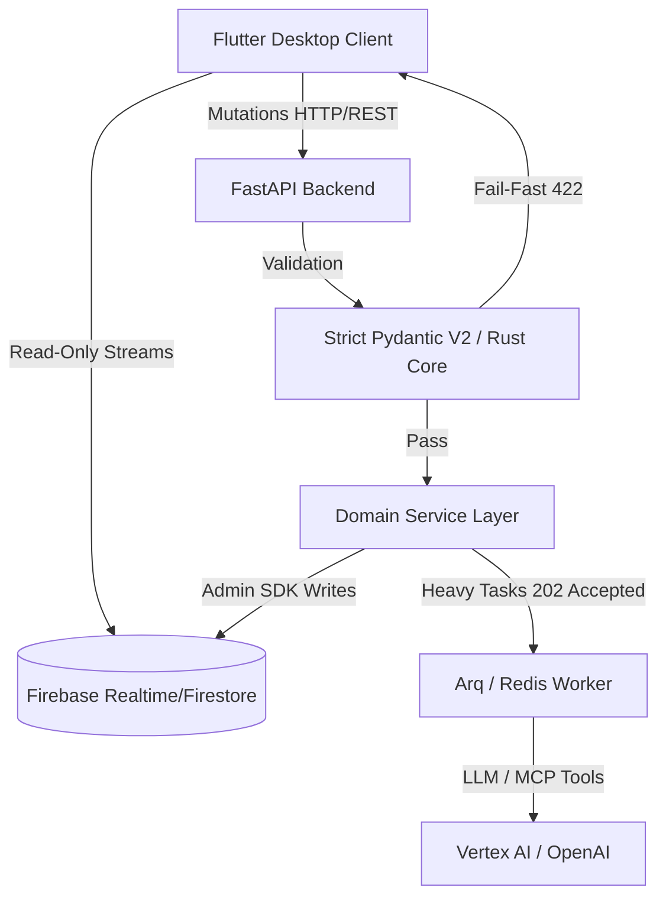
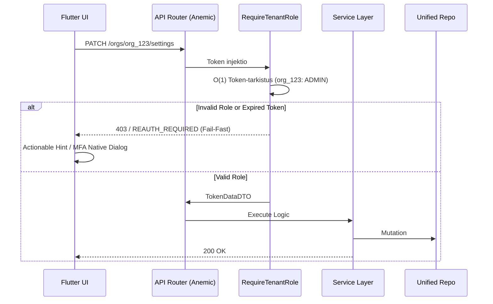
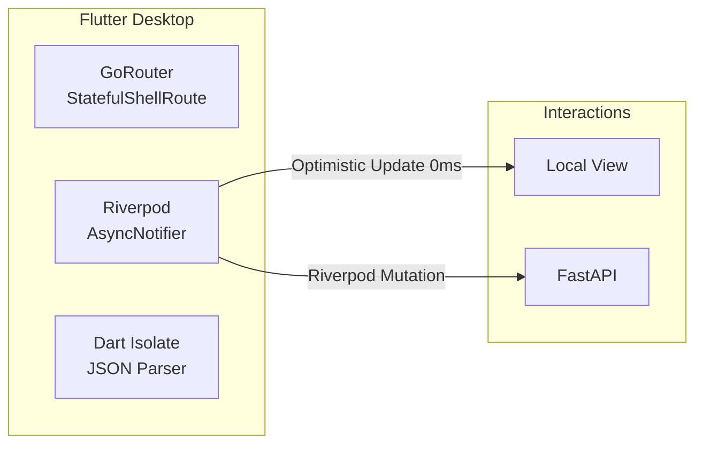
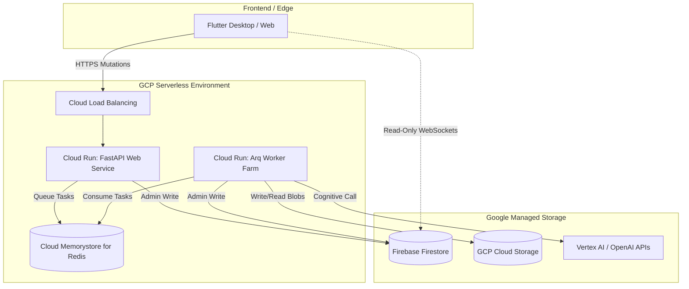

# **ARKKITEHTUURIMÄÄRITTELY: Komponenttipohjainen AI-orkestraattori (Enterprise V2.5)**

> [!IMPORTANT]
> **PHASE 9 HARDENING & EPIC 10 SLUG ERADICATION ACTIVE**
> Tämä dokumentti on päivitetty täysin vastaamaan Phase 9 tasoa (Pydantic V2 Strict Nirvana & Flutter Freezed). Kaikki vanhat jäänteet "try-except pass" peittelystä, Freezed-kirjaston ohittamisesta tai vapaamuotoisista tiedonsiirroista on EHDOTTOMASTI KIELLETTY. Ainoa sallittu arkkitehtuuri on "Fail-Fast", tiukka Opaque ID -reititys (Slugien poisto) ja täydellinen Rust-core purku (Pydantic / Isolate.run).

Tämä dokumentti määrittelee dynaamisen, täysin litteän (Flat MVC) ja sataprosenttisesti auditoitavan tekoälyorkestraattorin ydinarkkitehtuurin B2B SaaS -ympäristöön vuonna 2026. 

## **0. Järjestelmäkonteksti ja Executive Summary (C4)**

**Ongelma (Mittaamisen kriisi):** Generatiivisen tekoälyn myötä tietotyö kohtaa laadullisen mittaamisen haasteen. Organisaatiot uittavat valtavia määriä arkaluontoista sankaridataa valmiisiin perusmalleihin (GenAI), mutta pelkkään yhteen monoliittiseen tekoälymalliin nojaaminen johtaa *myötäilyvinoumaan* (Sycophancy) sekä vaarallisiin, auditoimattomiin hallusinaatioihin. Yksittäinen raskaasti pyörivä tekoälymalli on umpisokea falsifioimaan omaa suoritustaan tai tunnistamaan loogisia syy-seuraus -virheitään prosessin aikana.

**Ratkaisu (Quorum):** B2B SaaS -alusta, jonka avulla asiantuntijat rakentavat turvallisesti eristettyjä, sataprosenttisesti auditoitavia rinnakkaisia tekoälyketjuja (DAG) esimerkiksi massiivisten lakitekstien auditointiin tai sijoituspäätösten validoimiseen. Järjestelmä hajauttaa työn "Kognitiiviselle Kvoorumille" (Moniagenttijärjestelmä / MAS). Tässä arkkitehtuurissa jättimäinen kognitiivinen työ pilkotaan riippumattomiin pikkuosiin (esim. pelkkä Faktojen Etsijä, pelkkä Looginen Haastaja, pelkkä Tulisieluinen Tuomari). Täten prosessi pakotetaan noudattamaan tieteellisistä menetelmistä lainattua systemaattista falsifiointia, jolla varmistetaan luotettavuus (Reliability) ilman, että menetetään asiantuntijuuden syvyyttä (Validity).

**Loppukäyttäjät:** Ensisijaisena kohderyhmänä ovat yritysten substanssiasiantuntijat (Manager-rooli), jotka piirtävät joustavia AI-putkia graafisessa Workflow Studiossa täysin ilman koodausosaamista (No-Code), sekä tuotannon loppukäyttäjät (Member), jotka ajavat järjestelmään satojen sivujen PDF-materiaaleja saadakseen takaisin läpinäkyviä XAI-raportteja (Explainable AI) täsmällisten lähdeviitteiden kera.

### **Brändisanasto (Glossary)**
* **Quorum (Kognitiivinen Kvoorum):** Alustan metodologinen sydän. Moniagenttijärjestelmä (MAS), missä luotettavuus syntyy erikoistuneiden agenttiroolien tuottamasta Koosteoppimisesta (Ensemble Learning) ja niiden välisestä ennalta suunnitellusta debatoinnista yksittäisen "kaikkitietävän" mallin sijaan.
* **Blueprint Service (Step):** Järjestelmän atomaarinen rakennuspalikka. Kapseloi sisäänsä tarkasti määritellyn ja eristetyn tehtävän (esim. "Analyst"), sisältäen sille viritetyt "System Promptit" sekä tiukat Pydantic-dataskemat (Odotetut syötteet ja tulosteet).
* **The Blind Audit (Kognitiivinen Riippumattomuus):** Arkkitehtuurin sääntö, jonka mukaan rinnakkaiset tekoälyagentit (kuten Analyytikko ja Falsifioija) suoritetaan työnkuluissa alussa "sokkona". Ne eivät näe rinnakkaisten agenttien väliarvioita (ehkäisee heikkoa konsensusta / lauma-ajattelua), ja faktat aggregoidaan yhteen vasta prosessin loppuvaiheessa (Tuomari-solmussa).
* **Fail-Fast (Zero-Compromise Pledge):** Keskeinen koodausfilosofia. Palvelin ei koskaan saa yrittää paikata puuttuvaa dataa asettamalla "turvallisia" oletusarvoja, vaan kaatuu ja heittää virheen välittömästi (RFC 7807 Standardi), jos odotettua rakennetta ei löydy. Pakottaa korjaamaan juurisyyt laastaroimisen sijaan.
* **Hybridirubriikki:** Arvioinnin viitekehys koko SaaS-palvelun ytimessä, missä mekaaninen validointikerros (Strict DTO Schema / Python hookit) takaa mittauksen toistettavuuden (Reliability) ja korkean tason agenttiverkko takaa poikkeuksellisten oivallusten löytymisen sääntöjen takaa (Validity).

## **1. Arkkitehtuurin Ydinfilosofiat (2026 Mandates)**

1. **Firebase CQRS (Read/Write Separation):** Flutter-käyttöliittymä on tietokannan suhteen täysin **Read-Only**. Se käyttää Firebase SDK:ta ainoastaan lokaalien nollaviiveen striimien kuuntelemiseen. Kaikki tilamutaatiot kulkevat Python FastAPI -backendin kautta.
2. **The Zero-Compromise Pledges (Fail-Fast & Zero Backward Compatibility):** Niellyt virheet (`try-except pass`) ja vaimennetut ohitukset asettamalla oletusarvoja puuttuvalle datalle (`score = 0.0`) ovat kiellettyjä. Järjestelmän ainoa totuus on lokaali `seed_data.json`. Jos tieto puuttuu tai on viallista, backend nostaa välittömästi `AppException(RFC 7807)` -luokan virheen ja suoritus katkeaa. Taaksepäinyhteensopivuutta (Graceful Degradation) ei tueta.
3. **Strict Pydantic V2 & Flutter Freezed Parity:** Backendin data puretaan suoraan Rust-ytimessä (`MyModel.model_validate_json`, `extra="forbid"`). Vaikka backendissä sallitaan käytännön syistä joustavuutta (`strict=False` lokaaleissa Enumeissa raskaiden JSON/TinyDB-purkujen takia), Frontendissä (Flutter) noudatetaan säälimätöntä 100% "Strict Nirvanaa" (Freezed + `json_serializable` tiukalla `disallow_unrecognized_keys: true` -asetuksella, O(1) lista-vertailu ohittamalla `.==`). Manuaalinen JSONin purku on kielletty, ja polymorfinen reititys UI:ssa hoidetaan yksinomaan natiiveilla Dart 3 `sealed class` ja `switch` pareilla (ei `.when()` tai fallback-tyyppejä).
4. **Background Workers (The Arq Mandate):** API on asynkroninen muttei blokkaava. Raskaat DAG-ketjut, tekoälyn prosessointi ja massatuonnit (Excel/CSV) siirretään välittömästi `Arq / Redis` taustajonoon palauttaen `202 Accepted`.
5. **Kognitiivinen Riippumattomuus (The Anti-Mirror Protocol):** Tekoälyagentit suoritetaan työnkuluissa rinnakkain varjeltuna The Blind Audit -protokollalla, missä ne eivät koskaan näe saati arvioi rinnakkaisten tekoälyjen tuotosta lopullisessa ihmisdatan arviossa.
6. **Opaque Stripe ID Mandate:** Yksikään tietokanna-avain ei saa yrittää olla ihmisluettava luonnollisella kielellä. Tunnisteet noudattavat turvallista rakennetta (esim. `org_[a-zA-Z0-9]{8,}`). URL-slugit eristetään puhtaasti kosmeettisiksi.

---

## **2. B2B SaaS IAM & Turvallisuusmandaatit**

Identiteetti, asiakaseristys ja pääsynhallinta on toteutettu vahvalla Zero-Trust -mallilla, joka eliminoi manuaaliset tietokantahaut token-validoinneista litteillä leimoilla (Custom Claims).

### **A. Passkey-First ja Proaktiivinen MFA**
Ensisijainen tunnistautumisinfrastruktuuri rakentuu modernin FIDO2 Passkey -kirjautumisen ympärille. Monivaiheinen tunnistautuminen (MFA) todennetaan lennosta O(1)-nopeudella JWT-tokenin `amr`-leimasta (Authentication Methods References). Rivi reitittimessä `RequireMFA()` pakottaa Frontendin nostamaan lokaalin jatkotunnistautumishaasteen nollaviiveellä ilman täyden sivun uudelleenlatausta.

### **B. Käyttäjäroolit ja Oikeusmatriisi (Custom Claims)**
Firebasen injektoimat leimat dekoodataan asynkronisesti sekä backendin suojauksissa (Guards) että Frontendin Riverpod-muistissa (SWR). Riverpod degradittää työtilat lokaalisti, kätkien painikkeita (`SizedBox.shrink()`), joihin käyttäjällä ei ole valtuuksia.
* **ROOT:** Globaali pääkäyttäjä (System Admin), ei The Tenant -eristyksen rajoissa.
* **ADMIN:** Tenantin täysimittainen omistaja (Laskutus, SSO Enterprise Mappings, Poistovalta).
* **MANAGER:** Kognitiivisia DAG-työnkulkuja rakentava asiantuntija.
* **MEMBER:** Ajoja (Executions) käynnistävä asiantuntija.
* **VIEWER:** Strict Read-Only -oikeus lokien ja tulosten (TraceEvent) silmäilyyn.

### **C. Modernit Yritysominaisuudet (B2B)**
SaaS-alusta suojaa yritysdataa aktiivisesti:
* **Saga Pattern Tilinpoistossa:** Käyttäjää poistettaessa (oikeus tulla unohdetuksi) API laukaisee taustalla Arq Workerin, joka pyyhkii PII-datan järjestelmästä riisuutuen pelkkään orpoon Opaque ID -tunnisteeseen turvatakseen globaalien XAI-ajolokien historiallisen eheyden.
* **Device Fingerprinting:** Mahdollisuus evätä API-tasolla toisten laitteiden Refresh Tokenit.
* **Tekoälyn Opt-Out (Consent):** Yritys voi nappia painamalla asettaa API-kerrokseen Zero-Data-Retention -leiman, estäen kaiken Tenant-datan valumisen OpenAI:n/Anthropicsin globaaleihin opetusmalleihin.
* **API-avaimet (PAT):** Ohjelmallisiin tuonteihin tarkoitetut skriptiavaimet nojaavat vahvaan Step-Up MFA -varmennettuun salakirjoitukseen heti ensimmäisellä vilkaisulla esitettynä.

---

## **3. Esityskerros (Adaptive BFF - Flutter & Riverpod)**

Koko käyttöliittymän arkkitehtuuri nojaa **Desktop-First** ja **IDE Pro-Tool** -filosofioihin. Käyttäjä on asiantuntija, eikä hänen työnkulkuaan saa katkaista kokoruudun siirtymillä tai piinaavilla lautas-animaatioilla.

1. **Stateful Nested Navigation (GoRouter):** Työpöytänäkymän päänavigaation on ehdottomasti nojattava `StatefulShellRoute` -rakenteeseen. Asiantuntijan monimutkainen alasvetovalikko-tila tai Infinite Canvas -näyttö ei rikkoudu, jos hän piipahtaa sivupalkin kautta katsomassa asetusvälilehteä. "InitialData" (`$extra`) objektin syöttäminen GoRouterin yli uuteen tilaan on täysin kielletty – GoRouter käsittelee vain luunkovia Opaque ID -avaimia.
2. **Zero-Latency IAM UI (SWR & Optimistic Updates):** Asetusikkunat (Teema, Kieli, Työtilat) käyttävät puhdasta Stale-While-Revalidate (SWR) -matriisia. Käyttöliittymä vastaa nollaviiveellä välittömästi, kun Riverpod-mutaatiot puskevat verkkopyynnöt asynkroniseen tausta-ajoon – estäen perinteiset ja raskaat koko ruudun peittävät latausanimaatiot kokonaan.
3. **The Isolate Mandate (Ei Pääsäikeen Bukkauksia):** Satojen megatavujen RAG-raportit tai massiiviset 5000 rivin CSV-vienti/tuonnit koodataan ehdottomasti ohittamaan UI-säie, siirtyen luonnostaan rinnakkaiseen `Isolate.run()` asynkroniseen dataparserointiin. Suorituskyky pidetään teräksisenä 144Hz PC-näytöillä.
4. **The Zero-Math & Micro-CoT Flattening Mandate:** Käyttöliittymä (Dart/Flutter) ei saa koskaan laskea numeerisia keskiarvoja tai yrittää parsia monimutkaisia sisäkkäisiä tekoälyn Micro-CoT (Chain of Thought) -rakenteita vapaista sanakirjoista (dict). Pydantic-turvallisuuden takaamiseksi kaikki datan litistäminen (Flattening) tapahtuu Backendin Python-kerroksessa (esim. `ScoringHook`). Tekoälyn palauttama rakenteellinen JSON puretaan osiin: `score` asetetaan absoluuttisena liukulukuna (`float`) ja xAI-päättelyketjut yhdistetään `justification`-tekstikenttään. Tämä takaa Flutterin Type-Safe -toiminnan ilman, että `SafeCast` muuttaa tuntemattomia objekteja null-arvoiksi.

---

## **4. Kognitiivinen Monikielisyys (The 5-Layer Strategy)**

Järjestelmä viipaloi ihmisten hallintakielen ja kielimallien kognitiivisen ytimen toisistaan.

1. **Compile-Time l10n (`.arb`):** Vain järjestelmän kiinteät UI-solunut (Otsikot, Navigaatio).
2. **Runtime Payload:** Pydanticin DTO-rakenne ohjeille `translations: {"fi": "Syyttäjä...", "en": "Prosecutor..."}`.
3. **English-Only Mandate (The Deep Engine):** Tekoälyn järjestelmätason luokittelumandaatit ja System Prompt -konfiguraatiot pitää aina ohjelmoida englanniksi laadun maksimoimiseksi, pakottaen mallin `reasoning_trace` askelluksen englantiin. 
4. **Temporal Standard:** Numerot, ajat ja desimaalit matkustavat backendin ja tietokannan välillä primitiivinä ISO-8601 UTC -standardissa ja ne kääntyvät ihmiskielelle Dart ICU -kirjastoilla lokaalissa.
5. **Translation Hooks:** JSON-objekteihin generoitu tekoälyvastaus suodatetaan Blueprint Service -kerroksessa myöhäisellä sidonnalla. Malli ei itse käännä JSON-avaimia jotta Pydantic v2 validaatio ei pirstaloidu.

---

## **5. Työnkulkujen Orkestraatio (DAG) & Suoritusmoottori**

Quorumin todellinen voima asuu tietokantapohjaisesti ohjatuissa suunnatuissa syklittömissä verkoissa (`Directed Acyclic Graph`), joissa yksittäisten arviointimatriisien säännöt yhdistyvät täydellisesti erotettuun logiikkakerrokseen.

```mermaid
graph TD
    A[$inputs.chat_log] --> B(Parser/Normalizer Hook)
    B --> C{DAG Router}
    C -->|Strategy: Fast| D[Step 1: Analyst Agent]
    C -->|Strategy: Strict| E[Step 2: Prosecutor Agent]
    D --> F[Final Aggregation Hook]
    E --> F
    F --> G(ReportDataDTO Flush)
    style D fill:#2b2b2b,stroke:#00a3cc,stroke-width:2px
    style E fill:#2b2b2b,stroke:#e63900,stroke-width:2px
```

### **A. Polymorfinen Node-Orkestraatio (The Strategy Pattern)**
Puhdas rajapinta (`BaseNodeStrategy`) erottaa suorittavat solmut:
- **LLMNodeStrategy:** Syöttää skeman (Structured Output) LLM-moottoriin, kytkien pyynnön dynaamiseen faktanhakukoneeseen The Tool Loop. Koska mallit tuottavat syvälle jaoteltua strukturoitua dataa (esim. Micro-CoT JSON), solmun tulosteet on ehdottomasti litistettävä (Flattening) erillisen normalisointi-hookin avulla ennen kantaan viemistä, jotta UI:n Freezed-mallit eivät romahda tyyppivirheisiin.
- **LogicNodeStrategy:** Ajaa ohjelmallisia CPU-bound sääntöjä, parsien tai muuntaen dataa deterministisesti ilman hallusinaatioriskejä.

### **B. Ikuinen Auditoitavuus (Append-Only Event Sourcing)**
Ajon prosessi on "Append-Only" nauha lukkiutumattomia varmenteita (`TraceEvent`). Yhtäkään tilaa ei koskaan ylikirjoiteta. Historialliset askeleet kapseloidaan tismalleen muuttumattomaan syväkopioon (`FrozenContext`), joka varmistaa 100% auditoitavuuden vuosia myöhemmin – jopa silloin, kun alkuperäisten Agenttien parametritietokantoja on muokattu satoja kertoja.

### **C. The Tool Loop & Serverless MCP Integraatio**
Jos tekoälymallilla havahtuu "Episteemiseen Epävarmuuteen", API keskeyttää päätöksenteon välittömästi. 
Se siirtyy hakuun (Model Context Protocol). Etsivät `Tools` toimivat erillisinä SaaS-soketteina (Cloud Run / Tavily). Täysmääräinen hakuhistoria (`tool_calls` ja empiirinen fakta) säilytetään eheänä, litistämättömänä Message-Arraynä (Pass-Through) läpi HTTP-kyselyn estämään hallusinaatiot, ja faktat pakotetaan Pydantic-validoinnilla globaaleihin XAIEvidence -lokilaatikoihin Frontendiin suojellakseen objektiivista faktaa subjektiivisen koneopin seasta.

### **D. TaskGroup & Zombisäikeiden Kuolema**
Tekoälyn ja tietokannan massakyselyverkostot ammutaan matkaan `asyncio.TaskGroup()` -varjoilla suojelemaan palvelinta. Avoimia `asyncio.gather()` tulilankoja, jotka jättäisivät järjestelmään vuotavia orposäikeitä ("Zombies"), pidetään arkkitehtuurisena esteenä Fail-Fast mentaliteetille. Jos koko ketju kaatuu ExceptionGroup-tulvassa, Arq-työntekijä pysäyttää leikin jäsennellysti ja nollaa resurssit varoituksetta.

### **E. Kognitiivinen Tiedonkäsittely (Polyglot Context Engineering)**
Tekoälyn ohjaaminen (Prompt Engineering) ja datan injektointi LLM-kontekstiin nojautuu monikieliseen, vahvasti optimoituun "Polyglot" -formaattistrategiaan, jossa jokaisella tietorakenteella on psykologinen ja laskennallinen erityistehtävä:
1. **Ohjeistus (Markdown / MD):** Tekoälyn järjestelmätason luonne, askeleet ja asiantuntijasäännöt (System Prompt) muotoillaan ehdottomasti puhtaalla **Markdownilla** (esim. otsikot `##`, luettelot `-`). Nykyaikaisten mallien tokenisaattorit ymmärtävät Markdown-hierarkiaa natiivisti, mikä maksimoi painoarvon olennaisille säännöille ja parantaa mallin kykyä seurata ohjeita orjallisesti.
2. **Kontekstin Injektio (XML-tägit):** Ulkopuolelta tuotava asiantuntijadata, kuten RAG-lähteet, lähdetiedostot tai aiemmat analyysit, saarretaan semanttisesti vahvoilla **XML-tägeillä** (esim. `<document_1> ... </document_1>`). XML toimii "kognitiivisena aitoituksena" (Prompt Enclosure / Semantic Separation), joka pitää huolen siitä, ettei kielimalli ikinä sekoita epäluotettavaa asiakasdataa järjestelmän The Markdown -ytimen sisäisiin käskyihin. Tämä eliminoi myös Prompt Injection -haavoittuvuudet lennosta.
3. **Paluudata ja Eristys (JSON & Pydantic):** Ajatteluprosessin lopputuloksena Vastausten jäsentely pakotetaan täysin tiukkaan **JSON**-muotoon Structured Outputs -rajapinnoilla. Vaikka syöte on joustavaa luonnollista kieltä, koko tekoälyn ulostulo on The Backendille kuivaa konedataa. Pydantic-validointi sitoo JSON-rakenteet välittömästi deterministisiin sääntöihin ja suorittaa the Flattening-logiikan (kuten yllä mainittu The Zero-Math Mandate).

---

## **6. Tietomalli ja Datan Pysyvyys (Data Persistence)**

Koko orkestraattorin datan pysyvyys rakentuu abstrahoidun yhdistelmä-repositorion (`UnifiedRepository`) päälle, joka eristää taustajärjestelmän luku- ja kirjoitusoperaatiot kokonaan palvelu- ja API-kerroksilta. 

### **A. Kustannustehokas Master DB: Lokaali vs. Tuotanto**
* **Kehitysympäristö (Local):** Asynkroninen tiedostopohjainen kanta (`TinyDB` / JSON). Kaikki tilat, kuten `seed_data.json` js lokaalit työnkulut, ohjataan kansion `data/db_v2.json` sisään, mikä takaa 100% tietosuojan kehitysvaiheessa C-asemalla.
* **Tuotantoympäristö (Production):** **Firebase Firestore** toimii järjestelmän primäärikantana (Master DB) yhdistettynä **GCP Cloud Storage** -kerrokseen (Storage Driver). Firestore ei toimi raskaana "Event Sourcing" -lokina valtavien asiakirjojen säilömiseen kustannussyistä. Firestoreen tallennetaan vain kevyt **metadataindeksi** (esim. `status`, aikaleimat ja Opaque ID -suhteet). Raskaat JSON-hyötykuormat (megatavujen kokoiset Execution Traces) injektoidaan edullisiksi staattisiksi GCP Storage -objekteiksi.

### **B. CQRS-Synkronointi ja Atomiset Mutaatiot**
Järjestelmä välttää perinteisen (esim. PostgreSQL -> Firebase) kahtiajaon synkronointivirheet hyödyntämällä Firestorea natiivina Command & Query -väylänä:
1. **Commands (Kirjoitukset):** Flutter lähettää tilamuutospyynnöt HTTP/REST-kutsuina FastAPI-backendille The Zero-Compromise -validaation läpi. Firestoren asiakas-SDK:ta (Frontend) on ehdottomasti kiellettyä käyttää kirjoittamiseen.
2. **Atominen Tallennus:** Kun Arq Worker generoi raskaan tapahtumalokin ("Append-Only Event"), backendin `ExecutionService` tallentaa *ensin* valtavan datan `StorageDriver`illa turvaan, ja *vasta sen onnistuttua* päättää transaktion merkkaamalla Firestore-dokumenttiin tilan valmiiksi (`COMPLETED`).
3. **Queries (Luku-Striimit):** Koska Admin SDK:n tekemä kirjoitus osuu samaan Firebase-projektiin, jota Frontend kuuntelee nollaviiveen WebSockets/gRPC-tilauksilla, mutaatio projisoituu käyttöliittymään viiveettä (<100ms). Järjestelmäkaatuminen projektion välissä on arkkitehtuurisesti mahdotonta.

---

## **7. Infrastruktuuri ja Käyttöönottomalli (Deployment Architecture)**

Järjestelmän fyysinen topologia ja ajonaikainen ekosysteemi rakentuu **Google Cloud Platformin (GCP)** Serverless-arkkitehtuuriin. Tämä eliminoi raskaat Kubernetes (K8s) klusteripidikkeet, säästää ylläpitokustannuksia lepotilassa (Scale-to-Zero) ja mahdollistaa äkillisten B2B-kuormapiikkien automaattisen keston.

### **A. Suorituskerros (FastAPI & Arq Workers)**
* **Web Service (FastAPI):** Ajetaan tilattomassa `Google Cloud Run` -konteissa. Se skaalautuu automaattisesti horisontaalisesti tuhansiin yhtäaikaisiin HTTP-mutatiokutsuihin saapuvan liikenteen aallotusten mukaisesti.
* **Worker Farm (Arq):** Raskaat 5000 askelta kestävät LLM-ohjatut tekoälyverkot (DAG) irrotetaan FastAPI:sta. Taustaprosessit ("Jobs") suoritetaan jatkuvina *Cloud Run -työntekijäkonteissa* (tai *Cloud Run Jobs*, riippuen kuuntelumallista). Kun Redis-jono alkaa täyttyä The Tool Loop työmääräyksistä, laukaistaan taustalle GCP:n dynaamisella skaalauksella kymmeniä/satoja rinnakkaisia Worker-konteja, jotka pureskelevat jonoa poikki (Parallel Processing).

### **B. Tila- ja Jonokerros (State & Queues)**
* **Välimuisti ja Jonot (Redis):** Viestiketjujen ja väliaikaisen työjonon ydin on `GCP Cloud Memorystore for Redis (High-Availability Tier)`. Palvelin asettaa työt nopeasti Redisiin ja erillispalkatut Arq Worker -säikeet poimivat niitä sieltä itsenäisesti. Mikään arkkitehtuurikriittinen (esim. potilastieto) ei jää asumaan Redisiin turvataksemme Fail-Fast elvytysmallin: jos Redis kaatuu, vain aktiiviset työjonot vääristyvät ja virhe nollataan The Zombi-Protocol'nin turvin.

### **C. B2B Skaalautuvuusskenaario (Kymmenen 5000 kytköksen DAG ajoa)**
Kun 10 Enterprise-luokan yritystä laukaisee yhtäaikaisesti 50 000 laskennallista solmua:
1. Fast API ei hyydy eikä ruoki latenssia: Se generoi vain ohjeistuksen ja tiputtaa 50 000 objektia Redis-jonoon 10 millisekunnissa ja kuittaa Desktop Clientille "202 Accepted".
2. Flutter Client palaa normaaliin "Optimistic UI" tilaan näppärästi ilman odotuskeilaa.
3. Järjestelmän kapasiteettiraja ei ole koodissasi tai konteissa, vaan **Vertex AI / OpenAI:n asettamissa API-kiintiöissä (Rate Limits)**. Tämän takia Worker Nodeissa elää älykäs Concurrent Limiter (Backoff), joka ei pommita ulkoista verkkoa rajoitusten yli ja takaa joustavan skaalautumisen hallusinaatioiden ehdoilla.

---

## **8. Vikasietoisuus ja Virheistä Toipuminen (Resilience)**

Vaikka järjestelmän sisäinen arkkitehtuuri noudattaa ehdotonta "Fail-Fast" ja "Zero-Compromise" -filosofiaa, ulkoisiin verkkoriippuvuuksiin (kuten Vertex AI ja OpenAI API) sovelletaan joustavampaa vikasietoisuusmallia. Hajautetuissa B2B-järjestelmissä ulkoiset rajapinnat palauttavat säännöllisesti transientteja virheitä (esim. HTTP 429 Too Many Requests tai 503 Service Unavailable), joiden takia tuntikausia kestäneiden raskaiden DAG-ajojen nollaaminen "varoituksetta" olisi liiketoiminnallisesti kestämätöntä.

Tämän ristiriidan hallitsemiseksi järjestelmä toteuttaa kolmitasoisen toipumisstrategian ulkoisten riippuvuuksien osalta:

### **A. Älykäs Uudelleenyritys (Exponential Backoff)**
Kaikki ulospäin suuntautuvat LLM- ja hakukutsut kääritään automaattiseen uudelleenyrityslogiikkaan (Retry Wrapper / Tenacity). Jos ulkoinen palvelu palauttaa transientin virheen (esim. kapasiteettirajoitus), järjestelmä ei kaadu tai nosta Fail-Fast-virhettä välittömästi, vaan soveltaa satunnaistetulla viiveellä varustettua eksponentiaalista perääntymistä (Exponential Backoff with Jitter). Näin järjestelmä joustaa hetkellisten verkkokatkosten tai lyhyiden API-ruuhkien yli ilman tilaongelmia.

### **B. Kognitiivinen Tilan Tallennus (DAG Checkpointing)**
Massiivisissa työnkuluissa (esim. satoja solmuja pitkissä asiantuntija-analyyseissä) jokaisen onnistuneen solmun (Step) tulos tallennetaan välittömästi tietokantaan (Firestore / GCS -offload) erillisenä tilannevedoksena (Checkpoint). Tämä varmistaa, että jos koko Worker-prosessi kuitenkin kaatuu pitkittyneen API-katkoksen (Hard Timeout) tai pilvi-infrastruktuurin häiriön vuoksi, arvokasta ja kallista prosessointiaikaa ei menetetään kokonaan. Ajon tila voidaan myöhemmin Elvyttää (Resume) suoraan siitä solmusta, mihin se viimeksi onnistuneesti jäi. 

### **C. Hylättyjen Töiden Jono (Dead Letter Queue, DLQ)**
Jos taustatyö (Background Job) epäonnistuu jatkuvasti jopa maksimimäärän uudelleenyrityksiä jälkeen (esim. pysyvä Pydantic-validointivirhe täysin korruptoituneen kolmannen osapuolen API-vastauksen takia), sitä ei jätetä zombisäikeeksi kuormittamaan palvelinta asynkronisiin silmukoihin. Tällöin astuu voimaan Fail-Fast: ajon suoritus keskeytetään heti, mutta epäonnistunut prosessi varastoidaan turvallisesti erilliseen Dead Letter Queue (DLQ) -rekisteriin. Tämä eristää "myrkylliset" kuormat estäen niitä tukkimasta Redis-pääjonoa, luo hälytyksen järjestelmävalvojille RFC 7807 -muodossa ja mahdollistaa ajon debuggaamisen ja manuaalisen uudelleenkäynnistyksen viiveellä korjausten jälkeen.

---

## **9. Operatiivinen valvonta ja hajautettu jäljitys (Observability)**

Koska järjestelmä koostuu täysin asynkronisista ja hajautetuista mikropalveluista (Flutter -> FastAPI -> Redis -> Arq Worker -> Vertex AI), yksittäisen asiakaspyynnön jäljittäminen (Distributed Tracing) on kriittinen edellytys "Fail-Fast" -kaatumisten juurisyiden tutkinnassa. Ilman kattavaa telemetriaa Arq-workerin taustalla tapahtuvat kaatumiset ja tekoälyn hallusinaatiot näyttäytyisivät pelkkinä hiljaisina järjestelmävirheinä.

### **A. Hajautettu Jäljitys (Trace-ID & ContextVars)**
Järjestelmä ylläpitää yhtenäistä jäljitysketjua (Distributed Tracing) läpi kaikkien palvelurajojen hyödyntämällä Pythonin `contextvars` -kirjastoa ja keskitettyä telemetriaa (OpenTelemetry / Logfire -standardit):
1. **Laukaisu:** Käyttäjän työnkulusta syntyvä ainutlaatuinen tilaus (`execution_id` tai API-tason `X-Request-ID`) ruiskutetaan välittömästi FastAPI:n middleware-kerroksessa asynkroniseen lokaaliin kontekstiin (`ContextVars`).
2. **Siirtymä:** Tunniste välitetään asynkronisena payloadina Redis-jonon (Arq) yli taustatyöntekijälle, joka palauttaa sen välittömästi omaan suorituskontekstiinsa aktiiviseksi.
3. **Leimaus:** Keskitetty lokienhallinta (`ContextFilter`) liittää automaattisesti kyseisen jäljen (Trace-ID) **jokaiseen yksittäiseen lokiriviin**, joita palvelin ja työntekijä tuottavat, ja formatoi ne JSON-muotoon.
4. **Vaikutus:** Yksittäiset HTTP-virheet, LLM-rajapinnan asynkroniset kutsut ja Arq-työntekijän Pydantic-kaatumiset sidotaan yhteen näkymään yhden Trace-ID:n alle. Valvoja näkee suoraan, kuka käyttäjä laukaisi kaatumisen, kauan Redis-jonotus kesti, ja minkä tarkalleen ottaen tekoälymalli hallusinoi.

### **B. Kaksinkertainen Raportointi (Dual-Reporting) ja Keskittäminen**
Telemetria ja raportointi noudattavat järjestelmässä arkkitehtuurista Dual-Reporting -mallia (`.agents/rules/02_flutter_desktop.md` -standardi), joka suojelee dataa ja keskittää näkyvyyden:
* **Palvelin ja AI (Backend):** Kaikki asynkroniset Pydantic-validaatiovirheet, LLM-kyselyiden kestot, ja työjonojen kaatumiset viedään automaattisesti **Pydantic Logfire** (tai muuhun OpenTelemetry -alustaan). Alusta instrumentoi natiivisti HTTPx- ja LiteLLM-kutsut, jolloin jokaisen tokenin kustannus ja mallin todellinen verkkovasteaika saadaan talteen ilman manuaalista lokitusta.
* **Käyttöliittymä (Proxy-Malli):** Client-sovellus (Flutter) **ei koskaan** raportoi laitteen kaatumisia (Crashlytics, UI-poikkeukset) suoraan kolmansien osapuolien pilvipalveluihin lukuun ottamatta asettamaansa omaa Firebase-telemateriaa. Sensitiiviset `AppException` -virheet ja ajonaikaiset logit lähetetään tietoturvallisesti Backendin omalle `/telemetry/client-error` -päätepisteelle (Proxy). 
* API-reititin paketoi Clientin session, käyttöjärjestelmän tiedot ja Flutterin Stack Tracen suoraan osaksi palvelimen omaa yhtenäistä lokivirtaa. Näin ollen järjestelmän virheet (niin painallus UI:ssa kuin AI-hallusinaatio 10 minuuttia myöhemmin) kulkevat turvallisesti eristetyllä siltojen yli ja ovat analysoitavissa yhdestä ja samasta "Single Pane of Glass" -näkymästä logienhallinnassa.

---

## **10. Tekoälyn resurssienhallinta (FinOps ja Kvootit)**

Kun puoliautonomisille tekoälyagenteille jaetaan vapaus ketjuttua (MAS) ja käyttää resursseja vaativia MCP-työkaluja, järjestelmän pilvilasku (Cloud Spend) altistuu täysin ohjelmallisille riskeille. Hallitsemattomat hallusinaatiot, ikuiset silmukat tai massiiviset tiedostokoot voivat laukaista "Denial of Wallet" -tilanteen eli budjetin räjähtämisen. B2B SaaS vaatii ehdottomat Tenant-tason suojamekanismit.

### **A. Tokenien jyvitys ja USD-laskenta (LiteLLM & Usage Service)**
Koko järjestelmän tekoälyliikenne (Vertex AI, OpenAI) reititetään keskitetyn `LiteLLMProvider` -komponentin läpi, joka vastaa standardisoidusta kulutuksen mittaamisesta:
1. **Mallikohtainen Hinnoittelu:** Välittömästi jokaisen API-kutsun jälkeen LiteLLM laskee tarkan USD-kustannuksen (`litellm.completion_cost()`), joka huomioi automaattisesti Input/Output/Cached ja Reasoning -tokenien mallikohtaiset hintaerot. Järjestelmän ei tarvitse ylläpitää hidasta lokaalia hintataulukkoa.
2. **Immutabeli Lokitus:** Jokainen kustannus tallennetaan pysyvänä `UsageRecord` -objektina tietokantaan siten, että se osoittaa yksiselitteisesti suorittavaan asiakasorganisaatioon (`org_id`), käyttäjään (`user_id`) ja instanssiin.
3. **SWR Aggregaatio:** Yksittäiset kustannukset aggregoidaan lennosta organisaatiotason kuukausisaldoiksi (CQRS-malli), jotta "kuluva budjetti" voidaan kysyä O(1)-latenssilla suoraan välimuistista.

### **B. Circuit Breaker ("Denial of Wallet" -suojaus)**
Järjestelmä seuraa ja tallentaa token-kuluja täydellisesti sentin murto-osien tarkkuudella (`UsageService.track_usage()`). Alustassa on aktiivinen automaattinen Circuit Breaker kahteen kriittiseen pisteeseen suojaamassa kustannusten karkaamista:
1. **Pre-flight Check (FastAPI Kerros):** Kun asiakas laukaisee uuden eräajon Frontendistä, API-reitittimen (`ExecutionService`) **ON PAKKO** varmentaa vuokralaisen budjetti (`check_quota`). Jos saldo ylittää määritetyn vuokralaisbudjetin (esim. 10.00 USD / kk), FastAPI hylkää HTTP-pyynnön välittömästi tilakoodilla `402 Payment Required` (RFC 7807 Standard). Pyyntöä ei koskaan päästetä edes Redis-jonoon säikeitä kuluttamaan.
2. **Worker Cut-off (Arq Kerros):** Koska pitkät, satojen MCP-solmujen ketjut saattavat räjäyttää budjetin kesken hiljaisen tausta-ajon, Arq-workerin (`BaseNodeStrategy`) on asynkronisesti auditoitava jäljellä oleva budjetti (Rate Limit) raskaiden solmuvaiheiden välissä. Jos budjetti ylittyy kesken lennon, orkestraattorin on laukaistava Graceful Degradation (Exit Hatch) -pysäytys. Ajo jäädytetään tilaan `QUOTA_EXCEEDED` ja siihen mennessä onnistunut työ tallennetaan TraceEventinä, lukiten organisaation kunnes laskutus on kuitattu.

---

## **11. Asynkroninen tapahtumahallinta ja Integraatiot (Event-Driven Loop)**

Koska järjestelmä rakentuu raskaiden tekoäly-DAG:ien ympärille ja nojaa asynkroniseen "Fire and Forget" -palvelumalliin (API palauttaa nopeasti "202 Accepted"), on elintärkeää, että sekä lokaali käyttöliittymä (Flutter) että asiakkaan koneelliset järjestelmät saavat viipymättä tiedon massiivisen työn valmistumisesta.

### **A. Käyttöliittymäluupin sulkeutuminen (The Reactive UI Loop)**
Kun Flutter Client pakottaa käskyn aloittaa jopa kymmeniä minuutteja kestävän tekoälyajon, prosessin tila puretaan ilman perinteisiä blokkaavia API-kyselyitä (HTTP Polling) tai Timeout-riskejä:

1. **Optimistic Start (Riverpod):** Saatuaan vahvistuksen ajon jonottamisesta, Frontendin Riverpod esittää 0 ms latenssilla lokaalin tilan (`PENDING / RUNNING`), siirtäen asiantuntijan välittömästi jatkamaan muuta työtä.
2. **Worker Terminal Write:** Kun Arq Worker Worker-kontissa suorittaa DAG-puun onnistuneesti loppuun (tai kaatuu Fail-Fast -sääntöön), sen viimeinen toiminto on ajaa tilamuutos (`ExecutionStatus.COMPLETED` tai `FAILED`) Master DB:hen yhtenä atomisena Mutaationa (Admin SDK:n Firestore-kirjoitus).
3. **Reaktiivinen Push-Päivitys (Zero-Code):** Flutterin käyttöliittymä ylläpitää taustalla saumatonta WebSocket/gRPC -kuuntelijaa (`firestore.collection.snapshots()`). Tieto tilamuutoksesta lennähtää pilvestä asiakaslaitteen muistiin välittömästi. Kun uusi data korvaa optimistisen SWR-tilan, Riverpod renderöi valmiin XAI-raportin näkyviin reaaliajassa asiantuntijan eteen.

### **B. Enterprise Integraatiot ja Webhookit (CRM/ERP -tuki)**
**Nykykuva (Tekninen Velka):** Vaikka asynkroninen tiedottaminen Flutter-käyttöliittymän lokaaleilla Workereilla on saumatonta (WebSocket/C++ Firebase SDK), ulkomaailman B2B-järjestelmien "Server-to-Server" (S2S) integraatiot loistavat tällä hetkellä poissaolollaan.

**Arkkitehtuurimandaatti ja Push-Automaatio:** B2B Enterprise -mittakaavassa (SaaS Integration Layer) asiakkaan CRM- tai ERP-järjestelmän täytyy reagoida välittömästi orkestraattorin onnistumiseen (esim. liittämällä valmis raportti takaisin asiakkaan ulkoiseen tikettiin). Pilvilaskun tai jatkuvan verkkoliikenteen kannalta ei ole järkevää ohjeistaa asiakkaita tekemään manuaalisia REST API -kyselyitä viiden sekunnin välein koneellisen tilan selvittämiseen.
Alustaan tulee välittömästi suunnitella seuraava integraatiokerros:
1. **Tenant-Specific Webhookit:** Jokainen organisaatio voi tallentaa oman järjestelmänsä URL:n alustan (Frontend -> Database) integraatioasetuksiin.
2. **Webhook Dispatcher (Arq):** Aina kun Worker-solmu savuttaa `COMPLETED`- tai `FAILED`-tilan, se laukaisee erillisen, kevyen Arq-Dispatcherin, joka suorittaa nopean **HTTP POST** -pyynnön suoraan tuohon asiakas-URL:ään vieden mukanaan tarkat Opaque ID:t tapahtumasta.
3. **Turvallisuus (HMAC-allekirjoitus ja PAT):** Salattu B2B-kommunikaatio edellyttää, että jokainen POST-vastaus allekirjoitetaan (HMAC-SHA256) yhdessä asiakkaan oman `Shared Secret` P.A.T:in (Personal Access Token) kanssa. Asiakas-yksikkö kykenee matemaattisesti omassa järjestelmässään varmentamaan, että palautuvan API-kutsun luoja oli varmasti aito Cognitive Quorum -alus, ei tahallinen hyökkääjä.