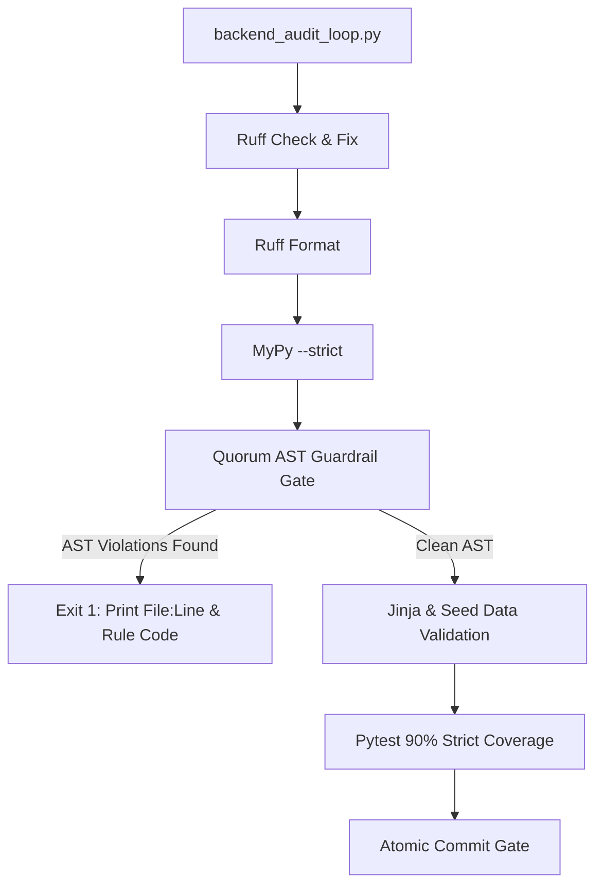

# Automated AST Codebase Guardrails (`.get()`, `getattr()`, and Silent `except Exception` Prevention)

> **SSOT Implementation Plan — Generated from Tier 8 Feature Audit `feature_audit_ast_guardrail_scripts.md`.**
> **Epic**: Automated Architectural Quality Gate Hardening

<required_context_rules>
- @[.agents/rules/00-antigravity-core.md]
- @[.agents/rules/01-python-backend.md]
- @[.agents/rules/04_directory_reference.md]
- @[ki_ast_guardrail_testing.md]
- @[ki_god_code_prevention.md]
- @[ki_global_config_sovereignty.md]
</required_context_rules>

<anti_targets>
- Do NOT use regex or string matching (`str.find`) for code AST validation (`no_string_matching_in_ast`).
- Do NOT allow false positives on string literals (`label = "getattr"`), comments, docstrings, or test assertions.
- Do NOT swallow scanner exceptions; AST syntax errors in target files MUST fail fast.
- Do NOT introduce duck-typing (`getattr`/`hasattr`/`isinstance(dict)`) or fallback dictionaries `{}` inside the guardrail script itself.
- Do NOT hardcode file lists; the scanner MUST dynamically accept any target files or directories passed by `backend_audit_loop.py`.
</anti_targets>

## Problem Statement

Standard Python tooling (`ruff` and `mypy --strict`) cannot enforce domain-level architectural rules in Quorum:
1. `getattr(obj, "field", None)` and `hasattr(obj, "field")` are legal Python syntax; `mypy` and `ruff` allow them without warnings.
2. `dict.get(key, default)` is a standard library dictionary method; linter tools cannot distinguish between unvalidated raw external payloads and domain state that must be strict Pydantic models.
3. Silent exception swallowing (`except Exception: pass` or `except Exception: return {}`) is allowed by linters if accompanied by comments or simple log lines, violating `the_duct_tape_ban` and Fail-Fast principles.

Because LLMs and developers can inadvertently introduce these anti-patterns, a **deterministic AST-based (Abstract Syntax Tree) static verification gate in `scripts/backend_audit_loop.py`** is required to mathematically prevent anti-patterns from entering the codebase.

### Architecture Decision

> [!IMPORTANT]
> **Dedicated Modular AST Guardrail Engine with Zero-Overhead Integration into `backend_audit_loop.py`**:

1. **Modular Scanner (`scripts/_ast_guardrails.py`)**: A pure Python AST visitor (`QuorumGuardrailVisitor`) that parses AST trees recursively and returns structured `GuardrailViolation` DTOs containing file path, line number, violation rule code, and actionable remediation instructions.
2. **Quality Loop Integration (`scripts/backend_audit_loop.py`)**: Wire the AST scanner into `backend_audit_loop.py` as an explicit validation step (Step 4/6) executed immediately after `mypy --strict` and before unit tests. If violations are found, the quality loop outputs clear error locations and exits with code 1.
3. **ISTQB Negative Test Suite (`backend_v2/tests/unit/scripts/test_ast_guardrails.py`)**: Comprehensive test suite verifying that the scanner flags all banned constructs while producing zero false positives on strings, comments, and reflection utilities.



---

## User Review Required

> [!IMPORTANT]
> **Scoping of `.get()` Fallback Detection**: To avoid false positives on low-level dictionary lookups, the `.get()` ban specifically targets **two-argument calls (`.get(key, default)`)** with fallback default literals (`""`, `{}`, `[]`, `0`, `None`) inside domain logic (`backend_v2/services/`, `backend_v2/hooks/`, `backend_v2/strategies/`, `backend_v2/models/`). Single-argument `.get(key)` (which returns `None` without masking defaults) is evaluated separately.

> [!IMPORTANT]
> **Exception Handling Verification**: The AST scanner mandates that any broad `except Exception:` or `except BaseException:` handler inside business logic MUST contain an explicit `ast.Raise` statement (re-raising or raising `AppException`). Silent `pass`, returning literal `{}` / `[]` / `None`, or logging without re-raising will fail the quality gate.

---

## Target Files and Modification Categories

- **[NEW]** @[scripts/_ast_guardrails.py]
- **[MODIFY]** @[scripts/backend_audit_loop.py#L148-L236]
- **[NEW]** @[backend_v2/tests/unit/scripts/test_ast_guardrails.py]
- **[MODIFY]** @[backend_v2/tests/unit/test_ast_domain_security_guardrails.py#L8-L89]

---

```xml
<execution_protocol>
  <phase id="1" name="Core AST Guardrail Engine Implementation">
    <step id="1.1" target="scripts/_ast_guardrails.py">
      <description>Implement QuorumGuardrailVisitor and scan_files_for_guardrails in scripts/_ast_guardrails.py.</description>
      <constraint invariant="ast_guardrail_testing">Implement ast.NodeVisitor detecting: 1) getattr/hasattr calls, 2) 2-argument .get(key, default) fallback calls in domain code, 3) broad except Exception handlers lacking ast.Raise.</constraint>
      <constraint invariant="pure_python_ast">Use pure Python standard library ast module. Zero external dependencies.</constraint>
      <constraint invariant="structured_violation_reporting">Return list of GuardrailViolation dataclass objects containing filepath: str, lineno: int, col_offset: int, rule_code: str, message: str, and snippet: str.</constraint>
    </step>

    <step id="1.2" target="scripts/_ast_guardrails.py">
      <description>Implement directory traversal and target resolution supporting single files, directories, and glob patterns.</description>
      <constraint invariant="directory_routing_mandate">Safely resolve target paths within workspace, ignoring .venv, __pycache__, and node_modules.</constraint>
    </step>
  </phase>

  <phase id="2" name="Backend Audit Loop Quality Gate Integration">
    <step id="2.1" target="scripts/backend_audit_loop.py">
      <description>Integrate AST Guardrail check into backend_audit_loop.py main() as Step 4 (before Jinja/Seed/Pytest validation).</description>
      <constraint invariant="ast_boundary_verification_mandate">Target lines L148-L236 in main() using ast.parse boundaries.</constraint>
      <constraint invariant="fail_fast_quality_gate">If scan_files_for_guardrails finds violations, print formatted error table with file, line, code, and remediation instruction, then sys.exit(1).</constraint>
    </step>
  </phase>

  <phase id="3" name="ISTQB Unit Testing &amp; Guardrail Parity">
    <step id="3.1" target="backend_v2/tests/unit/scripts/test_ast_guardrails.py">
      <description>Implement ISTQB unit tests covering all positive, negative, and false-positive avoidance partitions.</description>
      <constraint invariant="anti_happy_path_mandate">Test partitions: 1) Detection of getattr(), 2) Detection of hasattr(), 3) Detection of .get('k', default), 4) Detection of silent except Exception: pass, 5) Detection of except Exception: return {}, 6) False-positive immunity for string literals ('getattr'), 7) False-positive immunity for comments, 8) Valid except Exception with raise AppException.</constraint>
    </step>

    <step id="3.2" target="backend_v2/tests/unit/test_ast_domain_security_guardrails.py">
      <description>Update DomainSecurityVisitor in test_ast_domain_security_guardrails.py (L8-L89) to complement the new AST guardrails.</description>
      <constraint invariant="regression_defense">Verify all existing AST guardrail unit tests pass without regression.</constraint>
    </step>
  </phase>
</execution_protocol>
```

---

## Verification Plan

### Automated Tests

```powershell
uv run python scripts/backend_audit_loop.py scripts/_ast_guardrails.py
uv run python scripts/backend_audit_loop.py scripts/backend_audit_loop.py
uv run python scripts/backend_audit_loop.py backend_v2/tests/unit/scripts/test_ast_guardrails.py --test
uv run python scripts/backend_audit_loop.py backend_v2/tests/unit/test_ast_domain_security_guardrails.py --test
```

### Negative Verification (Anti-Happy-Path)

1. Feed code containing `getattr(obj, "field", None)` -> Verify audit loop exits with code 1 and logs `BAN_DUCK_TYPING`.
2. Feed code containing `except Exception: pass` -> Verify audit loop exits with code 1 and logs `BAN_SILENT_EXCEPTION`.
3. Feed code containing `d.get("key", "")` in `backend_v2/services/` -> Verify audit loop exits with code 1 and logs `BAN_LAZY_GET_FALLBACK`.
4. Feed code containing string literal `x = "getattr"` -> Verify audit loop passes cleanly (Zero False Positives).
