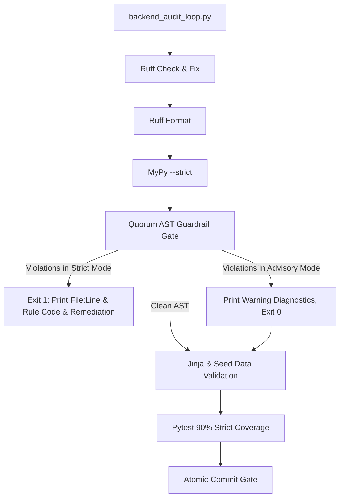

# Automated AST Codebase Guardrails (`.get()`, `getattr()`, and Silent `except Exception` Prevention)

> **SSOT Implementation Plan — Generated from Tier 8 Feature Audit `feature_audit_ast_guardrail_scripts.md`.**
> **Epic**: Automated Architectural Quality Gate Hardening

<required_context_rules>
- @[.agents/rules/00-antigravity-core.md]
- @[.agents/rules/01-python-backend.md]
- @[.agents/rules/04_directory_reference.md]
- @[ki_ast_guardrail_testing.md]
- @[ki_god_code_prevention.md]
- @[ki_global_config_sovereignty.md]
</required_context_rules>

<anti_targets>
- Do NOT use regex or string matching (`str.find`) for code AST validation (`no_string_matching_in_ast`).
- Do NOT allow false positives on string literals (`label = "getattr"`), comments, docstrings, or test assertions.
- Do NOT swallow scanner exceptions; AST syntax errors in target files MUST fail fast.
- Do NOT introduce duck-typing (`getattr`/`hasattr`/`isinstance(dict)`) or fallback dictionaries `{}` inside the guardrail script itself.
- Do NOT hardcode file lists; the scanner MUST dynamically accept any target files or directories passed by `backend_audit_loop.py`.
</anti_targets>

## Problem Statement

Standard Python tooling (`ruff` and `mypy --strict`) cannot enforce domain-level architectural rules in Quorum:
1. `getattr(obj, "field", None)` and `hasattr(obj, "field")` are legal Python syntax; `mypy` and `ruff` allow them without warnings.
2. `dict.get(key, default)` is a standard library dictionary method; linter tools cannot distinguish between unvalidated raw external payloads and domain state that must be strict Pydantic models.
3. Silent exception swallowing (`except Exception: pass` or `except Exception: return {}`) is allowed by linters if accompanied by comments or simple log lines, violating `the_duct_tape_ban` and Fail-Fast principles.
4. **Chameleon / Pseudo-Class Metaprogramming**: Overriding `__new__` on `BaseModel` classes or overriding `model_construct` with `# type: ignore[override]` to fake union behavior bypasses Rust `pydantic-core` validation, breaks MyPy/LSP attribute resolution, and introduces unvalidated silent fallbacks.
5. **Raw String Discriminator Routing**: Checking `block.category_id == "matrix"` or `category_id == "system_rule"` with raw string literals instead of strict `PromptBlockCategory` Enum members bypasses type safety and creates silent prompt compilation fractures.

### Codebase Blast Radius Audit (Day-One Reality)

Physical scanning of `backend_v2/` reveals **~442 pre-existing legacy violations**:
- `getattr()` / `hasattr()` calls: **160** (65 in `provider.py` alone for LiteLLM dynamic exception introspection)
- 2-arg `.get(key, default)` calls in domain logic: **112** (including valid Enum map lookups in `enums.py`)
- Broad `except Exception:` handlers: **~170** (including valid Circuit Breaker, Worker DLQ, and Archival boundaries)
- `__new__` / `model_construct` hijacking on BaseModel: **0** (fully cleaned)

> [!CAUTION]
> **The Scope Creep Bomb**: Activating a rigid, fatal AST check across all legacy files without phased rollout or suppression mechanisms would immediately brick development velocity — any 3-line bug fix would be blocked by 15+ pre-existing legacy violations.

---

### Architecture Decision: Context-Aware AST Engine with Phased Rollout

> [!IMPORTANT]
> **Dedicated Modular AST Guardrail Engine (`scripts/_ast_guardrails.py`) with Dual-Mode Quality Gate Integration (`scripts/backend_audit_loop.py`)**:

1. **Modular Scanner (`scripts/_ast_guardrails.py`)**: A pure Python AST visitor (`QuorumGuardrailVisitor`) that parses AST trees recursively and returns structured `GuardrailViolation` dataclass DTOs containing file path, line number, violation rule code, severity, and actionable remediation instructions:
   - `QGR001` (`BAN_REFLECTION_DUCK_TYPING`): Banning `getattr()` and `hasattr()` in domain/service logic, while respecting inline `# noqa: QGR001` and third-party dynamic exception lookups.
   - `QGR002` (`BAN_LAZY_GET_FALLBACK`): Banning two-argument `.get(key, default)` fallback lookups on internal domain states, while allowing Enum label maps and HTTP/environment access (`os.environ`, `request.headers`).
   - `QGR003` (`BAN_SILENT_EXCEPTION`): Banning broad `except Exception:` handlers lacking explicit `ast.Raise`, while allowing audited system boundaries (Worker DLQ, Circuit Breakers) with logging + state mutation or `# noqa: QGR003`.
   - `QGR004` (`BAN_PYDANTIC_METAPROGRAMMING`): Banning `__new__` and `model_construct` overrides on `BaseModel` subclasses (Chameleon Class Ban).
   - `QGR005` (`BAN_RAW_STRING_DISCRIMINATOR_ROUTING`): Banning raw string literals in polymorphic category routing.

2. **Inline Suppression Support (`# noqa: QGRxxx`)**: Full token-level comment parsing allowing legitimate low-level reflection (e.g. `getattr(litellm, "RateLimitError", type(None)) # noqa: QGR001`) without degrading architecture.

3. **Phased Quality Loop Integration (`scripts/backend_audit_loop.py`)**:
   - **Advisory Mode (Default on legacy targets)**: Prints formatted violation table with line numbers and remediation instructions, but returns exit code 0 to prevent blocking unrelated bug fixes.
   - **Strict Mode (`--ast-strict` or `[NEW]` targets)**: Exits with code 1 upon any violation, guaranteeing that all newly created or actively hardened files remain 100% compliant.

4. **ISTQB Test Suite (`backend_v2/tests/unit/scripts/test_ast_guardrails.py`)**: Comprehensive test suite verifying all positive detections, negative detections, and false-positive immunity partitions.



---

## User Review Required

> [!IMPORTANT]
> **Inline Suppression Policy**: To maintain forensic audibility, inline suppression `# noqa: QGR001` and `# noqa: QGR003` is permitted ONLY for:
> 1. Dynamic third-party library introspection (e.g. `litellm` exceptions, `sys.stdout.reconfigure`).
> 2. System-boundary resilience handlers (Worker task supervision, Circuit Breaker classification) that log warnings and update status.
> Suppressions in core domain services (`backend_v2/services/orchestrator/`, `backend_v2/models/`) are strictly audited.

> [!IMPORTANT]
> **Enum & Header Exemption**: Calling `.get(key, default)` on `_LABEL_MAP` inside `Enum`/`StrEnum` classes, `os.environ.get()`, and `request.headers.get()` is recognized as legitimate and does NOT trigger `QGR002`.

> [!IMPORTANT]
> **Coexistence with Existing AST Tests**: Existing contract tests (`test_ast_prompt_xml_sovereignty.py` and `test_ast_domain_security_guardrails.py`) remain intact as domain-specific regression tests, while `scripts/_ast_guardrails.py` serves as the reusable codebase-wide engine.

---

## Target Files and Modification Categories

- **[NEW]** @[scripts/_ast_guardrails.py]
- **[MODIFY]** @[scripts/backend_audit_loop.py#L148-L236]
- **[NEW]** @[backend_v2/tests/unit/scripts/test_ast_guardrails.py]
- **[MODIFY]** @[backend_v2/tests/unit/test_ast_domain_security_guardrails.py#L8-L89]

---

```xml
<execution_protocol>
  <phase id="1" name="Core AST Guardrail Engine Implementation">
    <step id="1.1" target="scripts/_ast_guardrails.py">
      <description>Implement GuardrailViolation DTO, CommentParser for # noqa: QGRxxx, and QuorumGuardrailVisitor in scripts/_ast_guardrails.py.</description>
      <constraint invariant="ast_guardrail_testing">Implement ast.NodeVisitor detecting: 1) QGR001: getattr/hasattr calls, 2) QGR002: 2-argument .get(key, default) fallback calls in domain code (exempting Enum methods and os.environ/headers), 3) QGR003: broad except Exception handlers lacking ast.Raise (exempting logged boundary handlers), 4) QGR004: __new__ and model_construct definitions on BaseModel classes, 5) QGR005: raw string literals in category discriminator routing.</constraint>
      <constraint invariant="inline_suppression_support">Parse inline comments to support `# noqa: QGR001`, `# noqa: QGR002`, `# noqa: QGR003`, `# noqa: QGR004`, `# noqa: QGR005`.</constraint>
      <constraint invariant="pure_python_ast">Use pure Python standard library ast and tokenize modules. Zero external dependencies.</constraint>
      <constraint invariant="structured_violation_reporting">Return list of GuardrailViolation dataclass objects containing filepath: str, lineno: int, col_offset: int, rule_code: str, message: str, remediation: str, and is_suppressed: bool.</constraint>
    </step>

    <step id="1.2" target="scripts/_ast_guardrails.py">
      <description>Implement scan_files_for_guardrails supporting single files, directories, glob patterns, and strict vs advisory modes.</description>
      <constraint invariant="directory_routing_mandate">Safely resolve target paths within workspace, ignoring .venv, __pycache__, and node_modules.</constraint>
    </step>
  </phase>

  <phase id="2" name="Backend Audit Loop Quality Gate Integration">
    <step id="2.1" target="scripts/backend_audit_loop.py">
      <description>Integrate AST Guardrail check into backend_audit_loop.py main() as Step 4 (before Jinja/Seed/Pytest validation) with --ast-strict CLI flag support.</description>
      <constraint invariant="ast_boundary_verification_mandate">Target lines L148-L236 in main() using ast.parse boundaries.</constraint>
      <constraint invariant="phased_rollout_gate">If strict mode is enabled and violations exist, print formatted error table with remediation and exit(1). In advisory mode, print warning table and continue.</constraint>
    </step>
  </phase>

  <phase id="3" name="ISTQB Unit Testing &amp; Guardrail Parity">
    <step id="3.1" target="backend_v2/tests/unit/scripts/test_ast_guardrails.py">
      <description>Implement ISTQB unit tests covering all positive, negative, false-positive avoidance, and inline suppression partitions.</description>
      <constraint invariant="anti_happy_path_mandate">Test partitions: 1) Detection of getattr(), 2) Detection of hasattr(), 3) Detection of .get('k', default), 4) Detection of silent except Exception: pass, 5) Detection of except Exception: return {}, 6) Detection of __new__ on BaseModel, 7) Detection of model_construct override on BaseModel, 8) Detection of raw string category routing (== 'matrix'), 9) False-positive immunity for string literals ('getattr'), 10) False-positive immunity for comments, 11) False-positive immunity for os.environ.get and request.headers.get, 12) False-positive immunity for Enum _LABEL_MAP.get, 13) Inline suppression via # noqa: QGR001, 14) Valid except Exception with raise AppException.</constraint>
    </step>

    <step id="3.2" target="backend_v2/tests/unit/test_ast_domain_security_guardrails.py">
      <description>Verify test_ast_domain_security_guardrails.py (L8-L89) passes cleanly alongside the new AST engine without regression.</description>
      <constraint invariant="regression_defense">Verify all existing AST guardrail unit tests pass without regression.</constraint>
    </step>
  </phase>
</execution_protocol>
```

---

## Verification Plan

### Automated Tests

```powershell
uv run python scripts/backend_audit_loop.py scripts/_ast_guardrails.py --ast-strict
uv run python scripts/backend_audit_loop.py scripts/backend_audit_loop.py --ast-strict
uv run python scripts/backend_audit_loop.py backend_v2/tests/unit/scripts/test_ast_guardrails.py --test
uv run python scripts/backend_audit_loop.py backend_v2/tests/unit/test_ast_domain_security_guardrails.py --test
```

### Negative Verification (Anti-Happy-Path)

1. Feed code containing `getattr(obj, "field", None)` without noqa -> Verify audit loop in strict mode exits with code 1 and logs `QGR001: BAN_REFLECTION_DUCK_TYPING`.
2. Feed code containing `getattr(obj, "field", None)  # noqa: QGR001` -> Verify audit loop passes cleanly (Suppression Gate).
3. Feed code containing `except Exception: pass` -> Verify audit loop in strict mode exits with code 1 and logs `QGR003: BAN_SILENT_EXCEPTION`.
4. Feed code containing `d.get("key", "")` in `backend_v2/services/` -> Verify audit loop in strict mode exits with code 1 and logs `QGR002: BAN_LAZY_GET_FALLBACK`.
5. Feed code containing `os.environ.get("PORT", "8000")` -> Verify audit loop passes cleanly (Zero False Positives on standard libraries).
6. Feed code containing `class X(BaseModel): def __new__(cls): ...` in `models/` -> Verify audit loop in strict mode exits with code 1 and logs `QGR004: BAN_PYDANTIC_METAPROGRAMMING`.
7. Feed code containing string literal `x = "getattr"` -> Verify audit loop passes cleanly (Zero False Positives on literals).
