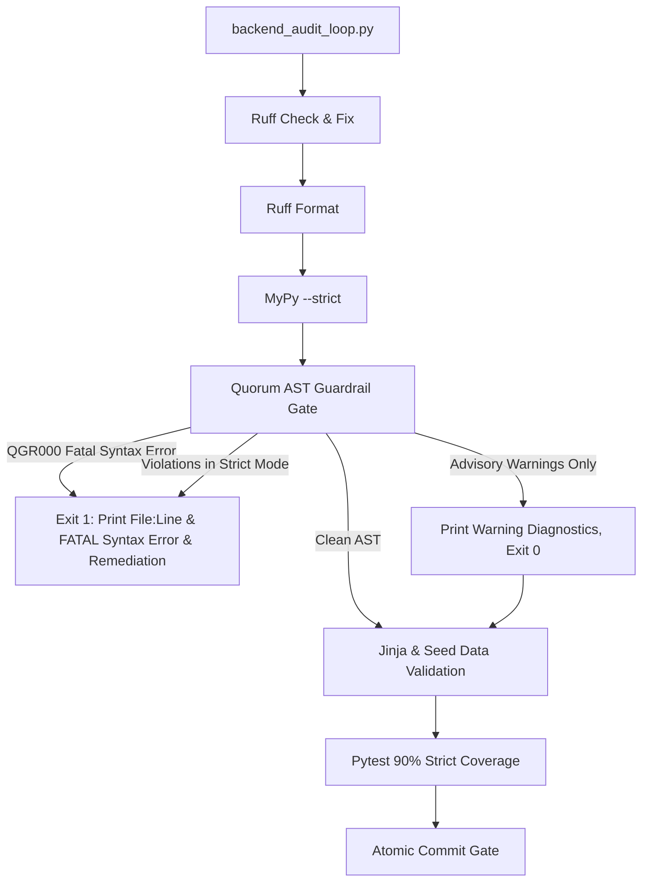

# Automated AST Codebase Guardrails (`.get()`, `getattr()`, and Silent `except Exception` Prevention)

> **SSOT Implementation Plan — Generated from Tier 8 Feature Audits `feature_audit_ast_guardrail_scripts.md`, `feature_audit_hypocritical_gatekeeper_tech_debt.md`, and `feature_audit_ast_syntax_error_resilience.md`.**  
> **Epic**: Automated Architectural Quality Gate Hardening

<required_context_rules>
- @[.agents/rules/00-antigravity-core.md]
- @[.agents/rules/01-python-backend.md]
- @[.agents/rules/04_directory_reference.md]
- @[ki_ast_guardrail_testing.md]
- @[ki_god_code_prevention.md]
- @[ki_global_config_sovereignty.md]
</required_context_rules>

<anti_targets>
- Do NOT use regex or string matching (`str.find`) for code AST validation (`no_string_matching_in_ast`).
- Do NOT allow false positives on string literals (`label = "getattr"`), comments, docstrings, or test assertions.
- Do NOT allow unhandled `SyntaxError` crashes during `ast.parse()` to tear down the scanner process or sidetrack remaining files (`syntax_error_resilience_mandate`).
- Do NOT swallow scanner exceptions or return empty dictionaries/lists (`{}` / `[]`) upon `SyntaxError` or `UnicodeDecodeError` (`the_duct_tape_ban`).
- Do NOT introduce duck-typing (`getattr`/`hasattr`/`isinstance(dict)`) or fallback dictionaries `{}` inside the guardrail script itself.
- Do NOT hardcode file lists; the scanner MUST dynamically accept any target files or directories passed by `backend_audit_loop.py`.
- Do NOT add new quality gate stages to `backend_audit_loop.py` without first eradicating all existing technical debt within `backend_audit_loop.py` (`touched_scope_tech_debt_mandate`).
</anti_targets>

## Problem Statement

Standard Python tooling (`ruff` and `mypy --strict`) cannot enforce domain-level architectural rules in Quorum:
1. `getattr(obj, "field", None)` and `hasattr(obj, "field")` are legal Python syntax; `mypy` and `ruff` allow them without warnings.
2. `dict.get(key, default)` is a standard library dictionary method; linter tools cannot distinguish between unvalidated raw external payloads and domain state that must be strict Pydantic models.
3. Silent exception swallowing (`except Exception: pass` or `except Exception: return {}`) is allowed by linters if accompanied by comments or simple log lines, violating `the_duct_tape_ban` and Fail-Fast principles.
4. **Chameleon / Pseudo-Class Metaprogramming**: Overriding `__new__` on `BaseModel` classes or overriding `model_construct` with `# type: ignore[override]` to fake union behavior bypasses Rust `pydantic-core` validation, breaks MyPy/LSP attribute resolution, and introduces unvalidated silent fallbacks.
5. **Raw String Discriminator Routing**: Checking `block.category_id == "matrix"` or `category_id == "system_rule"` with raw string literals instead of strict `PromptBlockCategory` Enum members bypasses type safety and creates silent prompt compilation fractures.
6. **"Hypocritical Gatekeeper" Policy Violation (`touched_scope_tech_debt_mandate`)**: The gatekeeper file `scripts/backend_audit_loop.py` itself contains reflection duck-typing (`hasattr(sys.stdout, "reconfigure")`), silent exception swallowing (`except Exception: pass`), non-fail-fast template reading (`except Exception as e:` in Jinja scanning loop), non-English docstrings/prints, and outdated 30% coverage comments. Under the Scoped Boy Scout mandate, touching `backend_audit_loop.py` strictly requires eradicating this technical debt in Phase 1 before integrating new quality gate steps.
7. **SyntaxError Process Crash Risk (Resilience Hole)**: Calling `ast.parse()` without localized error wrapping crashes the entire scanning process if a file contains a syntax error (e.g. an agent left code incomplete or missed a comma). This abruptly halts multi-file scanning, preventing downstream files and subsequent quality gates from running, while emitting confusing runtime tracebacks.

### Codebase Blast Radius Audit (Day-One Reality)

Physical scanning of `backend_v2/` reveals **~442 pre-existing legacy violations**:
- `getattr()` / `hasattr()` calls: **160** (65 in `provider.py` alone for LiteLLM dynamic exception introspection)
- 2-arg `.get(key, default)` calls in domain logic: **112** (including valid Enum map lookups in `enums.py`)
- Broad `except Exception:` handlers: **~170** (including valid Circuit Breaker, Worker DLQ, and Archival boundaries)
- `__new__` / `model_construct` hijacking on BaseModel: **0** (fully cleaned)

> [!CAUTION]
> **The Scope Creep Bomb**: Activating a rigid, fatal AST check across all legacy files without phased rollout or suppression mechanisms would immediately brick development velocity — any 3-line bug fix would be blocked by 15+ pre-existing legacy violations.

---

### Architecture Decision: Pre-requisite Gatekeeper Cleanup & Context-Aware AST Engine with Phased Rollout & Fault Isolation

> [!IMPORTANT]
> **Pre-requisite Refactoring of `scripts/backend_audit_loop.py` (Scoped Boy Scout Rule) followed by Dedicated Modular AST Guardrail Engine (`scripts/_ast_guardrails.py`) with Dual-Mode Quality Gate Integration and SyntaxError Fault Domain Isolation**:

1. **Pre-requisite Gatekeeper Cleanup (`scripts/backend_audit_loop.py`)**:
   - Clean Windows stdout configuration: Eliminate `hasattr(sys.stdout, "reconfigure")` and `except Exception: pass`. Replace with strict `try: sys.stdout.reconfigure(encoding="utf-8") except (AttributeError, io.UnsupportedOperation): pass`.
   - Enforce Fail-Fast in Jinja template validation: Replace broad `except Exception as e:` with `except (OSError, UnicodeDecodeError) as e:` and fail immediately with `sys.exit(1)`.
   - Complete English translation: Translate all docstrings, comments, and CLI status printouts to 100% English per `english_language_mandate`.
   - Update docstring coverage requirement from obsolete 30% to strict 90% TDD coverage.

2. **Modular Scanner (`scripts/_ast_guardrails.py`)**: A pure Python AST visitor (`QuorumGuardrailVisitor`) that parses AST trees recursively and returns structured `GuardrailViolation` dataclass DTOs containing file path, line number, violation rule code, severity, and actionable remediation instructions:
   - `QGR000` (`FATAL_SYNTAX_ERROR`): Capturing `SyntaxError`, `IndentationError`, `TabError`, and file read errors `(OSError, UnicodeDecodeError)`. Severity is locked to `FATAL` (cannot be suppressed via `# noqa`, and always triggers `sys.exit(1)` even in advisory mode).
   - `QGR001` (`BAN_REFLECTION_DUCK_TYPING`): Banning `getattr()` and `hasattr()` in domain/service logic, while respecting inline `# noqa: QGR001` and third-party dynamic exception lookups.
   - `QGR002` (`BAN_LAZY_GET_FALLBACK`): Banning two-argument `.get(key, default)` fallback lookups on internal domain states, while allowing Enum label maps and HTTP/environment access (`os.environ`, `request.headers`).
   - `QGR003` (`BAN_SILENT_EXCEPTION`): Banning broad `except Exception:` handlers lacking explicit `ast.Raise`, while allowing audited system boundaries (Worker DLQ, Circuit Breakers) with logging + state mutation or `# noqa: QGR003`.
   - `QGR004` (`BAN_PYDANTIC_METAPROGRAMMING`): Banning `__new__` and `model_construct` overrides on `BaseModel` subclasses (Chameleon Class Ban).
   - `QGR005` (`BAN_RAW_STRING_DISCRIMINATOR_ROUTING`): Banning raw string literals in polymorphic category routing.

3. **Inline Comment & Multiline Span Suppression (`CommentSuppressor`)**:
   - Uses `tokenize.generate_tokens()` to extract all `# noqa` comments into a line-keyed index `dict[int, set[str]]`.
   - Evaluates suppression across the full closed interval $[\text{lineno}, \text{end\_lineno}]$ via `range(node.lineno, (node.end_lineno or node.lineno) + 1)`.
   - Eliminates AST comment amnesia on multiline calls (e.g. `getattr(...) # noqa: QGR001` on closing parenthesis) and multiline `except (..., Exception) as exc: # noqa: QGR003` tuples.
   - `QGR000` (`FATAL_SYNTAX_ERROR`) is explicitly immune to suppression (cannot be bypassed).

4. **Fault Domain Isolation (Resilient File Scanning)**:
   - File reading and `ast.parse()` are protected within dedicated `try...except (OSError, UnicodeDecodeError)` and `try...except SyntaxError as exc:` blocks per file.
   - If an unparseable file is encountered, a `GuardrailViolation(rule_code="QGR000", severity="FATAL")` is recorded, and the scanner proceeds to process remaining files.

5. **Phased Quality Loop Integration (`scripts/backend_audit_loop.py`)**:
   - **Advisory Mode (Default on legacy targets)**: Prints formatted violation table with line numbers and remediation instructions, but returns exit code 0 to prevent blocking unrelated bug fixes. **Exception**: `FATAL` severity violations (`QGR000`) trigger exit code 1 even in Advisory Mode.
   - **Strict Mode (`--ast-strict` or `[NEW]` targets)**: Exits with code 1 upon any violation (`WARNING` or `FATAL`), guaranteeing that all newly created or actively hardened files remain 100% compliant.

6. **ISTQB Test Suite (`backend_v2/tests/unit/scripts/test_ast_guardrails.py` and `test_backend_audit_loop.py`)**: Comprehensive test suite verifying all positive detections, negative detections, multiline span suppressions, false-positive immunity partitions, syntax error fault isolation, and gatekeeper CLI behaviors.



---

## User Review Required

> [!IMPORTANT]
> **Inline Suppression Policy**: To maintain forensic audibility, inline suppression `# noqa: QGR001` and `# noqa: QGR003` is permitted ONLY for:
> 1. Dynamic third-party library introspection (e.g. `litellm` exceptions, standard I/O stream reconfigurations).
> 2. System-boundary resilience handlers (Worker task supervision, Circuit Breaker classification) that log warnings and update status.
> Suppressions in core domain services (`backend_v2/services/orchestrator/`, `backend_v2/models/`) are strictly audited. `QGR000` (SyntaxError) CANNOT be suppressed.

> [!IMPORTANT]
> **Enum & Header Exemption**: Calling `.get(key, default)` on `_LABEL_MAP` inside `Enum`/`StrEnum` classes, `os.environ.get()`, and `request.headers.get()` is recognized as legitimate and does NOT trigger `QGR002`.

> [!IMPORTANT]
> **Coexistence with Existing AST Tests**: Existing contract tests (`test_ast_prompt_xml_sovereignty.py` and `test_ast_domain_security_guardrails.py`) remain intact as domain-specific regression tests, while `scripts/_ast_guardrails.py` serves as the reusable codebase-wide engine.

---

## Target Files and Modification Categories

- **[MODIFY]** @[scripts/backend_audit_loop.py]
- **[NEW]** @[scripts/_ast_guardrails.py]
- **[NEW]** @[backend_v2/tests/unit/scripts/test_ast_guardrails.py]
- **[NEW]** @[backend_v2/tests/unit/scripts/test_backend_audit_loop.py]
- **[MODIFY]** @[backend_v2/tests/unit/test_ast_domain_security_guardrails.py#L8-L89]

---

```xml
<execution_protocol>
  <phase id="1" name="Pre-requisite Gatekeeper Cleanup &amp; Core AST Guardrail Engine">
    <step id="1.1" target="scripts/backend_audit_loop.py">
      <description>Refactor scripts/backend_audit_loop.py to eradicate all existing technical debt per touched_scope_tech_debt_mandate.</description>
      <constraint invariant="the_duct_tape_ban">Remove `hasattr(sys.stdout, 'reconfigure')` and `except Exception: pass`. Replace with strict `try: sys.stdout.reconfigure(encoding='utf-8') except (AttributeError, io.UnsupportedOperation): pass` without reflection or broad exception swallowing.</constraint>
      <constraint invariant="universal_fail_fast">Refactor Jinja template scanning loop: replace `except Exception as e: print(...)` with `except (OSError, UnicodeDecodeError) as e: print(f'❌ Error reading template {jinja_file}: {e}'); sys.exit(1)` so corrupted templates fail fast.</constraint>
      <constraint invariant="english_language_mandate">Translate all docstrings, comments, and CLI console print statements into 100% English.</constraint>
      <constraint invariant="strict_90_coverage">Update header docstring and CLI messages to reflect strict 90% TDD coverage requirement.</constraint>
    </step>

    <step id="1.2" target="scripts/_ast_guardrails.py">
      <description>Implement GuardrailViolation DTO, CommentSuppressor for tokenized # noqa: QGRxxx with multiline [lineno, end_lineno] span evaluation, and QuorumGuardrailVisitor with fault-isolated file parsing in scripts/_ast_guardrails.py.</description>
      <constraint invariant="ast_guardrail_testing">Implement ast.NodeVisitor detecting: 0) QGR000: SyntaxError/IndentationError/TabError and file read errors (FATAL severity, non-suppressible), 1) QGR001: getattr/hasattr calls, 2) QGR002: 2-argument .get(key, default) fallback calls in domain code (exempting Enum methods and os.environ/headers), 3) QGR003: broad except Exception handlers lacking ast.Raise (exempting logged boundary handlers), 4) QGR004: __new__ and model_construct definitions on BaseModel classes, 5) QGR005: raw string literals in category discriminator routing.</constraint>
      <constraint invariant="syntax_error_resilience">Wrap file reading in `try...except (OSError, UnicodeDecodeError)` and AST parsing in `try...except SyntaxError as exc:` to append QGR000 violation without process termination, allowing scanning of remaining files.</constraint>
      <constraint invariant="inline_suppression_support">Parse inline comments via tokenize module to support `# noqa: QGR001`, `# noqa: QGR002`, `# noqa: QGR003`, `# noqa: QGR004`, `# noqa: QGR005`. Evaluate suppression across the entire AST node span range(node.lineno, (node.end_lineno or node.lineno) + 1) to eliminate AST-comment amnesia on multiline calls and except blocks. Explicitly reject suppression for QGR000.</constraint>
      <constraint invariant="pure_python_ast">Use pure Python standard library ast and tokenize modules. Zero external dependencies.</constraint>
      <constraint invariant="structured_violation_reporting">Return list of GuardrailViolation dataclass objects containing filepath: str, lineno: int, col_offset: int, rule_code: str, message: str, remediation: str, severity: str ("WARNING" | "FATAL"), and is_suppressed: bool.</constraint>
    </step>

    <step id="1.3" target="scripts/_ast_guardrails.py">
      <description>Implement scan_files_for_guardrails supporting single files, directories, glob patterns, fault-isolated multi-file aggregation, and strict vs advisory modes.</description>
      <constraint invariant="directory_routing_mandate">Safely resolve target paths within workspace, ignoring .venv, __pycache__, and node_modules.</constraint>
      <constraint invariant="fatal_severity_enforcement">Ensure that if any violation has severity='FATAL' (such as QGR000), the scan returns a failure status even when running in advisory mode.</constraint>
    </step>
  </phase>

  <phase id="2" name="Backend Audit Loop Quality Gate Integration">
    <step id="2.1" target="scripts/backend_audit_loop.py">
      <description>Integrate AST Guardrail check into backend_audit_loop.py main() as Step 4 (before Jinja/Seed/Pytest validation) with --ast-strict CLI flag support and FATAL violation failure handling.</description>
      <constraint invariant="ast_boundary_verification_mandate">Target lines in main() using ast.parse boundaries.</constraint>
      <constraint invariant="phased_rollout_gate">If strict mode is enabled and violations exist, OR if any FATAL violation exists in advisory mode, print formatted error table with remediation and exit(1). If only advisory warnings exist, print warning table and continue.</constraint>
    </step>
  </phase>

  <phase id="3" name="ISTQB Unit Testing &amp; Self-Audit Verification">
    <step id="3.1" target="backend_v2/tests/unit/scripts/test_ast_guardrails.py">
      <description>Implement ISTQB unit tests covering all positive, negative, false-positive avoidance, syntax error resilience, and inline suppression partitions (including multiline spans).</description>
      <constraint invariant="anti_happy_path_mandate">Test partitions: 1) Detection of QGR000 on invalid Python syntax without crashing runner, 2) Detection of QGR000 on IndentationError, 3) Immunity of QGR000 against # noqa suppression, 4) Detection of getattr(), 5) Detection of hasattr(), 6) Detection of .get('k', default), 7) Detection of silent except Exception: pass, 8) Detection of except Exception: return {}, 9) Detection of __new__ on BaseModel, 10) Detection of model_construct override on BaseModel, 11) Detection of raw string category routing (== 'matrix'), 12) False-positive immunity for string literals ('getattr'), 13) False-positive immunity for comments, 14) False-positive immunity for os.environ.get and request.headers.get, 15) False-positive immunity for Enum _LABEL_MAP.get, 16) Inline suppression via # noqa: QGR001 on single-line calls, 17) Multiline suppression via # noqa: QGR001 at end_lineno of multiline getattr, 18) Multiline suppression via # noqa: QGR003 inside multiline except tuple, 19) Valid except Exception with raise AppException, 20) Multi-file scanning resilience where bad syntax in file 1 does not prevent scanning file 2.</constraint>
    </step>

    <step id="3.2" target="backend_v2/tests/unit/scripts/test_backend_audit_loop.py">
      <description>Implement ISTQB unit tests for backend_audit_loop.py verifying CLI argument parsing, Jinja Fail-Fast handling on read error, AST gate invocation in strict vs advisory modes, and FATAL error exit in advisory mode.</description>
      <constraint invariant="anti_happy_path_mandate">Test partitions: 1) CLI parsing with --ast-strict flag, 2) CLI parsing with target files, 3) Jinja scan failing fast with exit code 1 when template file has read error, 4) Jinja scan failing fast when template contains forbidden default/get expressions, 5) AST gate triggering exit 1 in strict mode upon warning violation, 6) AST gate triggering exit 1 in advisory mode upon FATAL QGR000 violation, 7) AST gate passing with exit 0 in advisory mode with only suppressible warnings.</constraint>
    </step>

    <step id="3.3" target="backend_v2/tests/unit/test_ast_domain_security_guardrails.py">
      <description>Verify test_ast_domain_security_guardrails.py (L8-L89) passes cleanly alongside the new AST engine without regression.</description>
      <constraint invariant="regression_defense">Verify all existing AST guardrail unit tests pass without regression.</constraint>
    </step>
  </phase>
</execution_protocol>
```

---

## Verification Plan

### Automated Tests

```powershell
uv run python scripts/backend_audit_loop.py scripts/backend_audit_loop.py --ast-strict
uv run python scripts/backend_audit_loop.py scripts/_ast_guardrails.py --ast-strict
uv run python scripts/backend_audit_loop.py backend_v2/tests/unit/scripts/test_ast_guardrails.py --test
uv run python scripts/backend_audit_loop.py backend_v2/tests/unit/scripts/test_backend_audit_loop.py --test
uv run python scripts/backend_audit_loop.py backend_v2/tests/unit/test_ast_domain_security_guardrails.py --test
```

### Self-Audit Proof (Zero Hypocrisy Gate)

1. Run `backend_audit_loop.py` against itself with `--ast-strict`:
   ```powershell
   uv run python scripts/backend_audit_loop.py scripts/backend_audit_loop.py --ast-strict
   ```
   Verify 100% clean pass with 0 violations and 0 suppressions.

### Negative Verification (Anti-Happy-Path)

1. Feed invalid Python code (e.g. `def broken(`) -> Verify scanner returns `QGR000: FATAL_SYNTAX_ERROR` without process crash and exits with code 1 even in advisory mode.
2. Feed multiple files where file 1 is invalid Python and file 2 contains `getattr` -> Verify both file 1 (`QGR000`) and file 2 (`QGR001`) are reported in the violation list.
3. Feed invalid Python code with `# noqa: QGR000` -> Verify violation is NOT suppressed (Fatal immunity).
4. Feed code containing `getattr(obj, "field", None)` without noqa -> Verify audit loop in strict mode exits with code 1 and logs `QGR001: BAN_REFLECTION_DUCK_TYPING`.
5. Feed code containing `getattr(obj, "field", None)  # noqa: QGR001` -> Verify audit loop passes cleanly (Suppression Gate).
6. Feed code containing `except Exception: pass` -> Verify audit loop in strict mode exits with code 1 and logs `QGR003: BAN_SILENT_EXCEPTION`.
7. Feed code containing `d.get("key", "")` in `backend_v2/services/` -> Verify audit loop in strict mode exits with code 1 and logs `QGR002: BAN_LAZY_GET_FALLBACK`.
8. Feed code containing `os.environ.get("PORT", "8000")` -> Verify audit loop passes cleanly (Zero False Positives on standard libraries).
9. Feed code containing `class X(BaseModel): def __new__(cls): ...` in `models/` -> Verify audit loop in strict mode exits with code 1 and logs `QGR004: BAN_PYDANTIC_METAPROGRAMMING`.
10. Feed code containing string literal `x = "getattr"` -> Verify audit loop passes cleanly (Zero False Positives on literals).
11. Feed Jinja template with read permissions error -> Verify audit loop exits with code 1 (Fail-Fast Jinja Gate).
