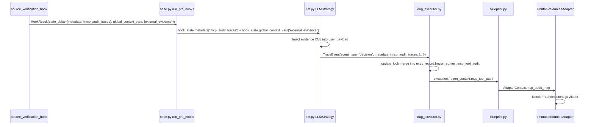

# Restore Tavily Search & Source Bibliography (MCP Tool Loop Re-Integration)

> **SSOT Plan — Consolidates all planning from conversations `ba5e9168` (original audit), `55d4dd19` (initial plan), and `da0f63a5` (Tier 0 Research Analysis + mutations).**
> **Epic**: EPIC 89 Phase 2 Follow-On: Hook Integration

<required_context_rules>
- @[.agents/rules/00-antigravity-core.md]
- @[.agents/rules/01-python-backend.md]
- @[.agents/rules/02_flutter_desktop.md]
- @[.agents/rules/03_seed_vault.md]
- @[.agents/rules/05_llm_architecture.md]
- @[ki_god_code_prevention.md]
- @[ki_workflow_context_governance.md]
- @[ki_tripartite_pipeline_architecture.md]
- @[ki_global_config_sovereignty.md]
</required_context_rules>

<anti_targets>
- Do NOT modify @[backend_v2/services/orchestrator/prompt_compiler.py] (Prompt Compiler is a frozen architectural cornerstone).
- Do NOT introduce parallel DTOs or duplicate models (One Concept = One Schema).
- Do NOT use fallback default dictionaries `{}` or `.get(..., "")` in domain logic (Universal Fail-Fast).
- Do NOT hardcode model provider configs inline (all LLM client creation must route through `LLMClient.from_strategy()`).
- Do NOT edit live runtime database files directly (mutate `seed_data.json` and sync via `run_seed.py local`).
- Do NOT directly `.append()` to `frozen_ctx` lists (violates `frozen_state_mutability` and creates concurrency race conditions).
- Do NOT add monolithic private helpers downwards into existing files (`private_helper_bloat_ban`). Extract outwards into dedicated modules if needed.
- Do NOT modify files exceeding 300 lines (`llm.py`, `dag_executor.py`) without mathematically verifying AST node boundaries via `ast.parse` (`ast_boundary_verification_mandate`).
</anti_targets>

## Problem Statement

Steps `sp_76eedbc020274f66` (Faktantarkistaja) and `sp_6f40b964895c426b` (Falsifier) declare `"allowed_mcp_tools": ["mcp_tavily_search"]` and `PromptCompiler.generate_mcp_instruction()` injects the `[SYSTEM: DYNAMIC TOOL AUTOMATION]` directive into the prompt. However, **no production code calls `execute_tool_loop()`** since `chunk_worker.py` was deleted on 2026-07-16. The `TDAEngine` and `LLMStrategy` execute LLM tasks directly, bypassing MCP tool dispatch entirely. As a result, `frozen_context.mcp_tool_audit` is always empty, and `PrintableSourcesAdapter` never renders the `### Lähdeluettelo ja viitteet` section.

Furthermore, a second critical disconnection was discovered during the Tier 8 audit: the **`prior_analysis` data pipe** between Guard (`sp_ddb7cf7c8a0245d4`) and Faktantarkistaja (`sp_76eedbc020274f66`) is broken in `seed_data.json` (the workflow DAG node `sr_02b7cc1e7c2a4a62` lacks the `"prior_analysis": "$steps.sr_0f7947ec7007498c"` mapping). Consequently, the Fact Checker does not receive Guard's narrative analysis to extract claims from.

### Root Cause Chain & Architecture Context

1. **Tool Execution Disconnection**: `chunk_worker.py` (deleted 2026-07-16) previously executed the tool loop. `TDAEngine` + `EnrichedDagExecutor` replaced it for atom-level matrix calculations, leaving tool dispatch orphaned.
2. **Missing Hook Registration**: `source_verification_hook.py` exists but was never decorated with `@hook_registry.register` or imported into `backend_v2/hooks/__init__.py`.
3. **Broken Two-Stage Verification Pipeline**: In the original design, Guard analyzed raw texts, and Faktantarkistaja received Guard's summary as `prior_analysis`, extracted verifiable claims (`blk_033180746a954415`), ran web searches (`TavilyTool`), and scored Epistemic Humility (`blk_22e3598e06414409`). The missing `input_mappings` entry broke this chain.
4. **Studio UI Terminology Gap — "Kontekstiankkurointi" (Context Anchoring)**: In Studio's `WorkflowStepCard`, the control enabling `$steps.*` forwarding was named *"Edeltävien askeleiden tekstiyhteenvedot"*, which is passive and misses the cognitive reality. The refined term **"Kontekstiankkurointi" (Context Anchoring)** communicates the exact psychological and agentic mechanism: anchoring an agent's reasoning framework to a prior specialist's findings for cross-examination, falsification, and peer-review (versus unanchored independent assessment).

### Architecture Decision

> [!IMPORTANT]
> **Hook-based Pre-Engine Integration & Pipeline Reconnection**, adhering strictly to Tripartite Pipeline and 3-Zone Workflow Governance:

1. **Pre-Hook Phase**: `source_verification_hook` runs as a pre-hook on Faktantarkistaja/Falsifier steps. It extracts claims from the step's input context (including `prior_analysis`) and dispatches searches via `ToolDispatcher` -> `TavilyTool`.
2. **Evidence Injection (Tier 0 CRITICAL-1 Fix)**: The hook returns evidence XML in `state_delta["global_context_vars"]["external_evidence"]`. Because `prompt_compiler.py` and `prompt_factory.py` have ZERO references to `global_context_vars` or `external_evidence`, `llm.py` MUST explicitly append this XML to `prompt_payload.user_payload` AFTER `prompt_factory.build_prompt()` returns (approximately L433). The `prompt_compiler.py` is a frozen file and MUST NOT be modified.
3. **Audit Persistence**: `MCPAuditTrace` objects are written to `state_delta["metadata"]["mcp_audit_traces"]`.
4. **Thread-Safe Trace Accumulation (Tier 0 CRITICAL-2 Fix)**: `LLMStrategy.execute()` MUST NOT directly `.append()` to `frozen_ctx.mcp_tool_audit` (violates `frozen_state_mutability` and creates a concurrency race condition when parallel DAG steps share the same `frozen_ctx`). Instead, `LLMStrategy.execute()` returns the traces via its event output, and `dag_executor.py`'s `_update_lock`-protected `run_step_wrapper` merges them into `exec_record.frozen_context.mcp_tool_audit`.
5. **Downstream (zero changes needed)**: `blueprint.py` -> `AdapterContext.mcp_audit_map` -> `PrintableSourcesAdapter` already renders sources correctly.
6. **Studio UI Context Anchoring Alignment**: Align localization keys (`app_fi.arb` and `app_en.arb`) with **"Kontekstiankkurointi" (Context Anchoring)** to clearly explain the cognitive impact of binding prior step narratives.



### Universal MCP Extensibility & Future Phase Readiness (Wikipedia / Generic MCP)

> [!TIP]
> **Zero-Modification Core for Phase 2 MCP Tools (Wikipedia, REST, Remote MCP Servers)**:
> This implementation deliberately establishes a universal, tool-agnostic pipeline so that adding future MCP tools (like Wikipedia in the subsequent phase) requires **zero architectural refactoring** to the core orchestrator or SDUI rendering engine:
> 
> 1. **Pluggable `BaseTool` & `ToolDispatcher` Contract**: `ToolDispatcher` manages tool instances implementing `BaseTool` (with standard OpenAI JSON schema `declaration` and async `execute(**kwargs) -> MCPAuditTrace`). In the next phase, adding `WikipediaSearchTool` and `WikipediaReadTool` (in `backend_v2/services/mcp/tools/wikipedia.py`) merely registers new `BaseTool` subclasses into `ToolDispatcher`.
> 2. **Tool-Agnostic Audit & SDUI Pipeline**: The `TraceEvent` -> `dag_executor.py` (`_update_lock` merge) -> `frozen_context.mcp_tool_audit` -> `PrintableSourcesAdapter` pipeline is 100% agnostic to `tool_id`. When Wikipedia tools emit `MCPAuditTrace` with `source_urls: ["https://fi.wikipedia.org/wiki/..."]`, they are automatically stored in the forensic audit trail and rendered as clickable citations in Studio reports without touching the adapter or orchestrator.
> 3. **Studio V2 & Seed SSOT Alignment**: Studio's `MCP-yhdyskäytävät` view and `StepBuilderView` already read `SystemConfigMCPGateways` dynamically from `seed_data.json`. Adding Wikipedia tools to `mcp_gateways` in the seed data immediately enables visual toggling via `FilterChip` for any specialist step.
> 4. **Dynamic Multi-Tool Hook Dispatch**: `source_verification_hook` receives `step_obj.allowed_mcp_tools`, allowing future steps to dynamically invoke Tavily, Wikipedia, or both based purely on blueprint configuration.

---

## User Review Required

> [!IMPORTANT]
> **SourceVerificationService Technical Debt**: The current service has 12 banned anti-patterns identified by Tier 0 audit (expanded from original 5). All will be cleaned up per Zero Compromise Pledge. Full list in Phase 1 below.

> [!WARNING]
> **`llm.py` Touched Scope Tech Debt (DEFERRED)**: Lines L543-558 in `llm.py` contain 6 banned patterns (`getattr`, `hasattr`, `isinstance(dict)`, `.get()`) and L300-306 contains direct mutation of `hook_state.metadata` per `touched_scope_tech_debt_mandate`. However, these are inside the DAG Orchestrator ecosystem — per `orchestrator_god_object_fragility`, mutating them requires explicit permission and full blast-radius analysis. **Recommendation**: DEFER to a separate hardening task to avoid scope explosion.

> [!NOTE]
> **`base.py` Pre-Hook Infrastructure (VERIFIED)**: Physical inspection of `backend_v2/services/orchestrator/strategies/base.py#L186-L196` confirms that `run_pre_hooks()` natively merges `metadata` and `global_context_vars` from `HookResult.state_delta`. No architectural modifications to `base.py` are required.

> [!IMPORTANT]
> **`seed_data.json` Mutation**: Adding `"source_verification_hook"` to `pre_hooks` arrays of two steps, and restoring `"prior_analysis": "$steps.sr_0f7947ec7007498c"` in workflow DAG node `sr_02b7cc1e7c2a4a62`. This follows the `03_seed_vault.md` Bounded Mutation Protocol.

---

## Open Questions

> [!WARNING]
> **Execution-level Deduplication**: If both Faktantarkistaja and Falsifier run Tavily searches for the same execution, we may get duplicate searches. Should we implement execution-level caching in this plan, or defer to a future EPIC? **Recommendation**: Defer — the cost is bounded by `settings.max_tool_calls_per_step=3` per step and `settings.tavily_max_results=5`.

---

## Proposed Changes

### Phase 1: Pre-Implementation Technical Debt Cleanups & Register `source_verification_hook`

---

#### [MODIFY] @[backend_v2/services/source_verification_service.py#L30-L257]

**God Code Prevention Constraint (`anti_god_file_dumping`, `private_helper_bloat_ban`)**:
The current file is 257 lines. By removing the redundant `_ensure_initialized` fallback bloat, removing inline imports, and using constructor DI, the file MUST shrink down to **< 150 lines**. Do NOT dump ad-hoc private helpers into this file.

**Current state**: 12 banned anti-patterns identified by Tier 0 audit:

| # | Line | Violation | Rule |
|---|------|-----------|------|
| 1 | L27 | Hardcoded magic number `MAX_EXTRACTION_CHARS = 30000` | `strict_configuration_segregation` |
| 2 | L40-44 | Inline `from backend_v2.llm.client import LLMClient` inside `__init__` | `inline_imports_ban` |
| 3 | L43 | Banned `getattr(llm_task_executor, "llm_client", None)` | `the_zero_compromise_pledge` |
| 4 | L50-51 | Inline imports in `_ensure_initialized` (`LLMClient`, `LLMProviderConfig`, `PromptCompiler`) | `inline_imports_ban` |
| 5 | L54-65 | Ad-hoc hardcoded `LLMProviderConfig(id="local_fast", ...)` | `llm_structured_execution_mandate` |
| 6 | L142 | Direct `tavily_search(query)` import bypassing `ToolDispatcher` | SRP violation |
| 7 | L174 | `isinstance(eval_res_tuple, tuple)` duck typing | `strict_pydantic_v2_rust` |
| 8 | L175 | `isinstance(eval_res_str, dict)` duck typing | `the_zero_compromise_pledge` |
| 9 | L176 | `.get("content", "")` fallback | `zero_service_layer_fallbacks` |
| 10 | L178 | `isinstance(eval_res_str, str)` redundant type guard | `strict_pydantic_v2_rust` |
| 11 | L191-201 | Silent `except Exception` returns `INCONCLUSIVE` instead of Fail-Fast | `the_duct_tape_ban` |
| 12 | L113 | Broad `except Exception` catch (though re-raises via AppException) | Pattern review |

**Changes** (Pre-Implementation Technical Debt Cleanup):
1. **L27**: Move `MAX_EXTRACTION_CHARS` to `settings.py` as `get_settings().source_extraction_max_chars`.
2. **L40-44, L50-51**: Move `LLMClient` import to module-level (it is NOT a heavy AI/ML library — it's a wrapper). Keep `LLMProviderConfig` and `PromptCompiler` at module level too.
3. **L43**: Replace `getattr` with strict typed constructor parameters: `__init__(self, llm_task_executor: LLMTaskExecutor, llm_client: LLMClient)` (required, no fallback or hidden internal factory).
4. **L54-65**: Remove redundant `_ensure_initialized` completely — client and executor are strictly injected at initialization.
5. **L142**: Replace direct `tavily_search` call with `await DISPATCHER.execute_tool(tool_id=TAVILY_TOOL_ID, query=query, step_name="source_verification", target_language="en", llm_client=self.llm_client, claim_text=claim.claim_text)`. Import `DISPATCHER` and `TAVILY_TOOL_ID` from `backend_v2.services.mcp.mcp_tool_loop` (L46, L52). Collect the returned `MCPAuditTrace` instances alongside `VerifiedSourceDTO`.
6. **L174-178**: Replace all `isinstance()` / `.get()` duck typing with strict typed result from `execute_chat_task()`. `execute_chat_task()` returns `str | dict[str, Any]` (evaluated as `status_str.strip().upper()` directly).
7. **L191-201**: Replace silent `except Exception -> INCONCLUSIVE` with Fail-Fast `AppException(ErrorCodes.FETCH_FAILED)`. Individual claim verification failures MUST propagate, not be silently masked.

---

#### [MODIFY] @[backend_v2/models/domain/source_verification.py#L61-L79]

Add `audit_traces` to `SourceVerificationResultDTO`:
```python
class SourceVerificationResultDTO(V2CoreBase):
    model_config = ConfigDict(strict=True, extra="forbid")

    claims: Annotated[list[VerifiedSourceDTO], Field(description="Verified claims.")] = Field(default_factory=list)
    audit_traces: Annotated[list[MCPAuditTrace], Field(description="Audit traces of external searches executed.")] = Field(default_factory=list)
    verification_timestamp: Annotated[str, Field(description="Timestamp when verification ran.")]
    total_claims: Annotated[int, Field(description="Count of claims extracted.")]
    verified_count: Annotated[int, Field(description="Count of claims marked as VERIFIED.")]
    hallucination_count: Annotated[int, Field(description="Count of claims marked as HALLUCINATION.")]
```

---

#### [MODIFY] @[backend_v2/hooks/source_verification_hook.py#L15-L46]

**God Code Prevention Constraint**: This file is a pure adapter hook and MUST remain **< 60 lines**.

**Current state**: Unregistered function (NOT decorated with `@hook_registry.register`), creates `SourceVerificationService()` directly without DI container, has broad `except Exception` with f-string logging, and contains a double-escaped newline bug at L31 (`val + "\\\\n\\\\n"` producing literal `\n\n` characters).

**Changes**:
1. Add `@hook_registry.register(name="source_verification_hook")` decorator.
2. Polymorphic payload text extraction (`polymorphic_dag_payload_handling`): Extract text content safely from `state.inputs` supporting all 4 partitions (`str`, `dict` containing text fields or step evaluations, `list` of strings/dicts), ignoring metadata keys starting with `_`. Fixes the literal `\\n\\n` formatting to clean string joins (`\n\n`).
3. Initialize dependencies via standard DI:
   ```python
   llm_client = await LLMClient.from_strategy("fast", repository=deps.system_repo, pipeline_name="source_verification_hook")
   task_executor = LLMTaskExecutor(PromptCompiler())
   service = SourceVerificationService(llm_task_executor=task_executor, llm_client=llm_client)
   ```
4. Construct external evidence XML from verified sources:
   ```xml
   <external_evidence>
     <source_verification>
       <claim text="...">
         <status>VERIFIED</status>
         <summary>...</summary>
         <sources><url>...</url></sources>
       </claim>
     </source_verification>
   </external_evidence>
   ```
5. Return `HookResult(success=True, state_delta=...)` containing:
   - `"metadata"`: `{"mcp_audit_traces": [trace.model_dump(mode="json") for trace in result.audit_traces]}`
   - `"global_context_vars"`: `{"external_evidence": evidence_xml}`
6. If `state.inputs` is empty or lacks text content, return `HookResult(success=True, state_delta={})` without executing external queries.

---

#### [MODIFY] @[backend_v2/hooks/__init__.py]

Add `source_verification_hook` to imports and `__all__`:
```python
from backend_v2.hooks import (
    ...
    source_verification_hook,
    ...
)

__all__ = [
    ...
    "source_verification_hook",
    ...
]
```

---

#### [MODIFY] @[backend_v2/services/orchestrator/strategies/llm.py#L103-L774]

> [!IMPORTANT]
> **AST Boundary Verification Mandate (`ast_boundary_verification_mandate`)**: Because `llm.py` is 775 lines (>300 lines God File), the executing agent MUST run a Python script with `ast.parse` before editing to extract exact line boundaries of target nodes (`LLMNodeStrategy.execute`, `prompt_factory.build_prompt` call site) rather than relying on stale line numbers.

**Pre-requisite cleanup**:
- Remove stale debug print `print(f"DEBUG: all_prompt_blocks_raw = {all_prompt_blocks_raw}")` at line 223.

**Step A — MCP Audit Trace Extraction (after `run_pre_hooks()` at L214)**:
Extract `mcp_audit_traces` from `hook_state.metadata` using typed key access (NOT `.get()`):
```python
# Typed key access — Tier 0 CRITICAL-3 fix (no .get() fallback)
mcp_audit_traces_raw: list[dict[str, Any]] = []
if "mcp_audit_traces" in hook_state.metadata:
    mcp_audit_traces_raw = hook_state.metadata["mcp_audit_traces"]
```
Do NOT write these traces to `frozen_ctx` here. Return them as part of the step's event output so that `dag_executor.py`'s `_update_lock`-protected merge handles thread-safe accumulation (CRITICAL-2 fix).

**Step B — Evidence XML Injection (AFTER `prompt_factory.build_prompt()` returns at approximately L433)**:
```python
# Tier 0 CRITICAL-1 fix: explicit evidence injection post-prompt_factory
# prompt_compiler.py is FROZEN — evidence MUST be injected at the llm.py call site
# Injects into user_payload for LLM evaluation. For matrix steps using TDAEngine,
# evidence delivery to per-atom prompts is deferred to a future enhancement.
if "external_evidence" in hook_state.global_context_vars:
    evidence_xml: str = hook_state.global_context_vars["external_evidence"]
    user_payload = f"{user_payload}\n\n{evidence_xml}"
    prompt_payload = PromptPayload(
        base_system_prompt=prompt_payload.base_system_prompt,
        user_payload=user_payload,
        atom_to_block_ids=prompt_payload.atom_to_block_ids,
    )
```

> [!NOTE]
> **Matrix Step Evidence Scope**: For matrix steps using TDAEngine, the `user_payload` does NOT flow into per-atom evaluation prompts (TDAEngine builds its own via `EnrichedEngineRequest`). Since Faktantarkistaja and Falsifier are the primary targets, and the core goal is populating `frozen_context.mcp_tool_audit` for bibliography rendering, this limitation is acceptable. Matrix-step evidence injection is deferred to a future enhancement if evaluation quality is affected.

**Step C — Return traces for DAG-level merge**:
Include `mcp_audit_traces_raw` in the step's returned `TraceEvent` list (via a new event with `event_type="decision"` and `metadata={"mcp_audit_traces": mcp_audit_traces_raw}`) so `dag_executor.py` can merge them thread-safely.

#### [MODIFY] @[backend_v2/services/orchestrator/dag_executor.py#L559-L690]

> [!IMPORTANT]
> **AST Boundary Verification Mandate (`ast_boundary_verification_mandate`)**: Because `dag_executor.py` is 903 lines (>300 lines God File), the executing agent MUST run a Python script with `ast.parse` before editing to extract exact line boundaries of `run_step_wrapper` within `execute_dag`.

**Thread-safe trace accumulation (Tier 0 CRITICAL-2 Fix)**:
Inside `run_step_wrapper()`, after `events = await self.node_executor.execute(...)` and within the `_update_lock` block:
```python
# Merge MCP audit traces from hook metadata into frozen_context
for event in events:
    if event.metadata and "mcp_audit_traces" in event.metadata:
        raw_traces = event.metadata["mcp_audit_traces"]
        current_audits = list(exec_record.frozen_context.mcp_tool_audit)
        for raw in raw_traces:
            current_audits.append(MCPAuditTrace.model_validate(raw))
        exec_record = exec_record.model_copy(
            update={"frozen_context": exec_record.frozen_context.model_copy(
                update={"mcp_tool_audit": current_audits}
            )}
        )
```
This ensures thread safety via `_update_lock` and immutable re-validation via `model_copy(update=...)` instead of direct `.append()`.

---

> [!TIP]
> **Session Handover Checkpoint**: After completing Phase 1 (tech debt cleanup + hook registration), the executing agent SHOULD commit atomically and consider a `/tier5-session-handover` before proceeding to Phase 2 to prevent Context Amnesia degradation.

### Phase 2: Seed Data Wiring (Hooks + `prior_analysis` Data Pipe)

---

> [!IMPORTANT]
> **Tier 0 MOD-3: Deterministic Line Number Verification**: Exact line numbers in `seed_data.json` have been verified via Python audit script:
> - Workflow node `sr_02b7cc1e7c2a4a62`: Lines 7864-7878
> - Step `sp_6f40b964895c426b` (Falsifier): Lines 8420-8450
> - Step `sp_76eedbc020274f66` (Faktantarkistaja): Lines 8830-8860
> 
> Follow `03_seed_vault.md` Bounded Mutation Protocol (timestamped backup before edit, `multi_replace_file_content` bounded edit, syntax check, backend audit loop, `run_seed.py local`).

#### [MODIFY] @[backend_v2/seed/seed_data.json#L7864-L7878] & @[backend_v2/seed/seed_data.json#L8437-L8441] & @[backend_v2/seed/seed_data.json#L8847-L8851]

**2A. Pre-hooks — Add `source_verification_hook` to target steps:**

**Step `sp_76eedbc020274f66`** (Faktantarkistaja, @[backend_v2/seed/seed_data.json#L8847-L8851]):
```diff
 "pre_hooks": [
     "inject_step_metadata",
-    "atom_flattening_hook"
+    "atom_flattening_hook",
+    "source_verification_hook"
 ],
```

**Step `sp_6f40b964895c426b`** (Falsifier, @[backend_v2/seed/seed_data.json#L8437-L8441]):
```diff
 "pre_hooks": [
     "inject_step_metadata",
-    "atom_flattening_hook"
+    "atom_flattening_hook",
+    "source_verification_hook"
 ],
```

> [!NOTE]
> `source_verification_hook` is ordered LAST in pre_hooks so it runs after `atom_flattening_hook` has prepared the shuffled atoms. The hook needs the flattened text inputs to extract claims from.

**2B. Restore `prior_analysis` input_mapping — Re-wire Guard → Faktantarkistaja data pipe:**

**Workflow DAG node `sr_02b7cc1e7c2a4a62`** (Faktantarkistaja, @[backend_v2/seed/seed_data.json#L7872-L7876]):
```diff
 "input_mappings": {
+    "prior_analysis": "$steps.sr_0f7947ec7007498c",
     "product_text": "$inputs.product_text",
     "chat_log": "$inputs.chat_log",
     "reflection_text": "$inputs.reflection_text"
 }
```

---

### Phase 3: Studio UI Terminology Refinement — "Kontekstiankkurointi" (Context Anchoring)

---

#### [MODIFY] @[client_app_v2/lib/l10n/app_fi.arb#L1456-L1457]

```diff
-  "studioWorkflowPriorStepsTitle": "Edeltävien askeleiden tekstiyhteenvedot (Valinnainen)",
-  "studioWorkflowPriorStepsSubtitle": "Valitse vain jos agentin pitää lukea laaja sanallinen analyysi. Strukturoitu data ja havainnot siirtyvät aina automaattisesti.",
+  "studioWorkflowPriorStepsTitle": "Edeltävien askeleiden kontekstiankkurointi (Valinnainen)",
+  "studioWorkflowPriorStepsSubtitle": "Ankkuroi tämän asiantuntijan arvioinnin valitun edeltävän askeleen sanalliseen raporttiin (prior_analysis) ristiinarviointia tai faktantarkistusta varten. Ilman ankkurointia agentti arvioi aineistoa täysin riippumattomasti.",
```

#### [MODIFY] @[client_app_v2/lib/l10n/app_en.arb#L2118-L2119]

```diff
-  "studioWorkflowPriorStepsTitle": "Prior Step Text Summaries (Optional)",
-  "studioWorkflowPriorStepsSubtitle": "Enable only if this agent needs to read the narrative analysis. Structured findings are forwarded automatically.",
+  "studioWorkflowPriorStepsTitle": "Prior Step Context Anchoring (Optional)",
+  "studioWorkflowPriorStepsSubtitle": "Anchors this specialist's evaluation to the narrative report of a prior step (prior_analysis) for cross-examination or fact-checking. Without anchoring, the specialist evaluates materials completely independently.",
```

---

### Phase 4: Settings Enhancement

---

#### [MODIFY] @[backend_v2/settings.py]

Add the new setting:
```python
source_extraction_max_chars: Annotated[int, Field(description="Max text chars for source claim extraction")] = 30000
```

---

### Phase 5: Tests (Positive & Negative ISTQB Partition Coverage)

---

#### [NEW] @[backend_v2/tests/unit/hooks/test_source_verification_hook.py]

Unit tests covering all 4 ISTQB partitions and error handling:
1. **Positive 1 (Happy path)**: Mock `ToolDispatcher.execute_tool` -> verify hook returns `state_delta` with `mcp_audit_traces` and `external_evidence`.
2. **Positive 2 (Prior analysis claim extraction)**: Verify claims are extracted from Guard narrative summary in `prior_analysis`.
3. **Negative 1 (Empty input)**: Input is empty dictionary `{}` -> verify hook returns `HookResult(success=True, state_delta={})` without invoking search.
4. **Negative 2 (Malformed input)**: Non-string values in inputs -> verify safe filtering without unhandled exception.
5. **Negative 3 (Tool failure / Circuit Breaker)**: Mock Tavily tool raising `AppException(ErrorCodes.FETCH_FAILED)` -> verify exception propagates as Fail-Fast.
6. **Boundary 1 (Max tool calls cap)**: Verify `get_settings().max_tool_calls_per_step` limits number of searches.

#### [MODIFY] Existing tests

Verify no regression in:
- @[backend_v2/tests/unit/services/test_source_verification_service.py] — update unit tests to mock `ToolDispatcher.execute_tool` instead of `tavily_search`.
- @[backend_v2/tests/unit/services/mcp/test_mcp_tool_loop.py] — existing tool loop tests pass unchanged.
- @[backend_v2/tests/unit/services/sdui/adapters/test_printable_sources_adapter.py] — existing adapter tests pass unchanged.
- @[client_app_v2/test/features/studio/views/widgets/workflow/workflow_step_card_test.dart#L235-L245] — verify updated localization string matches ("Edeltävien askeleiden kontekstiankkurointi (Valinnainen)").

---

<dod_checklist>
- [ ] `source_verification_hook` is decorated with `@hook_registry.register("source_verification_hook")` and exported in `backend_v2/hooks/__init__.py`.
- [ ] `SourceVerificationService` ALL 12 anti-patterns cleaned up (see expanded tech debt table in Phase 1).
- [ ] AST boundary verification executed for `llm.py` (specifically `LLMNodeStrategy.execute`) and `dag_executor.py` (`DAGExecutor.execute_dag`) prior to modifications (`ast_boundary_verification_mandate`).
- [ ] `source_verification_service.py` (<150 lines) and `source_verification_hook.py` (<60 lines) maintain strict file size and single-responsibility boundaries (`anti_god_file_dumping`, `private_helper_bloat_ban`).
- [ ] `LLMNodeStrategy.execute` extracts `mcp_audit_traces` from hook metadata via typed key access (NO `.get()`), returns traces in event output for DAG-level merge.
- [ ] `dag_executor.py` `run_step_wrapper` thread-safely merges MCP audit traces into `exec_record.frozen_context.mcp_tool_audit` via `_update_lock` and `model_copy(update=...)` (NO direct `.append()`).
- [ ] `llm.py` injects `external_evidence` XML into `prompt_payload.user_payload` AFTER `prompt_factory.build_prompt()` returns. Matrix-step evidence delivery via TDAEngine is deferred to a future enhancement.
- [ ] `seed_data.json` line numbers verified via Python audit script BEFORE mutation. Updated with `source_verification_hook` in `pre_hooks` of `sp_76eedbc020274f66` and `sp_6f40b964895c426b`, and `prior_analysis` mapping in `sr_02b7cc1e7c2a4a62`.
- [ ] Studio UI localization in `app_fi.arb` and `app_en.arb` uses "Kontekstiankkurointi" (Context Anchoring), and Flutter tests pass.
- [ ] All unit and integration tests pass via `backend_audit_loop.py` and `flutter_audit_loop.py`.
</dod_checklist>

<validation_gate>
```powershell
uv run python scripts/backend_audit_loop.py backend_v2/hooks/source_verification_hook.py --test
uv run python scripts/backend_audit_loop.py backend_v2/services/source_verification_service.py --test
uv run python scripts/backend_audit_loop.py backend_v2/services/orchestrator/strategies/llm.py --test
uv run python scripts/backend_audit_loop.py backend_v2/services/orchestrator/dag_executor.py --test
uv run python scripts/backend_audit_loop.py backend_v2/tests/unit/hooks/test_source_verification_hook.py --test
uv run python scripts/flutter_audit_loop.py client_app_v2/test/features/studio/views/widgets/workflow/workflow_step_card_test.dart
```
</validation_gate>

## Verification Plan

### Automated Tests
```powershell
uv run python scripts/backend_audit_loop.py backend_v2/hooks/source_verification_hook.py --test
uv run python scripts/backend_audit_loop.py backend_v2/services/source_verification_service.py --test
uv run python scripts/backend_audit_loop.py backend_v2/services/orchestrator/strategies/llm.py --test
uv run python scripts/backend_audit_loop.py backend_v2/services/orchestrator/dag_executor.py --test
uv run python scripts/backend_audit_loop.py backend_v2/tests/unit/hooks/test_source_verification_hook.py --test
uv run python scripts/flutter_audit_loop.py client_app_v2/test/features/studio/views/widgets/workflow/workflow_step_card_test.dart
```

### Manual Verification
- Run a workflow execution with Faktantarkistaja step.
- Verify `frozen_context.mcp_tool_audit` contains `MCPAuditTrace` entries with `source_urls`.
- Verify the rendered SDUI output contains `### Lähdeluettelo ja viitteet` with clickable source URLs.
- Open Studio Workflow View and verify that the section header displays *"Edeltävien askeleiden kontekstiankkurointi (Valinnainen)"*.
