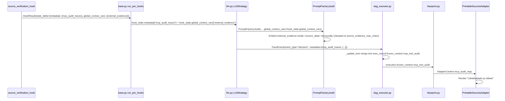

# Restore Tavily Search & Source Bibliography (MCP Tool Loop Re-Integration)

> **SSOT Plan — Consolidates all planning from conversations `ba5e9168` (original audit), `55d4dd19` (initial plan), `da0f63a5` (Tier 0 Research Analysis), and `a103066d` (Tier 8 Feature & Scope Audit).**
> **Epic**: EPIC 89 Phase 2 Follow-On: Hook Integration

<required_context_rules>
- @[.agents/rules/00-antigravity-core.md]
- @[.agents/rules/01-python-backend.md]
- @[.agents/rules/02_flutter_desktop.md]
- @[.agents/rules/03_seed_vault.md]
- @[.agents/rules/05_llm_architecture.md]
- @[ki_god_code_prevention.md]
- @[ki_workflow_context_governance.md]
- @[ki_tripartite_pipeline_architecture.md]
- @[ki_global_config_sovereignty.md]
</required_context_rules>

<anti_targets>
- Do NOT introduce parallel DTOs or duplicate models (One Concept = One Schema).
- Do NOT use fallback default dictionaries `{}` or `.get(..., "")` in domain logic (Universal Fail-Fast).
- Do NOT use raw string concatenation on prompt payloads (`user_payload = f"{user_payload}\n\n{evidence_xml}"` ban). All XML/context assembly MUST happen structurally inside `PromptFactory` / `PromptCompiler`.
- Do NOT hardcode model provider configs inline (all LLM client creation must route through `LLMClient.from_strategy()`).
- Do NOT edit live runtime database files directly (mutate `seed_data.json` and sync via `run_seed.py local`).
- Do NOT directly `.append()` to `frozen_ctx` lists (violates `frozen_state_mutability` and creates concurrency race conditions).
- Do NOT add monolithic private helpers downwards into existing files (`private_helper_bloat_ban`). Extract outwards into dedicated modules if needed.
- Do NOT swallow MCPAuditTrace validation errors or insert loose raw dicts into FrozenContext (Pydantic Strict Nirvana & Fail-Fast).
- Do NOT modify files exceeding 300 lines (`llm.py`, `dag_executor.py`) without mathematically verifying AST node boundaries via `ast.parse` (`ast_boundary_verification_mandate`).
- Do NOT defer technical debt in touched target files (`touched_scope_tech_debt_mandate`). Clean all 1-hop debt in Phase 1.
</anti_targets>

## Problem Statement

Steps `sp_76eedbc020274f66` (Faktantarkistaja) and `sp_6f40b964895c426b` (Falsifier) declare `"allowed_mcp_tools": ["mcp_tavily_search"]` and `PromptCompiler.generate_mcp_instruction()` injects the `[SYSTEM: DYNAMIC TOOL AUTOMATION]` directive into the prompt. However, **no production code calls `execute_tool_loop()`** since `chunk_worker.py` was deleted on 2026-07-16. The `TDAEngine` and `LLMStrategy` execute LLM tasks directly, bypassing MCP tool dispatch entirely. As a result, `frozen_context.mcp_tool_audit` is always empty, and `PrintableSourcesAdapter` never renders the `### Lähdeluettelo ja viitteet` section.

Furthermore, a second critical disconnection was discovered during the Tier 8 audit: the **`prior_analysis` data pipe** between Guard (`sp_ddb7cf7c8a0245d4`) and Faktantarkistaja (`sp_76eedbc020274f66`) is broken in `seed_data.json` (the workflow DAG node `sr_02b7cc1e7c2a4a62` lacks the `"prior_analysis": "$steps.sr_0f7947ec7007498c"` mapping). Consequently, the Fact Checker does not receive Guard's narrative analysis to extract claims from.

### Root Cause Chain & Architecture Context

1. **Tool Execution Disconnection**: `chunk_worker.py` (deleted 2026-07-16) previously executed the tool loop. `TDAEngine` + `EnrichedDagExecutor` replaced it for atom-level matrix calculations, leaving tool dispatch orphaned.
2. **Missing Hook Registration**: `source_verification_hook.py` exists but was never decorated with `@hook_registry.register` or imported into `backend_v2/hooks/__init__.py`.
3. **Broken Two-Stage Verification Pipeline**: In the original design, Guard analyzed raw texts, and Faktantarkistaja received Guard's summary as `prior_analysis`, extracted verifiable claims (`blk_033180746a954415`), ran web searches (`TavilyTool`), and scored Epistemic Humility (`blk_22e3598e06414409`). The missing `input_mappings` entry broke this chain.
4. **Studio UI Terminology Gap — "Kontekstiankkurointi" (Context Anchoring)**: In Studio's `WorkflowStepCard`, the control enabling `$steps.*` forwarding was named *"Edeltävien askeleiden tekstiyhteenvedot"*, which is passive and misses the cognitive reality. The refined term **"Kontekstiankkurointi" (Context Anchoring)** communicates the exact psychological and agentic mechanism: anchoring an agent's reasoning framework to a prior specialist's findings for cross-examination, falsification, and peer-review (versus unanchored independent assessment).

### Architecture Decision

> [!IMPORTANT]
> **Hook-based Pre-Engine Integration & Pipeline Reconnection**, adhering strictly to Tripartite Pipeline and 3-Zone Workflow Governance:

1. **Pre-Hook Phase**: `source_verification_hook` runs as a pre-hook on Faktantarkistaja/Falsifier steps. It extracts claims from the step's input context (including `prior_analysis`) and dispatches searches via `ToolDispatcher` -> `TavilyTool`.
2. **Evidence Injection (Pure Prompt Architecture)**: The hook returns evidence XML in `state_delta["global_context_vars"]["external_evidence"]`. `PromptFactory.build()` takes `global_context_vars` as an explicit direct parameter (without any `PromptCompiler.compile()` proxy indirection) and places `<external_evidence>` deterministically inside `<source_data>` in `user_payload`, truncated to `settings.source_evidence_max_chars`. `PromptPayload` remains completely immutable (`@dataclass(frozen=True)`), eliminating raw string concatenation in `llm.py`.
3. **Audit Persistence**: `MCPAuditTrace` objects are written to `state_delta["metadata"]["mcp_audit_traces"]`.
4. **Thread-Safe Trace Accumulation & Strict Fail-Fast Validation**: `LLMStrategy.execute()` MUST NOT directly `.append()` to `frozen_ctx.mcp_tool_audit`. Instead, `LLMStrategy.execute()` returns the traces via its event output (`TraceEvent(event_type="decision", metadata={"mcp_audit_traces": [...]})`). In `dag_executor.py`'s `run_step_wrapper`, every raw trace is explicitly validated via `MCPAuditTrace.model_validate()`. If a `ValidationError` occurs, it is logged with `ErrorCodes.VALIDATION_FAILED` and raises `AppException(message=f"Failed to validate MCP audit traces for step '{step_id}': {val_err}", status_code=500, details={"error_code": ErrorCodes.VALIDATION_FAILED.value, ...})` (Fail-Fast). Validated traces are then merged into `exec_record.frozen_context.mcp_tool_audit` under `_update_lock` using `model_copy(update=...)`.
5. **Downstream (zero changes needed)**: `blueprint.py` -> `AdapterContext.mcp_audit_map` -> `PrintableSourcesAdapter` already renders sources correctly.
6. **Studio UI Context Anchoring Alignment**: Align localization keys (`app_fi.arb` and `app_en.arb`) with **"Kontekstiankkurointi" (Context Anchoring)** to clearly explain the cognitive impact of binding prior step narratives.



---

## User Review Required

> [!IMPORTANT]
> **SourceVerificationService Technical Debt**: The current service has 12 banned anti-patterns identified by Tier 0 audit (expanded from original 5). All will be cleaned up per Zero Compromise Pledge in Phase 1.

> [!IMPORTANT]
> **`llm.py` Touched Scope Tech Debt (MANDATORY SCOPED BOY SCOUT)**: Per `touched_scope_tech_debt_mandate`, all 7 identified anti-patterns in `llm.py` (L223 debug print, L300-307 metadata mutation, L525-538 silent except and loose parsing, L543-570 getattr duck typing and dead V1 `mcp_tools` iteration) are strictly included in Phase 1 and will be eliminated prior to feature execution.

> [!NOTE]
> **`base.py` Pre-Hook Infrastructure (VERIFIED)**: Physical inspection of `backend_v2/services/orchestrator/strategies/base.py#L186-L196` confirms that `run_pre_hooks()` natively merges `metadata` and `global_context_vars` from `HookResult.state_delta`. No architectural modifications to `base.py` are required.

> [!IMPORTANT]
> **In-Memory Hook DI Container (Zero FastAPI Context Coupling)**: Per System 2 audit (`feature_audit_tavily_hook_di_context.md`), hooks run inside asynchronous background workers (`DAGExecutor` / `LLMNodeStrategy`) without FastAPI HTTP request context. `source_verification_hook` strictly uses the injected in-memory `HookDependencies` parameter (`deps: HookDependencies`), enforcing explicit Fail-Fast validation on `deps.system_repo`. No FastAPI `Depends()` or `backend_v2.api.dependencies` imports are permitted.

> [!IMPORTANT]
> **MCPAuditTrace Pydantic Validation & RFC 7807 Fail-Fast**: Per System 2 audit (`feature_audit_mcp_pydantic_validation.md`), `dag_executor.py` must explicitly validate all raw trace dictionaries using `MCPAuditTrace.model_validate(raw)`. If validation fails, it must NOT fall back or drop traces silently; it must log `ErrorCodes.VALIDATION_FAILED` and raise `AppException(message=f"Failed to validate MCP audit traces for step '{step_id}': {val_err}", status_code=500, details={"error_code": ErrorCodes.VALIDATION_FAILED.value, ...})`. Validated traces are accumulated into `frozen_context.mcp_tool_audit` under `_update_lock`.

> [!IMPORTANT]
> **`seed_data.json` Mutation**: Adding `"source_verification_hook"` to `pre_hooks` arrays of two steps, and restoring `"prior_analysis": "$steps.sr_0f7947ec7007498c"` in workflow DAG node `sr_02b7cc1e7c2a4a62`. This follows the `03_seed_vault.md` Bounded Mutation Protocol.

> [!CAUTION]
> **Tier 0 Research Mutation (2026-08-23): Critical Evidence Data Path Fix**. Original plan referenced `llm_context_data['global_context_vars']` for evidence injection — physically impossible as `ContextBuilder.build()` does NOT include `global_context_vars` in `llm_context_data`. Fixed: `PromptFactory.build()` now receives `global_context_vars` as an explicit parameter (bypassing any unnecessary `PromptCompiler` indirection). Also added: `source_evidence_max_chars` token budget, `prompt_factory.py` touched-file tech debt, second `getattr` instance at L501-L503, and session handover boundary between Phase 2→3. See `research_analysis_tavily_bibliography.md` for full audit.

---

## Target Files and Modification Categories

- **[MODIFY]** @[backend_v2/services/source_verification_service.py#L30-L256]
- **[MODIFY]** @[backend_v2/models/domain/source_verification.py#L61-L78]
- **[MODIFY]** @[backend_v2/hooks/source_verification_hook.py#L15-L46]
- **[MODIFY]** @[backend_v2/hooks/__init__.py]
- **[MODIFY]** @[backend_v2/services/orchestrator/strategies/llm_execution/prompt_factory.py#L39-L290]
- **[MODIFY]** @[backend_v2/services/orchestrator/strategies/llm.py#L52-L774]
- **[MODIFY]** @[backend_v2/services/orchestrator/dag_executor.py#L326-L902]
- **[MODIFY]** @[backend_v2/seed/seed_data.json#L7846-L7850] & @[backend_v2/seed/seed_data.json#L8411-L8414] & @[backend_v2/seed/seed_data.json#L8821-L8824]
- **[MODIFY]** @[client_app_v2/lib/l10n/app_fi.arb#L1458-L1459]
- **[MODIFY]** @[client_app_v2/lib/l10n/app_en.arb#L2120-L2121]
- **[MODIFY]** @[client_app_v2/test/features/studio/views/widgets/workflow/workflow_step_card_test.dart#L237-L239]
- **[MODIFY]** @[backend_v2/settings.py]
- **[NEW]** @[backend_v2/tests/unit/hooks/test_source_verification_hook.py]

---

```xml
<execution_protocol>
  <phase id="1" name="Pre-Implementation Technical Debt Cleanups &amp; Hook Registration">
    <step id="1.1" target="backend_v2/services/source_verification_service.py">
      <description>Clean all 12 banned anti-patterns in SourceVerificationService per Zero Compromise Pledge. Shrink file to &lt; 150 lines.</description>
      <constraint invariant="strict_configuration_segregation">Move MAX_EXTRACTION_CHARS (L27) to settings.py as source_extraction_max_chars.</constraint>
      <constraint invariant="inline_imports_ban">Move LLMClient, LLMProviderConfig, PromptCompiler imports to module top level.</constraint>
      <constraint invariant="the_zero_compromise_pledge">Replace getattr(llm_task_executor, 'llm_client', None) with strict constructor injection: __init__(self, llm_task_executor: LLMTaskExecutor, llm_client: LLMClient).</constraint>
      <constraint invariant="the_no_legacy_mandate">Remove _ensure_initialized completely.</constraint>
      <constraint invariant="srp_mandate">Replace direct tavily_search call with await DISPATCHER.execute_tool(tool_id=TAVILY_TOOL_ID, query=query, step_name='source_verification', target_language='en', llm_client=self.llm_client, claim_text=claim.claim_text).</constraint>
      <constraint invariant="strict_pydantic_v2_rust">Replace isinstance() and .get() duck-typing with strict typed execute_chat_task() evaluation.</constraint>
      <constraint invariant="the_duct_tape_ban">Replace silent except Exception -&gt; INCONCLUSIVE with Fail-Fast AppException(ErrorCodes.FETCH_FAILED).</constraint>
    </step>

    <step id="1.2" target="backend_v2/models/domain/source_verification.py">
      <description>Add audit_traces field to SourceVerificationResultDTO.</description>
      <constraint invariant="domain_model_purity_mandate">Add audit_traces: Annotated[list[MCPAuditTrace], Field(description="Audit traces of external searches executed.")] = Field(default_factory=list).</constraint>
    </step>

    <step id="1.3" target="backend_v2/hooks/source_verification_hook.py">
      <description>Register hook, fix literal newline bug, add polymorphic payload extraction, enforce HookDependencies.system_repo Fail-Fast validation, and export in hooks/__init__.py.</description>
      <constraint invariant="hook_registration_mandate">Decorate with @hook_registry.register(name="source_verification_hook").</constraint>
      <constraint invariant="polymorphic_dag_payload_handling">Extract text polymorphically from state.inputs (str, dict, list) and fix literal \\n\\n bug to clean \n\n.</constraint>
      <constraint invariant="di_container_mandate">Initialize SourceVerificationService using the in-memory HookDependencies container parameter (deps.system_repo) with explicit Fail-Fast validation (if not deps.system_repo: raise AppException(message="Missing system_repo in HookDependencies", status_code=500, details={"error_code": ErrorCodes.CONFIGURATION_ERROR.value})), completely decoupled from FastAPI HTTP request context. Instantiate LLMClient.from_strategy('fast', repository=deps.system_repo, pipeline_name='source_verification') and LLMTaskExecutor(PromptCompiler()).</constraint>
      <constraint invariant="immutable_dto_contract">Return HookResult with state_delta containing metadata.mcp_audit_traces and global_context_vars.external_evidence.</constraint>
    </step>

    <step id="1.4" target="backend_v2/services/orchestrator/strategies/llm_execution/prompt_factory.py">
      <description>Add global_context_vars parameter directly to PromptFactory.build(), embed external_evidence XML structurally inside &lt;source_data&gt;, and clean touched-file tech debt.</description>
      <constraint invariant="pure_prompt_architecture">Add new parameter `global_context_vars: dict[str, Any] | None = None` directly to PromptFactory.build(). Extract external_evidence from global_context_vars (NOT llm_context_data) and embed directly inside &lt;source_data&gt; after xml_ctx, truncated to settings.source_evidence_max_chars. Root cause: llm_context_data is built by ContextBuilder.build() from state_data/inputs only — it does NOT contain global_context_vars.</constraint>
      <constraint invariant="the_zero_compromise_pledge">Clean L173 getattr(b, 'slug', None) → use b.slug directly (PromptBlock has typed slug field).</constraint>
      <constraint invariant="fail_fast_hydration_mandate">Clean L88-L96 deep .get() chain for execution_time extraction → add isinstance guard at top then direct [] access with structural validation.</constraint>
      <constraint invariant="touched_scope_tech_debt_mandate">FLAG for follow-up: L140-L168 find_value_by_key recursive hasattr/isinstance God Method exceeds Scoped Boy Scout boundary for this plan.</constraint>
    </step>

    <step id="1.5" target="backend_v2/services/orchestrator/strategies/llm.py">
      <description>1-Hop Scoped Boy Scout Cleanups: Clean all 8 anti-patterns in LLMNodeStrategy.execute, directly pass hook_state.global_context_vars to PromptFactory.build() without PromptCompiler indirection, extract traces from hook metadata, and return in event list.</description>
      <constraint invariant="ast_boundary_verification_mandate">Verify line boundaries of LLMNodeStrategy.execute (L103-L774) using ast.parse before editing.</constraint>
      <constraint invariant="touched_scope_tech_debt_mandate">Remove L223 debug print statement.</constraint>
      <constraint invariant="frozen_state_mutability">Refactor L300-307 metadata mutation to clean dictionary initialization.</constraint>
      <constraint invariant="the_duct_tape_ban">Replace L524-539 loose parsing and silent except Exception: pass with typed extraction from projector.snapshot and structured error logging.</constraint>
      <constraint invariant="the_zero_compromise_pledge">Replace BOTH instances of getattr(step, 'input_mappings', None): at L501-L503 (allowed_dynamic_keys) and at L543 (allowed_dynamic_keys extension) with step.input_mappings.keys().</constraint>
      <constraint invariant="the_no_legacy_mandate">Delete dead L548-558 getattr(step, 'mcp_tools', None) duck-typing loops. Derive mcp_prefixes from step_obj.allowed_mcp_tools.</constraint>
      <constraint invariant="zero_service_layer_fallbacks">Replace L569 hook_state.metadata.get() and L570 getattr(step, 'expected_sdui_type') with direct access.</constraint>
      <constraint invariant="trace_event_propagation">Return mcp_audit_traces_raw in step TraceEvent(event_type="decision", metadata={"mcp_audit_traces": ...}) for DAG-level merge.</constraint>
      <constraint invariant="pure_prompt_architecture">Pass hook_state.global_context_vars directly to PromptFactory.build(..., global_context_vars=hook_state.global_context_vars) at L417-L431 (eliminating any PromptCompiler.compile proxy method).</constraint>
    </step>

    <step id="1.6" target="backend_v2/services/orchestrator/dag_executor.py">
      <description>Strict Fail-Fast validation and thread-safe accumulation of MCP audit traces in run_step_wrapper under _update_lock.</description>
      <constraint invariant="ast_boundary_verification_mandate">Verify line boundaries of DAGExecutor.run_step_wrapper (L559-L752) using ast.parse before editing.</constraint>
      <constraint invariant="strict_pydantic_v2_rust">Explicitly validate all raw traces from event.metadata['mcp_audit_traces'] via MCPAuditTrace.model_validate().</constraint>
      <constraint invariant="rfc7807_dual_reporting_mandate">Catch pydantic.ValidationError during trace parsing, log logger.error with ErrorCodes.VALIDATION_FAILED, and raise AppException(message=f"Failed to validate MCP audit traces for step '{step_id}': {val_err}", status_code=500, details={"error_code": ErrorCodes.VALIDATION_FAILED.value, "step_id": step_id, "validation_errors": val_err.errors()}) to enforce Universal Fail-Fast.</constraint>
      <constraint invariant="concurrency_lock_mandate">Merge validated MCPAuditTrace objects into exec_record.frozen_context.mcp_tool_audit inside _update_lock using model_copy(update=...). NO direct .append().</constraint>
    </step>
  </phase>

  <phase id="2" name="Seed Data Wiring (Hooks &amp; prior_analysis Data Pipe)">
    <step id="2.1" target="backend_v2/seed/seed_data.json">
      <description>Add source_verification_hook to pre_hooks of Faktantarkistaja (sp_76eedbc020274f66) and Falsifier (sp_6f40b964895c426b).</description>
      <constraint invariant="bounded_mutation_protocol">Execute timestamped backup before edit. multi_replace_file_content at lines L8411-L8414 and L8821-L8824.</constraint>
    </step>

    <step id="2.2" target="backend_v2/seed/seed_data.json">
      <description>Restore prior_analysis input_mapping in workflow DAG node sr_02b7cc1e7c2a4a62.</description>
      <constraint invariant="bounded_mutation_protocol">Insert "prior_analysis": "$steps.sr_0f7947ec7007498c" into input_mappings at L7846-L7850.</constraint>
    </step>
  </phase>

  <!-- SESSION HANDOVER BOUNDARY: Complete Phases 1-2 (backend) in Session 1, then /tier5-session-handover before Phases 3-5 (frontend + settings + tests) -->

  <phase id="3" name="Studio UI Localization Refinement">
    <step id="3.1" target="client_app_v2/lib/l10n/app_fi.arb">
      <description>Update studioWorkflowPriorStepsTitle and Subtitle to 'Edeltävien askeleiden kontekstiankkurointi (Valinnainen)'.</description>
      <constraint invariant="dual_axis_localization_architecture">Update Finnish localization keys at L1458-L1459.</constraint>
    </step>

    <step id="3.2" target="client_app_v2/lib/l10n/app_en.arb">
      <description>Update studioWorkflowPriorStepsTitle and Subtitle to 'Prior Step Context Anchoring (Optional)'.</description>
      <constraint invariant="dual_axis_localization_architecture">Update English localization keys at L2120-L2121.</constraint>
    </step>

    <step id="3.3" target="client_app_v2/test/features/studio/views/widgets/workflow/workflow_step_card_test.dart">
      <description>Update widget test string assertions to match refined 'Edeltävien askeleiden kontekstiankkurointi (Valinnainen)' key values.</description>
      <constraint invariant="zero_tolerance_audit_loop">Update widget test expectation at L237-L239.</constraint>
    </step>
  </phase>

  <phase id="4" name="Central Settings SSOT Enhancement">
    <step id="4.1" target="backend_v2/settings.py">
      <description>Add source_extraction_max_chars: int = 30000 and source_evidence_max_chars: int = 8000 settings.</description>
      <constraint invariant="central_config_sovereignty">Define both settings in Settings class with Annotated[int, Field(description=...)]. source_extraction_max_chars controls input text truncation. source_evidence_max_chars controls maximum character budget for evidence XML injected into prompts to prevent token explosion.</constraint>
    </step>
  </phase>

  <phase id="5" name="ISTQB Testing &amp; Verification Gate">
    <step id="5.1" target="backend_v2/tests/unit/hooks/test_source_verification_hook.py">
      <description>Implement 7 unit tests covering happy path, prior_analysis claims, empty input, malformed input, missing system_repo in HookDependencies (Fail-Fast), tool failure Fail-Fast, and tool call cap boundary.</description>
      <constraint invariant="anti_happy_path_mandate">Verify both success paths and failure paths (AppException on missing deps.system_repo, AppException on ToolDispatcher failure, empty dict handling).</constraint>
    </step>

    <step id="5.2" target="backend_v2/tests/unit/services/test_source_verification_service.py">
      <description>Update existing service tests to mock ToolDispatcher.execute_tool instead of tavily_search.</description>
      <constraint invariant="regression_defense">Verify zero test regressions across existing suite.</constraint>
    </step>

    <step id="5.3" target="backend_v2/tests/unit/services/orchestrator/test_dag_executor_mcp_audit.py">
      <description>Implement ISTQB negative tests verifying that malformed MCPAuditTrace payloads in event.metadata raise AppException with ErrorCodes.VALIDATION_FAILED and that valid traces are merged under _update_lock without mutating frozen instances.</description>
      <constraint invariant="anti_happy_path_mandate">Test valid MCPAuditTrace list merge, invalid dict payload (missing required field) triggering AppException with ErrorCodes.VALIDATION_FAILED, and non-list payload handling.</constraint>
    </step>
  </phase>
</execution_protocol>
```

---

## Verification Plan

### Automated Tests

```powershell
uv run python scripts/backend_audit_loop.py backend_v2/hooks/source_verification_hook.py --test
uv run python scripts/backend_audit_loop.py backend_v2/services/source_verification_service.py --test
uv run python scripts/backend_audit_loop.py backend_v2/services/orchestrator/strategies/llm.py --test
uv run python scripts/backend_audit_loop.py backend_v2/services/orchestrator/dag_executor.py --test
uv run python scripts/backend_audit_loop.py backend_v2/tests/unit/hooks/test_source_verification_hook.py --test
uv run python scripts/backend_audit_loop.py backend_v2/tests/unit/services/orchestrator/test_dag_executor_mcp_audit.py --test
uv run python scripts/flutter_audit_loop.py client_app_v2/test/features/studio/views/widgets/workflow/workflow_step_card_test.dart
```

### Manual Verification

1. Run workflow execution with Faktantarkistaja step.
2. Verify `frozen_context.mcp_tool_audit` contains `MCPAuditTrace` entries with `source_urls`.
3. Verify SDUI report output renders `### Lähdeluettelo ja viitteet` with clickable source URLs.
4. Open Studio Workflow View and verify header displays *"Edeltävien askeleiden kontekstiankkurointi (Valinnainen)"*.
