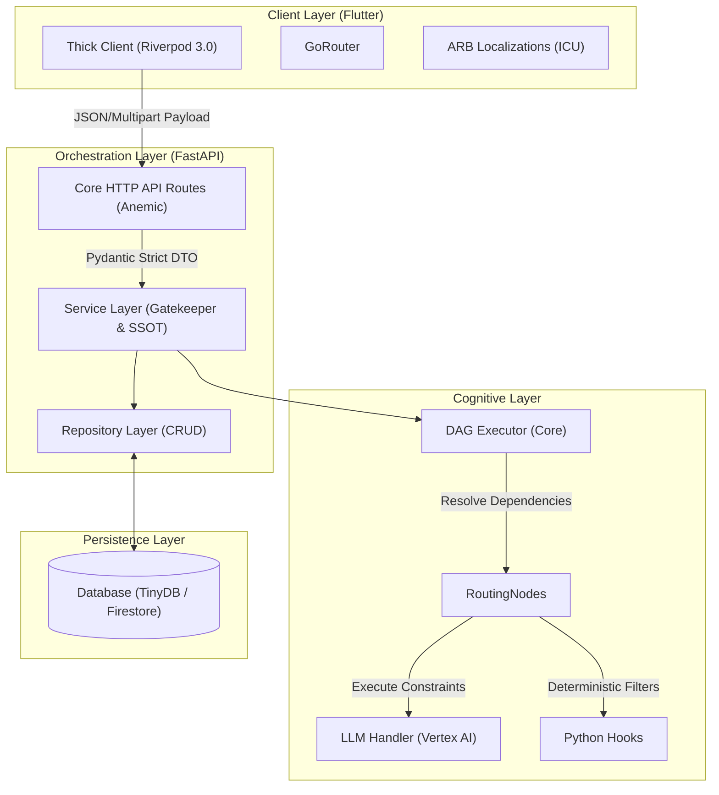

# Unified System Architecture Specification (V2.5)

**Project:** Cognitive Quorum (Monorepo: Python Backend + Flutter Client)
**Date:** March 2026
**Status:** Enterprise V2.5 Production Standard (Deployed)
**Core Philosophy:** Zero-Deploy, SDUI & "Zero-Magic" Modular Async Monolith

---

## Chapter 1: Executive Summary & System Core Principles

This document serves as the absolute Single Source of Truth (SSOT), consolidating the theoretical, scientific, and technical mandates of the Quorum V2 Architecture. It governs the Core Backend Execution Pipeline (DAGs & Hooks), the Client Layer (Server-Driven UI), and the rules for extending the system. 

The primary objective of the V2 migration was to systematically eradicate the inherent volatility, unpredictability (stochasticity), and hallucination risks of Large Language Models (LLMs) present in V1. V2 solves this by reconstructing the pipeline into a deterministic, highly verifiable software straitjacket, stripping the AI of workflow logic and shifting all cognitive business rules, data routing, and UI rendering natively into the database.

### 1.1 The Zero-Compromise Pledge
**"Production Quality, Day One."** The system strictly forbids compromising on quality, security, or data integrity checks. This philosophy governs how all system components are built:

1. **The Fail-Fast Boundary (RFC 7807 & Zero-Fallback):** The core engine, database, and domain layers **MUST CRASH FAST** (raise Exceptions) when encountering a flawed state or missing data. 
   - **BANNED:** Using `try-except pass` or silently returning empty values (`None`, `[]`, `{}`) to bypass upstream errors. If an entity is missing or relations are violated, the Service layer immediately halts execution.
2. **Root Cause Mandate:** Symptoms must never be patched superficially (e.g., using defensive defaults like `.get('field', default)` without justification). Developers must trace and repair the data's origin. Defective generator nodes must be fixed; pipelines are not patched to tolerate bad data.
3. **Strict Typing & No Defaults:** Domain models must not contain implicit defaults for required fields unless mathematically sound. Pydantic V2 is enforced globally with `ConfigDict(strict=True)`.
4. **Deterministic Execution Mandate (Python Authority):** Because LLMs are probabilistic and Python is deterministic, logical operations (math, sorting, deduplication, identifier generation) **SHALL NEVER** be delegated to the LLM via prompt instructions. They must be executed deterministically in Python (`BaseAgent.post_process()`, pre/post-hooks).

### 1.2 The 11 Core Philosophies of V2
The transition to V2 is defined by the following systemic upgrades:

1. **Zero-Deploy, SDUI & Responsiveness:** UI engines and PDF generators are business-logic agnostic. All rendering rules, criteria, and models are configured in the database, allowing global system scaling without code deployments.
2. **Reactive State Management (Riverpod):** The entire client UI state and async data streams rely exclusively on Riverpod 3.0 following structural best practices (`AsyncNotifier`, Code Generation).
3. **Schema-Driven AI (Dynamic Pydantic):** The AI is never requested to format output via free-text prompt instructions. Outputs are deterministically constrained via OpenAPI JSON Schema Validation (`Structured Outputs`) matching Pydantic DTOs on the fly.
4. **Universal Measurement Architecture ("PromptBlocks"):** Qualitative analyses, decimal metrics, and instructions are unified under a single schema: the `PromptBlock`. 
5. **Dynamic Evaluation Calibration (Model Strategy):** Cognitive intents (`fast`, `deep`, `strict`) are entirely decoupled from physical models via the global `system_config` registry.
6. **Theory-Grounded XAI (Explainable AI):** Evaluation criteria are explicitly bound to theory sources (URLs) embedded within the matrix, injected to the AI before generation.
7. **Dynamic Data Routing (Semantic Data Flow):** Hardcoded agent pipelines are replaced with dynamic Directed Acyclic Graphs (DAG). Data is routed mathematically utilizing explicit routing variables (`$inputs.`, `$step_node_1.`).
8. **Eternal Auditability (Append-Only & Snapshotting):** Live execution blocks are never overwritten. Runs freeze out a `frozen_context` (a deep copy of the executing ruleset) at runtime.
9. **Single Source of Truth (Domain Service Layer):** API Routers are strictly anemic. Tenant-isolation and DB connections are solely managed inside a fortified Service Layer.
10. **Strict Pydantic Role Enforcement:** Pydantic schema keys strictly prevent LLM "cloning" and generic summarization by forcing evaluation strictly through individualized agent lenses.
11. **The Anti-Mirror Protocol (Parallel Blind Audit):** The system fundamentally prevents AI consensus-bias (groupthink) when evaluating human end-users. Expert evaluators are executed blindly in parallel, strictly ingesting isolated `$inputs` stripped of previous AI interference. 

---

## Chapter 2: High-Level Architecture (The Spine vs. The Mind)

V2 strictly enforces a **Unidirectional Data Flow** explicitly decoupling the logic from the executable. This cleanly segregates the system into two conceptual hemispheres: "intelligence" and "muscle".

### 2.1 The "Spine" (Execution Layer)
* **Role:** Orchestration, State Management, deterministic Execution, and Type Enforcement.
* **Component:** The Python-based `GraphEngine` and FastAPI backend.
* **Operation:** Contains **zero** localized "intelligence" or hardcoded AI rules. It acts solely as the deterministic runtime, reading definitions and forcibly routing data. Information moves across explicit nodes, ensuring raw intelligence targets the right downstream handlers.

### 2.2 The "Mind" (Cognitive Layer)
* **Role:** Reasoning, Rulesets, Strategy, and Output Criteria.
* **Component:** The JSON/NoSQL Document database (`seed_data.json` / Firestore). 
* **Operation:** Prompt instructions, scoring matrices, penalty thresholds, and model mappings exist purely as database configuration. Modifying them updates the system globally without redeploying the backend.

### 2.3 The Strict DTO Pattern (The "Air Gap")
To insulate the deterministic system from LLM hallucinations (such as inventing system metadata, execution IDs, or timestamps), V2 enforces an "Air Gap" via Pydantic Data Transfer Objects (DTOs):
1. **The LLM Output (The Proposal):** The generative model produces a lean, raw data proposal (DTO) containing only substantive values (e.g., scoring arrays, textual evaluation).
2. **The Python Authority (The Catcher):** The executing Agent (Python code) captures the DTO, validating boundaries via `ConfigDict(strict=True, extra="ignore")`. No loose dictionaries (`dict`) are permitted.
3. **Domain Promotion:** The Python authority systematically injects robust system metadata (Execution IDs, tenant constraints, server-side timestamps) onto the clean DTO, uplifting it into a fully validated Domain Model ready for persistence.

### 2.4 High-Level System Topological Map

This strict decoupling ensures that fast human operations (UI rendering, CRUD tasks) do not block or intertwine with slow cognitive reasoning (DAG orchestration, LLM inference).

---

## Chapter 3: Universal Data Routing & DAG Orchestration

The execution engine in V2 interprets a dynamic Directed Acyclic Graph (DAG), mapping exact routing configurations. The architecture eradicated legacy "Ghost Matrices" (free-text instructions) in favor of deterministic semantic data routing.

### 3.1 Universal Routing & Dynamic Input Ingestion
Raw inputs (PDFs, chat logs, user text) are intercepted by the orchestration engine. Instead of hardcoding specialized instructions for specific files, agents use **Universal Routing**. A pre-hook dynamically injects an `ai_description` header (e.g., "This is the transcript") directly into the document string. This enables any generalized AI agent to process any dataset natively without workflow-specific prompt hacks.

### 3.2 Semantic Data Flow and Routing Variables ($)
Information streams through the network utilizing explicit mappings (`input_mappings`).
- **Global Inputs (`$inputs.chat_log`):** Cleaned, isolated primary source text. V2 strictly separates human inputs from AI noise.
- **Upstream Outputs (`$steps.step_node_1.output.risk_score`):** Explicit references to prior nodes.

The engine retrieves the target Pydantic Input Schema and strictly inflates the routed raw JSON. If variables mismatch or parameters are missing, the engine immediately crashes (`AGENT_SCHEMA_VALIDATION_FAILED`).

### 3.3 The Fan-Out & Upstream Experts (Parallel Blind Audit)
The pipeline fans out to multiple, independent expert agents:
- **Phase 1 (Ingestion):** Process raw text strings, enforce security perimeters, and retrieve external domain contexts.
- **Phase 2 (The Fused Analysts):** Independent experts execute highly specialized cognitive functions in isolation. To prevent cognitive bias (Groupthink), agents do not read each other's work if they are evaluating human data.
- **Phase 3 (The Grand Unifier & Output):** A convergence node absorbs the 360-degree panorama via an overarching `JudgeInput` Pydantic model to finalize the mathematical scorings and semantic reports.

---

## Chapter 4: Cognitive Ecosystem & Hook Architecture

To eliminate token bloat and hallucination risks, all validation, filtering, math, penalty calculating, and document handling routines have been excised from the LLM context into modular Python logic executed across the workflow lifecycle (`backend_v2/hooks/`).

### 4.1 CPU-Bound Determinism (The Hook Ecosystem)
- **Front-Door Validation:** Hooks like `check_banned_phrases`, `sanitize_text`, and `verify_structure` viciously process data before any LLM is activated.
- **Quantitative Measurement:** Heuristics, classical NLP math (word counts, standard deviations), and deterministic matching (performative language counters) execute entirely in pure Python math (`metrics`, `linguistics`).
- **Security & Integrity Hooks:** Processes like `verify_citation_integrity` ensure quoted text strictly matches the source (`$inputs`), penalizing hallucinated citations deterministically. `inject_step_metadata` applies server timestamps and tenant IDs so the LLM never generates system parameters.

### 4.2 Polymorphic PromptBlocks
Legacy text matrices and heuristic descriptions are unified into a `PromptBlock`. A PromptBlock encompasses:
- **Directives:** Immutable rule mandates (in English).
- **Context:** Injected state, prior evidence, and web structures.
- **Cognitive Criteria:** Evaluation matrices transformed into strict rubrics.
- **Output Validation:** Auto-generates the `{{SCHEMA_EXAMPLE}}` DTO.

### 4.3 The 2D-Engine: 5-Level Strictness Framework & Injections
Scoring adapts via a two-dimensional framework:
1. **Macro-Level (Qualitative Injection):** For example, jumping to Level 5 bypasses baseline blocks and injects a ruthless identity and extreme cognitive friction (e.g., forcing Popperian falsification logic).
2. **Micro-Level (Programmable Zero-Tolerance):** The engine mathematically overrides the LLM's scoring variance. Setting `strictness_level` to 100 nullifies rounding favors, demanding absolute perfection for full grades.

### 4.4 CoT String-Tuple Pre-Parsing
LLM structured output (JSON Mode) mathematically collapses fractional nuance toward integers (e.g., changing 4.2 to 4). V2 employs the **CoT String-Tuple Hack**:
1. The model is forced to output its decimal insight within the Chain-of-Thought string format: `||DECIMAL: 4.2||`.
2. The `normalize_matrix_scores` hook intercepts the execution state, regex-extracts the precise decimal, violently overrides the JSON integer constraint, and cleanses the string before returning it to the Pydantic validator.

### 4.5 Adversarial AI Pipeline (Monimallinen Debattiarkkitehtuuri)
The DAG permits AI-to-AI debate pipelines (LLM-as-a-Judge vs. LLM-as-a-Judge) where the Anti-Mirror Protocol is intentionally relaxed because humans are no longer the evaluation focus. By crossing cognitive strategies (e.g., feeding a `fast` Analyst into a `strict` Falsifier), the network exposes algorithmic blind spots without subjective distortion.

### 4.6 3-Tier Information Retrieval
Information retrieval avoids context collapse through targeted segregation:
1. **Proactive Search (`search.py` Hook):** A pre-hook generative engine targeting external Vertex queries to gather structured evidence prior to analysis.
2. **Real-Time Grounding:** Inline Fact-Checking via provider native tools (e.g., Google Search integration within the direct LLM generation request).
3. **Post-Hoc Compliance (`references.py`):** Asynchronous evaluation checking the generated result against localized organizational constraints.

---

## Chapter 5: Data & Persistence Strategy

The system embraces a strict No-ORM document model utilizing TinyDB locally and Firestore in production. Database operations are violently isolated.

### 5.1 Single Source of Truth & Domain Service Layer
- **Anemic API Routers:** FastAPI routers (`backend_v2/api/`) only parse HTTP input via Pydantic and immediately delegate to the Service layer. Direct `repository.create()` calls inside routers are absolutely banned.
- **The Gatekeeper:** The Domain Service Layer enforces all rules, relations (e.g., Tenant Isolation, Granular RBAC), and database validations.

### 5.2 Dual Backend Parity & No-ORM
Pydantic V2 definitions serve as the 1:1 documentation of the database structure. Any CRUD modification must be methodically implemented across both the local `repository.py` and the cloud-native `firestore_repo.py` to maintain operational parity. Object-Relational Mapping (ORM) tools like SQLAlchemy are expressly prohibited.

### 5.3 NoSQL Design & Polymorphic Collections
To prevent the mathematical penalty of relational JOIN queries lacking in Firestore, cognitive components (Instructions, Matrices, Hooks) are deliberately consolidated:
- **Polymorphic `prompt_blocks`:** Component configurations are stored in a massive single collection using a polymorphic `"type"` routing key. Pydantic instantly reconstructs these JSON payloads back into highly typed Python subclasses upon reading.
- **Explicit Isolation Limits:** While configurations are grouped, core transactional entities (`users`, `organizations`) exist in rigidly separated collections to guarantee secure RBAC boundary enforcement at the Domain Service level.

### 5.4 The 3-Tier Data Model
Data persists across a 3-tier operational lifecycle:
1. **Tier 1 (Local Testing - Mocks):** Rapid offline UI development via local `db_v2.json` and a `USE_MOCK_LLM=true` engine.
2. **Tier 2 (Local Production - Live):** High-fidelity local database testing utilizing Live Cloud LLMs (e.g., Vertex AI integration directly against the local `db_v2.json`).
3. **Tier 3 (Cloud Production):** Standard multi-tenant ecosystem running solely on Google Cloud Firestore natively.

Both Tiers 2 & 3 decouple operational strategies (`fast`, `deep`) via the `system_configs` mapping, allowing safe downgrades or upgrades of physical LLMs purely through data, without code changes.

### 5.5 Bidirectional Seeding System & Data as Logic
Changing a database record instantly alters how the system "thinks." Therefore, manually hand-editing the local `db_v2.json` is strictly forbidden. The system employs a bidirectional protocol to enforce the SSOT (`backend_v2/seed/seed_data.json`):
1. **Seeding (Blueprint $\rightarrow$ Database):** Executing `python backend_v2/seed/run_seed.py local` ingests the blueprint directly into the Runtime Database, enforcing mathematical Pydantic validation upon entry. It automatically generates timestamped backups to prevent catastrophic overwrites.
2. **Extraction (Database $\rightarrow$ Blueprint):** Development modifications from the database can be extracted back into the SSOT blueprint (`migrate_to_seed.py`), ensuring structural parity.

*🚨 Recovery Protocol:* If seeder scripts crash, developers must *never* blindly revert `seed_data.json` with a backup. Script failures must be analyzed and patched incrementally to preserve live translation blocks and valid structural schema changes.

---

## Chapter 6: Frontend Architecture & SDUI (Flutter)

The Quorum V2 client (`client_app_v2`) is a purely declarative, Server-Driven UI render engine.

### 6.1 State Management & Architecture
Client state is governed exclusively by **Riverpod 3.0** (`@riverpod` generators) utilizing `AsyncNotifier`. Legacy state solutions like `ChangeNotifier` are banned.
- **Optimistic Updates:** The UI must not aggressively spin loaders while waiting for backend CRUD syncs. It immediately writes local state optimally and quietly reverts upon catching a failure.
- **Routing:** Governed entirely by `go_router` utilizing typed `GoRouteData`. Bare string pushes (e.g., `context.push('/home')`) and inline navigational guard logic inside widgets are forbidden.
- **Concurrency:** Data decoding operations must be punted to isolated background threads via `Isolate.run(...)`.

### 6.2 The Hybrid SDUI & Compound Widgets
The frontend receives Omni-Channel JSON structures and renders them dynamically as compound widgets (combining sliders, Markdown evidence, and context boxes). The framework uses a defensive strategy known as **SafeCast**, preventing null-pointer exceptions if expected properties structurally shift.

### 6.3 Internationalization (I18n) & The No-String Mandate
Data originates globally and structurally:
- **The English-Only Backend Mandate:** Advanced AI reasoning and system contexts are fundamentally processed in English.
- **The No-String Rule:** Backend variables (`"RISK_LOW"`) are transmitted as explicit ENUM strings, never prefixed programmatically (`"Result: RISK_LOW"`).
- **The 5-Layer Holistic Strategy:** The Client maps raw tokens to localized Dart `.arb` files employing ICU logic formatting, preserving the absolute separation of the presentation language (e.g., Finnish UI) from the cognitive execution language (English logic context).

---

## Chapter 7: Error Handling & Governance (RFC 7807)

V2 enforces an ironclad, standardized Error Handling mechanism based on the **RFC 7807** specification.

### 7.1 Explicit `AppException` & Dual-Reporting
Catching a base `Exception` or randomly raising `HTTPException` directly is banned. Errors are managed via Dual-Reporting:
1. Operations trace the root failure contextually mapping securely into the internal logs via `logger.error` using strict ENUM states.
2. The layer wraps the error in a semantic `AppException` (e.g., `WORKFLOW_EXECUTION_FAILED`), surfacing the safe ENUM to the frontend without spilling server stack traces.

### 7.2 Graceful Degradation Protocol (The Fail-Fast Exception)
While Core engines Fail-Fast completely upon bad logic, the **Client Render Engine** honors Graceful Degradation.
If a deeply nested element inside a complex UI dashboard corrupts during SDUI JSON ingestion:
1. The widget traps the error and throws an internal log (`VALIDATION_FAILED` / `TRANSLATION_FAILED`).
2. The component collapses itself cleanly (`SizedBox.shrink()`) or falls back to an un-localized default string, preserving the surrounding application integrity rather than "Red-Screening" the end user.

### 7.3 The UI `ErrorView` Boundary
Exceptions are passed as simple Enum codes (e.g., `"VALIDATION_FAILED"`) to the UI, which translates them via an `AppErrorExt` framework into meaningful, actionable hints rendered inside a uniform fullscreen or partial `ErrorView` widget. 

---

## Chapter 8: Development Protocols & Compliance

To maintain structural discipline within the system, developers and agents alike are bound by strict pre-flight protocols.

### 8.1 Environmental Baseline (Latest Stable Mandate)
Dependencies must remain aggressively updated:
- **Backend:** Python 3.14.2+, FastAPI 0.128+, Pydantic 2.12.5+.
- **Frontend:** Dart 3.11+, Riverpod 3.0+, GoRouter 17+.

### 8.2 Banned Legacy Patterns
- `parse_obj()` and `.dict()` are banned for Pydantic V2 compatibility (`model_validate` and `model_dump` mandated).
- Implicit DI overrides in FastAPI without the `Annotated[Dep, Depends()]` wrapper.
- `try-except pass` usage anywhere inside the core.

### 8.3 Documentation Hygiene & English-Only Policy
System documentation, source code variables, and logic gates are universally mandated to be processed in US English. Public API definitions, Python `"""docstrings"""`, and Dart `///` comments must strictly employ the **Imperative Mood** (e.g., "Calculate the matrix score", not "Returns the calculated score").

Additionally, inline comments must explain **"Why"** a complex decision or hack was employed to bypass a technical limitation, rather than spelling out **"What"** the code is doing mechanically. Orphaned `TODO:`s without an owning developer or targeted version timeline are strictly prohibited.
