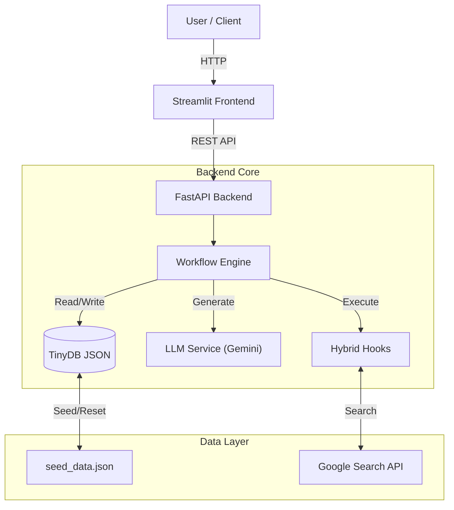

# System Architecture

Cognitive Quorum v2 is built on a modern, modular architecture designed for flexibility, scalability, and rigorous process control.

## High-Level Diagram

## Core Components

### 1. Frontend (Streamlit)
*   **Role**: Provides the user interface for submitting assessments and managing the system.
*   **Features**:
    *   **Assessment UI**: File upload, chat interface, and report viewing.
    *   **Management UI**: Editors for Prompts, Rules, and Configuration.
    *   **Visualizations**: Real-time progress tracking and JSON data inspection.

### 2. Backend (FastAPI)
*   **Role**: The central nervous system. Exposes REST endpoints for all operations.
*   **Key Endpoints**:
    *   `/workflow/start`: Initiates a new assessment.
    *   `/config/*`: CRUD operations for system configuration.
    *   `/manage/*`: Administrative tools (e.g., deploying mock to prod).

### 3. Workflow Engine (`backend/engine.py`)
*   **Role**: Orchestrates the execution of the 9-step cognitive process.
*   **Mechanism**:
    *   Loads a **Workflow Definition** from the database.
    *   Iterates through **Steps**.
    *   For each step, constructs a **Prompt** using templates and data.
    *   Calls the **LLM** or executes a **Hook**.
    *   Validates the output against a **Schema**.
    *   Saves the result to the **Context**.

## The 9-Step Cognitive Workflow

The system implements a sequential "Assembly Line" of cognition:

1.  **Guard Agent**: Input sanitization and security check.
2.  **Analyst Agent**: Evidence extraction and anchoring.
3.  **Logician Agent**: Argument construction and logical structuring.
4.  **Logical Falsifier**: Stress-testing the argument (Panel).
5.  **Factual Overseer**: External fact-checking (Panel).
6.  **Causal Analyst**: Verifying cause-and-effect claims (Panel).
7.  **Performativity Detector**: Checking for AI artifacts (Panel).
8.  **Judge Agent**: Final synthesis, scoring, and verdict.
9.  **XAI Reporter**: Generating the human-readable explanation (implemented via `XAIReportAgent` and Jinja2 templates).

## Technology Stack

*   **Language**: Python 3.10+
*   **Web Framework**: FastAPI
*   **UI Framework**: Streamlit
*   **Database**: TinyDB (JSON-based, file-backed)
*   **LLM**: Google Gemini (via `google-generativeai`)
*   **Validation**: Pydantic
*   **Templating**: Jinja2