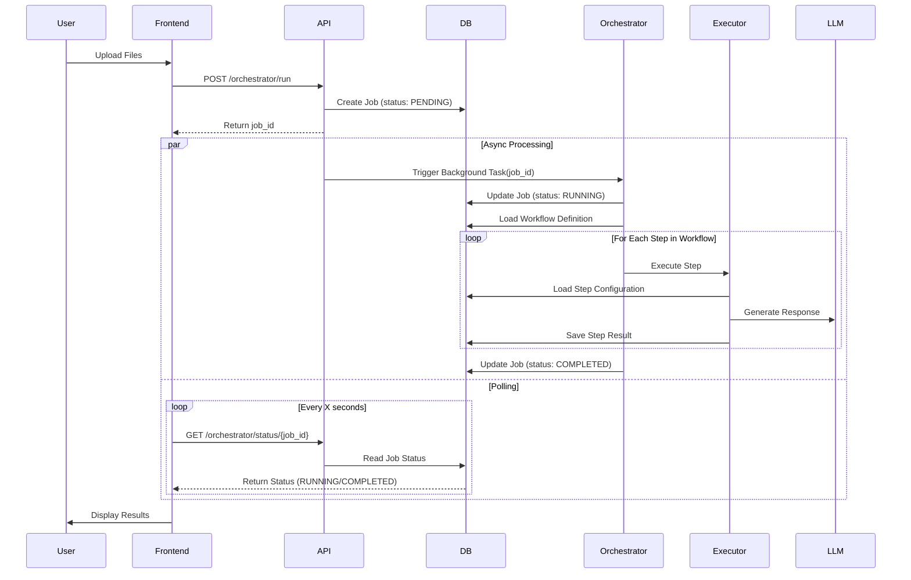
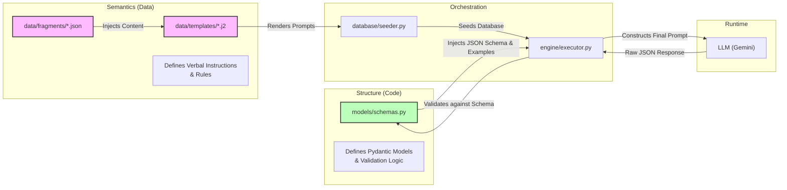
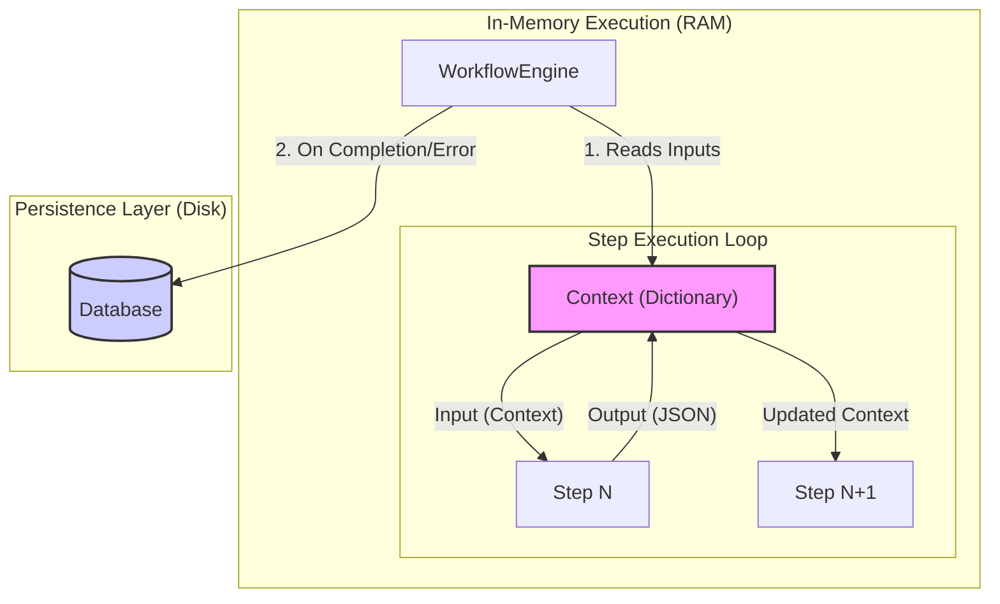

## Architecture: Cognitive Quorum v2

The **Cognitive Quorum v2** architecture is a **Generic Workflow Engine** designed with a **Cloud-Native** focus. It decouples the frontend from the backend, enabling asynchronous processing and scalable deployment.

## Core Concepts

### 1. Data-Driven Logic
All business logic is defined in the database (seeded from `seed_data.json`), not hardcoded in the application. This includes:
- **Rules**: Global constraints applied across workflows (e.g., "Chain of Trust").
- **Prompts**: Instructions for LLMs, dynamically assembled from fragments.
- **Steps**: Atomic units of execution with defined Inputs, Outputs, and Hooks.
- **Workflows**: Ordered sequences of Steps that define a complete process.

### 2. REST API & Job Queue
The system exposes a REST API (using FastAPI) to handle incoming requests. Long-running workflows are executed asynchronously via a Job Queue pattern:
- **`POST /orchestrator/run`**: Accepts input files and initiates a background workflow, immediately returning a `job_id`.
- **`GET /orchestrator/status/{job_id}`**: A polling endpoint to check the job's progress and retrieve the final results upon completion.

### 3. Generic Engine
The `Orchestrator` and `Executor` classes (`src/engine/`) are content-agnostic. They do not contain any specific business logic; they simply load a workflow definition from the database and execute its steps in the prescribed order.

### 4. Registry Pattern
A Registry Pattern bridges the gap between static data definitions (from the database) and dynamic Python code:
- **`SchemaRegistry`**: Maps string identifiers (e.g., "AnalysisSummary") to their corresponding Pydantic models for data validation.
- **`HookRegistry`**: Maps string identifiers (e.g., "execute_google_search") to executable Python functions, allowing workflows to trigger custom code.

## Directory Structure

```
src/
├── api/                # FastAPI Application
│   ├── routers/        # API Endpoints (e.g., orchestrator)
│   └── server.py       # Application Entry Point
├── components/         # Reusable business logic components
│   ├── hooks/          # Python functions (e.g., Search, RAG, Parsing)
│   └── templates/      # Jinja2 templates for reporting
├── database/           # Database client (e.g., Firestore, TinyDB)
├── engine/             # Core Orchestrator & Executor logic
└── models/             # Pydantic Schemas & Registries
```

## Execution Flow



## Data & Prompt Management (SSOT Architecture)

To ensure consistency and maintainability, the system uses a **Single Source of Truth (SSOT)** architecture that separates data **Structure** (code) from instructional **Semantics** (data).



### 1. Dynamic Prompt Assembly
1.  Loads all JSON fragments from `data/fragments/`.
2.  Loads the Jinja2 templates from `data/templates/`.
3.  Renders the final prompt text for each component by injecting fragments into templates.
4.  Upserts the complete, rendered components (prompts, rules, etc.) into the database.

This architecture ensures that a change to a single rule in `rules.json` is automatically propagated to every prompt that references it, guaranteeing system-wide consistency.

## Internal Data Flow & Persistence

The engine manages data flow between steps in memory and persists the final state to the database.



### Explanation
1.  **In-Memory Data Flow**:
    - The `Orchestrator` maintains a `context` dictionary in RAM for the duration of a job.
    - When a step completes, its JSON output is merged into this `context` via `context.update(output)`.
    - The next step in the workflow receives the updated `context`, giving it access to all previously generated data.
2.  **Persistence**:
    - **During execution**, all state is managed in RAM for performance.
    - **Upon completion or failure**, the final `context` and all individual step results are written to the database for auditing and retrieval.