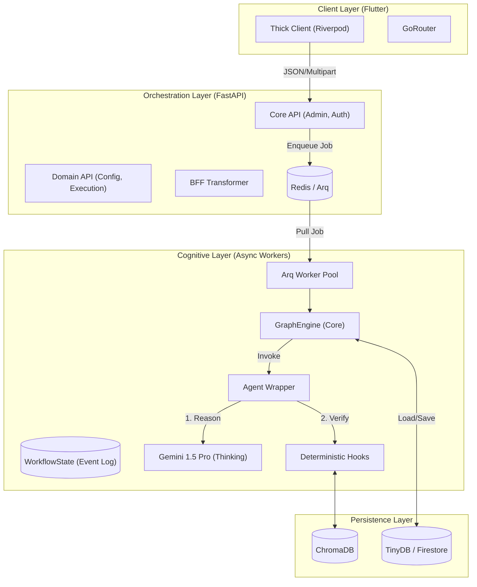

# System Architecture (V2.9 / 2026)

**Status:** V2.9 Production Standard (Feb 2026)
**Core Philosophy:** "Zero-Magic" Modular Async Monolith

Cognitive Quorum V2.9 is a deterministic, highly verifiable AI orchestration platform. It rejects the "black box" nature of standard agent frameworks in favor of a strictly typed, schema-driven architecture where every state transition is audited and persisted via **Event Sourcing**.

## 0. Key Architectural Upgrades (Q1 2026)
Significant hardening has occurred in Phase 2.5 and Phase 8 (Bulletproof Agencies):
*   **Strict Type Safety**: Transited from Dictionary-based inputs to **Strict Pydantic Models** (`JudgeInput`, `ProfilerInput`, etc.).
*   **Fail Fast Protocol**: Adopted **RFC 7807** error handling. Agents and Hooks verify inputs *before* execution, raising `AppException` (400) instead of failing silently or hallucinating.
*   **Relative Scoring**: Scoring logic now uses configurable percentage-based penalties (from `settings.py`) with safety clamps.
*   **XAI Hardening**: `XAIReporter` strictly enforces `JudgeScoreCard` schema, rejecting legacy flat structures.

---

## 1. High-Level Architecture

The system follows a **Separated Execution Model**: the API accepts requests, but the actual intelligence runs in a detached Async Worker pool. This decouples the user experience from the latency of deep cognitive reasoning.

```mermaid
graph TD
    subgraph "Client Layer (Flutter)"
        App["Thick Client (Riverpod)"]
        Router["GoRouter"]
    end

    subgraph "Orchestration Layer (FastAPI)"
        API["Core API (Admin, Auth)"]
        DomainAPI["Domain API (Config, Execution)"]
        BFF["BFF Transformer"]
        Queue[(Redis / Arq)]
    end

    subgraph "Cognitive Layer (Async Workers)"
        Worker["Arq Worker Pool"]
        Engine["GraphEngine (Core)"]
        State[("WorkflowState (Event Log)")]
        
        Engine -->|Invoke| Agent["Agent Wrapper"]
        Agent -->|1. Reason| LLM["Gemini 1.5 Pro (Thinking)"]
        Agent -->|2. Verify| Hooks["Deterministic Hooks"]
    end

    subgraph "Persistence Layer"
        DB[("TinyDB / Firestore")]
        VectorDB[("ChromaDB")]
    end

    App -->|JSON/Multipart| API
    API -->|Enqueue Job| Queue
    Queue -->|Pull Job| Worker
    Worker --> Engine
    Engine <-->|Load/Save| DB
    Hooks <--> VectorDB
```

---

## 2. Core Components Analysis

### A. The "Spine" (Execution Engine)
*   **Location**: `backend/core/engine.py` (Class: `GraphEngine`)
*   **Role**: The deterministic runtime that loads definitions and executes steps.

### E. API Structure (Modular Routers)
*   **System Routers** (`backend/api/*.py`):
    *   `auth_router`: Login & Session Management.
    *   `admin_router`: System-wide configuration & User Management.
    *   `organization_router`: Multi-tenancy isolation.
*   **Domain Routes** (`backend/api/routes/`):
    *   `config/`: CRUD for `workflows`, `steps`, `components` (The "Brains").
    *   `execution/`: `lifecycle` (Run/Stop), `monitor` (Status), `views` (BFF).
*   **Pattern**: This separation ensures that high-volume execution logic is isolated from low-volume administrative tasks.
*   **Event Sourcing**:
    *   The Engine does not mutate a "Blackboard".
    *   Instead, it appends `TraceEvent` items to an immutable `execution_trace`.
    *   State is derived by replaying these events (or checking the latest snapshot `context_variables`).
*   **Key Feature: Strict Object Mode**:
    *   The Engine **never** passes raw dictionaries to Agents.
    *   It hydrates a `WorkflowState` Pydantic object before execution.
    *   If the DB data does not match the Schema, the Engine **crashes fast** rather than propagating corruption.
    *   **Strict Enums**: Categorical data (Risk, Fidelity, etc.) is typed as strict Enums (`backend.models.enums`), rejecting fuzzy string matching.

### B. The "Mind" (Agent Graph)
*   **Location**: `backend/agents/`
*   **Pattern**: Functional Wrapper.
*   **Behavior**: Agents are stateless logic units. They receive `WorkflowState`, perform **one** specific cognitive task, and return a structured Pydantic object (e.g., `AnalystOutput`).
*   **Reasoning Continuity**: To solve "Chain-of-Thought Amnesia", the engine extracts hidden "Thinking Tokens" from Gemini and passes them to the next agent via `ReasoningTrace`.

### C. The "Hand" (Async Worker)
*   **Location**: `backend/worker.py`
*   **Tech**: `arq` (Redis-based).
*   **Why**: Standard HTTP/WSGI servers timeout after 60s. Cognitive Workflows (e.g., Causal Analysis) take 5-15 minutes.
*   **Resilience**: Workers are stateless. If a worker dies, the job is re-queueable. The `WorkflowState.version` field prevents race conditions ("Optimistic Locking").

### D. The "Face" (Flutter Client)
*   **Location**: `client_app/`
*   **Architecture**: Feature-First, Riverpod-based.
*   **Modules**:
    *   `orchestration`: The flowchart UI and execution monitoring.
    *   `studio`: The Matrix Editor and Configuration tools.
    *   `admin`: User management and System settings.
*   **BFF Pattern**: The frontend does not parse raw Agent outputs. The Backend exposes a "BFF" (Backend for Frontend) view that transforms complex graphs into UI-ready view models.

---

## 3. Data & Persistence Strategy

The system supports a **Dual-Database** strategy for development velocity vs. production scale.

### Primary Store: UnifiedWorkflowRepository (Driver Pattern)
*   **Interface**: `backend/database/repository.py`
*   **Protocol**: `StorageDriver` (Defines CRUD + Query contract).
*   **Drivers**:
    *   `TinyDBDriver`: Adapter for local JSON file (Dev).
    *   `FirestoreDriver`: Adapter for Google Cloud Firestore (Prod).
*   **Advantage**: Business logic (filtering, aggregation) is unified in the Repository, while I/O is abstracted.

### Vector Store: KnowledgeBaseService
*   **Implementation**: `ChromaDB` (Local/Server).
*   **Use Case**: RAG (Retrieval Augmented Generation) for the Analyst Agent.

### Schema Enforcement
*   **Source of Truth**: `backend/models/state.py`.
*   **Migration Strategy**: "Field Addition Only". We never rename fields; we add new ones and deprecate old ones to maintain backward compatibility with serialized JSON blobs.
*   **Strict Enums**: All categorical data (Risk, Fidelity, etc.) must use Enums defined in `backend/models/enums.py`. Fuzzy string matching is strictly forbidden.

---

## 4. Security & Compliance

### Identity & Access Management (IAM)
*   **Scope**: `auth_router.py`.
*   **Model**: RBAC (Root, Admin, Manager, Member, Viewer).
*   **Multi-Tenancy**: All DB queries are scoped by `organization_id`.

### PII Protection
*   **Agent**: `GuardAgent`.
*   **Mechanism**: **Deterministic Cleaning Hooks** (`backend.hooks.security`).
*   **Flow**:
    1.  User submits raw text.
    2.  `GuardAgent` executes `sanitize_input` pre-hook.
    3.  Detected entities (Names, SSNs) are flagged/redacted via regex/heuristics.
    4.  Downstream agents **only** see the sanitized text.

---

## 5. Technology Stack (V2.9 Locked)

| Component | Technology | Version | Purpose |
| :--- | :--- | :--- | :--- |
| **Backend** | Python | 3.14.2 | Core Logic (Async) |
| **Web Framework** | FastAPI | 0.115+ | REST API |
| **Worker** | Arq | 0.26+ | Job Queue |
| **DB (Doc)** | TinyDB / Firestore | 4.7+ | State Persistence |
| **DB (Vector)** | ChromaDB | 0.4+ | Semantic Search |
| **Frontend** | Flutter | 3.27+ | UI / Client |
| **State Mgmt** | Riverpod | 2.6+ | Reactive State |
| **Routing** | GoRouter | 14.0+ | Navigation |
| **LLM** | Vertex AI | Gemini 1.5 | Cognitive Engine |

---

## 6. Deployment (Docker)

The system is deployed as a consolidated **Docker Compose** stack.

*   `backend`: Exposes Port 8000.
*   `execution-worker`: Runs the Arq process (scales horizontally).
*   `redis`: Message Broker.
*   `client`: Nginx serving the Flutter Web build (Port 8080).

> **Note**: In Development, the `backend` and `worker` bind-mount the local source code for hot-reloading. In Production, they use immutable builds.

---

## 7. Validated Architectural Integrity (Phase 8)

### A. Bulletproof Agencies
Agents now define explicit `InputModels` (e.g., `JudgeInput`). The Engine validates these inputs *before* invoking the agent.
*   **Benefit**: Eliminates `AttributeError` at runtime inside agents.
*   **Benefit**: IDE Autocomplete for agent developers.

### B. Hook Hardening (Phase 2.5)
Hooks (`scoring.py`, `validation.py`, `integrity.py`) have been refactored to reject invalid state:
*   **Scoring**: Uses **Relative Penalties** (e.g., -10%) configured in `settings.py`. Includes a **Safety Clamp** (`max(score, scale_min)`) to prevent negative or zero scores from breaking downstream validation.
*   **Integrity**: Verifies citation keys against the actual bibliography.

## 8. Diagnostics & Observability

### A. Temporary Debug Dump
For critical debugging, the worker can dump the full `WorkflowState` to a local file (`debug_output_*.json`) immediately upon completion. This serves as a "Black Box" recording independent of the database or reporting service.

### B. Dynamic Settings (Roadmap)
Future architecture will support adjusting sensitivity (Penalties, Thresholds) via the Admin UI, moving these values from `settings.py` to the Database.