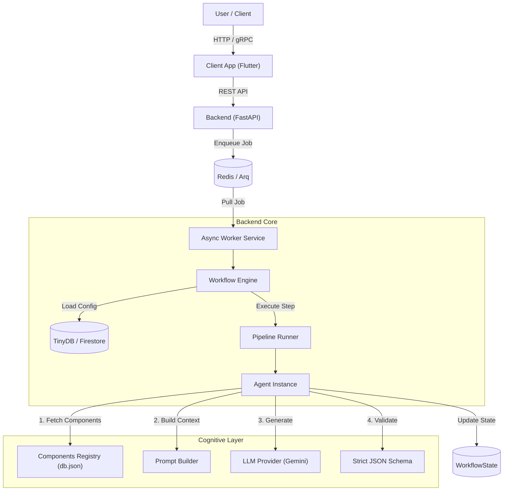

# System Architecture (V2.6)

Cognitive Quorum v2.6 is a **Modular Monolith** built on Python 3.14, designed for deterministic, verifiable AI workflows. It combines a rigorous Pydantic-based backbone with a flexible, **Configuration-Driven Intelligence** layer.

## High-Level Diagram

```mermaid
graph TD
    User["User / Client"] -->|HTTP / gRPC| Client["Client App (Flutter)"]
    Client -->|REST API| Backend["Backend (FastAPI)"]
    
    Backend -->|Enqueue Job| Redis[(Redis / Arq)]
    Redis -->|Pull Job| Worker["Async Worker Service"]
    
    subgraph "Backend Core"
        Worker --> Engine["Workflow Engine"]
        Engine -->|Load Config| DB[("TinyDB / Firestore")]
        Engine -->|Execute Step| Runner["Pipeline Runner"]
        
        Runner --> Agent["Agent Instance"]
    end
    
    subgraph "Cognitive Layer"
        Agent -->|1. Fetch Components| Registry["Components Registry (db.json)"]
        Agent -->|2. Build Context| PromptBuilder["Prompt Builder"]
        Agent -->|3. Generate| LLM["LLM Provider (Gemini)"]
        Agent -->|4. Validate| Schema["Strict JSON Schema"]
    end
    
    Agent -->|Update State| State[("WorkflowState")]
```

## Core Components

### 1. Backend & Worker
The backend is split into two primary runtime components:

*   **API Service (`backend/api/`)**: Handles HTTP requests and enqueues jobs to Redis.
*   **Worker Service (`backend/worker.py`)**: A distributed execution engine powered by **Arq**. It executes the workflows asynchronously, allowing for long-running "Deep Research" tasks.

### 2. State Management (WorkflowState)
Quorum uses a strict **`WorkflowState`** Pydantic model (`backend/models/state.py`).

*   **Audit Results List**: V2.6 introduces a dynamic `audit_results` list, allowing multiple Judges or Panels to contribute to the same state without overwriting each other.
*   **Persisted & Replayable**: The state is serialized to JSON after every step.
*   **Optimistic Locking**: Uses a `version` field to prevent race conditions during distributed execution.

### 3. Agent Architecture ("Thin Agents")
Agents are "thin" wrappers that coordinate:
1.  **Configuration**: Fetching prompts/matrices from the `Components Registry`.
2.  **Hooks**: Calling deterministic Python code (Math, Search, PII).
3.  **Generation**: Invoking the LLM with strict schemas.

### 4. Deterministic Hooks (`backend/hooks/`)
To prevent "hallucinated logic", complex operations are offloaded to Python code:
*   **`archival.py`**: Similarity search via Vector DB.
*   **`security.py`**: PII masking via Microsoft Presidio.
*   **`causal.py`**: Statistical validation via DoWhy.

### 5. BFF & Reporting Layer (PDF)
The Backend for Frontend (BFF) transforms raw execution state into human-readable views.
*   **PDF Generation**: Uses `Jinja2` templates + `WeasyPrint` to render pixel-perfect reports on the server.
*   **Timeline Unification**: Aggregates logs from all agents into a single chronological feed (`events` key).
*   **Client Download**: The Flutter client uses `FileSaver` to download the binary blob, ensuring consistent file handling across Web and Desktop without relying on browser print dialogs.

## Data-Driven Configuration

In V2.6, the *Workflow Definition* and *Cognitive Strategy* are strictly separated from code.
A workflow in `db.json` defines:
1.  **Sequence**: Which agents run in what order.
2.  **Components**: Which **Evaluation Matrices** (BARS) and **Mandates** are active.
3.  **Model Strategy**: Dynamic mapping resolved against the **Regional Model Registry**.

This allows for "No-Code" tuning of the AI's personality and evaluation criteria.

## Technology Stack

*   **Language**: Python 3.14 & Dart (Flutter)
*   **Observability**: Logfire (Distributed Tracing)
*   **API**: FastAPI + Pydantic v2 (Strict Mode)
*   **Client**: Flutter (Riverpod 3.0 + GoRouter)
*   **Database**: TinyDB (Local) / Firestore (Cloud)
*   **Vector Search**: ChromaDB
*   **LLM Provider**: **Google Cloud Vertex AI** (Region: `europe-north1` / Hamina)

## Deployment Architecture (Docker)

The system is fully containerized using Docker Compose.

*   **Shared Image**: `backend` and `worker` share the same Docker image.
*   **Bind Mounts**: Development uses host-to-container mapping for rapid iteration.
*   **Configuration**: Environment variables (`.env`) injected via Compose enforce Single Source of Truth.

## Identity & Security

### 1. Multi-Tenancy
*   **Strict Scoping**: All resources are filtered by `organization_id`.
*   **System Organization**: A protected "God Tenant" (`id="system"`) for Platform Admin.

### 2. Role Hierarchy
*   **ROOT / ADMIN / MANAGER / MEMBER / VIEWER**: A strict 5-tier RBAC model managed by the Auth Service.