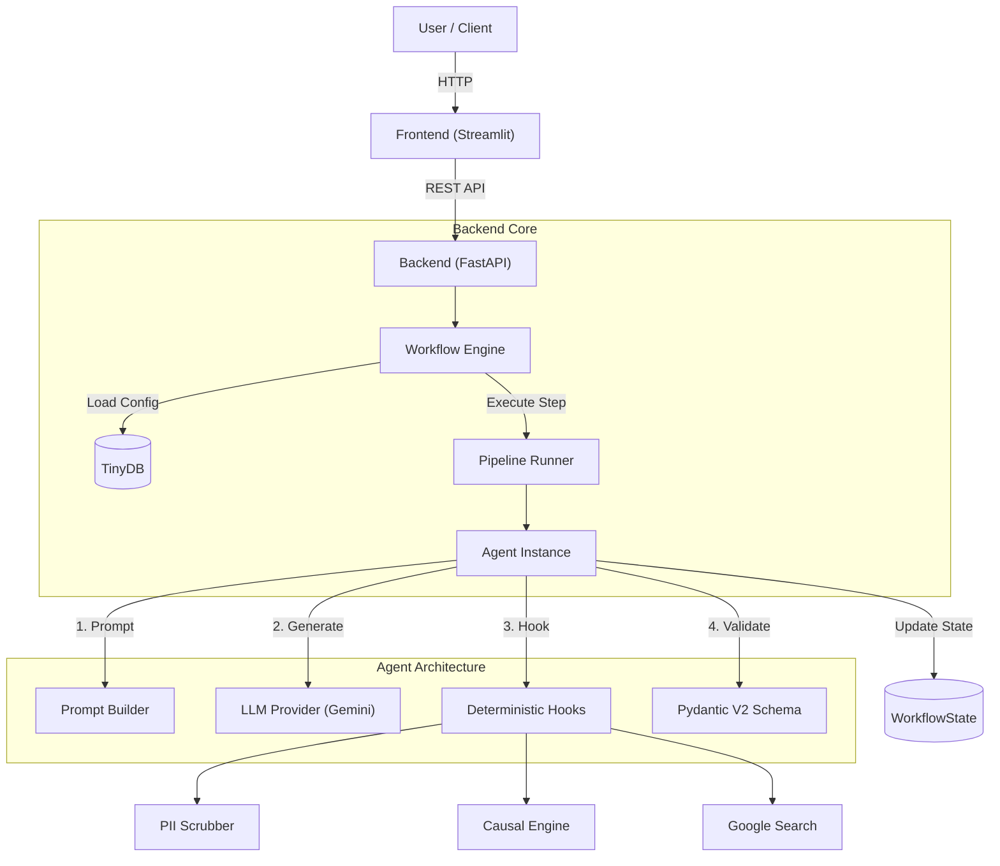

# System Architecture

Cognitive Quorum v2.0 is a **Modular Monolith** built on Python 3.12+, designed for deterministic, verifiable AI workflows. It combines a rigorous Pydantic-based backbone with a flexible, database-driven configuration engine.

## High-Level Diagram

```mermaid
graph TD
    User["User / Client"] -->|HTTP| Streamlit["Frontend (Streamlit)"]
    Streamlit -->|REST API| Backend["Backend (FastAPI)"]
    
    subgraph "Backend Core"
        Backend --> Engine["Workflow Engine"]
        Engine -->|Load Config| DB[("TinyDB")]
        Engine -->|Execute Step| Runner["Pipeline Runner"]
        
        Runner --> Agent["Agent Instance"]
    end
    
    subgraph "Agent Architecture"
        Agent -->|1. Prompt| PromptBuilder["Prompt Builder"]
        Agent -->|2. Generate| LLM["LLM Provider (Gemini)"]
        Agent -->|3. Hook| Hooks["Deterministic Hooks"]
        Agent -->|4. Validate| Schema["Pydantic V2 Schema"]
    end
    
    Hooks --> PII["PII Scrubber"]
    Hooks --> Causal["Causal Engine"]
    Hooks --> Search["Google Search"]
    
    Agent -->|Update State| State[("WorkflowState")]
```

## Core Components

### 1. Backend (FastAPI)
The backend is structured as a modular monolith:

*   **`backend/api/`**: REST Routers defined using FastAPI. Strictly typed requests/responses. Includes **Dynamic Availability API** (`/config/models/available`) for regional model discovery.
*   **`backend/core/`**: The `WorkflowEngine` and `PipelineRunner`. Orchestrates the flow based on DB config.
*   **`backend/agents/`**: specialized Agent classes (e.g., `GuardAgent`, `JudgeAgent`) inheriting from `BaseAgent`.
*   **`backend/models/`**: Centralized domain models using Pydantic v2 `Annotated` syntax.
*   **`backend/llm/`**: **Provider Layer** with specialized **JSON Heuristic Repair Engine** (regex + ast fallback) to handle truncated or malformed responses from high-intelligence models (e.g. Gemini 2.5).

### 2. State Management (WorkflowState)
Unlike many agent frameworks that pass free-form dictionaries, Quorum uses a strict **`WorkflowState`** Pydantic model (`backend/models/state.py`).

*   **Atomic Updates:** Each agent writes to a specific field (e.g., `step_guard`, `step_judge`).
*   **Persisted & Replayable:** The entire state is serialized to JSON after every step, allowing execution resumption.
*   **Type Safe:** Agents cannot write invalid data to the state; Pydantic validation enforces schema compliance.

### 3. Agent Architecture (Thin Agents)
Agents are "thin" wrappers that coordinate three things:

1.  **Prompting:** Constructing context using `PromptBuilder`.
2.  **Hooks:** Calling deterministic Python code (Hooks) for tasks logical reasoning cannot solve (e.g., math, causal inference, search).
3.  **Generation:** Calling the LLM via `LLMProvider` (Vertex AI).

Configurations (Prompts, Model usage) are stored in `seed_data.json` / Database, but the execution logic resides in code.

### 4. Deterministic Hooks (`backend/hooks/`)
To prevent "hallucinated logic", complex operations are offloaded to Python code:

*   **`archival.py`**: Similarity search via Vector DB.
*   **`security.py`**: PII masking via Microsoft Presidio.
*   **`metrics.py`**: Text analytics (lexical diversity, etc.).
*   **`causal.py`**: Statistical validation via DoWhy.

## Data-Driven Configuration

While the *logic* is in code, the *workflow definition* is data-driven.
A workflow in `db.json` defines:
1.  **Sequence:** Which agents run in what order.
2.  **Configuration:** Which prompt templates and model parameters to use.
3.  **Model Strategy:** Dynamic mapping (Fast/Deep) resolved against **Regional Model Registry** (Hamina).

This allows changing the *behavior* (prompts, order) without redeploying code, while keeping the *capability* (Python logic) rigorously tested.

## Technology Stack

*   **Language:** Python 3.12+
*   **API:** FastAPI + Pydantic v2 (Strict Mode)
*   **UI:** Streamlit (Thin Client - No Business Logic)
*   **Database:** TinyDB (Local) / Firestore (Cloud) - **3-Tier Env** (Mock/Local/Prod)
*   **Vector Search:** ChromaDB
*   **LLM:** **Google Cloud Vertex AI** (Region: `europe-north1` / Hamina) - Strict Data Residency
*   **Models:** Gemini 2.5 (Flash/Pro) - Validated for Hamina
*   **PII:** Microsoft Presidio
*   **Causal Inference:** Microsoft DoWhy

## Identity & Security Architecture

### 1. Multi-Tenancy Model
The system uses a **Strictly Scoped Multi-Tenancy** model where every user and resource belongs to a specific `organization_id`.

*   **Tenant Isolation**: Data access is filtered at the Repository layer by `organization_id`.
*   **System Organization**: A special "God Tenant" (`id="system"`) exists solely for Platform Administration.

### 2. System Organization Logic
To maintain architectural simplicity and strict security boundaries:

*   **Exclusivity**: The "System" organization is reserved **strictly** for users with the `ROOT` role.
*   **No "System Roles"**: There are no separate `SYSTEM_ADMIN` or `SYSTEM_MEMBER` roles. Platform authority is derived from the `ROOT` role itself, not the organization membership.
*   **Immutability**: The System Organization and the primary Seeded Root user cannot be deleted.

### 3. Role Hierarchy
Permissions are hierarchical:
1.  **ROOT**: Platform Owner. Can manage all Organizations, Users, and System Config.
2.  **ADMIN**: Organization Owner. Can manage Users and Workflows within their own Organization.
3.  **MANAGER**: Technical Lead. Can configure Workflows/Prompts but cannot manage Users.
4.  **MEMBER**: Standard User. Can execute Workflows.
5.  **VIEWER**: Read-Only access.