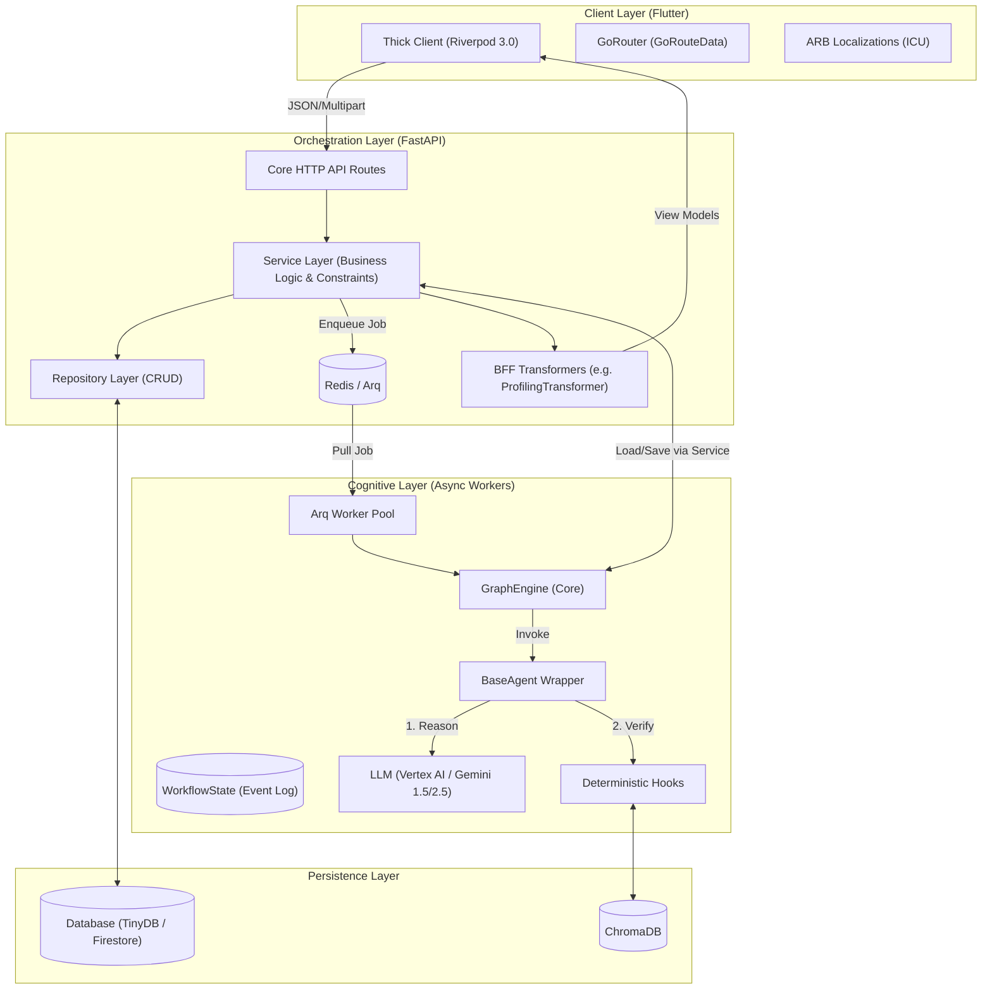

# System Architecture (V5.1 / Phase 9 Hardening)

**Status:** V5.1 Production Standard (2026)
**Core Philosophy:** "Zero-Magic" Modular Async Monolith with Clean Architecture

Cognitive Quorum V5.1 is a deterministic, highly verifiable AI orchestration platform. Its fundamental objective is to solve the inherent unpredictability (stochasticity) of Large Language Models (LLMs) by constraining them within a strict, deterministic software straitjacket. It strictly enforces separation of concerns through Domain APIs, Service/Repository layers, and a "Dumb" Server-Driven UI (SDUI) frontend.

### The "Mind" vs. "The Spine" (Separation of Cognition and Execution)
The system fundamentally separates "intelligence" from "muscle":
* **"The Mind" (Cognitive Layer):** System rules, prompts, strategies, and grading matrices (BARS) are decoupled from code. They live purely as configuration data in the JSON database (`seed_data.json`).
* **"The Spine" (Execution Layer):** The Python-based workflow engine (`GraphEngine`) contains no inherent "cognitive intelligence". It serves purely as a deterministic orchestrator, reading rules from the database and forcefully routing data through the system.

## 0. Key Architectural Upgrades (Phase 9 Hardening)
* **The Strict DTO Pattern (Type Safety & "Air Gap")**: Pydantic V2 models (`ConfigDict(strict=True, extra="ignore")`) are the absolute source of truth for all data entering or leaving the system. No loose dictionaries are passed internally.
* **Fail-Fast Protocol (RFC 7807 & Zero-Fallback)**: The system never uses `try-except pass` to silence errors or guess default values. If an entity is missing, data is malformed, or relations are violated, the Service layer immediately raises an `AppException` (Fail-Fast), which the global handler formats as RFC 7807 problem details.
* **Database-to-Agent Schema Synchronization**: The `inputs` bindings configured in the SSOT JSON database are statically validated against Python Pydantic Models via CI/CD test gates. This guarantees runtime engine hydration will never encounter drift-induced structural mismatch errors.
* **BFF Transformers (SDUI)**: The frontend is strictly a rendering layer. Complex domain models are mapped into exact View Models (`ToulminDisplay`, `DriverProfileDisplay`) via dedicated Transformers (e.g., `LogicDomainTransformer`, `ProfilingTransformer`).
* **I18N No-String Mandate**: No translated strings are ever passed from the backend, except native LLM free-text. All UI texts use backend-provided Enums/Keys, mapped to ICU-formatted strings in Flutter `.arb` files.

---

## 1. High-Level Architecture

The system decouples fast user interactions from slow cognitive reasoning tasks.

```mermaid
graph TD
    subgraph "Client Layer (Flutter)"
        App["Thick Client (Riverpod 3.0)"]
        Router["GoRouter (GoRouteData)"]
        L10N["ARB Localizations (ICU)"]
    end

    subgraph "Orchestration Layer (FastAPI)"
        API["Core HTTP API Routes"]
        Service["Service Layer (Business Logic & Constraints)"]
        Repo["Repository Layer (CRUD)"]
        BFF["BFF Transformers (e.g. ProfilingTransformer)"]
        Queue[(Redis / Arq)]
    end

    subgraph "Cognitive Layer (Async Workers)"
        Worker["Arq Worker Pool"]
        Engine["GraphEngine (Core)"]
        State[("WorkflowState (Event Log)")]
        
        Engine -->|Invoke| Agent["BaseAgent Wrapper"]
        Agent -->|1. Reason| LLM["LLM (Vertex AI / Gemini 1.5/2.5)"]
        Agent -->|2. Verify| Hooks["Deterministic Hooks"]
    end

    subgraph "Persistence Layer"
        DB[("Database (TinyDB / Firestore)")]
        VectorDB[("ChromaDB")]
    end

    App -->|JSON/Multipart| API
    API --> Service
    Service --> Repo
    Service -->|Enqueue Job| Queue
    Repo <--> DB
    Queue -->|Pull Job| Worker
    Worker --> Engine
    Engine <-->|Load/Save via Service| Service
    Hooks <--> VectorDB
    Service --> BFF
    BFF -->|View Models| App
```

---

## 2. Core Components Analysis

### A. The "Spine" (Execution Engine & State Management)
* **Location**: `backend/core/engine.py` (Class: `GraphEngine`)
* **Role**: The deterministic runtime that loads definitions and executes steps based on the Single Source of Truth (`seed_data.json`).
* **Hybrid State Architecture**: 
  1. **Event Sourcing (Truth)**: `WorkflowState.execution_trace` is an append-only log of immutable `TraceEvent` objects, providing a perfect audit trail and enabling time-travel debugging.
  2. **Blackboard Snapshot (Performance)**: `WorkflowState.context_variables` maintains a mutable projection of the current state for high-performance read access by agents via `state.get_context(model=Model)`.
* **Centralized Hook Mapping**: All execution hooks (e.g., scoring, integrity checks) are explicitly registered in `engine.py:HOOK_MAPPING`. "Magic" plugin discovery is explicitly avoided for readability and debuggability.

### B. The API & Service Layers (Strict SSOT)
* **System Routes** (`backend/api/routes/*.py`): Extremely thin wrappers. They ONLY parse HTTP input, inject dependencies, and call the Service layer.
* **Service Layer**: The absolute gatekeeper. Enforces validation, relations (e.g., preventing deletion of active components), and constructs `AppException`s on failure.
* **BFF Transformers**: Take heavy aggregate Domain models (e.g. `ProfilerOutput`) and map them to lean, UI-ready `Display` models with strict Enum keys.

### C. The Agent Graph & Strict DTO (The "Air Gap")
* **Location**: `backend/agents/`
* **Pattern**: Subclasses of a unified `BaseAgent` with explicit `InputModels` (e.g., `JudgeInput`) validated before invocation to eliminate runtime `AttributeError`s.
* **Instructor-Based Structured Output**: The system natively enforces schemas via three layers: `instructor` wraps LiteLLM to enforce Pydantic at the API level, `tenacity` handles transient network errors, and Strict Validation on the agent side fails fast if the schema is violated.
* **Reasoning Token Continuity ("Memory")**: To prevent LLM amnesia between steps, "Hidden Thinking" tokens (e.g., Gemini 1.5 Thinking) are explicitly extracted and passed to downstream agents via `state.reasoning_context`.
* **High-Fidelity Matrix Formatting**: `PromptBuilder` and `MatrixFormatter` enforce strict BARS (Behaviorally Anchored Rating Scales) formatting. Matrices are converted to detailed Markdown rubrics with explicit anchor-to-scale mapping logic to ensure precise LLM adherence to grading criteria.

### D. Performance Optimization: Panel Fusion (Courtroom 3.0)
To avoid the high latency and cost of running specialized agents (e.g., Logician, Falsifier, Profiler) in a sequential chain, V5.1 introduces Panel Fusion:
* **Fused Panel**: A single, complex LLM call (e.g., Gemini 2.5 Pro) encompasses the roles of multiple experts simultaneously within a massive JSON response.
* **Fan-Out (Blackboard)**: The engine extracts the individual expert results from the fused response and stores them in distinct keys on the state blackboard (`step_logician`, `step_falsifier`). Downstream agents (like the Judge) consume these as if they came from separate, independent agents, drastically reducing latency without breaking modularity.

### E. The "Hand" (Async Worker & Distributed Sync Loop)
* **Location**: `backend/worker.py`
* **Distributed Sync Loop**: The system solves the "Long-Running AI" problem via a detached execution loop:
  1. **Ingest**: `POST /execution` pushes a job to Redis -> `202 Accepted`.
  2. **Pickup**: Arq Worker picks up the job.
  3. **Hydrate**: `GraphEngine` loads the full `WorkflowState` from the DB.
  4. **Execute**: The Agent executes (handling 10s - 15m deep reasoning delays seamlessly).
  5. **Persist**: Engine saves the updated state.
  6. **Polling**: Flutter client polls the DB for changes.
* **Timeout Decoupling**: Standard HTTP timeouts (60s) are bypassed. Workers can process massive reasoning chains without client connection drops.
* **Diagnostics**: For critical debugging, workers can dump the full `WorkflowState` to a local file (`debug_output_*.json`) as a standalone "Black Box" recording.

### F. The "Face" (Flutter Client)
* **Location**: `client_app/`
* **Architecture**: Riverpod 3.0 `AsyncNotifier` Matrix pattern. No large `Future.wait` monoliths.
* **BFF/UI Resilience (Dual-Reporting)**: The frontend gracefully degrades (e.g., a missing widget gracefully collapses using `SizedBox.shrink()`) without crashing the screen, logging a `🔴 UI GRACEFUL DEGRADATION` warning for developer visibility.

---

## 3. Information Retrieval & 3-Tier Grounding (Anti-Hallucination)

To prevent LLM confirmation bias and fabricated facts, information retrieval is rigidly structured into three phases:
1. **Proactive Search (Analyst Hypothesis Search)**: An Analyst agent formulates hypotheses, triggering an independent pre-hook to perform internet-wide Vertex AI searches *before* the final text is generated.
2. **Real-Time Fact-Checking (Dynamic Vertex Grounding)**: Heavy LLM models cross-reference their own text generation in real-time with Google Search, injecting precise URL citations directly into the output.
3. **Post-Hoc Compliance (Internal Knowledge Base)**: At the end of the execution chain, an asynchronous process scans the generated text against internal organizational documents (e.g., brand guidelines) in a vector database to flag any policy violations.

---

## 4. Data & Persistence Strategy

### Primary Store: Unified Service/Repository Pattern ("No-ORM")
* **Interface**: `backend/database/repository.py`
* **StorageDriver**: Unifies differences between local (TinyDB) and production (Firestore) environments. The system completely rejects traditional ORMs (SQLAlchemy/Prisma).
* **Concurrency**: Database bottlenecks and race conditions are mitigated via "Optimistic Locking" (`version` field) and efficient selective updates.
* **SSOT Principle**: Pydantic V2 models act as the single source of truth for interfaces, storage structure, and validation. Scripts, APIs, and Async workers must universally go through the Service/Repository layer. Direct DB driver calls outside repositories are strictly forbidden.
* **Static Schema Synchronization**: Because workflows are dynamically defined in JSON (`seed_data.json`), CI/CD pipelines use set-math to statically synchronize the JSON definitions with Python's Pydantic models. This ensures code and database never drift apart.

### Schema Enforcement & Hook Hardening
* **Pydantic V2**: `ConfigDict(strict=True, extra="ignore")`. The schema is the absolute law.
* **Strict Enums**: Categorical data (Risk, UI localization keys like `BIAS_DETECTED`) must use Enums defined in `backend/models/enums.py`. Fuzzy string matching is strictly forbidden.
* **Hook Hardening**: `scoring.py`, `validation.py`, and `integrity.py` actively reject invalid logic (e.g., negative/zero scores are clamped `max(score, scale_min)`, and citation keys are verified against the actual bibliography).

---

## 5. Security, Compliance & I18N

### Identity & Access Management (IAM)
* **Multi-Tenancy**: Operations are scoped by `organization_id`.
* **Relational Integrity**: `root` users cannot be deleted. Resources in use cannot be soft-deleted without erroring explicitly.

### I18N (Internationalization) & Reporting Parity
* Enforced No-String rule across the boundary. Translatable concepts are passed as Enum keys.
* Frontend `.arb` files strictly own the presentation and ICU-formatted pluralizations.
* **Reporting Parity**: The exact same BFF data transformer is used to feed both the UI display and the downloadable PDF report generator. This guarantees 100% visual and logical consistency between all presentation formats.

---

## 6. Testing & Verification Philosophy

* **Backend**: Uses `pytest` and `unittest.mock` (strictly offline; no external network calls permitted during tests).
* **Frontend**: Uses `flutter_test` and `mocktail` (no code-generation mocks allowed).
* **Core Philosophy**: "Fail Fast". If the DB schema doesn't match the Pydantic model, or if a Matrix cannot be formatted correctly for the LLM, tests fail immediately rather than risking corrupted data at runtime.

---

## 7. Technology Stack (V5.1 Locked)

| Component | Technology | Version | Purpose |
| :--- | :--- | :--- | :--- |
| **Backend** | Python | 3.14+ | Core Logic (Async) |
| **Web Framework** | FastAPI | 0.115+ | REST API & OpenAPI Gen |
| **Validation** | Pydantic | 2.0+ | Strict Data parsing |
| **Worker** | Arq | 0.26+ | Job Queue |
| **Frontend** | Flutter | 3.27+ | UI / Client |
| **State Mgmt** | Riverpod | 3.0+ | Generators & AsyncNotifiers |
| **Routing** | GoRouter | 14.0+ | GoRouteData strictly |
| **LLM** | Vertex AI / LiteLLM | Gemini 1.5/2.5 | Cognitive Engine |