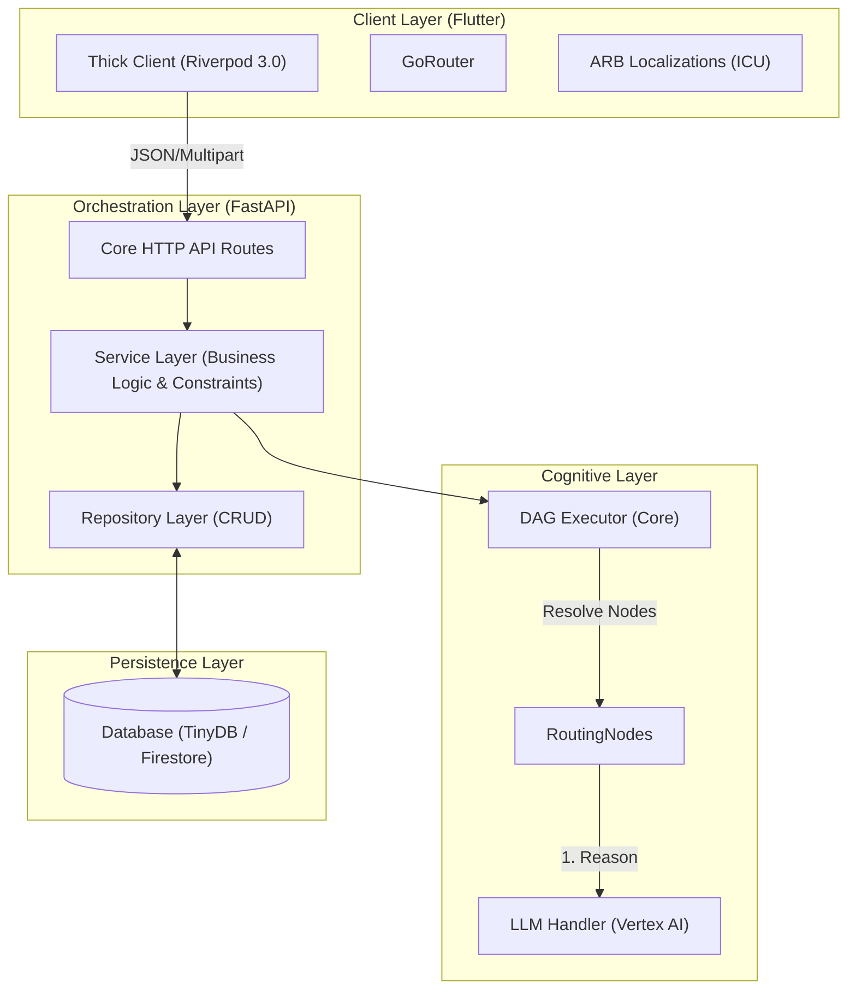

# System Architecture (V2.5)

**Status:** Enterprise V2 / V2.5 Production Standard (2026)
**Core Philosophy:** Zero-Deploy, SDUI & "Zero-Magic" Modular Async Monolith

Cognitive Quorum V2 is a deterministic, highly verifiable, and 100% auditable AI orchestration platform. It shifts cognitive business logic, data routing, and UI rendering rules entirely into the database (Zero-Deploy). Its fundamental objective is to solve the inherent unpredictability (stochasticity) of Large Language Models (LLMs) by constraining them within a strict, deterministic software straitjacket. It strictly enforces separation of concerns through Domain APIs, Service/Repository layers, and a "Dumb" Server-Driven UI (SDUI) frontend.

### The "Mind" vs. "The Spine" (Separation of Cognition and Execution)
The system fundamentally separates "intelligence" from "muscle":
* **"The Mind" (Cognitive Layer):** System rules, prompts, strategies, and grading matrices (PromptBlocks) are decoupled from code. They live purely as configuration data in the JSON database (`seed_data.json`).
* **"The Spine" (Execution Layer):** The Python-based workflow engine (`GraphEngine`) contains no inherent "cognitive intelligence". It serves purely as a deterministic orchestrator, reading rules from the database and forcefully routing data through the system.

## 0. Key Architectural Upgrades (V2)
* **The Strict DTO Pattern (Type Safety & "Air Gap")**: Pydantic V2 models (`ConfigDict(strict=True, extra="ignore")`) are the absolute source of truth for all data entering or leaving the system. No loose dictionaries are passed internally.
* **Fail-Fast Protocol (RFC 7807 & Zero-Fallback)**: The system never uses `try-except pass` to silence errors or guess default values. If an entity is missing, data is malformed, or relations are violated, the Service layer immediately raises an `AppException` (Fail-Fast).
* **Polymorphic PromptBlocks**: Legacy text components, evaluation matrices, and hooks are now unified under a single strict model (`PromptBlock`). This reduces API surface area while maximizing cognitive routing flexibility.
* **Model Registry (Global Configs)**: Intelligence tiers (`fast`, `deep`) are decoupled from agents and stored in the database's `system_config`. Changing an underlying cloud model does not require a code deploy.
* **Unified UI State (Freezed/Riverpod)**: The frontend embraces Dart `freezed` models and Riverpod `AsyncNotifier` for absolutely robust, immutable state management that strictly mirrors the backend API schemas.

---

## 1. High-Level Architecture

The system decouples fast user interactions from slow cognitive reasoning tasks.

```mermaid
graph TD
    subgraph "Client Layer (Flutter)"
        App["Thick Client (Riverpod 3.0)"]
        Router["GoRouter"]
        L10N["ARB Localizations (ICU)"]
    end

    subgraph "Orchestration Layer (FastAPI)"
        API["Core HTTP API Routes"]
        Service["Service Layer (Business Logic & Constraints)"]
        Repo["Repository Layer (CRUD)"]
    end

    subgraph "Cognitive Layer"
        Engine["DAG Executor (Core)"]
        
        Engine -->|Resolve Nodes| Nodes["RoutingNodes"]
        Nodes -->|1. Reason| LLM["LLM Handler (Vertex AI)"]
    end

    subgraph "Persistence Layer"
        DB[("Database (TinyDB / Firestore)")]
    end

    App -->|JSON/Multipart| API
    API --> Service
    Service --> Repo
    Repo <--> DB
    Service --> Engine
```

---

## 2. Core Components Analysis

### A. The "Spine" (Execution Engine)
* **Role**: The deterministic runtime that loads definitions and executes steps based on the Single Source of Truth (`seed_data.json`).
* **DAG Execution (Topological Sort)**: Workflows define dependencies between `RoutingNodes`. The DAG Executor resolves these dependencies and executes nodes sequentially or in parallel where supported.

### B. The API & Service Layers (Strict SSOT)
* **System Routes** (`backend_v2/api/routers/*.py`): Extremely thin wrappers. They ONLY parse HTTP input, inject dependencies, and call the Service layer.
* **Service Layer**: The absolute gatekeeper. Enforces validation, relations (e.g., preventing deletion of active components), and constructs `AppException`s on failure.

### C. PromptBlocks and Semantic Context
* **Location**: `backend_v2/models/v2_core.py`
* **Theory-Grounded XAI**: Blocks strictly bind to external theory sources (URLs). The system feeds this to the LLM, forcing the AI to provide a numeric score, a multilingual justification, and a precise citation to that exact source.

---

## 3. Data & Persistence Strategy

### Primary Store: Unified Service/Repository Pattern ("No-ORM")
* **Interface**: `backend_v2/database/repository.py`
* **StorageDriver**: Unifies differences between local (TinyDB) and production (Firestore) environments. The system completely rejects traditional ORMs.
* **SSOT Principle**: Pydantic V2 models act as the single source of truth for interfaces, storage structure, and validation. Scripts, APIs, and Async workers must universally go through the Service/Repository layer. Direct DB driver calls outside repositories are strictly forbidden.

### Schema Enforcement & Validation
* **Pydantic V2**: `ConfigDict(strict=True, extra="ignore")`. The schema is the absolute law.
* **Migration Scripts**: Database schema evolution is driven explicitly by `migrate_v1_to_v2.py`, moving legacy structures into the unified V2 architectures (e.g., converting legacy arrays of step strings into proper `RoutingNode` DAG networks).

---

## 4. Security, Compliance & I18N

### Identity & Access Management (IAM)
* **Tenant Isolation**: Operations are rigorously scoped by `organization_id` injected at the Service layer.
* **Relational Integrity**: Deletion of Core Blocks (PromptBlocks) fails-fast with an HTTP 400 if they are still structurally linked to a Step (`TaskBlueprint`).

### I18N (Internationalization) & SDUI
* Frontend respects the multi-lingual `I18nText` object sent by the backend. It uses a defensive rendering strategy (`SafeCast`) to read from `translations['fi']` or fallback to `default_locale`.

---

## 5. Technology Stack (V2 Locked)

| Component | Technology | Version | Purpose |
| :--- | :--- | :--- | :--- |
| **Backend** | Python | 3.12+ | Core Logic (Async) |
| **Web Framework** | FastAPI | 0.115+ | REST API & OpenAPI Gen |
| **Validation** | Pydantic | 2.0+ | Strict Data parsing |
| **Frontend** | Flutter | 3.27+ | UI / Client |
| **State Mgmt** | Riverpod | 3.0+ | AsyncNotifiers |
| **LLM** | Vertex AI | Gemini 2.5 | Cognitive Engine |