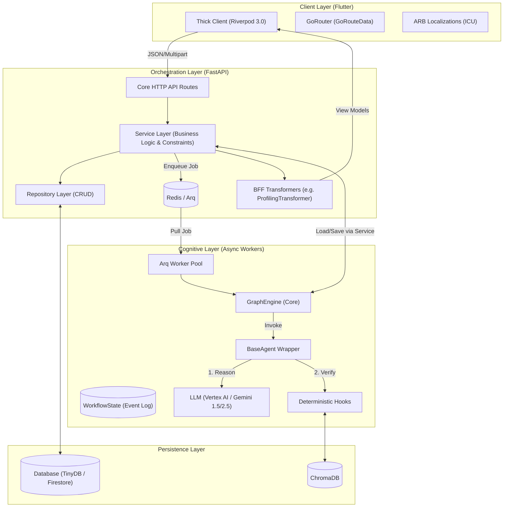

# System Architecture (V5.1 / Phase 9 Hardening)

**Status:** V5.1 Production Standard (2026)
**Core Philosophy:** "Zero-Magic" Modular Async Monolith with Clean Architecture

Cognitive Quorum V5.1 is a deterministic, highly verifiable AI orchestration platform. It strictly enforces separation of concerns through Domain APIs, Service/Repository layers, and a "Dumb" Server-Driven UI (SDUI) frontend.

## 0. Key Architectural Upgrades (Phase 9 Hardening)
* **The Strict DTO Pattern (Type Safety)**: Pydantic V2 models (`ConfigDict(strict=True, extra="ignore")`) are the absolute source of truth for all data entering or leaving the system. No loose dictionaries are passed internally.
* **Fail-Fast Protocol (RFC 7807)**: The system never uses `try-except pass` to silence errors. If an entity is missing or relations are violated, the Service layer immediately raises an `AppException`, which the global exception handler formats as RFC 7807 problem details.
* **Database-to-Agent Schema Synchronization**: The `inputs` bindings configured in the SSOT JSON database are statically validated against Python Pydantic Models via CI/CD test gates. This guarantees runtime engine hydration will never encounter drift-induced structural mismatch errors.
* **BFF Transformers (SDUI)**: The frontend is strictly a rendering layer. Complex domain models are mapped into exact View Models (`ToulminDisplay`, `DriverProfileDisplay`) via dedicated Transformers (e.g., `LogicDomainTransformer`, `ProfilingTransformer`).
* **I18N No-String Mandate**: No translated strings are ever passed from the backend, except native LLM free-text. All UI texts use backend-provided Enums/Keys, mapped to ICU-formatted strings in Flutter `.arb` files.

---

## 1. High-Level Architecture

The system decouples fast user interactions from slow cognitive reasoning tasks.

```mermaid
graph TD
    subgraph "Client Layer (Flutter)"
        App["Thick Client (Riverpod 3.0)"]
        Router["GoRouter (GoRouteData)"]
        L10N["ARB Localizations (ICU)"]
    end

    subgraph "Orchestration Layer (FastAPI)"
        API["Core HTTP API Routes"]
        Service["Service Layer (Business Logic & Constraints)"]
        Repo["Repository Layer (CRUD)"]
        BFF["BFF Transformers (e.g. ProfilingTransformer)"]
        Queue[(Redis / Arq)]
    end

    subgraph "Cognitive Layer (Async Workers)"
        Worker["Arq Worker Pool"]
        Engine["GraphEngine (Core)"]
        State[("WorkflowState (Event Log)")]
        
        Engine -->|Invoke| Agent["BaseAgent Wrapper"]
        Agent -->|1. Reason| LLM["LLM (Vertex AI / Gemini 1.5/2.5)"]
        Agent -->|2. Verify| Hooks["Deterministic Hooks"]
    end

    subgraph "Persistence Layer"
        DB[("Database (TinyDB / Firestore)")]
        VectorDB[("ChromaDB")]
    end

    App -->|JSON/Multipart| API
    API --> Service
    Service --> Repo
    Service -->|Enqueue Job| Queue
    Repo <--> DB
    Queue -->|Pull Job| Worker
    Worker --> Engine
    Engine <-->|Load/Save via Service| Service
    Hooks <--> VectorDB
    Service --> BFF
    BFF -->|View Models| App
```

---

## 2. Core Components Analysis

### A. The "Spine" (Execution Engine)
* **Location**: `backend/core/engine.py` (Class: `GraphEngine`)
* **Role**: The deterministic runtime that loads definitions and executes steps based on the Single Source of Truth (`seed_data.json`).

### B. The API & Service Layers (Strict SSOT)
* **System Routes** (`backend/api/routes/*.py`): Extremely thin wrappers. They ONLY parse HTTP input, inject dependencies, and call the Service layer.
* **Service Layer**: The absolute gatekeeper. Enforces validation, relations (e.g., preventing deletion of active components), and constructs `AppException`s on failure.
* **BFF Transformers**: Take heavy aggregate Domain models (e.g. `ProfilerOutput`) and map them to lean, UI-ready `Display` models with strict Enum keys.

### C. The "Mind" (Agent Graph & Strict DTO)
* **Location**: `backend/agents/`
* **Pattern**: Subclasses of a unified `BaseAgent`.
* **Behavior**: Agents are stateless. The LLM exclusively generates pure **Data Transfer Objects (DTOs)**. The Agent's Python wrapper strictly validates this via Pydantic V2 before injecting system properties to promote the DTO into a fully hydrated **Domain Model**. Deterministic logic (sorting, ID generation) belongs in Python, never the LLM.

### D. The "Hand" (Async Worker)
* **Location**: `backend/worker.py`
* **Tech**: `arq` (Redis-based).
* **Resilience**: Workers are stateless and interact exclusively through the core Service/Repository API, never bypassing it for database access.

### E. The "Face" (Flutter Client)
* **Location**: `client_app/`
* **Architecture**: Riverpod 3.0 `AsyncNotifier` Matrix pattern. No large `Future.wait` monoliths.
* **BFF/UI Resilience (Dual-Reporting)**: The frontend gracefully degrades (e.g., a missing widget gracefully collapses using `SizedBox.shrink()`) without crashing the screen, logging a `🔴 UI GRACEFUL DEGRADATION` warning for developer visibility.

---

## 3. Data & Persistence Strategy

### Primary Store: Unified Service/Repository Pattern
* **Interface**: `backend/database/repository.py`
* **StorageDriver**: Unifies differences between local (TinyDB) and production (Firestore) environments.
* **SSOT Principle**: Scripts, APIs, and Async Workers must universally go through the Service/Repository layer to access data. Direct DB driver calls outside repositories are strictly forbidden.

### Schema Enforcement
* **Pydantic V2**: `ConfigDict(strict=True, extra="ignore")`. The schema is the absolute law.
* **Strict Enums**: Categorical data (Risk, UI localization keys like `BIAS_DETECTED`) must use Enums defined in `backend/models/enums.py`. Fuzzy string matching is strictly forbidden.

---

## 4. Security, Compliance & I18N

### Identity & Access Management (IAM)
* **Multi-Tenancy**: Operations are scoped by `organization_id`.
* **Relational Integrity**: `root` users cannot be deleted. Resources in use cannot be soft-deleted without erroring explicitly.

### I18N (Internationalization)
* Enforced No-String rule across the boundary. Translatable concepts are passed as Enum keys.
* Frontend `.arb` files strictly own the presentation and ICU-formatted pluralizations.

---

## 5. Technology Stack (V5.1 Locked)

| Component | Technology | Version | Purpose |
| :--- | :--- | :--- | :--- |
| **Backend** | Python | 3.14+ | Core Logic (Async) |
| **Web Framework** | FastAPI | 0.115+ | REST API & OpenAPI Gen |
| **Validation** | Pydantic | 2.0+ | Strict Data parsing |
| **Worker** | Arq | 0.26+ | Job Queue |
| **Frontend** | Flutter | 3.27+ | UI / Client |
| **State Mgmt** | Riverpod | 3.0+ | Generators & AsyncNotifiers |
| **Routing** | GoRouter | 14.0+ | GoRouteData strictly |
| **LLM** | Vertex AI / LiteLLM | Gemini 1.5/2.5 | Cognitive Engine |