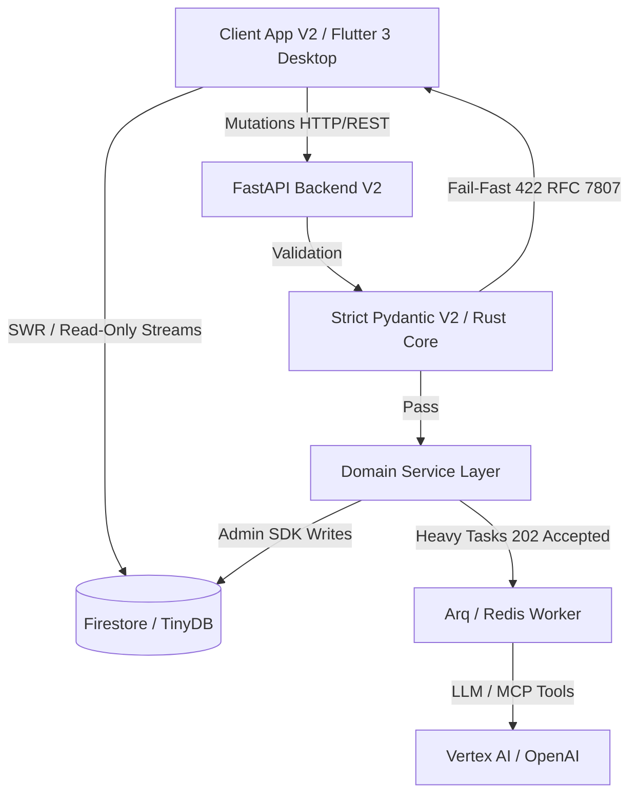

# 00: Järjestelmäkonteksti ja Executive Summary (C4)

> [!IMPORTANT]
> **TIUKKA ARKKITEHTUURIMALLI (FAIL-FAST & STRICT SCHEMA)**
> Tämä dokumentaatio kuvaa järjestelmän nykytilaa, joka perustuu Pydantic V2 Strict -tilaan ja Flutter Freezed -malleihin. Arkkitehtuurissa ei sallita virheiden nielentää (try-except pass), implisiittisiä oletusarvoja tai luksumattomia tiedonsiirtoja. Järjestelmä nojaa "Fail-Fast" periaatteeseen, tiukkaan Opaque ID -reititykseen sekä Pydantic V2:n Rust-ytimeen perustuvaan nopeaan validointiin.

Cognitive Quorum on dynaaminen, litteä (Flat MVC) ja sataprosenttisesti auditoitava tekoälyorkestraattori B2B SaaS -ympäristöön.

## Ongelma ja Ratkaisu

**Ongelma (Mittaamisen kriisi):** Generatiivisen tekoälyn myötä tietotyö kohtaa laadullisen mittaamisen haasteen. Pelkkään yhteen monoliittiseen tekoälymalliin nojaaminen johtaa *myötäilyvinoumaan* (Sycophancy) sekä hallusinaatioihin. Yksittäinen tekoälymalli ei kykene itsenäisesti falsifioimaan omaa suoritustaan tai tunnistamaan loogisia syy-seuraus -virheitään monimutkaisissa prosesseissa.

**Ratkaisu (Moniagenttijärjestelmä - Quorum):** B2B SaaS -alusta, jonka avulla rakennetaan turvallisesti eristettyjä ja auditoitavia rinnakkaisia tekoälyketjuja (DAG - Directed Acyclic Graph). Järjestelmä hajauttaa tehtävät "Kognitiiviselle Kvoorumille" eri rooleihin (esim. Analyytikko, Falsifioija, Tuomari). Prosessi noudattaa systemaattista sokkoarviointia (Blind Audit), mikä takaa tulosten luotettavuuden (Reliability) asiantuntijuuden syvyydestä (Validity) tinkimättä.

### Loppukäyttäjät
Quorumin käyttäjäkunta jakautuu kahteen rooliin: asiantuntijat (Manager), jotka mallintavat joustavia tekoälyputkia graafisessa Workflow Studiossa täysin ilman koodia (No-Code), sekä tuotannon loppukäyttäjät (Member), jotka syöttävät järjestelmään aineistoa (esim. PDF-dokumentteja) ja saavat takaisin läpinäkyviä XAI-raportteja (Explainable AI).

## Brändisanasto (Glossary)

* **Quorum (Kognitiivinen Kvoorum):** Alustan metodologinen sydän. Koosteoppimisesta (Ensemble Learning) ja moniagenttidebatista syntyvä luotettavuus.
* **Blueprint:** Järjestelmän dynaaminen ohjausmalli, joka sitoo yhteen käyttöliittymän renderöintisäännöt ja backendin tekoälytulokset.
* **The Blind Audit (Kognitiivinen Riippumattomuus):** Agentit suoritetaan työnkuluissa sokkona. Ne eivät näe rinnakkaisten agenttien väliarvioita.
* **Fail-Fast:** Palvelin ei koskaan paikkaa puuttuvaa dataa oletusarvoilla, vaan kaatuu ja palauttaa RFC 7807 -standardin mukaisen virheen välittömästi.

## Arkkitehtuurin Ydinfilosofiat

1. **CQRS-malli (Read/Write Separation):** Flutter-käyttöliittymä on tietokannan suhteen täysin **Read-Only**. Kaikki mutaatiot (mukaan lukien asetuksien ja työnkulkujen muutokset) kulkevat keskitetysti Python FastAPI -backendin reitittimien kautta.
2. **Fail-Fast -periaate:** Niellyt virheet ja vaimennetut ohitukset (esim. puuttuvan datan paikkaaminen oletusarvoilla) ovat koodikannassa ehdottomasti kiellettyjä. Puuttuva tai virheellinen data aiheuttaa välittömän 400/422 -virheen (RFC 7807 Problem Details), estäen arkkitehtuurillisen mätänemisen.
3. **Strict Pydantic V2 & Flutter Freezed -pariteetti:** Backendin rajapinnat validoivat datan Pydanticin Ruoste-ytimeen perustuvalla `model_validate_json` -metodilla, torjuen tuntemattomat avaimet (`extra='forbid'`). Frontend purkaa saapuvan datan Riverpod Isolate -säikeissä yhtä tiukasti kiellettyjen avaimien säännöllä (`disallow_unrecognized_keys: true`).
4. **Taustaprosessointi (Asynkroninen Arq Worker):** Raskaat tekoälyajot (DAG-ketjut) eristetään synkronisesta HTTP-käsittelystä. Reititin palauttaa asiakkaalle välittömästi `202 Accepted`, ja työnkulkua ajetaan asynkronisessa Arq/Redis-taustajonossa.
5. **Kognitiivinen Riippumattomuus:** Tekoälyagentit eristetään (Blind Audit) toisistaan rinnakkaisissa työnkuluissa (Workflow ja HookStates), jotta vältetään ketjuuntuvat hallusinaatiot.
6. **Opaque Stripe ID -reititys:** Järjestelmän tietokanta-avaimet, Pydantic-relaatiot ja GoRouter-reititykset perustuvat puhtaasti järjestelmässä generoituihin Stripe-tyyppisiin tunnisteisiin (esim. `org_abc123`). Ihmisluettavia slugeja (kuten `/users/risto`) ei käytetä järjestelmän sisäisessä verkkologiikassa eikä Pydantic-malleissa.
