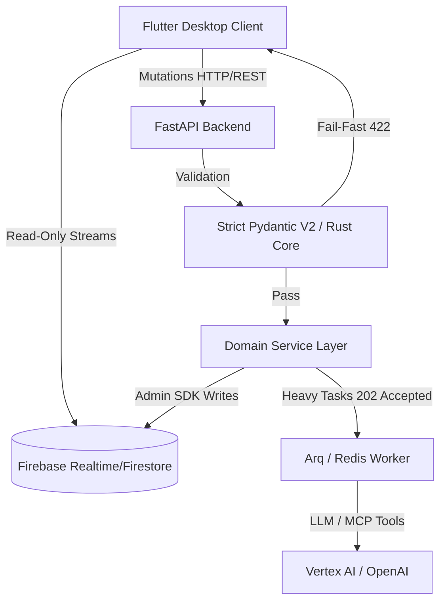

# 00: Järjestelmäkonteksti ja Executive Summary (C4)

> [!IMPORTANT]
> **PHASE 9 HARDENING & EPIC 10 SLUG ERADICATION ACTIVE**
> Tämä dokumentaatio edustaa Pydantic V2 Strict Nirvana & Flutter Freezed -kantaa. Kaikki vanhat jäänteet "try-except pass" peittelystä, luksumattomista tiedonsiirroista ja fallback-oletuksista ovat EHDOTTOMASTI KIELLETTY. Ainoa sallittu arkkitehtuuri on "Fail-Fast", tiukka Opaque ID -reititys (Slugien poisto) ja täydellinen Rust-core purku.

Cognitive Quorum (Enterprise V2.5) on dynaaminen, täysin litteä (Flat MVC) ja sataprosenttisesti auditoitava tekoälyorkestraattori B2B SaaS -ympäristöön.

## Ongelma ja Ratkaisu

**Ongelma (Mittaamisen kriisi):** Generatiivisen tekoälyn myötä tietotyö kohtaa laadullisen mittaamisen haasteen. Organisaatiot uittavat valtavia määriä arkaluontoista dataa perusmalleihin (GenAI), mutta pelkkään yhteen monoliittiseen tekoälymalliin nojaaminen johtaa *myötäilyvinoumaan* (Sycophancy) sekä hallusinaatioihin. Yksittäinen raskaasti pyörivä tekoälymalli on umpisokea falsifioimaan omaa suoritustaan tai tunnistamaan loogisia syy-seuraus -virheitään prosessin aikana.

**Ratkaisu (Quorum):** B2B SaaS -alusta, jonka avulla asiantuntijat rakentavat turvallisesti eristettyjä, sataprosenttisesti auditoitavia rinnakkaisia tekoälyketjuja (DAG - Directed Acyclic Graph). Järjestelmä hajauttaa työn "Kognitiiviselle Kvoorumille" (Moniagenttijärjestelmä / MAS). Tässä arkkitehtuurissa jättimäinen kognitiivinen työ pilkotaan riippumattomiin pikkuosiin (Analyytikko, Falsifioija, Tuomari). Täten prosessi pakotetaan noudattamaan tieteellisistä menetelmistä lainattua systemaattista falsifiointia, jolla varmistetaan luotettavuus (Reliability) ilman, että menetetään asiantuntijuuden syvyyttä (Validity).

### Loppukäyttäjät
Ensisijaisena kohderyhmänä ovat yritysten substanssiasiantuntijat (Manager-rooli), jotka piirtävät joustavia AI-putkia graafisessa Workflow Studiossa täysin ilman koodausosaamista (No-Code), sekä tuotannon loppukäyttäjät (Member), jotka ajavat järjestelmään satojen sivujen PDF-materiaaleja saadakseen takaisin läpinäkyviä XAI-raportteja (Explainable AI).

## Brändisanasto (Glossary)

* **Quorum (Kognitiivinen Kvoorum):** Alustan metodologinen sydän. Koosteoppimisesta (Ensemble Learning) ja moniagenttidebatista syntyvä luotettavuus.
* **Blueprint Service (Step):** Järjestelmän atomaarinen rakennuspalikka, joka kapseloi tehtävän, System Promptit ja tiukat Pydantic-dataskemat.
* **The Blind Audit (Kognitiivinen Riippumattomuus):** Agentit suoritetaan työnkuluissa sokkona. Ne eivät näe rinnakkaisten agenttien väliarvioita.
* **Fail-Fast (Zero-Compromise Pledge):** Palvelin ei koskaan paikkaa puuttuvaa dataa oletusarvoilla, vaan kaatuu ja heittää RFC 7807 -virheen välittömästi.
* **Hybridirubriikki:** Arvioinnin viitekehys, missä Strict DTO Schema takaa toistettavuuden, ja agenttiverkko Validityn.

## Arkkitehtuurin Ydinfilosofiat (2026 Mandates)

1. **Firebase CQRS (Read/Write Separation):** Flutter-käyttöliittymä on tietokannan suhteen täysin **Read-Only**. Kaikki mutaatiot kulkevat Python FastAPI -backendin kautta.
2. **The Zero-Compromise Pledges (Fail-Fast):** Niellyt virheet (`try-except pass`) ja vaimennetut ohitukset (`score = 0.0`) ovat kiellettyjä. Jos tieto puuttuu, API nostaa välittömästi `AppException(RFC 7807)`. Taaksepäinyhteensopivuutta ei tueta arkkitehtuurivirheiden kustannuksella.
3. **Strict Pydantic V2 & Flutter Freezed Parity:** Backendin data puretaan `model_validate_json`, ja Frontend pääsee "Strict Nirvanaan" kieltämällä kaikki tuntemattomat avaimet (`disallow_unrecognized_keys: true`).
4. **Background Workers (The Arq Mandate):** Raskaat DAG-ketjut siirretään välittömästi `Arq / Redis` taustajonoon palauttaen `202 Accepted`.
5. **Kognitiivinen Riippumattomuus (Anti-Mirror):** Tekoälyagentit varjellaan The Blind Audit -protokollalla muiden tuotoksilta.
6. **Opaque Stripe ID Mandate:** Yksikään tietokanna-avain ei saa yrittää olla ihmisluettava (esim. `org_[a-zA-Z0-9]{8,}`). URL-slugit ovat puhtaasti kosmeettisia ja API-hylkää ne lukuoperaatioissa.
