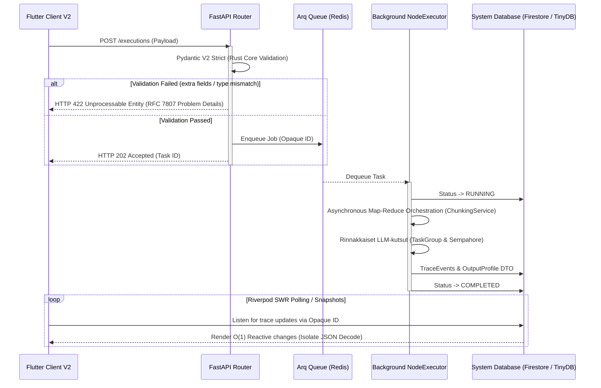

# 01: API-kerros ja Asynkroninen tapahtumahallinta (Core)

Cognitive Quorum rakentuu järeän asynkronisen Python 3.14 FastAPI -kerroksen ja tilattomien reitittimien varaan. Järjestelmä on optimoitu raskaiden tekoäly-DAG:ien käsittelyyn "Fire and Forget" -mallilla (rajapinnat palauttavat nopeasti 202 Accepted). Käyttöliittymä (Flutter) lukee tulokset ja tilamuutokset asynkronisesti erillisen synkronointimekanismin kautta (Firestore snapshots tai Riverpod polling).

## Asynkroninen tapahtumahallinta (Event-Driven Loop)

Kognitiivisesti raskaat tekoälyajot ja raporttien kääntämiset prosessoidaan API-kerroksen ulkopuolella taustalla. Alla oleva sekvenssikaavio havainnollistaa työnkulun asynkronisen elinkaaren ja Fail-Fast Pydantic -kardinaalisuojan:

1. **Optimistinen vastaanotto (FastAPI):** Kun asiakas lähettää suorituspyynnön, FastAPI delegoi raskaan työn Arq-taustajonolle (Redis) ja palauttaa välittömästi HTTP 202 -vastauksen.
2. **Taustaprosessointi ja Map-Reduce (Arq Worker):** Itsenäinen Worker-prosessi purkaa jonon. Mikäli käsiteltävänä on massiivinen määrä atomeja (kysymyksiä), se välitetään ohjaustasolla `ChunkingService`-komponentille. Järjestelmä orkestroi tiukat `SystemConcurrency.LLM_MAX_CHUNK_SIZE` -rajat (oletus 40) ja ajaa klusterin rinnakkain `asyncio.TaskGroup`- ja `Semaphore`-työkalujen avulla ilman pelkoa API-rajoihin osumisesta (Token Explosion). Kaikki kootaan deterministisesti yhteen tulokseen.
3. **Reaktiivinen UI-päivitys:** Käyttöliittymä kuuntelee tietokannan tapahtumia ja päivittää näkymät (esim. XAI-raportit) heti kun taustaprosessi on valmis ja tietokannan tila päivittyy arvoon `COMPLETED`.

## Hakemistorakenne: Kognition ja rajapintojen erotus

Koodikannassa ohjaustaso asuu vahvasti rajatuissa kansioissa. Tärkein sääntö on, että kognitio (LLM-kutsut, skoraus) ei saa siirtyä rajapintoihin, vaan routers-kerros on "aneeminen" (Anemic pattern).

### `backend_v2/api/routers/` (FastAPI Control Plane)
Ylin REST-rajapintakerros vastaa HTTP-pyyntöihin. Se pysäyttää virheellisen datan RFC 7807 -turvamuuriin (Pydantic ValidationError) ennen kuin se siirtää vastuun Services-kerrokselle.

- **`execution/`**: Työnkulkujen asynkronisten ajojen ominaisuudet, koostaen tiedostot `executions.py` (ajojen aloitus ja historian haku), `scorecard.py` (piste- ja diagnostiikkaraporttien koonti jäädytetyistä ajoista) sekä ajonaikaisen työnkulkujen kytkennän `workflows.py`.
- **`iam/`**: Identiteetin ja organisaatiotason hallinta (Tenant Isolation) tukeutuen tiedostoihin `auth.py`, `organizations.py` ja `users.py`.
- **`studio/`**: "Cognitive Studio" hallitsee suoraan arkkitehtuurisia Pydantic-rakennuspalikoita. Kansion alla elää koko dynaamisten Blueprinttien CRUD-operaatiot erillisinä tiedostoina: `prompt_blocks.py`, `steps.py` ja `workflows.py`, sekä järjestelmän fyysiset hallintareitittimet: `mcp_gateways.py`, `model_registry.py` ja `system_configs.py`.
- **`output_profiles.py`**: Yksittäinen reititintiedosto (ei kansio) tulostusprofiilien ja näkymien (SDUI) hallintaan.
- **`system/`**: Järjestelmän infrastruktuurioperaatiot tiedostoina, kuten terveystarkistukset (`health.py`) ja telemetria (`telemetry.py`). (Ohjelmalliset konfiguraatiot ovat täysin siirretty `studio/` -reitittimen alaisuuteen.)

### `backend_v2/core/` (Arkkitehtuuriresurssit)
Sisältää sovelluksen kriittisen asynkronisen infran ja rekisterit, jotka hallinnoivat järjestelmän toimintaa taustalla.
- **`hook_registry.py`**: Suorituksenaikaiset välityspalvelut (hooks), jotka vaikuttavat malleihin suorituksen aikana.
- **`registry.py`**: Universaali rekisteri (Workflow/Block mallien dynaaminen yhdistäjä).
- **`rate_limit.py` / `security.py`**: API:n tiukat rajoitteet ja tietoturvamääritykset (RateLimiter, CORS).

### The Entrypoint: `backend_v2/main.py`
Järjestelmän juurikäynnistäjä, joka sitoo arkkitehtuurin kasaan:
1. **Lifespan Management & Telemetry:** 
   - Ennen Arq-poolin alustamista sovellus käynnistää (importtaa) `backend_v2.hooks` -moduulin. Tämä lataa kaikki `@hook_trigger`-dekoraattorit muistiin reaaliaikaista Hook Registryn käyttöä varten (dynaaminen ajonaikainen kognitiomutaatio).
   - Alustaa Arq Redis -poolin (FakeRedis fallback-mekanismein) vikasietoisuuden takaajana.
   - Välittömästi FastAPI-applikaation luonnin jälkeen logfire instrumentoidaan `logfire.instrument_fastapi(app)` avulla, turvaten telemetrian kirjaamisen jo ennen middlewarejen käynnistystä ja "One Truth Error Protocol" -jäljitettävyyden takaamiseksi.
2. **Middlewaret:** `RequestIdMiddleware` mahdollistaa pyyntöjen jäljitettävyyden lokiketjuissa ja `LocalizationMiddleware` parsii asiakkaan kielen (Accept-Language) dynaamisia käännöksiä varten.
3. **Global Error Catchers:** Sieppaa kaikki järjestelmästä irtoavat Pydantic- ja domain-virheet ja asettaa ne ehdottomasti yhtenäiseen RFC 7807 "Problem Details" -JSON-muotoon. Näin "Fail-Fast" periaatteen mukainen suorituksen katkaiseminen näkyy standardoituna ohjelmistorajapinnassa.
