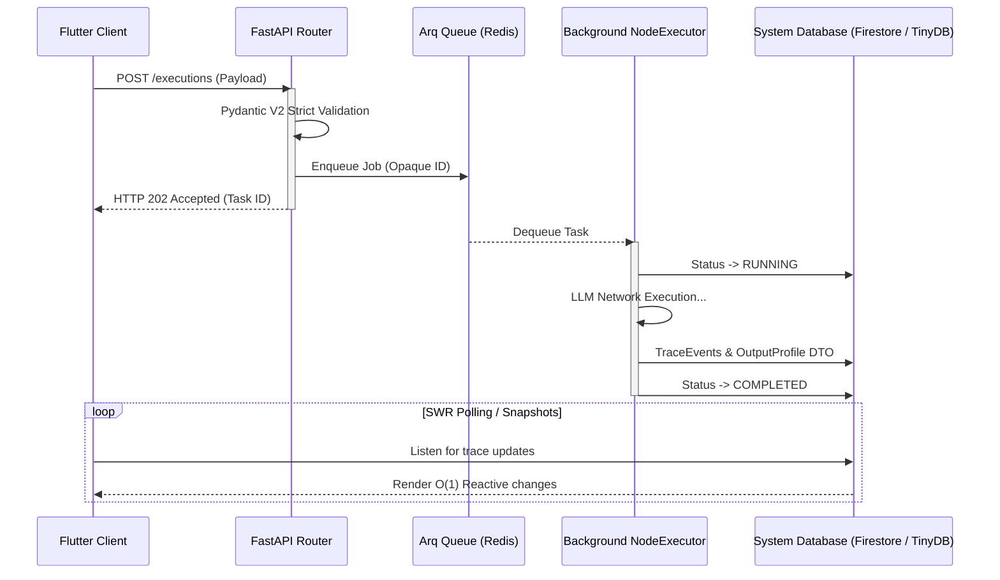

# 01: API-kerros ja Asynkroninen tapahtumahallinta (Core)

Cognitive Quorum rakentuu järeän asynkronisen Python FastAPI -kerroksen ja tilattomien reitittimien varaan. Järjestelmä on optimoitu raskaiden tekoäly-DAG:ien käsittelyyn "Fire and Forget" -mallilla (rajapinnat palauttavat nopeasti 202 Accepted). Käyttöliittymä (Flutter) lukee tulokset ja tilamuutokset asynkronisesti erillisen synkronointimekanismin kautta (Firestore snapshots).

## Asynkroninen tapahtumahallinta (Event-Driven Loop)

Kognitiivisesti raskaat tekoälyajot ja raporttien kääntämiset prosessoidaan API-kerroksen ulkopuolella taustalla. Alla oleva sekvenssikaavio havainnollistaa työnkulun asynkronisen "Fire and Forget" -elinkaaren:

1. **Optimistinen vastaanotto (FastAPI):** Kun asiakas lähettää suorituspyynnön, FastAPI delegoi raskaan työn Arq-taustajonolle (Redis) ja palauttaa välittömästi HTTP 202 -vastauksen.
2. **Taustaprosessointi (Arq Worker):** Itsenäinen Worker-prosessi purkaa jonon, suorittaa LLM-kutsut ja suorittaa atomisen tallennuksen (COMPLETED/FAILED) tietokantaan.
3. **Reaktiivinen UI-päivitys:** Käyttöliittymä kuuntelee tietokannan tapahtumia ja päivittää näkymät (esim. XAI-raportit) heti kun taustaprosessi on valmis.

## Hakemistorakenne: Kognition ja rajapintojen erotus

Koodikannassa ohjaustaso asuu vahvasti rajatuissa kansioissa. Tärkein sääntö on, että kognitio (LLM-kutsut, skoraus) ei saa siirtyä rajapintoihin, vaan routers-kerros on "aneeminen" (Anemic pattern).

### `backend_v2/api/routers/` (FastAPI Control Plane)
Ylin REST-rajapintakerros vastaa HTTP-pyyntöihin. Se pysäyttää virheellisen datan RFC 7807 -turvamuuriin (Pydantic ValidationError) ennen kuin se siirtää vastuun Services-kerrokselle.

Käytössä olevat reitittimet:
- **`execution/`**: Työnkulkujen (DAG) ajojen aloitus ja historian haku.
- **`iam/`**: Identiteetin, organisaatioiden (org) ja käyttäjäroolien mutaatiot.
- **`studio/`**: Graafisen työnkulkustudion rakenteiden CRUD -operaatiot.
- **`output_profiles/`**: Tulostusprofiilien hallinta.
- **`system/`**: Järjestelmän yleiset konfiguraatiot ja meta-operaatiot.

### `backend_v2/core/` (Arkkitehtuuriresurssit)
Sisältää sovelluksen kriittisen asynkronisen infran ja rekisterit, jotka hallinnoivat järjestelmän toimintaa taustalla.
- **`hook_registry.py`**: Suorituksenaikaiset välityspalvelut (hooks), jotka vaikuttavat malleihin suorituksen aikana.
- **`registry.py`**: Universaali rekisteri (Workflow/Block mallien dynaaminen yhdistäjä).
- **`rate_limit.py` / `security.py`**: API:n tiukat rajoitteet ja tietoturvamääritykset (RateLimiter, CORS).

### The Entrypoint: `backend_v2/main.py`
Järjestelmän juurikäynnistäjä, joka sitoo arkkitehtuurin kasaan:
1. **Lifespan Management:** Kytkee Redis-jonot (Arq) ja lokituksen (Logfire/Python Logger) päälle.
2. **Middlewaret:** `RequestIdMiddleware` mahdollistaa pyyntöjen jäljitettävyyden lokiketjuissa ja `LocalizationMiddleware` parsii asiakkaan kielen (Accept-Language) dynaamisia käännöksiä varten.
3. **Global Error Catchers:** Sieppaa kaikki järjestelmästä irtoavat Pydantic- ja domain-virheet ja asettaa ne ehdottomasti yhtenäiseen RFC 7807 "Problem Details" -JSON-muotoon. Näin "Fail-Fast" periaatteen mukainen suorituksen katkaiseminen näkyy standardoituna ohjelmistorajapinnassa.
