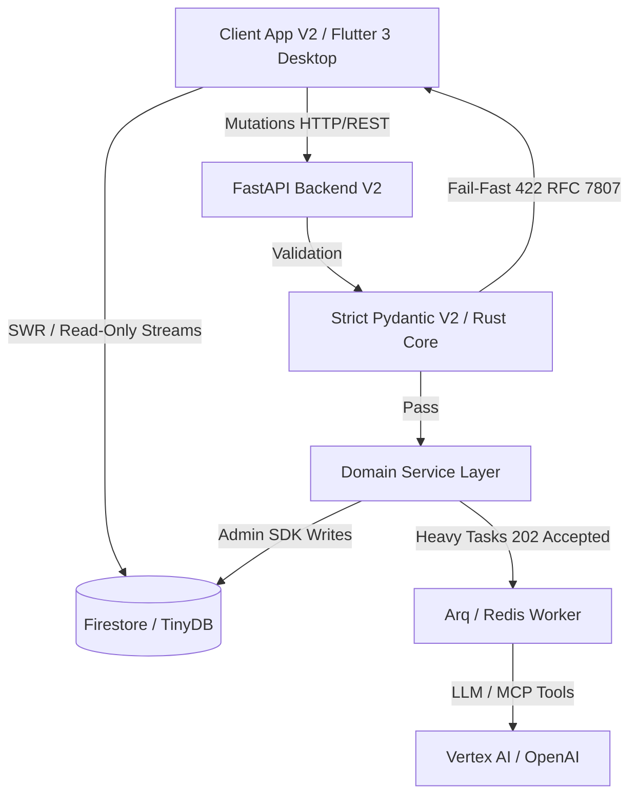

# 01: Executive Summary & Engine Philosophy

> [!IMPORTANT]
> **TIUKKA ARKKITEHTUURIMALLI (FAIL-FAST & STRICT SCHEMA)**
> Tämä dokumentaatio kuvaa järjestelmän nykytilaa, joka perustuu Pydantic V2 Strict -tilaan ja Flutter Freezed -malleihin. Arkkitehtuurissa ei sallita virheiden nielentää (try-except pass), implisiittisiä oletusarvoja tai luksumattomia tiedonsiirtoja. Järjestelmä nojaa "Fail-Fast" periaatteeseen, tiukkaan Opaque ID -reititykseen sekä Pydantic V2:n Rust-ytimeen perustuvaan nopeaan validointiin.

Cognitive Quorum on dynaaminen, Feature-First (Flutter) ja Strict Async Monolith (FastAPI) arkkitehtuuriin pohjautuva, sataprosenttisesti auditoitava tekoälyorkestraattori B2B SaaS -ympäristöön.

## Ongelma ja Ratkaisu

**Ongelma (Mittaamisen kriisi):** Generatiivisen tekoälyn myötä tietotyö kohtaa laadullisen mittaamisen haasteen. Pelkkään yhteen monoliittiseen tekoälymalliin nojaaminen johtaa *myötäilyvinoumaan* (Sycophancy) sekä hallusinaatioihin. Yksittäinen tekoälymalli ei kykene itsenäisesti falsifioimaan omaa suoritustaan tai tunnistamaan loogisia syy-seuraus -virheitään monimutkaisissa prosesseissa.

**Ratkaisu (Moniagenttijärjestelmä - Quorum):** B2B SaaS -alusta, jonka avulla rakennetaan turvallisesti eristettyjä ja auditoitavia rinnakkaisia tekoälyketjuja (DAG - Directed Acyclic Graph). Järjestelmä hajauttaa tehtävät "Kognitiiviselle Kvoorumille" eri rooleihin (esim. Analyytikko, Falsifioija, Tuomari). Prosessi noudattaa systemaattista sokkoarviointia (Blind Audit), mikä takaa tulosten luotettavuuden (Reliability) asiantuntijuuden syvyydestä (Validity) tinkimättä.

### Loppukäyttäjät
Quorumin käyttäjäkunta jakautuu kahteen rooliin: asiantuntijat (Manager), jotka mallintavat joustavia tekoälyputkia graafisessa Workflow Studiossa täysin ilman koodia (No-Code), sekä tuotannon loppukäyttäjät (Member), jotka syöttävät järjestelmään aineistoa (esim. PDF-dokumentteja) ja saavat takaisin läpinäkyviä XAI-raportteja (Explainable AI).

## Brändisanasto (Glossary)

* **Quorum (Kognitiivinen Kvoorum):** Alustan metodologinen sydän. Koosteoppimisesta (Ensemble Learning) ja moniagenttidebatista syntyvä luotettavuus.
* **Blueprint:** Järjestelmän dynaaminen ohjausmalli, joka sitoo yhteen käyttöliittymän renderöintisäännöt ja backendin tekoälytulokset.
* **The Blind Audit (Kognitiivinen Riippumattomuus):** Agentit suoritetaan työnkuluissa sokkona. Ne eivät näe rinnakkaisten agenttien väliarvioita.
* **Fail-Fast:** Palvelin ei koskaan paikkaa puuttuvaa dataa oletusarvoilla, vaan kaatuu ja palauttaa RFC 7807 -standardin mukaisen virheen välittömästi.



## Arkkitehtuurin Ydinfilosofiat

1. **CQRS-malli (Read/Write Separation):** Flutter-käyttöliittymä on tietokannan suhteen täysin **Read-Only**. Kaikki mutaatiot (mukaan lukien asetuksien ja työnkulkujen muutokset) kulkevat keskitetysti Python FastAPI -backendin reitittimien kautta.
2. **Fail-Fast -periaate:** Niellyt virheet ja vaimennetut ohitukset (esim. puuttuvan datan paikkaaminen oletusarvoilla) ovat koodikannassa ehdottomasti kiellettyjä. Puuttuva tai virheellinen data aiheuttaa välittömän 400/422 -virheen (RFC 7807 Problem Details), estäen arkkitehtuurillisen mätänemisen.
3. **Strict Pydantic V2 & Flutter Freezed -pariteetti:** Backendin rajapinnat validoivat datan Pydanticin Ruoste-ytimeen perustuvalla `model_validate_json` -metodilla, torjuen tuntemattomat avaimet (`extra='forbid'`). Frontend purkaa saapuvan datan Riverpod Isolate -säikeissä yhtä tiukasti kiellettyjen avaimien säännöllä (`disallow_unrecognized_keys: true`).
4. **Taustaprosessointi (Asynkroninen Arq Worker):** Raskaat tekoälyajot (DAG-ketjut) eristetään synkronisesta HTTP-käsittelystä. Reititin palauttaa asiakkaalle välittömästi `202 Accepted`, ja työnkulkua ajetaan asynkronisessa Arq/Redis-taustajonossa.
5. **Kognitiivinen Riippumattomuus:** Tekoälyagentit eristetään (Blind Audit) toisistaan rinnakkaisissa työnkuluissa (Workflow ja HookStates), jotta vältetään ketjuuntuvat hallusinaatiot.
6. **Opaque Stripe ID -reititys:** Järjestelmän tietokanta-avaimet, Pydantic-relaatiot ja GoRouter-reititykset perustuvat puhtaasti järjestelmässä generoituihin Stripe-tyyppisiin tunnisteisiin (esim. `org_abc123`). Ihmisluettavia slugeja (kuten `/users/risto`) ei käytetä järjestelmän sisäisessä verkkologiikassa eikä Pydantic-malleissa.

---

## Moottoriarkkitehtuuri ja Schema-Driven -reititys (Engine)

### Arkkitehtuuridokumenttien Roolijako (Lukemisopas)

Cognitive Quorum V2:n monimutkainen arviointi- ja pisteytysjärjestelmä on jaettu erillisiin dokumentteihin, joista jokainen vastaa tiettyyn kysymykseen:

* **Miksi?** Tämä osio on ylätason konsepti. Se selittää *miksi* moottori eristää matematiikan LLM:stä (Tripartite), miten System 1 ja System 2 erotetaan, ja miten kronomnesia torjutaan mekaanisesti.
* **Mitä?** Dokumentti `02_domain_models.md` on hermosto. Se kertoo *mitä* laatikkoja (Pydantic-rakenteet kuten `LightweightMatrixOutput`, `ExecutionRecord` ja uudet Epic 60 -mukaiset lohkot) tämä koko koneisto liikuttelee.
* **Miten?** Dokumentti `06_evaluation_and_scoring.md` kuvaa DINA-mallin, CDM:n (Cognitive Diagnostic Model) ja Soft Scoring V3 -pisteytyksen. Se kertoo *miten* matematiikka ja rangaistukset lasketaan.
* **Missä?** Dokumentti `05_llm_and_hooks.md` on toteutuskatalogi. Se kertoo *missä* tiedostoissa (esim. `scoring.py`, `integrity.py`) säännöt asuvat ja mitä ne tekevät.

---

### Filosofia: Pelimoottori vs. Pelikenttä

Cognitive Quorum V2:n backend ei ole perinteinen, kovakoodattuja polkuja suorittava monoliitti. Se on suunniteltu **Moottoriarkkitehtuurin (Engine Architecture / Rule Engine Pattern)** mukaisesti, jossa järjestelmä on jaettu kahteen täysin eristettyyn vastuualueeseen:

1. **Staattinen Moottori (Koodi):** Kiveen hakatut fysiikan lait ja turvarajat. Pydantic-mallit (esim. `GuardOutput`, `LightweightMatrixOutput`) ovat muuttumattomia (`frozen=True`) ja kieltävät ylimääräisen datan (`extra="forbid"`). Tämä vastaa pelimoottoria (esim. Unreal Engine).
2. **Dynaaminen Kenttä (Tietokanta):** Admin Studiosta käsin rakennettavat työnkulut, DAG-graafit (Directed Acyclic Graph), promptit ja askeleet (Steps). Nämä elävät `seed_data.json` -tietokannassa (Seed Vault). Tämä vastaa pelikenttää, jota pelimoottori pyörittää.

Tämän erottelun ansiosta järjestelmä kykenee toteuttamaan **Zero-Deploy joustavuutta**: Pääkäyttäjä voi rakentaa uusia prosesseja ja tekoälyagentteja tietokantaan, eikä ohjelmistokehittäjän tarvitse julkaista uutta koodiversiota, kunhan uudet askeleet noudattavat moottorin staattisia rajapintoja.

---

### System 1 vs. System 2 ja Claim-Level Contextual Override

Cognitive Quorum V2 erottaa toisistaan **System 1 (sokea semanttinen tiedonhaku)** ja **System 2 (deterministinen looginen päättely)** -tasot. 

Kun tekoälyagentti (System 1) arvioi lähdemateriaalia atomitasolla, se saattaa kohdata tilanteen, jossa mekaaninen sääntö epäonnistuu dokumentissa olevan epäsuoran tai lieventävän asiayhteyden vuoksi. Tätä varten arkkitehtuuriin on rakennettu **Claim-Level Contextual Override (kontekstuaalinen ohitusventtiili)**, joka siirtää päätöksenteon System 2 -suojamuurille:

1. **Kaksoislukitusvaltuutus (Double-Lock Authorization):**
   Ohituksen soveltaminen ei ole kielimallin itsenäisesti päätettävissä. Se vaatii poikkeuksetta kahden tason master-kytkinten aktiivisuutta:
   * **Workflow Switch** (`enable_contextual_overrides`): Globaali työnkulun ylätason kytkin.
   * **Assertion Switch** (`allow_contextual_override`): Kyseisen yksittäisen TDA-väitteen oma sääntökohtainen kytkin.
   
   Jos LLM palauttaa vastauksessaan `contextual_override = True`, but jompikumpi kytkimistä on `False`, System 2 -suojamuuri **hylkää ohituksen välittömästi** ja pakottaa arvioinnin palaamaan mekaaniseen evidenssitarkistukseen.

2. **Laiskuuden esto (Anti-Laziness Mandate):**
   Mallin laiskuuden ja oikoteiden estämiseksi jokainen hyväksytty ohitus validoidaan Pydantic-kerroksessa:
   * **Pituusvaatimus:** Perustelutekstin (`semantic_reasoning`) on oltava vähintään 50 merkkiä pitkä.
   * **Spatiaalinen ankkurointi:** Perustelun on sisällettävä eksplisiittinen sijaintiviite lähdetekstiin (kuten *sivu*, *kappale*, *rivi*, *luku* tai *otsikko*).
   
   Mikäli nämä ehdot eivät täyty, Pydantic heittää `ValidationError`-virheen ja käynnistää korjaavan uudelleenyrityksen (`Self-Healing`).

---

### Kronomnesian torjunta: Spatial Slicing (Spatiaalinen paloittelu)

**Kronomnesia (aikahäiriö)** eli LLM-mallin taipumus ottaa huomioon ajallisesti väärässä kohdassa (esim. liian myöhään) tapahtuneet asiat, estetään fyysisellä **Spatial Slicing (spatiaalinen paloittelu)** -tekniikalla ennen tekstin syöttämistä kielimallille:

* **Kronologinen tunnistus:** `ContextBuilder` tunnistaa säännöstä aikajanaan sidotun ehdon (esim. *"ennen vaihetta 2"*).
* **Fyysinen leikkaus:** Tekstistä etsitään vastaava rajamerkki (esim. `[PHASE 2]`), ja kaikki tämän rajan jälkeinen aineisto **leikataan mekaanisesti irti**.
* **Kaksikanavainen falsifikointi:** Koska leikatun alueen ulkopuolinen tapahtuma poistetaan fyysisesti, kielimalli raportoi siitä nollahavainnon (`evidence_found = False`). Python-kerroksen Boolean-inversio (`inverse_evidence = True`) kääntää tämän oikein `PASSED`-tilaksi. LLM ei voi nähdä tulevaisuuteen, mikä todistaa kronomnesian eston aukottomasti.

---

### Epic 60: Modular Extraction Decoupling

Aiempi sotkuinen `promptBlocks`-listamalli korvattiin Epic 60 -uudistuksessa kompromissittomalla **Modular Extraction Decoupling** -arkkitehtuurilla. `Step`-mallissa lohkoviittaukset on eriytetty ja strukturoitu kolmeen selkeästi rajattuun ja tyypitettyyn kenttään:

1. **`role_block_id` (Tekoälyn roolipersoona):** Määrittää tekoälyn asenteellisen ja ammatillisen roolin (esim. asiantuntija-auditoija).
2. **`extraction_protocol_block_id` (Evidenssin poimintaprotokolla):** Globaali säännöstö (esim. Global Zero-Trust Evidence Extraction Protocol), joka pakottaa deterministiset poimintakäskyt ja suojamuurit.
3. **`criteria_block_ids` (Kriteerilohkot):** Lista arvioitavista kriteereistä (BARS-matriiseja ja TDA-sääntöjä), jotka alistetaan matemaattiselle arvioinnille.

Tämä erottelu poistaa kognitiivisen Attention Dilution -ilmiön kokonaan. Kielimalli ei enää hämmenny yhdessä listassa olevista rooli-, sääntö- ja kriteeri-ohjeista, vaan sille syötetään erittäin puhtaat, XML-tagatut ja cache-ystävälliset syötteet.

---

### Arkkitehtuurikaavio

Alla oleva Mermaid-kaavio havainnollistaa, miten dynaaminen tietokanta (vasemmalla) muuntuu LLM-moottorin kautta staattiseksi, tyyppiturvalliseksi Pydantic-malliksi (oikealla).

```mermaid
graph TD
    subgraph "Dynaaminen Tietokanta (TinyDB/Firestore)"
        DB1["Workflow (Työnkulku)"]
        DB2["Step (Askel stp_123)"]
        DB3["Decoupled Blocks: Role, Protocol, Criteria"]
        
        DB1 --> DB2
        DB2 --> DB3
    end

    subgraph "Moottori: Dynamic Compiler & Task Executor"
        E1(("PromptCompiler<br>(Dynamic Schema)"))
        E2["LLM Client<br>(Structured Output)"]
        
        DB3 -.->|Lukee metadatan| E1
        E1 -->|"1. create_model(strict=True)"| E2
    end

    subgraph "Moottori: Hook Interception & Registry"
        H1["Integrity Hooks & Contextual Override Check"]
        H2{{"TypeAdapter<br>(AnalystOutput | EvaluationResult)"}}
    end

    subgraph "Staattinen Domain (Python/Pydantic)"
        M1["EvaluationResult"]
        M2["AnalystOutput"]
        M3["GuardOutput (TaskRegistry)"]
        
        M1 -.- M1a["frozen=True<br>extra='forbid'"]
    end
    
    E2 -->|2. Palauttaa raa'an JSONin| H1
    H1 --> H2
    H2 -->|3. Pakottaa staattiseen muotoon| M1
    H2 --> M2
    
    DB2 -.->|Logic Step (ei LLM)| M3
    
    M1 --> OUT[("Turvallinen, tyyppitarkastettu<br>Dynaaminen Suoritus")]
    M2 --> OUT
    M3 --> OUT

    style E1 fill:#81ecec,stroke:#00cec9,stroke-width:2px,color:#2d3436
    style H2 fill:#ffeaa7,stroke:#fdcb6e,stroke-width:2px,color:#2d3436
    style M1 fill:#55efc4,stroke:#00b894,stroke-width:3px,color:#2d3436
    style M1a fill:#ff7675,color:#fff
```

### Yhteenveto

"Duct tape" -purkkaviritys olisi sitä, että koodissa jouduttaisiin avaamaan sanakirjoja ja yrittää onkia niistä lennosta muuttuvia kenttiä hiljaisin virhein. V2:n **Engine Architecture** tekee täsmälleen päinvastoin: se luo tiukan dynaamisen mallin askeleen kriteereistä lennosta (PromptCompiler), ja sen jälkeen Post-Hookit pakottavat (`TypeAdapter`) tulokset äärimmäisen kovaan ja rajalliseen joukkoon fyysisiä rakenteita (Domain Models). Tämä tarjoaa pelikentälle loputtoman variaation menettämättä pelimoottorin absoluuttista tyyppiturvallisuutta.

---

### Epic 57: XAI Päättelyketjun Integraatio ja Varianssimoottori

Cognitive Quorum V2:n päättelykykyä ja uskottavuutta vahvistettiin Epic 57 -uudistuksessa, jossa deterministiset mekaaniset esikoukut ja laadulliset semanttiset asiantuntija-agentit integroitiin yhdeksi Explainable AI (XAI) -päättelyketjuksi (`XAIOutputDTO`).

Uudistus ratkaisee **semanttisen tyhjiön** ongelman, jossa dynaamiset LLM-agentit (kuten Causal Analyst ja Performativity Detector) tekivät aiemmin päätelmiä erillään mekaanisista faktoista, altistaen mallit hallusinaatioille ja mielistelylle (*sycophancy*).

1. **Deterministiset Totuusankkurit (Truth Anchors):**
   * Suorituksen alussa ajettavat mekaaniset esikoukut (kuten `metrics.py` ja `linguistics.py`) laskevat numeerisia ja lingvistisiä totuusarvoja (esim. `performative_phrases_count`, `say_do_gap`, `automation_bias`).
   * `ContextBuilder` poimii nämä arvot `HookState`-kontekstista ja injektoi ne XML-ankkureina (`<mechanical_anchors>`) asiantuntija-agenttien järjestelmäohjeisiin. LLM-agentit pakotetaan perustamaan laadulliset arvionsa näihin kiistattomiin faktoihin lennossa.

2. **Mechanical-Cognitive Variance Engine:**
   * Järjestelmä suorittaa lennosta ristiinvertailun mekaanisen todellisuuden ja kognitiivisen arvion välillä.
   * Varianssi mitataan matemaattisesti vertaamalla LLM:n antamaa aitousarvoa (`llm_authenticity_score`) mekaanisten täytesanojen määrään pohjautuvaan suhdelukuun. Mikäli LLM yliarvioi performatiivisuutta mekaanisten ankkurien vastaisesti, järjestelmä laskee korkean varianssin ja tuottaa automaattisen kognitiivisen poikkeamahälytyksen (`CognitiveMismatchWarning`).
   * Matemaattinen varianssipäätös palautetaan tiukasti tyypitettynä `VarianceValidationExtension`-laajennoksena osana `output_extensions`-listaa.

3. **PDF-First Pariteetti (Tripartite Boundary):**
   * Moottori ei koskaan kovakoodaa tai renderöi valmiita visualisointeja (kuten HTML-taulukoita) backend-malleihin. Se välittää ainoastaan tyypitettyä dataa, ja visualisoinnista vastaavat esityskerroksen toteutukset: Flutter-client renderöi dynaamisen segmented-gauge kortin tooltip-toiminnoin, ja Jinja2 PDF -generaattori piirtää pixel-perfect staattisen A4-asettelun peilaten samoja segmenttejä (25%, 25%, 50%) ja matemaattisia rajoja 100 % pariteetissa.
