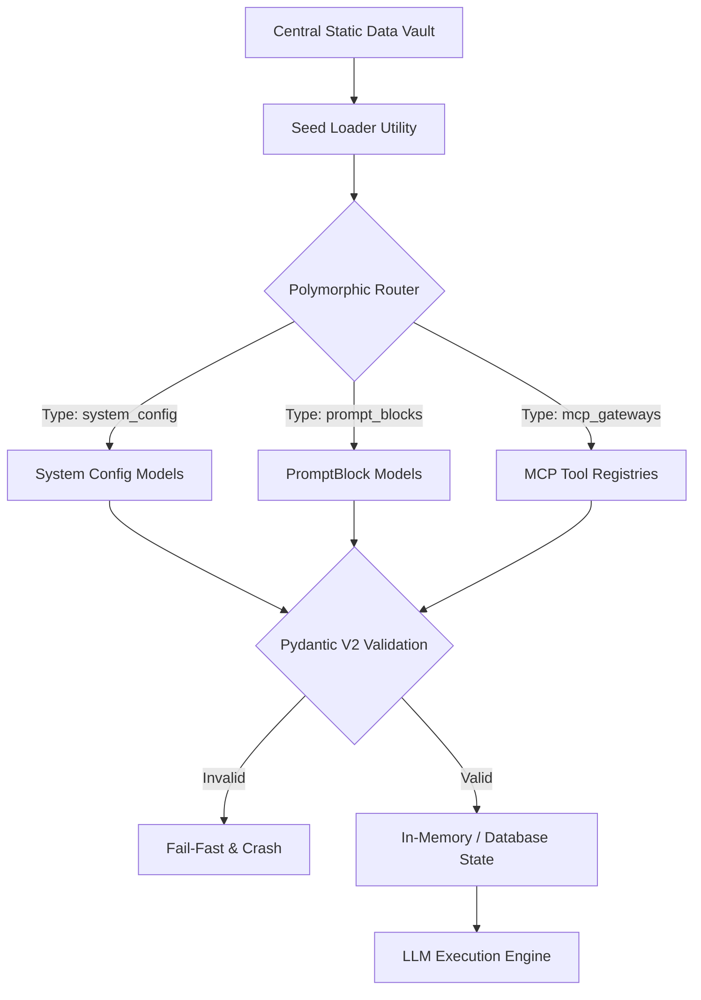

# Data Seeding & Ontology

## 1. Executive Summary
The **Data Seeding & Ontology** capability dictates that the Compound AI System is fundamentally **data-driven**, not code-driven. The entire behavior of the system—ranging from LLM instructions (PromptBlocks), allowed models, MCP tool gateways, to performative vocabularies—is defined externally in the central static data vault. The backend's primary role is simply to parse, hydrate, and route this declarative ontology rather than hardcoding operational instructions.

## 2. Architectural Principles & Implementation

The Data Seeding & Ontology layer establishes the declarative schemas, dynamic rules, and static datasets that power the platform:

### 2.1. Polymorphic Rule Routing
All dynamic rules and criteria are modeled as a unified `PromptBlock` entity within the database. Polymorphic collection parsing automatically routes different categories of configuration data (`system_config`, `prompt_blocks`, `mcp_gateways`) into their respective Pydantic validation structures, ensuring typed domain validation before runtime execution.

### 2.2. Single Source of Truth (SSOT) Relational Persistence
The central static data vault (`seed_data.json`) serves as the immutable structural authority for baseline entities. The underlying storage remains flat and relational across root collections, while backend APIs construct nested and stitched views (such as combining Workflows with Output Profiles) dynamically via dedicated response DTOs.

### 2.3. Y-Funnel Pre-Hook Normalization
Data transformations during initialization utilize a Y-Funnel architecture where pre-hooks normalize legacy or heterogeneous input shapes before domain validation. This keeps core Pydantic V2 domain models pure and focused strictly on business invariants rather than ingestion gymnastics.

### 2.4. Semantic Localization via Performative Lexicons
System personality traits, terminology standards, and vocabulary constraints are governed as data rather than code. Declarative `performative_lexicons` defined in seed data are injected dynamically during prompt compilation, supporting multilingual enforcement without code modifications.

### 2.5. Universal Bilingual Localization (I18nText)
User-facing dynamic strings across the ontology (profile titles, layout descriptions, preambles) utilize the strictly typed `I18nText` model in both Python and Flutter. The schema mandates complete baseline translations (`en` and target locale) with structured fallback resolution, ensuring bilingual parity across backend services, frontend widgets, and PDF generators.

### 2.6. Workflow Context Governance & Step Protection
Pipeline step definitions declare explicit system core protections (`is_system_core: true`) for foundational operations (document ingestion, scoring, synthesis, forensic reporting). The studio interface and API guardrails prevent unauthorized deletion or mutation of protected resources. Step definitions additionally declare synthesis source flags (`is_synthesis_source`), enabling deterministic context boundary governance between upstream text extraction and downstream qualitative synthesis.

### 2.7. Epistemic Separation (TheoryGrounding SSOT)
Bibliographic references and academic provenance metadata are strictly decoupled from operational prompting instructions. `PromptBlock.theory_grounding` (`TheoryGrounding`) is the sole Single Source of Truth for academic citations (`citation_reference`) and source URLs (`source_url`). `PromptBlock.ai_description` contains purely operational prompt text, allowing presentation layers and PDF reports to consume structured academic citations without prompt-scraping or token bloat.

## 3. Logical Data Flow

