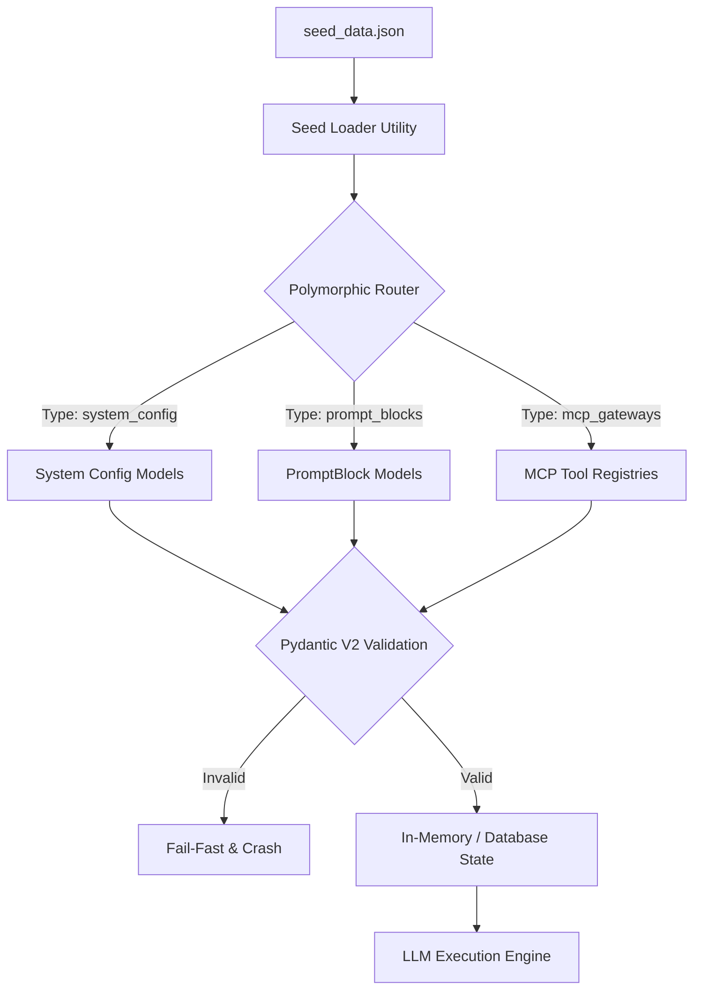

# Data Seeding & Ontology

## 1. Executive Summary
The **Data Seeding & Ontology** capability dictates that the Compound AI System is fundamentally **data-driven**, not code-driven. The entire behavior of the system—ranging from LLM instructions (PromptBlocks), allowed models, MCP tool gateways, to performative vocabularies—is defined externally in the `seed_data.json` repository. The backend's primary role is simply to parse, hydrate, and route this declarative ontology rather than hardcoding operational instructions.

## 2. Core Architectural Invariants (The Laws)

These absolute rules (Knowledge Items) govern the global context and must NEVER be violated:

### 2.1. Polymorphic Rule Routing
- **Law:** The system prohibits fractured rule models or hardcoded prompt logic inside Python files.
- **Enforcement:** All dynamic rules must be modeled as a unified `PromptBlock` entity within the database. The system utilizes Polymorphic Collection Parsing to automatically route different categories of data (e.g., `system_config`, `prompt_blocks`, `mcp_gateways`) into their respective Pydantic validation structures, simplifying the LLM DAG engine.

### 2.2. Single Source of Truth (SSOT) Immutability
- **Law:** The JSON structure of `seed_data.json` is the highest architectural authority for data shape.
- **Enforcement:** You MUST NEVER physically alter the root persistence arrays in the `seed_data.json` to match transient API shapes. While the backend API may expose nested, stitched structures (e.g., combining Workflows and Profiles), the underlying physical seed data must remain flat and relational to avoid cascading data corruption.

### 2.3. The Y-Funnel Pre-Hook Architecture
- **Law:** Data transformations during seeding must not pollute the pure domain objects.
- **Enforcement:** The system uses a Y-Funnel architecture where Pre-Hooks perform structural data normalization *before* data enters the domain validation phase. This ensures heterogeneous JSON definitions are canonicalized into strict Pydantic V2 Domain Models without polluting the domain layer with transformation logic.

### 2.4. Semantic Localization (Performative Lexicons)
- **Law:** System personality and localization strings are data, not code.
- **Enforcement:** Attributes like specific vocabulary (e.g., forcing the AI to use "delve into" or "syventyä") are injected dynamically via `performative_lexicons` defined in the seed data. The LLM engine must apply these lexicons post-resolution, allowing multi-lingual operation without altering the core logic.

### 2.5. Universal I18n Domain Model (I18nText)
- **Law:** Dynamic localized strings must never be flattened into dictionary maps or separate schema fields (e.g., `title_en`).
- **Enforcement:** Any user-facing string that exists within the ontology (like profile titles, layout descriptions, and preambles) MUST use the strictly typed `I18nText` object in Python and Flutter. This ensures safe fallback resolution logic, structural parity across boundaries, and prevents UI crashes due to missing translation keys.

## 3. Logical Data Flow

