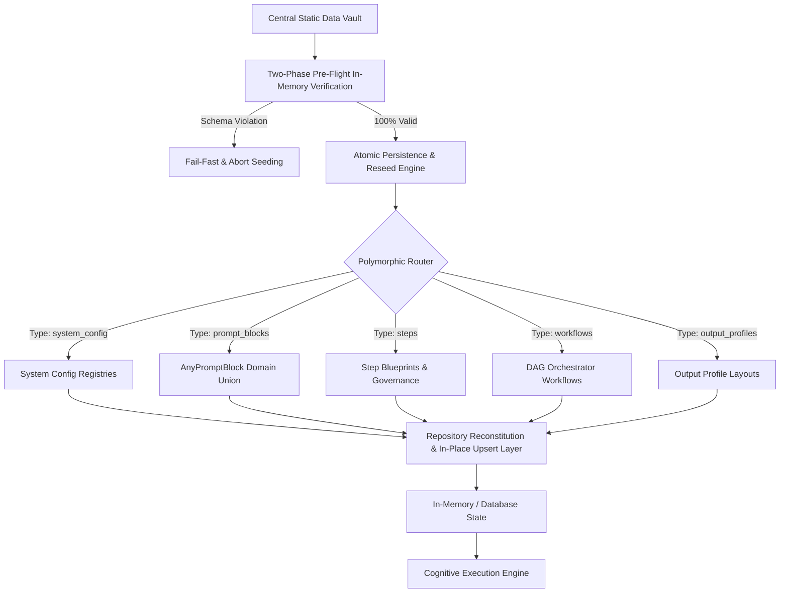

# Data Seeding & Ontology

## 1. Executive Summary
The **Data Seeding & Ontology** capability dictates that the Compound AI System is fundamentally **data-driven**, not code-driven. The entire behavior of the system—ranging from LLM instructions (PromptBlocks), allowed models, MCP tool gateways, to performative vocabularies—is defined externally in the central static data vault. The backend's primary role is to parse, validate, hydrate, and route this declarative ontology rather than hardcoding operational instructions.

## 2. Architectural Principles & Implementation

The Data Seeding & Ontology layer establishes the declarative schemas, dynamic rules, and static datasets that power the platform:

### 2.1. Polymorphic Rule Routing
All dynamic rules and criteria are modeled as a unified `PromptBlock` entity within the database. Polymorphic collection parsing automatically routes different categories of configuration data (`system_config`, `prompt_blocks`, `mcp_gateways`) into their respective Pydantic validation structures, ensuring typed domain validation before runtime execution.

### 2.2. Single Source of Truth (SSOT) Relational Persistence
The central static data vault serves as the immutable structural authority for baseline entities. The underlying storage remains flat and relational across root collections, while backend APIs construct nested and stitched views (such as combining Workflows with Output Profiles) dynamically via dedicated response DTOs.

### 2.3. Dual-Tool Seed Governance & Sanitization Architecture
Seed data quality and consistency are maintained through a decoupled inspection and transformation architecture:
- **Static Heuristic Inspection**: A read-only verification engine audits referential integrity, AST pattern rules, and prompt conventions across root database collections (`prompt_blocks`, `steps`, `workflows`, `output_profiles`), returning deterministic compliance exit codes without modifying persistent state.
- **In-Memory Sanitization & Transformation**: A declarative transformation pipeline strips unauthorized formatting artifacts, screaming imperatives, and mechanical counting directives from prompt text, re-validates entities against strict domain schemas, and writes changes atomically.

### 2.4. Two-Phase In-Memory Pre-Flight Validation
Database seeding enforces a two-phase protocol that isolates schema validation from state modification:
- **Phase 1 (Pre-Flight In-Memory Verification)**: The seeder loads master seed data and validates 100% of collection records in memory against strict domain models configured with `ConfigDict(strict=True, extra="forbid")`. If any item fails validation, the process terminates immediately with an explicit validation error, leaving existing database tables untouched.
- **Phase 2 (Atomic Population)**: Existing tables and records are updated only after every collection passes pre-flight validation with zero errors.

### 2.5. Atomic File Persistence & Database Lock Protocol
Master seed persistence and database storage enforce atomic file writes and concurrency controls:
- **Temporary Replacement Writes**: File-level persistence writes serialized JSON to isolated temporary files, flushes and synchronizes disk buffers, verifies complete re-loadability in memory, and replaces target files via atomic file replacement operations.
- **Platform-Native Concurrency Locking**: Local database access enforces cross-process and cross-thread locks using platform-specific non-blocking file locking to prevent race conditions during concurrent execution runs.

### 2.6. In-Place Upsert Lifecycle & Entity Immutability
Runtime persistence repositories maintain state through in-place atomic upsert operations keyed by canonical Opaque Stripe IDs. Entities update their records directly without creating duplicate shadow instances or mutating unrelated collections, preserving referential integrity and audit trails across execution sessions.

### 2.7. Y-Funnel Pre-Hook Normalization
Data transformations during initialization utilize a Y-Funnel architecture where pre-hooks normalize heterogeneous input shapes before domain validation. This keeps core Pydantic V2 domain models pure and focused strictly on business invariants rather than ingestion gymnastics.

### 2.8. Semantic Localization via Performative Lexicons
System personality traits, terminology standards, and vocabulary constraints are governed as data rather than code. Declarative lexicons defined in seed data are injected dynamically during prompt compilation, supporting multilingual enforcement without code modifications.

### 2.9. Universal Bilingual Localization (I18nText)
User-facing dynamic strings across the ontology (profile titles, layout descriptions, preambles) utilize the strictly typed `I18nText` model in both Python and Flutter. The schema mandates complete baseline translations (`en` and target locale) with structured fallback resolution, ensuring bilingual parity across backend services, frontend widgets, and PDF generators.

### 2.10. Workflow Context Governance & Step Protection
Pipeline step definitions declare explicit system core protections (`is_system_core: true`) for foundational operations (document ingestion, scoring, synthesis, forensic reporting). Studio interface and API guardrails prevent unauthorized deletion or mutation of protected resources. Step definitions additionally declare synthesis source flags (`is_synthesis_source`), enabling deterministic context boundary governance between upstream text extraction and downstream qualitative synthesis.

### 2.11. Epistemic Separation (TheoryGrounding SSOT)
Bibliographic references and academic provenance metadata are strictly decoupled from operational prompting instructions. `PromptBlock.theory_grounding` (`TheoryGrounding`) is the sole Single Source of Truth for academic citations (`citation_reference`) and source URLs (`source_url`). `PromptBlock.ai_description` contains purely operational prompt text, allowing presentation layers and PDF reports to consume structured academic citations without prompt-scraping or token bloat.

### 2.12. Structured Few-Shot Calibration Schema (ContrastivePairDTO)
Evaluation assertions and rubrics across the ontology define structured few-shot grounding via `ContrastivePairDTO`, encapsulating `acceptable` and `rejected` exemplars with enforced minimum length boundaries and equality conflict rejection. This eliminates unstructured string delimiters and manual prefix conventions from the seed vault, guaranteeing that every matrix atom provides a pristine, strongly typed boundary definition ready for prompt compilation and direct production deployment across all environments without runtime parsing shims.

## 3. Logical Data Flow

