# 02: Pydantic V2 Datamallit ja Verkkotopologia (Domain)

Cognitive Quorum rakentuu vahvasti tyypitettyjen, "Fail-Fast" periaatetta noudattavien Pydantic V2 -mallien varaan. Nämä mallit muodostavat backendin hermoston (Single Source of Truth), johon koko järjestelmän toiminta (FastAPI-reititys, tietokantamuutokset ja käyttöliittymän renderöinti) perustuu.

## V2CoreBase ja Tiukka Validointi (Strict Nirvana)

Kaikki järjestelmän ydinmallit perivät `V2CoreBase`-luokan. Tämä asettaa arkkitehtuurille ehdottoman tiukat säännöt, joilla estetään "hiljaiset virheet" ja kognition lipsuminen vuotavien rajapintojen läpi.

```python
class V2CoreBase(BaseModel):
    model_config = ConfigDict(strict=True, extra="forbid")
```

1. **Rust Core Parsing:** FastAPI-reitittimissä JSON puretaan suoraan `model_validate_json()` -metodilla, hyödyntäen Pydantic V2:n Rust-moottoria ohi hitaiden Python-kirjastojen.
2. **Extra='forbid':** Jos käyttöliittymä, LLM tai taustajärjestelmä lähettää malliin kuulumatonta (esim. hallusinoitua tai vanhentunutta) dataa, koodi kaatuu välittömästi (Validation Error 422). Järjestelmä ei koskaan niele tuntemattomia avaimia.
3. **No-String Mandate (I18nText):** Kaikki käyttöliittymään päätyvä teksti on kapseloitu `I18nText` Pydantic-malliin. Se pakottaa ("English-Only Mandate"), että kaikesta tekstistä löytyy englanninkielinen perusversio, johon kieli-middleware voi nojata silloinkin kun käännös puuttuu. Tekoälyn kognitiiviset ohjeet puolestaan eristetään yksinomaan englanninkielisiin `ai_description` -kenttiin UI-lokalisaatiosta irralliseksi.
4. **Zero-Duck-Typing:** "Duck-typing" -jäänteet (kuten `isinstance(x, dict)` tai hiljaiset `.get("id")` -kutsut) ovat ankarasti kiellettyjä Service- ja Controller-kerroksissa. Payloadin on täsmättävä täydellisesti Pydantic-rakenteeseen, eikä funktioiden sisällä tehdä arvailuja saapuvan tiedon muodosta.

## Ydinmallisto ja Opaque ID -reititys

Järjestelmä hylkää ihmisluettavat "slugit" identifioijina taustalogiikassa. Kaikki relaatiot ja datamallit pakottavat joustavan "Opaque Stripe ID" -reitityksen (esim. `blk_abc12345`), joka takaa sen, että mallien sisäiset ihmisluettavat nimimuutokset eivät koskaan riko järjestelmän topologiaa.

```mermaid
classDiagram
    class V2CoreBase{
        <<Pydantic>>
        +ConfigDict strict=True
        +ConfigDict extra="forbid"
        +model_validate()
    }

    class I18nText{
        +String default_locale
        +dict translations
    }

    class ExpectedInput{
        +String input_key
        +I18nText label
        +I18nText description
        +String ai_description
        +bool required
        +bool is_chat_history
        +List~String~ input_modes
        +List~QuestionnaireItem~ questionnaire_definition
    }

    class Workflow{
        +String id (Opaque Stripe ID 'wor_')
        +String slug
        +I18nText name
        +I18nText description
        +String status
        +int version
        +bool is_public
        +String organization_id
        +dict ui_schema
        +dict output_profiles
        +String default_profile_id
        +List~ExpectedInput~ expected_inputs
        +List~StepRule~ steps
        +bool enable_contextual_overrides
        +validate_dag_integrity()
    }

    class StepRule{
        +String id
        +String task_blueprint (Opaque Step ID 'stp_')
        +float ui_pos_x
        +float ui_pos_y
        +List~String~ depends_on
        +dict input_mappings
    }
    
    class Step{
        +String id
        +String slug
        +I18nText name
        +I18nText description
        +Literal type
        +String hook
        +Literal safety
        +List~String~ pre_hooks
        +List~String~ post_hooks
        +List~String~ allowed_mcp_tools
        +String model_strategy
        +List~String~ expected_inputs
        +dict output_schema
        +String role_block_id
        +String extraction_protocol_block_id
        +List~String~ criteria_block_ids
    }

    class TDAAssertion{
        +String id (Opaque Stripe ID 'tda_')
        +String description
        +String logic_expression
        +bool allow_contextual_override
    }

    class TheoryGrounding{
        +String source_url
        +String citation_reference
    }

    class PromptBlock{
        +String id (Opaque Block ID 'blk_')
        +String slug
        +I18nText label
        +I18nText description
        +String ai_description
        +String category_id
        +bool is_evaluative
        +BlockDataType type
        +bool allow_decimals
        +int scale_min
        +int scale_max
        +List~String~ output_extensions
        +TheoryGrounding theory_grounding
        +List~MatrixScale~ scales
        +List~MatrixRow~ rows
        +List~I18nText~ columns
        +validate_block_consistency()
    }

    class ExecutionRecord{
        <<Event Sourcing Root>>
        +String id
        +String workflow_id
        +ExecutionStatus status
        +String active_profile_id
        +WorkflowInputs raw_inputs
        +FrozenContext frozen_context
        +String frozen_context_storage_path
        +List~TraceEvent~ execution_trace
        +String execution_trace_storage_path
        +String pdf_report_path
        +String output_profile_id
        +dict step_states
        +dict profile_syntheses
        +int duration_ms
        +dict models_used
        +dict metadata
        +String error
        +datetime created_at
        +datetime updated_at
        +datetime completed_at
        +String created_by
        +String organization_id
    }

    class OutputProfile{
        +String id
        +String slug
        +String workflow_id
        +I18nText name
        +I18nText description
        +List~String~ visible_metadata
        +List~String~ visible_extensions
        +int max_extension_items
        +String display_scale
        +bool include_diagnostic_scorecard
        +SynthesisConfigDTO synthesis
        +List~OutputLayoutBlock~ layouts
    }

    class OutputLayoutBlock{
        +Literal preset_view
        +I18nText title
        +I18nText description
        +List~String~ steps
        +List~String~ target_blocks
        +Literal text_delivery_mode
        +SynthesisConfigDTO synthesis
        +String synthesis_md
    }

    class SynthesisConfigDTO{
        +String system_prompt
        +int length_constraint
        +I18nText preamble_text
        +HistoricalContextMode historical_context_mode
        +bool enable_pii_masking
        +List allowed_exports
        +bool omit_empty_sections
        +List~String~ allowed_mcp_tools
    }

    class BaseResponseDTO{
        <<API Boundary Sovereignty>>
        +str id
    }

    class ReportDataDTO{
        +String workflow_id
        +String profile_id
        +I18nText profile_name
        +dict available_profiles
        +float global_score
        +bool has_warning
        +String synthesized_markdown
        +List~String~ visible_metadata
        +datetime created_at
        +String org_name
        +float cost_estimate
        +int total_tokens
        +int prompt_tokens
        +int completion_tokens
        +int reasoning_tokens
        +List~MCPAuditTrace~ mcp_tool_audit
        +dict grouped_extensions
        +List~String~ penalties_applied
        +List~ReportLayoutDTO~ layouts
    }

    class ReportLayoutDTO{
        +Literal preset_view
        +I18nText title
        +I18nText description
        +List~ReportAxisDTO~ axes
        +Literal text_delivery_mode
        +SynthesisConfigDTO synthesis
        +String synthesis_md
    }

    class ModelProfile{
        +String provider
        +String model_name
        +float temperature
        +float top_p
        +int top_k
        +int tpm_limit
        +int rpm_limit
        +int max_tokens
        +List~String~ allowed_tools
        +bool supports_grounding
        +String api_key
        +String parsing_mode
        +String caching_strategy
        +bool is_active
        +dict additional_params
    }

    class AllowedMCPTool{
        +String tool_id
        +I18nText name
        +String description
        +dict input_schema
    }

    class XAIExtension{
        <<Discriminated Union>>
        +extension_type
    }

    class LightweightMatrixOutput{
        +float raw_score
        +float normalized_score
        +str level_breakdown
        +str justification
        +dict evaluated_atoms
        +dict extensions
    }
    
    class StepOutputDTO{
        <<Structured State Envelope>>
        +str step_id
        +str block_id
        +Literal data_type
        +Any payload
    }
    
    class StrictMatrixPayload{
        <<RootModel>>
    }

    class SynthesisStepDataDTO{
        +Any reasoning_trace
    }

    class SynthesisMetadataDTO{
        +str target_locale
        +dict token_usage
    }

    V2CoreBase <|-- I18nText
    V2CoreBase <|-- ExpectedInput
    V2CoreBase <|-- Workflow
    V2CoreBase <|-- StepRule
    V2CoreBase <|-- Step
    V2CoreBase <|-- TDAAssertion
    V2CoreBase <|-- TheoryGrounding
    V2CoreBase <|-- PromptBlock
    V2CoreBase <|-- ExecutionRecord
    V2CoreBase <|-- OutputProfile
    V2CoreBase <|-- OutputLayoutBlock
    V2CoreBase <|-- SynthesisConfigDTO
    BaseResponseDTO <|-- ReportDataDTO
    BaseResponseDTO <|-- ReportLayoutDTO
    V2CoreBase <|-- ModelProfile
    V2CoreBase <|-- AllowedMCPTool
    V2CoreBase <|-- LightweightMatrixOutput
    V2CoreBase <|-- StepOutputDTO
    V2CoreBase <|-- StrictMatrixPayload
    V2CoreBase <|-- SynthesisStepDataDTO
    V2CoreBase <|-- SynthesisMetadataDTO

    Workflow *-- ExpectedInput : "määrittää syötteet"
    Workflow *-- StepRule : "sisältää (Opaque DAG Nodes)"
    Workflow ..> OutputProfile : "Dynaaminen injektio API-kerroksessa (EI TALLENNETA KANTAAN!)"
    StepRule --> Step : "viittaa (Blueprint Reference)"
    Step --> TDAAssertion : "arvioi kriteerit (criteria_block_ids)"
    PromptBlock *-- TheoryGrounding : "yhdistää lähdeaineistoon"
    OutputProfile *-- OutputLayoutBlock : "sisältää (Layouts)"
    OutputLayoutBlock --> SynthesisConfigDTO : "määrittelee XAI-synteesin"
    ReportDataDTO *-- ReportLayoutDTO : "koostaa UI-näkymän"
    ReportDataDTO *-- XAIExtension : "polymorfinen rikastus"
    LightweightMatrixOutput --> XAIExtension : "laajennosdata"
```



### Keskeiset Arkkitehtuuriset Kokonaisuudet

1. **PromptBlock (Unified Directive Model - Epic 55 SSOT):**
   * Työnkulun pienin atomaarinen osa. Tämä malli fuusioi sisäänsä arviointimatriisit (BARS, Bipolar), odotetut datatyypit sekä tekoälyn suoritusohjeet (`ai_description`).
   * **Prompt Directive SSOT (Epic 55):** Erotamme järjestelmän käyttäytymisen ja asenteen (System Framework) puhtaasta substanssista (Domain Logic/Rules). Kaikki globaalit, mekaaniset ja syntaktiset säännöt (kuten *Morpho-Syntactic Determinism*, *Topological Determinism* ja *Constrained Parsing Protocol*) on riisuttu pois `PromptBlock`ien `ai_description`-kentistä ja siirretty kooditasolle tiedostoon `backend_v2/core/system_directives.py` (`Immutable Syntax`).
   * **Single-Injection Rule & Lightweight Schema:** Globaali kehys injektoidaan system-promptiin tasan kerran (`Single-Injection Rule`) `execution_persona`-tunnisteen perusteella. Tämä pitää Pydantic-skeemojen kenttien kuvaukset (`Field(description=...)`) erittäin kevyinä (`Lightweight Pydantic Schema`), mikä estää Vertex AI:n strukturoidun ulostulon tilarajoitusten ylittymisen ja kaatumiset.
   * **Roolijako (Single Source of Truth -mandaatti):** Jotta lohkojen toiminta on determinististä ja reaktiivinen käyttöliittymä ei kaadu dynamic schema validation -virheisiin, kentillä `type` ja `category_id` on tiukka ja erillinen Single Source of Truth (SSOT) -roolijako:
     * **`type` (Toiminnallinen SSOT / Functional SSOT):** Määrittää, miten lohkon kääntämä data jäsennellään ja validoidaan Pydantic-skeemassa (`prompt_compiler.py`). Jos `type` on `"instruction"`, dynamic schema kääntää lohkon yksinkertaiseksi `str`-kentäksi (kuten myös prompteissa statically listatut ohjeistukset), jotta LLM:n palauttama teksti voidaan validoida suoraan merkkijonona. Jos `type` on arviointikohtainen (kuten `"float"`), lohko käännetään monimutkaiseksi extraction-objektiksi (`DynamicExtractionResponse` tai `LightweightMatrixOutput`). Tämä poistaa kaatumisriskin ja ValidationError-ongelman non-standard-kategorioiden ohjeille.
     * **`category_id` (Semanttinen/Looginen SSOT / Semantic & Logical SSOT):** Määrittää lohkon loogisen ja matemaattisen roolin pisteytyksessä (`scoring.py`), sääntöreitityksessä ja käyttöliittymässä (kuten Admin Studio ryhmittelyssä). Esimerkiksi vain `"matrix"`-kategorialla varustetut lohkot otetaan mukaan numeerisen keskiarvon globaaliin pisteytykseen, kun taas `"system_rule"`, `"agent_role"`, `"task_definition"` ja `"runtime_variables"` toimivat puhtaasti hallinnollisina tai ohjeellisina tageina ilman laskentakuormaa.
     * **TheoryGrounding:** Kytkee matriisit suoraan organisaation omaan data- ja teoriapohjaan dokumentoimalla tarkan lähteen ja siihen liittyvän viittauksen.
     * **Zero-Trust Null-Filtering & Syntaktinen Ankkurointi (Epic 61):** TDA-arvioinneissa ja Vice-säännöissä (kuten heikkouksien/anti-patternien poiminnassa) sovelletaan ankaraa Zero-Trust-filtteröintiä. Jos kielellinen ja syntaktinen ankkuri (kuten tietyt säännössä luetellut suorat ilmaisut) puuttuu kokonaan tekstistä, LLM:n on palautettava `JSON null` (ei tyhjää sanakirjaa tai arvailuja). Spekulointi, ekstrapolointi tai puuttuvan näytön selittely ("rationalizing") on kiellettyä.

2. **Step ja StepRule (Modular Extraction Decoupling - Epic 60):**
   * **Step:** Eristetty, uudelleenkäytettävä logiikkamalli. Epic 60:n myötä askeleen aiempi sotkuinen `promptBlocks`-lista korvattiin kompromissittomalla **Modular Extraction Decoupling** -arkkitehtuurilla. Lohkoviittaukset on nyt eriytetty ja strukturoitu kolmeen selkeästi rajattuun ja tyypitettyyn kenttään:
     * `role_block_id` (String?): Viittaa tekoälyn asenteelliseen ja ammatilliseen roolilohkoon (esim. `agent_role` kategorialla varustettu `PromptBlock`).
     * `extraction_protocol_block_id` (String?): Viittaa globaaliin evidenssin poimintaprotokollaan (esim. `blk_573802341db9d68c` "Global Zero-Trust Evidence Extraction Protocol").
     * `criteria_block_ids` (List[String]): Lista kriteerilohkoista (kuten TDA-säännöt tai BARS-matriisit), joita askeleella arvioidaan.
     Tämä poistaa attention dilution -ilmiön kokonaan ja estää dynaamisten kääntäjien kaatumisriskit, kun ohjeet, roolit ja kriteerit on erotettu omiksi itsenäisiksi tietolähteikseen.
   * **StepRule:** Määrittelee solmun todellisen paikan työnkulun verkossa (Directed Acyclic Graph). Sisältää UI-koordinaatit (`ui_pos_x`, `ui_pos_y`), riippuvuudet (`depends_on`) ja datan syötelokeroinnin (`input_mappings`), joilla muiden askelten injektoimat lokaalit syötteet ja dynaamiset parametrit parsitaan LLM:lle.

3. **Workflow (DAG Orchestrator):**
   * Kokoaa yhteen StepRulet, eroteltujen lohkojen viittaukset, Output Profilet sekä myös dynaamiset odotetut syötteet (`ExpectedInput`), jotka määrittävät, mitä ulkopuolista dataa käyttäjältä tai järjestelmältä pyydetään ajon aikana. `ExpectedInput` luo vahvat syötelokerot (`input_mappings`), jotka reitittävät tiedot ohjatusti oikeille DAG-askelille.
   * Järjestelmä estää puutteelliset Workflown tilat ennen ajoa: `validate_dag_integrity` suorittaa Depth-First Search (DFS) -algoritmin, joka paljastaa työnkulun solmukohdista syklit (kehät) pystyen katkaisemaan suorituksen (RFC 7807) ennen ajon alkua. Se on absoluuttinen vaatimus turvalliselle asynkroniselle taustaprosessoinnille.
   * **E2E Orchestration Fail-Fast:** Rajapinta kaatuu välittömästi (HTTP 400 Validation Error), mikäli työnkulun `expected_inputs` -määritelmät (esim. `chat_log`) puuttuvat ajopyynnön `raw_inputs` -payloadista. Asiakassovellukset (esim. Dart E2E-skriptit) EIVÄT SAA käyttää keksittyjä syötteitä tai hardkoodattuja Opaque ID -tunnisteita (`prof_123`). Niiden on haettava ID:t dynaamisesti ja lähetettävä täsmälleen oikeat, validit syötteet.

4. **Execution and Synthesis Tier Decoupling (Epic 50):**
   * Järjestelmä erottaa **Execution Phase** (Raaka-arviointi, `PromptBlockit` / `criteria_block_ids`) ja **Reporting/Display Phase** (Synteesi, `OutputProfilet`) täysin toisistaan.
   * `PromptBlockit` ovat yksinomaan raakadatan arviointia varten (numeeriset asteikot kuten 1-5, ZERO-TRUST AUDITOR -ohjeet) eivätkä ne SAA sisältää UI-muotoilun tai pituuden ohjeita (esim. "kirjoita lyhyt lause").
   * `OutputProfilet` (mukaan lukien `SynthesisConfigDTO`) ovat yksinomaan UI-muotoilua ja synteesiä varten (esim. `row_explanation_prompt`). Ne EIVÄT SAA sisältää arviointiohjeita kuten "hypoteesien testaus" tai "oikein/väärin" -määrittelyjä.

5. **Claim-Level Contextual Override & Laiskuuden esto (System 2):**
   * **Kontekstuaalinen ohitusventtiili (Claim-Level Contextual Override):** Mahdollistaa sen, että tekoäly (System 1) voi ohittaa mekaanisen säännön epäonnistumisen lieventävän tai epäsuoran asiayhteyden perusteella.
   * **Kaksoislukitusvaltuutus (Double-Lock Authorization):** Ohituksen soveltaminen vaatii poikkeuksetta kahden tason master-kytkinten aktiivisuutta:
     * `enable_contextual_overrides` (Workflow-tason globaali kytkin)
     * `allow_contextual_override` (Kyseisen yksittäisen `TDAAssertion`-säännön sääntökohtainen kytkin)
     Jos LLM palauttaa vastauksessaan `contextual_override = True`, mutta jompikumpi kytkimistä on `False`, System 2 -suojamuuri hylkää ohituksen välittömästi ja pakottaa palaamaan mekaaniseen tarkistukseen.
   * **Laiskuuden esto (Anti-Laziness Mandate):** Jokainen hyväksytty ohitus validoidaan Pydantic-kerroksessa:
     * *Pituusvaatimus:* Perustelutekstin (`semantic_reasoning`) on oltava vähintään 50 merkkiä pitkä.
     * *Spatiaalinen ankkurointi:* Perustelun on sisällettävä eksplisiittinen sijaintiviite lähdetekstiin (kuten *sivu*, *kappale*, *rivi*, *luku* tai *otsikko*).
     Mikäli ehdot eivät täyty, Pydantic heittää `ValidationError`-virheen ja käynnistää `Self-Healing` -korjaussilmukan.

## Järjestelmäkonfiguraatiot ja Mallit

Pydantic-kirjasto on laajennettu hallinnoimaan työnkulkujen lisäksi koko järjestelmän laajuisia asetuksia, joilla tekoälyagenttien kyvykkyyksiä ohjataan koodin ulkopuolelta.
* **SystemConfigModelRegistry:** Ohjaa litteää tekoälymallien rekisteröintiä (esim. OpenAI, Google) kytkemällä mallin spesifikaatiot `ModelProfile` -objekteihin. Tämä sallii järjestelmän kognitiivisten moottoreiden vaihtamisen ilman käyttökatkoja. `ModelProfile`-oliolle on lisätty `caching_strategy` (välimuististrategian dynaaminen ohjaus, kuten `anthropic_ephemeral` tai `gemini_native` pilvipalvelun Context Caching -säästöjä varten) sekä `additional_params` (polymorfinen asetussanakirja). `additional_params` sallii dynaamisen ympäristömuuttujien interpoloinnin (esim. `${VERTEX_LOCATION}`), mikä poistaa tiukat pilvisijaintien tai konesalien kovakoodaukset suoraan koodista ja siirtää ne suvereeniin tietokantaohjattuun konfiguraatioon.
* **SystemConfigMCPGateways:** Rekisteröi sallitut, LLM-kutsuttavat ulkoiset työkalut käyttäen ohjattua `AllowedMCPTool` -mallia, jossa erotetaan I18n-lokalisoitavissa oleva käyttöliittymän nimi mallille luovutettavasta konerakenteesta (`input_schema`, `description`). Näin MCP-kyvykkyyksien salliminen on tiukasti säänneltyä.

## Suoritusmallit ja Event Sourcing

Työnkulun ajanhetkellinen tila ja lopullinen valmis raportti tallennetaan tiukkaan Event Sourcing -malliseen arkkitehtuuriin.

1. **ExecutionRecord:** Tallentaa tekoälyajon koko elinkaaren. Se lukitsee sisäänsä tarkan `FrozenContext` kopion kaikista siinä hetkessä käytetyistä PromptBlockeista ja säännöistä. Tämän konseptin ansiosta kone pystyy kuukausia myöhemmin selittämään tarkasti, miksi tekoäly on tietyt päätökset tehnyt (Explainable AI / Forensic Sovereignty).
2. **TraceEvent & MCPAuditTrace:** Työn lennossa, taustaprosessi lähettää atomisia `TraceEvent`-objekteja tilanteesta tietokantaan. Samalla kaikki Vertex AI-hakujen tai vastaavien ulkoisten MCP-työkalujen haut tallentuvat `MCPAuditTrace`-jäljeksi lokiin. MCPAuditTrace kirjaa ylös tarkan latenssin (`duration_ms`), työkalun käyttämän tietolähteen (`source_urls`), ja täsmällisen numeerisen/tekstillisen vastineen (`response_summary`). Tämä varmistaa koko työkalun logiikkaan läpinäkyvän, auditointikelpoisen forensisen jäljen.
3. **Structured State Envelopes (`StepOutputDTO`):** Execution-jäljet eivät enää koskaan projisoidu irrallisiksi, litteiksi sanakirjoiksi (flat dictionaries). `StateProjector` taittaa ajon tilan tiukasti muotoon `List[StepOutputDTO]`. Tämä varmistaa täydellisen tyyppiturvallisuuden koko suoritusketjun ja DAG-orkestraation läpi poistaen "villiin" dot-notaatioon (`$steps.x.y`) liittyvät kaatumisriskit.

## Phase 9: Strict Hook DTOs & Micro-CoT Validation

Järjestelmän taustakoukuissa (hooks) toteutetaan "Zero-Duck-Typing" ja Fail-Fast arkkitehtuurit korvaamalla dynaamiset dictionary-objektit tiukoilla Pydantic V2 -malleilla:

1. **Synthesis (synthesis.py):**
   * Pydantic V2 DTOt `SynthesisStepDataDTO` ja `SynthesisMetadataDTO` ottavat tiukasti vastaan synteesiprosessin injektiot. Erityisesti `SynthesisMetadataDTO` pakottaa eksaktin `step_results`-kentän olemassaolon, mikä estää askeleiden taustatulosten joutumisen orvoiksi ja pysäyttää suorituksen Fail-Fast -mallilla (HTTP 400), jos dataa puuttuu. Ne purkavat tarvittavat flagit generic step-outputeista ilman riskiä avainvirheistä (KeyErrors) ja mahdollistavat mallien lukitsemisen `frozen=True`.

2. **Scoring ja Arviointi (scoring.py & lightweight_matrix.py):**
   * Legacy-aikakauden dictionary-pohjaiset pisteytykset on korvattu RootModeliin perustuvalla `StrictMatrixPayload` -injektiolla ja `LightweightMatrixOutput` -mallilla. Tämä varmistaa, että matriisin suoritteet – mukaan lukien dynaamisesti luodut `MicroCotDTO` (Micro Chain of Thought) erittelyt – on validoitu ennalta.
   * Moduuleissa kuten falsifier ja guard käytetään `StepGuardDTO`, `StepFalsifierDTO` ja `StepPanelDTO` malleja, jotka perivät `ReasoningTrace` -pohjan lukiten mallien rakenteen Fail-Fast periaatteen mukaiseksi.

3. **Decoupled TDA Schema Factory (Epic 56):**
   * **Dynaaminen Pydantic-mallien Tehdas (Factory):** Yksittäinen staattinen `BaseTDAExtraction`-malli on korvattu dynaamisella malligeneraattorilla (`extraction_schema_factory.py`). Pythonin `create_model` rakentaa dynaamisesti `ExtractedFactsDTO`-mallin, jonka kentät mäpätään tietokantaohjatuista `facts_to_find` -tunnisteista aakkosjärjestyksessä (`sorted()`).
   * **DynamicExtractionResponse:** Toimii juurimallina asynkroniselle tiedonkerääjälle (Semantic Extractor). Sen kenttäjärjestys on tiukan Prefix Caching -eheyden takaamiseksi aina: `chunk_index` (int), `context_scan_trace` (str - kognitiivisesti laajennettu Micro-CoT, suoritetaan ensin), `search_context_anchor` (str | None) sekä `extracted_facts` (`ExtractedFactsDTO`). `COGNITIVE_JUDGEMENT`-reitillä dynaamiseen malliin injektoidaan lisäksi `validation_decision` (bool). Malli suljetaan tiukasti `ConfigDict(extra='forbid', strict=True)` -määritelmällä ilman fallback-polkuja (Fail-Fast).
   * **Laiskuuden Torjunta ja Salliva Identiteetti (Lazy Dumping Ban):** Pydantic-validaattori sallii useamman poimitun faktan olevan 100 % identtinen (Salliva Identiteetti), jotta mekaanista sensorivalidaattoria ei rangaista tiiviissä teksteissä. Kuitenkin, jos LLM yrittää laiskuuttaan dumptausta (kopioi yli 80 % koko tekstichunkista kenttiin), `@model_validator` hylkää vastauksen ja pakottaa Self-Healing -korjauskierroksen. Validation-säännössä malli soveltaa ankaraa `@model_validator(mode="after")` -sääntöä. Jos contextual_override on asetettu arvoon True, malli pakottaa deterministisesti, että exact_quote ON OLTAVA None (null). Tämä ristiinvalidointi tukee Dual-Track -arkkitehtuuria (Physical Match vs Semantic Override) taaten absoluuttisen loogisen determinismin poimintaputken läpi.

4. **Erikoistuneet Asiantuntija-agentit (causal.py ja performativity.py):**
   * **Kognitiivinen Syväpäättely (Causal & Performativity Specialist Domain Models):**
     * **`CausalOutput` & `CounterfactualTest`:** `CausalOutput` perii `ReasoningTrace`-ominaisuudet, varmistaen tiukan kognitiivisen lokituksen. Se sisältää `CausalAnalysis`-rakenteen, joka suorittaa abduktiivista päättelyä ja skenaariotestausta (`CounterfactualTest`). Malli vaatii dynaamisille asiantuntijapisteille (`plausibility_numeric`, `abductive_score`) yhden desimaalin tarkkuuden asteikolla $1.0 - 3.0$ ilmentämään analyysin sävyä ja varmuutta.
     * **`PerformativityOutput` & `PerformativityAnalysis`:** `PerformativityOutput` yhdistää lingvistisen analyysin ja heuristiikat (`PerformativityHeuristic`) sekä pre-mortem-päättelyn (`PreMortemAnalysis`). Se tuottaa numeerisen aitousarvosanan (`authenticity_score`) skaalalla $1.0 - 3.0$ ilmaisten asiantuntijan intuition ja kielellisen laadun.
   * **Vertex AI Float Bounds Grammar Resolution (Best Practice):**
     * *Arkkitehtoninen ongelma:* Kielimallien JSON Schema strict-tilojen kääntäminen Vertex AI:n sisäiseksi tuotantokieliopiksi (serving grammar) kaatuu `400 Bad Request` -virheeseen, jos float-kentille määritellään tiukat rajat Pydanticin `ge` ja `le` -parametreilla (esim. `ge=1.0, le=3.0`). Ääretön float-arvojen määrä ylikuormittaa kieliopin tilakoneen (state serving grammar state limits).
     * *Best Practice -ratkaisu:* Kaikki dynaamiset float-rajoitteet poistetaan suorasta API-skeemasta (ei `ge/le` -parametreja Pydanticin `Field`-määritelmässä). Validointi ja matemaattinen eheys siirretään paikallisesti suoritettaviin Pydantic-tason `@field_validator`-metodeihin (esim. `@field_validator("abductive_score")`). Tämä säästää LLM:n tuotantokieliopin kuorman, mutta takaa kompromissittoman Fail-Fast -tietoturvavarmennuksen asynkronisen backendin rajalla ennen datan jatkokäsittelyä.

## Polymorfinen XAI-injektio (Discriminated Unions)

Tekoälyn tuottamat selittävyyskomponentit ("Explainable AI") toteutetaan **Discriminated Union** -rakenteella (`models/domain/xai.py`).

* **XAIExtension:** Kaikki laajennustyypit (esim. `CitationExtension`, `RiskFlagExtension`, `EmotionalSentimentExtension`) ovat erillisiä lukittuja (`frozen=True, extra="forbid"`) malleja.
* Yhdistävä `XAIExtension` DTO tunnistaa oikean aliluokan dynaamisesti `extension_type` Literal-kentän perusteella.
* **Token Shielding ja Turvallisuus:** Tämä polymorfisuus suojaa järjestelmän käyttöliittymää (Flutter). Jos taustalla toimiva tekoälymalli hallusinoi vääränlaisen laajennustyypin tai sen kentät ovat rikki, Pydantic hylkää palasen välittömästi reitityksessä. Sovellus ei näin koskaan yritä renderöidä korruptoitunutta laajennusta, taaten Token Shielding -tason vikasietoisuuden.

<br><hr>

➡️ **Seuraavaksi:** Kun domain-laatikot on määritelty, siirry lukemaan [03_api_and_async_core.md](./03_api_and_async_core.md), joka näyttää, miten API-reitittimet ja Arq-taustajonot vastaanottavat nämä laatikot ja estävät järjestelmän ylikuormittumisen.
