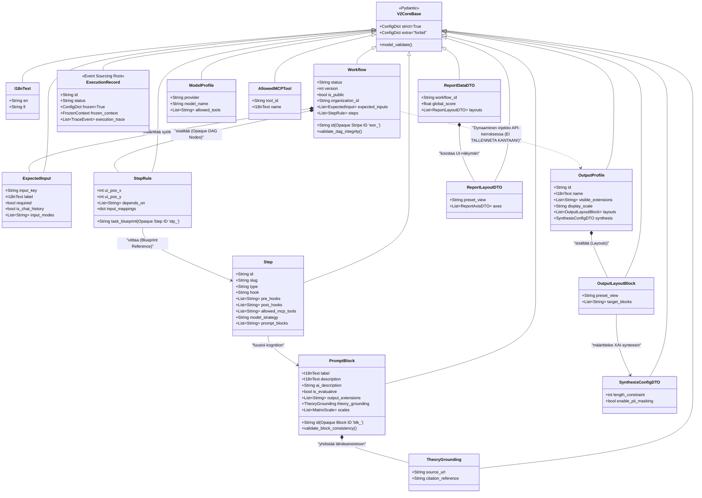

# 02: Pydantic V2 Datamallit ja Verkkotopologia (Domain)

Cognitive Quorum rakentuu vahvasti tyypitettyjen, "Fail-Fast" periaatetta noudattavien Pydantic V2 -mallien varaan. Nämä mallit muodostavat backendin hermoston (Single Source of Truth), johon koko järjestelmän toiminta (FastAPI-reititys, tietokantamuutokset ja käyttöliittymän renderöinti) perustuu.

## V2CoreBase ja Tiukka Validointi (Strict Nirvana)

Kaikki järjestelmän ydinmallit perivät `V2CoreBase`-luokan. Tämä asettaa arkkitehtuurille ehdottoman tiukat säännöt, joilla estetään "hiljaiset virheet" ja kognition lipsuminen vuotavien rajapintojen läpi.

```python
class V2CoreBase(BaseModel):
    model_config = ConfigDict(strict=True, extra="forbid")
```

1. **Rust Core Parsing:** FastAPI-reitittimissä JSON puretaan suoraan `model_validate_json()` -metodilla, hyödyntäen Pydantic V2:n Rust-moottoria ohi hitaiden Python-kirjastojen.
2. **Extra='forbid':** Jos käyttöliittymä, LLM tai taustajärjestelmä lähettää malliin kuulumatonta (esim. hallusinoitua tai vanhentunutta) dataa, koodi kaatuu välittömästi (Validation Error 422). Järjestelmä ei koskaan niele tuntemattomia avaimia.
3. **No-String Mandate (I18nText):** Kaikki käyttöliittymään päätyvä teksti on kapseloitu `I18nText` Pydantic-malliin. Se pakottaa ("English-Only Mandate"), että kaikesta tekstistä löytyy englanninkielinen perusversio, johon kieli-middleware voi nojata silloinkin kun käännös puuttuu. Tekoälyn kognitiiviset ohjeet puolestaan eristetään yksinomaan englanninkielisiin `ai_description` -kenttiin UI-lokalisaatiosta irralliseksi.
4. **Zero-Duck-Typing:** "Duck-typing" -jäänteet (kuten `isinstance(x, dict)` tai hiljaiset `.get("id")` -kutsut) ovat ankarasti kiellettyjä Service- ja Controller-kerroksissa. Payloadin on täsmättävä täydellisesti Pydantic-rakenteeseen, eikä funktioiden sisällä tehdä arvailuja saapuvan tiedon muodosta.

## Ydinmallisto ja Opaque ID -reititys

Järjestelmä hylkää ihmisluettavat "slugit" identifioijina taustalogiikassa. Kaikki relaatiot ja datamallit pakottavat joustavan "Opaque Stripe ID" -reitityksen (esim. `blk_abc12345`), joka takaa sen, että mallien sisäiset ihmisluettavat nimimuutokset eivät koskaan riko järjestelmän topologiaa.



### Keskeiset Arkkitehtuuriset Kokonaisuudet

1. **PromptBlock (Unified Directive Model):**
   * Työnkulun pienin atomaarinen osa. Tämä malli fuusioi sisäänsä arviointimatriisit (BARS, Bipolar), odotetut datatyypit sekä tekoälyn suoritusohjeet (`ai_description`).
   * Validointi (`validate_block_consistency`) pakottaa raskailla säännöillä sen, että matriisin min/max -arvot ja niihin linkitetyt asteikot (MatrixScale) ovat strukturaalisesti virheettömiä. Uudet kentät, kuten `output_extensions` sallivat XAI-laajennusten generoimisen, ja `TheoryGrounding` kytkee matriisit suoraan organisaation omaan data- ja teoriapohjaan dokumentoimalla tarkan lähteen ja siihen liittyvän viittauksen.

2. **Step ja StepRule (Opaque Nodes):**
   * **Step:** Eristetty, uudelleenkäytettävä logiikkamalli. Tukee vahvasti erittelyä joko dynaamiseksi lausekepohjaiseksi säännöksi (`type: logic`), jolloin se suorittaa ns. natiivia Python-koodia määritetyllä `hook`-funktiolla, tai neuroverkkomalliksi (`type: llm`), jossa kognitio ohjautuu LLM:lle. Malli integroi esi- ja jälkikäsittelyn koukkuihin (`pre_hooks`, `post_hooks`) ja estää hallusinoinnit lukitsemalla vain ennalta määritellyt ulkoiset MCP-työkalut (`allowed_mcp_tools`). Askeleilla tuki myös mallistrategialle (`model_strategy`) tehokkuuden säätöä varten.
   * **StepRule:** Määrittelee solmun todellisen paikan työnkulun verkossa (Directed Acyclic Graph). Sisältää UI-koordinaatit (`ui_pos_x`, `ui_pos_y`), riippuvuudet (`depends_on`) ja datan syötelokeroinnin (`input_mappings`), joilla muiden askelten injektoimat lokaalit syötteet ja dynaamiset parametrit parsitaan LLM:lle.

3. **Workflow (DAG Orchestrator):**
   * Kokoaa yhteen StepRulet, PromptBlockien viittaukset, Output Profilet sekä myös dynaamiset odotetut syötteet (`ExpectedInput`), jotka määrittävät, mitä ulkopuolista dataa käyttäjältä tai järjestelmältä pyydetään ajon aikana. `ExpectedInput` luo vahvat syötelokerot (`input_mappings`), jotka reitittävät tiedot ohjatusti oikeille DAG-askelille.
   * Järjestelmä estää puutteelliset Workflown tilat ennen ajoa: `validate_dag_integrity` suorittaa Depth-First Search (DFS) -algoritmin, joka paljastaa työnkulun solmukohdista syklit (kehät) pystyen katkaisemaan suorituksen (RFC 7807) ennen ajon alkua. Se on absoluuttinen vaatimus turvalliselle asynkroniselle taustaprosessoinnille.
   * **E2E Orchestration Fail-Fast:** Rajapinta kaatuu välittömästi (HTTP 400 Validation Error), mikäli työnkulun `expected_inputs` -määritelmät (esim. `chat_log`) puuttuvat ajopyynnön `raw_inputs` -payloadista. Asiakassovellukset (esim. Dart E2E-skriptit) EIVÄT SAA käyttää keksittyjä syötteitä tai hardkoodattuja Opaque ID -tunnisteita (`prof_123`). Niiden on haettava ID:t dynaamisesti ja lähetettävä täsmälleen oikeat, validit syötteet.

## Järjestelmäkonfiguraatiot ja Mallit

Pydantic-kirjasto on laajennettu hallinnoimaan työnkulkujen lisäksi koko järjestelmän laajuisia asetuksia, joilla tekoälyagenttien kyvykkyyksiä ohjataan koodin ulkopuolelta.
* **SystemConfigModelRegistry:** Ohjaa litteää tekoälymallien rekisteröintiä (esim. OpenAI, Google) kytkemällä mallin spesifikaatiot `ModelProfile` -objekteihin. Tämä sallii järjestelmän kognitiivisten moottoreiden vaihtamisen ilman käyttökatkoja.
* **SystemConfigMCPGateways:** Rekisteröi sallitut, LLM-kutsuttavat ulkoiset työkalut käyttäen ohjattua `AllowedMCPTool` -mallia, jossa erotetaan I18n-lokalisoitavissa oleva käyttöliittymän nimi mallille luovutettavasta konerakenteesta (`input_schema`, `description`). Näin MCP-kyvykkyyksien salliminen on tiukasti säänneltyä.

## Suoritusmallit ja Event Sourcing

Työnkulun ajanhetkellinen tila ja lopullinen valmis raportti tallennetaan tiukkaan Event Sourcing -malliseen arkkitehtuuriin.

1. **ExecutionRecord:** Tallentaa tekoälyajon koko elinkaaren. Se lukitsee sisäänsä tarkan `FrozenContext` kopion kaikista siinä hetkessä käytetyistä PromptBlockeista ja säännöistä. Tämän konseptin ansiosta kone pystyy kuukausia myöhemmin selittämään tarkasti, miksi tekoäly on tietyt päätökset tehnyt (Explainable AI / Forensic Sovereignty).
2. **TraceEvent & MCPAuditTrace:** Työn lennossa, taustaprosessi lähettää atomisia `TraceEvent`-objekteja tilanteesta tietokantaan. Samalla kaikki Vertex AI-hakujen tai vastaavien ulkoisten MCP-työkalujen haut tallentuvat `MCPAuditTrace`-jäljeksi lokiin. MCPAuditTrace kirjaa ylös tarkan latenssin (`duration_ms`), työkalun käyttämän tietolähteen (`source_urls`), ja täsmällisen numeerisen/tekstillisen vastineen (`response_summary`). Tämä varmistaa koko työkalun logiikkaan läpinäkyvän, auditointikelpoisen forensisen jäljen.

