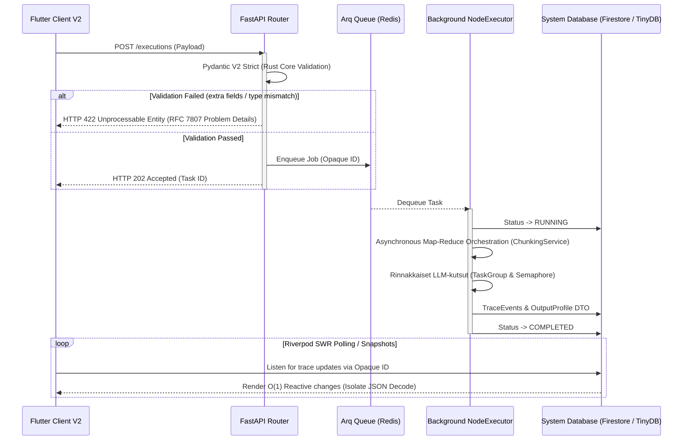

# 03: API-kerros ja Asynkroninen tapahtumahallinta (Core)

Cognitive Quorum rakentuu järeän asynkronisen Python 3.14 FastAPI -kerroksen ja tilattomien reitittimien varaan. Järjestelmä on optimoitu raskaiden tekoäly-DAG:ien käsittelyyn "Fire and Forget" -mallilla (rajapinnat palauttavat nopeasti 202 Accepted). Käyttöliittymä (Flutter) lukee tulokset ja tilamuutokset asynkronisesti erillisen synkronointimekanismin kautta (Firestore snapshots tai Riverpod polling).

## Asynkroninen tapahtumahallinta (Event-Driven Loop)

Kognitiivisesti raskaat tekoälyajot ja raporttien kääntämiset prosessoidaan API-kerroksen ulkopuolella taustalla. Alla oleva sekvenssikaavio havainnollistaa työnkulun asynkronisen elinkaaren ja Fail-Fast Pydantic -kardinaalisuojan:

1. **Optimistinen vastaanotto (FastAPI):** Kun asiakas lähettää suorituspyynnön, FastAPI delegoi raskaan työn Arq-taustajonolle (Redis) ja palauttaa välittömästi HTTP 202 -vastauksen.
2. **Taustaprosessointi ja Map-Reduce (Arq Worker):** Itsenäinen Worker-prosessi purkaa jonon. Mikäli käsiteltävänä on massiivinen määrä atomeja (kysymyksiä), se välitetään ohjaustasolla `ChunkingService`-komponentille. Järjestelmä orkestroi tiukat `SystemConcurrency.LLM_MAX_CHUNK_SIZE` -rajat (oletus 20) ja ajaa klusterin rinnakkain `asyncio.TaskGroup`- ja `Semaphore`-työkalujen avulla ilman pelkoa API-rajoihin osumisesta (Token Explosion). Kaikki kootaan deterministisesti yhteen tulokseen.
3. **Reaktiivinen UI-päivitys:** Käyttöliittymä kuuntelee tietokannan tapahtumia ja päivittää näkymät (esim. XAI-raportit) heti kun taustaprosessi on valmis ja tietokannan tila päivittyy arvoon `COMPLETED`.

## Hakemistorakenne: Kognition ja rajapintojen erotus

Koodikannassa ohjaustaso asuu vahvasti rajatuissa kansioissa. Tärkein sääntö on, että kognitio (LLM-kutsut, skoraus) ei saa siirtyä rajapintoihin, vaan routers-kerros on "aneeminen" (Anemic pattern).

### `backend_v2/api/routers/` (FastAPI Control Plane)

Ylin REST-rajapintakerros vastaa HTTP-pyyntöihin. *(Huom: Vaikka reitittimet sijaitsevat fyysisesti `routers/`-kansiossa ja vanha `api/v2/`-kansio on deprikoitu arkkitehtuurista, kaikki reitittimet julkaistaan ohjelmallisesti `main.py`:ssä asettamalla niille etuliite `/api/v2`.)* Se pysäyttää virheellisen datan RFC 7807 -turvamuuriin (Pydantic ValidationError) ennen kuin se siirtää vastuun Services-kerrokselle.

**API Boundary Sovereignty (BaseResponseDTO):** Järjestelmä käyttää keskitettyä `BaseResponseDTO` -rakennetta palauttaessaan objekteja rajapinnoista. Tämä takaa monivuokralaiseristyksen (multi-tenant isolation) suodattamalla piilotetut tietokantamuuttujat (esim. `organization_id`) automaattisesti pois paluukuormasta. Reitittimien ei enää tarvitse käsitellä epävarmoja `exclude=True` -määrityksiä paikallisesti, mikä estää inhimilliset virheet ja "API Boundary Leakage Trap" -haavoittuvuudet.

- **`execution/`**: Työnkulkujen asynkronisten ajojen ominaisuudet, koostaen tiedostot `executions.py` (ajojen aloitus ja historian haku), `scorecard.py` (piste- ja diagnostiikkaraporttien koonti jäädytetyistä ajoista) sekä ajonaikaisen työnkulkujen kytkennän `workflows.py`.
  - **Fail-Fast Hydration & Zero Defaults (Epic 42):** DTO-mallit (kuten `ExecutionCreate` ja `ExecutionRecord`) vaativat ehdottomasti työnkulkukohtaisen `strictness_level: int = Field(..., ge=0, le=100)` -arvon. Järjestelmä hylkää Pydantic-tasolla kaikki pyynnöt, joista ankaruustaso puuttuu (ei oletusarvoja, "Zero Defaults" -mandaatti).
  - **Contextual Override Injection:** `ExecutionCreate` -malli ottaa vastaan dynaamisen `enable_contextual_overrides: bool` -kytkimen. Tämä kytkin injektoidaan asynkroniseen suorituskontekstiin ja se toimii System 2 -ohitusten master-kytkimenä.
  - **Execution Cache Hashing:** `strictness_level` ja `enable_contextual_overrides` ovat pakollisia komponentteja ajojen välimuistiavaimessa (Cache Key Hash). Jos ankaruustaso tai ohitusten tila muuttuu, koko DAG-verkko vaatii uudelleenajon, taaten eheyden tekoälyn asiantuntijalogian ja tallennetun tuloksen välillä.
- **`iam/`**: Identiteetin ja organisaatiotason hallinta (Tenant Isolation) tukeutuen tiedostoihin `auth.py`, `organizations.py` ja `users.py`.
- **`studio/`**: "Cognitive Studio" hallitsee suoraan arkkitehtuurisia Pydantic-rakennuspalikoita. Kansion alla elää koko dynaamisten Blueprinttien CRUD-operaatiot erillisinä tiedostoina: `prompt_blocks.py`, `steps.py` (jotka integroivat Epic 60 -mukaiset `role_block_id`, `extraction_protocol_block_id` ja `criteria_block_ids` -määrittelyt) ja `workflows.py` (joka sisältää `/available-extensions` -reitin koko DAG:n laajennosten unioniin), sekä järjestelmän fyysiset hallintareitittimet: `mcp_gateways.py`, `model_registry.py` ja `system_configs.py`.
- **`output_profiles.py`**: Yksittäinen reititintiedosto (ei kansio) tulostusprofiilien ja näkymien (SDUI) hallintaan.
- **`system/`**: Järjestelmän infrastruktuurioperaatiot tiedostoina, kuten terveystarkistukset (`health.py`) ja telemetria (`telemetry.py`). (Ohjelmalliset konfiguraatiot ovat täysin siirretty `studio/` -reitittimen alaisuuteen.)

### `backend_v2/core/` (Arkkitehtuuriresurssit)

Sisältää sovelluksen kriittisen asynkronisen infran ja rekisterit, jotka hallinnoivat järjestelmän toimintaa taustalla.
- **`hook_registry.py`**: Suorituksenaikaiset välityspalvelut (hooks), jotka vaikuttavat malleihin suorituksen aikana.
- **`registry.py`**: `TaskRegistry` toimii kriittisenä V2 Adapterina. Se käärii vanhat Class-Based Agentit yhdenmukaisiksi tehtäviksi (Tasks), hoitaa dynaamisen promptien purkamisen kantaan tallennetuista paloista (`ComponentRegistry`), injektoi ajonaikaiset muuttujat (kuten `{{INPUTS_JSON}}`, `{{CURRENT_DATE}}`) ja varmistaa tulosten Strict Mode -validoinnin.
- **`rate_limit.py` / `security.py`**: API:n tiukat rajoitteet ja tietoturvamääritykset (RateLimiter, CORS).

### The Entrypoint: `backend_v2/main.py`

Järjestelmän juurikäynnistäjä, joka sitoo arkkitehtuurin kasaan:
1. **Lifespan Management & Telemetry:** 
   - Ennen Arq-poolin alustamista sovellus käynnistää (importtaa) `backend_v2.hooks` -moduulin. Tämä lataa kaikki `@hook_trigger`-dekoraattorit muistiin reaaliaikaista Hook Registryn käyttöä varten (dynaaminen ajonaikainen kognitiomutaatio).
   - Alustaa Arq Redis -poolin (FakeRedis fallback-mekanismein) vikasietoisuuden takaajana.
   - Välittömästi FastAPI-applikaation luonnin jälkeen logfire instrumentoidaan `logfire.instrument_fastapi(app)` avulla, turvaten telemetrian kirjaamisen jo ennen middlewarejen käynnistystä ja "One Truth Error Protocol" -jäljitettävyyden takaamiseksi.
2. **Middlewaret:** Middleware-ketju suoritetaan tarkassa arkkitehtuurisessa järjestyksessä heti telemetrian (`logfire`) injektoinnin jälkeen:
   - `CORSMiddleware` avaa rajapinnat asiakasohjelmalle (Flutter Client V2).
   - `RequestIdMiddleware` luo ja injektoi `X-Request-ID` -tunnisteen pyyntökontekstiin hajautettua jäljitettävyyttä varten.
   - `LocalizationMiddleware` parsii asiakkaan pyytämän kielen (`Accept-Language`) globaaliin kontekstiin dynaamisia käännöksiä varten.
3. **Global Error Catchers:** Sieppaa kaikki virheet ja muuntaa ne RFC 7807 "Problem Details" -muotoon Fail-Fast -periaatetta noudattaen. Pydantic-virheiden (`RequestValidationError`) lisäksi tämä sisältää reititystason rate limit -ylitysten (`RateLimitExceeded`) kiinnioton sekä yleisten HTTP-poikkeusten (esim. 401, 403, 404) kääntämisen suoraan sisäisiin `ErrorCodes`-enumeraatioihin, jolloin client-sovellus kykenee esittämään virheet oikealla kielellä lokalisaatioavainten kautta.

## API vs Service -kerroksen vastuunjako ja ID-generointi

Quorum noudattaa tiukkaa **Domain-Driven Design (DDD)** ja **Clean Architecture** -mallia, jossa API-taso (Router) toimii vain ohuena esityskerroksena (Presentation Layer) ja delegoi kaiken liiketoimintalogiikan Service-kerrokselle. Tämä näkyy erityisesti **Opaque Stripe ID** -tunnisteiden generoinnissa, jossa järjestelmä tukee kahta API-arkkitehtuurin "Best Practice" -mallia:

1. **Client-Side Generation (Idempotentti PUT / Upsert):**
   * **Toimintaperiaate:** Ulkoinen järjestelmä (esim. Flutter Client) generoi lokaalisti satunnaisen UUIDv4-tunnisteen, liittää siihen vaaditun etuliitteen (esim. `opt_xyz123`) ja tekee pyynnön `PUT /output-profiles/opt_xyz123`.
   * **Käyttötarkoitus:** Ensisijainen tapa ulkopuolisen datan synkronointiin. Mahdollistaa täyden offline-tuen (Frontend luo ID:n ilman verkkoa ja synkronoi myöhemmin) sekä idempotenssin (turvalliset uudelleenyritykset verkkokatkosten aikana ilman duplikaatteja). API:n Pydantic-mallit toimivat tiukkana portinvartijana hyläten puutteellisen datan (HTTP 422).

2. **Server-Side Generation (Post-and-Return / Draft Creation):**
   * **Toimintaperiaate:** Ulkoinen järjestelmä pyytää tyhjän pohjan (`POST /output-profiles/`). API-reititin siirtää vastuun välittömästi `StudioService`-kerrokselle, joka rakentaa luonnoksen, generoi uuden Opaque ID:n ja injektoi pakolliset alustusarvot.
   * **Käyttötarkoitus:** Kun Frontend tarvitsee uuden validin luonnoksen tai suorittaa massiivisen syväkloonauksen (Deep Clone). 
   * **Arkkitehtuurimandaatti (Rule 79):** ID-generointi ja monimutkaisten entiteettien rakentaminen tapahtuvat **AINA Service-kerroksessa**, ei koskaan API-reitittimessä.

## Epic 57: Asynkroninen Raportointi & Varianssianalyysi

Epic 57 hyödyntää täysimääräisesti asynkronista taustaprosessointia raskaissa synteesitöissä:

* **`/executions/{id}/render` -reititin:** Kun asiakaspyyntö vaatii uuden `OutputProfile`-profiilin mukaista synteesiä (jota ei löydy välimuistista), rajapinta ei käynnistä synteesiä synkronisesti FastAPI-säikeessä (mikä aiheuttaisi HTTP Timeout -katkoja). Sen sijaan reititin palauttaa välittömästi HTTP `202 Accepted` ("pending") -vastauksen ja siirtää työn Arq-taustajonoon.
* **Arq Worker (`render_profile_job`):** Taustaprosessi ottaa työn vastaan ja suorittaa `text_consolidation_hook`-synteesin. Tässä asynkronisessa worker-vaiheessa ajetaan myös deterministiset mekaaniset metriikat ja kutsutaan `calculate_mechanical_cognitive_variance`-moottoria ristiinvertailun suorittamiseksi. 
* **Monivuokralaiseristys (Tenant Isolation):** Varianssilaskenta ja raportin generointi noudattavat tiukasti monivuokralaiseristystä. Kaikki tiedot haetaan ja tallennetaan organisaatiokohtaisesti (`org_id`), mikä estää tietovuodot (Cross-Tenant leaks) toisille organisaatioille asynkronisten taustaprosessien aikana.

 

➡️ **Seuraavaksi:** Kun API-vastaanotto ja jonotus on ymmärretty, siirry lukemaan [04_workflow_and_dag.md](./04_workflow_and_dag.md), joka selittää, kuinka sisään tullut työ pilkotaan ja orkestroidaan jättimäiseksi rinnakkaiseksi verkoksi (DAG).
