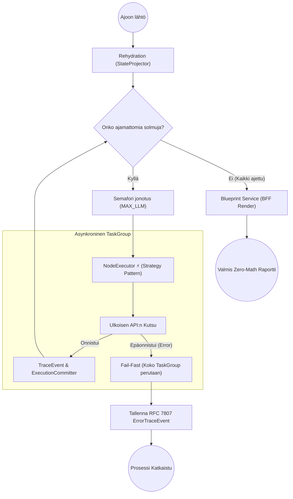

# 03: Palvelukerros ja DAG-moottori (Business Services)

Cognitive Quorumin `backend_v2/services/` -hakemisto sisältää järjestelmän ydinälyn. Kaikki liiketoimintalogiikat, työnkulkujen (DAG) suoritus ja "Backend-For-Frontend" (BFF) -raporttigenerointi suoritetaan tässä kerroksessa turvallisesti eristettynä HTTP-rajapinnoista (Routers).

## DAG-moottori: Arkkitehtuuri ja Asynkronisuus

Työnkulkujen orkesterointi on keskitetty `services/orchestrator/dag_executor.py` -moduuliin. Moottori ei ylläpidä paksua ajonaikaista muistitilaa vaan perustuu puhtaalle Event Sourcing -mallille. Arkkitehtuuri on pilkottu kolmeen eristettyyn komponenttiin:

1. **DAGExecutor (Orkestraattori):** 
   * Vastaa verkon topologian (Dependency Graph) varmistamisesta ja solmujen rinnakkaisajosta.
   * Suorittaa solmut (StepRule) natiiveina `asyncio.TaskGroup` -kapselointeina. Jos yksikin solmu sadoista kaatuu asynkronisen ajon aikana palamattomasti, `TaskGroup` perutaan ja ajon resurssit (esim. tekeillä olevat roikkuvat HTTP-pyynnöt LLM:lle) tapetaan automaattisesti taaten täydellisen "Fail-Fast" nollavuototilan.
   * Hallinnoi ajonaikaista rinnakkaiskattoa vahvan semaforin (`SystemConcurrency.MAX_CONCURRENT_LLM_STEPS`) avulla suojellakseen ulkoisia API-rajoitteita (Rate Limiting).
2. **NodeExecutor (Yksittäisen tason äly - Strategy Pattern):** 
   * Kapseloi tasan yhden askeleen ajolääkityksen (esim. LLMNodeStrategy tai LogicNodeStrategy) täyteen eristykseen.
   * Suorittaa ns. "FinOps Circuit Breaker" -tarkistuksen ennen tekoälykutsua taatakseen, ettei asiakas ylitä budjettia sadoilla tekoälykäskyillä.
   * Ei itse tallenna tietoa tietokantaan, vaan palauttaa `TraceEvent` tai virtuaalisesti siepatun `ErrorTraceEvent` -lokituksen deterministisestä lopputulemasta.
3. **ExecutionCommitter (Event Sourcing -tallennin):** 
   * Ottaa vastaan ajonaikaisen JSON-lokijonon ja puskee "Snapshotit" (`execution_trace` / `step_states`) alastomana Pydantic-datana tuettuihin tallennuskerroksiin (`repository.py`).
   * Pysyy täysin tietämättömänä itse logiikasta varmistaen vain nopeimmat asynkroniset tietokantasiirrot ajon edetessä "Optimistic UI" tukea varten.

### Rehydration (Kesken jääneen työn jatkaminen)
DAG-moottorin nojatessa Event Sourcingiin (aiemmin mainittu `execution_trace`), pystyy prosessi tarvittaessa toipumaan mistä tahansa ulospäin näkyvästä konesaliradasta:
1. Orkestraattori hakee lukitun työn tietokannasta ("Rehydration").
2. `StateProjector` -luokka pyöräyttää kaikki vanhat muistiinkirjatut taustalokit järjestyksessä kerralla muokatakseen sisäisen "Virtual State"n haluttuun pisteeseen.
3. NodeExecutor herättää eloon vain ne solmut, joiden tila oli lokitettu arvoon `pending` tai `failed`, pakoen sokeita massaoletuksia.

## Blueprint Service (BFF Renderöijä)

`backend_v2/services/blueprint.py` on järjestelmän näkyvin "Backend-For-Frontend" kerroksen muotoilija. Koska Frontendissä koodattiin tiukka nollalaskennan "Zero-Math UI" -sääntö, kaikki graafiset pisteytyslokiikat on sidottu yksinomaan tänne.

* Ajossa `BlueprintService` lukee valitun `OutputProfile` -konfiguraation (esim. Executive Summary -näkymä vs. Syvällinen 3D-verkkokuvio). Se analysoi työnkulun lopullisen "FrozenContextin".
* **Zero-Math sääntö:** Blueprint paketoi numeeriset skaalaimet ja värimuunnokset valmiiseen `ReportLayoutDTO` -mallistoon (Akselit, pisteet ja XAI "Missing Context" liputukset). Käyttöliittymä, tai PDF-generaattori ei joudu koskaan miettimään miten x/y korrelaatio ratkaistaan saati mistä teksti pöllittiin (Citation Integrity/Hallucination Flag), sillä ne kaikki ovat puhtaasti palvelimen päättelemässä DTO-putkessa.

## IAM ja Identiteetti

`services/auth.py` valvoo ja todentaa pyynnöt erillisten Custom Claims tai Firebase SDK -tokentapaisten puitteissa (JWT). Moduulissa käsitellään organisaation vaihto-operaatiot (Tenant Isolation), tuetaan sisäänrakennettuina "Bring Your Own Key" (BYOK) hallintoa ja varmennetaan, etteivät ristiin organisaatiot tallenna dataa väärillä `org_` prefikseillä. Lokaalissa "Mock_DB"-tilassa tämä osio ohitetaan ylikuormittavien HTTP-viiveiden estämiseksi ja valtuutetaan keinotekoinen rooli rajapintatestejä varten.
