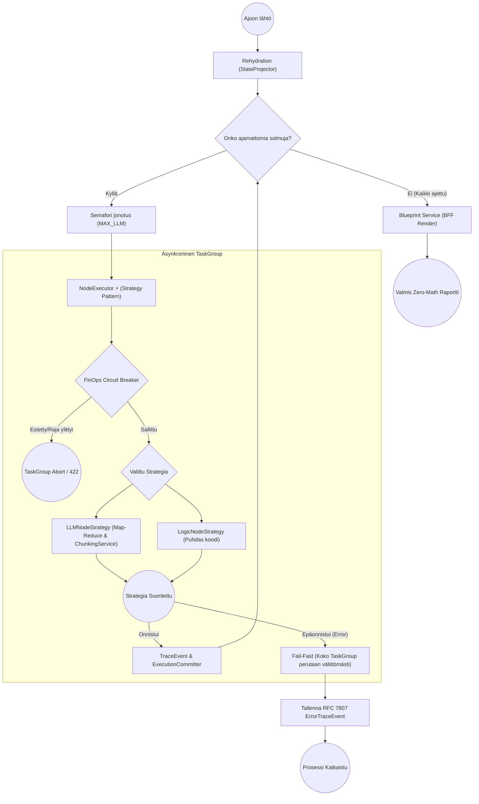

# 03: Palvelukerros ja DAG-moottori (Business Services)

Cognitive Quorumin `backend_v2/services/` -hakemisto sisältää järjestelmän ydinälyn. Kaikki liiketoimintalogiikat, työnkulkujen (DAG) suoritus ja "Backend-For-Frontend" (BFF) -raporttigenerointi suoritetaan tässä kerroksessa turvallisesti eristettynä HTTP-rajapinnoista (Routers).

## Execution Service (Orkestraation portinvartija)

`execution.py` (`ExecutionService`) toimii järjestelmän primäärinä portinvartijana työnkulkujen (DAG) käynnistämiselle ja jatkamiselle (`start_execution`, `resume_execution`). Palvelu ohjaa laajasti asynkronista suoritusta ja tulosten hallintaa:
* **Ingress ja Validointi:** Suorittaa raskaat "Fail-Fast" Pydantic-validoinnit työnkulun ingress-vaiheessa ja generoi dynaamiset käyttöliittymän vihjeet (SDUI) vastaustilan hallintaan.
* **Asynkroninen Raportointi (Epic 14):** Tukee asynkronista raportointia (`render_execution` -> `render_profile_job` Arq jonoon). Tämä ehkäisee käyttöliittymän "infinite loop" -kyselyitä luomalla deterministisen työtunnisteen jota käyttöliittymä voi pollausturvallisesti kuunnella.
* **Force Re-render:** Tarjoaa `clear_profile_synthesis` -funktion, jolla käyttäjä voi pakottaa yksittäisen output profiilin (ja siihen kytketyn PDF:n) tuhoamisen ja uudelleengeneroinnin tietokannasta.
* **Tenant Isolation:** Rajaa tiedon tiukan "Tenant Isolation" -periaatteen mukaisesti. Rajoite on vahvistettu kaikissa perustoiminnoissa (`list_executions`, `get_execution`, `delete_execution`), estäen ristiinlukemisen.
* **FinOps:** Valvoo puitebudjettia "Circuit Breaker" -rajoitteilla yhteistyössä `usage_service.py`:n kanssa suojellakseen osakkaiden kukkaroita karkaavalta AI-kulutukselta.

## DAG-moottori: Arkkitehtuuri ja Asynkronisuus

Työnkulkujen orkesterointi on keskitetty `services/orchestrator/dag_executor.py` -moduuliin. Moottori ei ylläpidä paksua ajonaikaista muistitilaa vaan perustuu puhtaalle Event Sourcing -mallille. Arkkitehtuuri on pilkottu kolmeen eristettyyn komponenttiin:

1. **DAGCompilerService (Shift-Left Pre-Flight Compilation):** 
   * Esivalmistelee ja validoi ylätason riippuvuudet staattisen analytiikan avulla jo työnkulkujen tallennusvaiheessa.
   * Etsii syklisiä riippuvuuksia (Infinite Loops) ja resolvoi tuntemattomia muuttujareferenssejä (`$inputs`, `$steps`) estääkseen kalliin AI-kutsun myöhäisvaiheen kaatumisen ajettaessa.
2. **DAGExecutor (Orkestraattori):** 
   * Vastaa verkon topologian (Dependency Graph) varmistamisesta ja solmujen rinnakkaisajosta. Ennen topologian aloitusta suoritetaan Pre-Hydration: moottori kutsuu Hook-rekisterin `input_processing` -tilaa eristetyllä `HookState`lla purkaakseen ja esikäsitelläkseen datan ajoa varten.
   * Suorittaa solmut (StepRule) natiiveina `asyncio.TaskGroup` -kapselointeina. Jos yksikin solmu sadoista kaatuu asynkronisen ajon aikana palamattomasti, `TaskGroup` perutaan ja ajon resurssit (esim. tekeillä olevat roikkuvat HTTP-pyynnöt LLM:lle) tapetaan automaattisesti taaten täydellisen "Fail-Fast" nollavuototilan.
   * Hallinnoi ajonaikaista rinnakkaiskattoa vahvan semaforin (`SystemConcurrency.MAX_CONCURRENT_LLM_STEPS`) avulla suojellakseen ulkoisia API-rajoitteita (Rate Limiting).
3. **NodeExecutor (Yksittäisen tason äly - Strategy Pattern):** 
   * Kapseloi askeleen ajologiikan (`LLMNodeStrategy` tai `LogicNodeStrategy`) täyteen eristykseen. `LLMNodeStrategy` ei ole vain putki, vaan itsessään laaja Map-Reduce -orkestraattori, joka ottaa vastaan rajattoman atomisen matriisin (`MATRIX_SAMPLING_LIMIT = 0`), pilkkoo sen `ChunkingService`:n avulla turvallisiin massapaloihin välttyäkseen Token-ylikuormalta, ajaa palat rinnakkain, ja yhdistää tulokset deterministisesti (`FlattenedAtomResult`).
   * Suorittaa ns. "FinOps Circuit Breaker" -tarkistuksen ennen kutsua taatakseen, ettei asiakas ylitä budjettia sadoilla käskyillä.
   * Ei itse tallenna tietoa tietokantaan, vaan palauttaa `TraceEvent` tai virtuaalisesti siepatun `ErrorTraceEvent` -lokituksen deterministisestä lopputulemasta.
4. **ExecutionCommitter (Event Sourcing -tallennin):** 
   * Ottaa vastaan ajonaikaisen JSON-lokijonon ja puskee "Snapshotit" (`execution_trace` / `step_states`) alastomana Pydantic-datana tuettuihin tallennuskerroksiin (`repository.py`).
   * Pysyy täysin tietämättömänä itse logiikasta varmistaen vain nopeimmat asynkroniset tietokantasiirrot ajon edetessä "Optimistic UI" tukea varten.

### Rehydration (Kesken jääneen työn jatkaminen)
DAG-moottorin nojatessa Event Sourcingiin (aiemmin mainittu `execution_trace`), pystyy prosessi tarvittaessa toipumaan mistä tahansa ulospäin näkyvästä konesaliradasta:
1. Orkestraattori hakee lukitun työn tietokannasta ("Rehydration").
2. `StateProjector` -luokka pyöräyttää kaikki vanhat muistiinkirjatut taustalokit järjestyksessä kerralla muokatakseen sisäisen "Virtual State"n haluttuun pisteeseen.
3. NodeExecutor herättää eloon vain ne solmut, joiden tila oli lokitettu arvoon `pending` tai `failed`, pakoen sokeita massaoletuksia.

## Admin Studio Service (Ideointi ja mallinnus)

`studio.py` (`Admin Studio Service`) hallinnoi koko järjestelmän domain-malleja (Workflows, Steps, PromptBlocks, OutputProfiles) sekä ylätason `SystemConfig` tiedostoja. Tämä palvelu kapseloi sisäänsä keskitetyn järjestelmänhallinnan logiikan:
* Suorittaa raskaampia graafioperaatioita, kuten työnkulkujen "Shallow-Deep Copy" kloonauksia, säilyttäen tiukan rakenteellisen eheyden.
* Tarjoaa `simulate_workflow()` -graafivalidoinnin etukäteen tapahtuvalle simulaatiolle.
* Valvoo ohi reitittimien kulkevia RBAC-tarkastuksia ja laajoja päivityksiä Admin Studio -toiminnoille.

## Tiedostojen renderöinti, BFF ja Ulkoiset (MCP) Palvelut

`backend_v2/services/blueprint.py` on järjestelmän näkyvin "Backend-For-Frontend" kerroksen muotoilija. Koska Frontendissä vaikuttaa tiukka nollalaskennan "Zero-Math UI" -sääntö, kaikki graafiset pisteytyslokiikat on sidottu yksinomaan tänne.

* Ajossa `BlueprintService` lukee valitun `OutputProfile` -konfiguraation (esim. Executive Summary -näkymä vs. Syvällinen 3D-verkkokuvio). Se analysoi työnkulun lopullisen "FrozenContextin".
* **Zero-Math sääntö:** Blueprint paketoi numeeriset skaalaimet ja värimuunnokset valmiiseen `ReportLayoutDTO` -mallistoon (Akselit, pisteet ja XAI "Missing Context" liputukset). Käyttöliittymä, tai PDF-generaattori ei joudu koskaan miettimään miten x/y korrelaatio ratkaistaan saati mistä teksti pöllittiin (Citation Integrity/Hallucination Flag), sillä ne kaikki ovat puhtaasti palvelimen päättelemässä DTO-putkessa.

**PdfReportService (`pdf_generator.py`)**
Toimii Blueprintin rinnalla ja hyödyntää samaista Layout DTO -pohjaa tulosten paketoinnissa. Se vastaa samalla asynkronisista dokumenttien tallennusajoista ulkoiselle `Storage_driver`ille varmistaen rinnakkaisuuden työnkulun ajon kanssa.

**Machine Control Protocol (MCP)**
Järjestelmään sisältyy `mcp/` -hakemisto, joka toimii agenttisten verkkohakujen ja tekoälyn ulkoisten toimintojen rajapintana. Palvelut kuten `mcp_tool_loop.py` ja luokat kuten `tavily_search_client.py` kykenevät tekemään itsenäistä verkkohakua ulkopuolisista viitekehyksistä, laajentaen suppeaa staattista kontekstia merkittävästi. Moottori käyttää näitä LLM:n orkestroimana asynkronisesti tarvittavan tiedon hakemiseen.

## IAM ja Identiteetti

`services/auth.py` valvoo ja todentaa pyynnöt erillisten Custom Claims tai Firebase SDK -tokentapaisten puitteissa (JWT). Moduulissa käsitellään organisaation vaihto-operaatiot (Tenant Isolation), tuetaan sisäänrakennettuina "Bring Your Own Key" (BYOK) hallintoa ja varmennetaan, etteivät ristiin organisaatiot tallenna dataa väärillä `org_` prefikseillä. Lokaalissa "Mock_DB"-tilassa tämä osio ohitetaan ylikuormittavien HTTP-viiveiden estämiseksi ja valtuutetaan keinotekoinen rooli rajapintatestejä varten.
