# 03: Työnkulkujen Orkestraatio (DAG) & Suoritusmoottori

Oheinen sivu kattaa Cognitive Quorumin todellisen voiman eli tietokantapohjaisesti ohjatut syklittömät työkulkuverkot (`Directed Acyclic Graph`), joissa yksittäisten arviointimatriisien säännöt yhdistyvät täydellisesti erotettuun palvelukerrokseen.

## Työkulkuarkkitehtuuri ja The Anti-Mirror Protocol

```mermaid
graph TD
    A[$inputs.chat_log] --> B(Parser/Normalizer Hook)
    B --> C{DAG Router}
    C -->|Strategy: Fast| D[Step 1: Analyst Agent]
    C -->|Strategy: Strict| E[Step 2: Prosecutor Agent]
    D --> F[Final Aggregation Hook]
    E --> F
    F --> G(ReportDataDTO Flush)
    style D fill:#2b2b2b,stroke:#00a3cc,stroke-width:2px
    style E fill:#2b2b2b,stroke:#e63900,stroke-width:2px
```

### Polymorfinen Node-Orkestraatio (The Strategy Pattern)
Puhdas rajapinta luokassa `BaseNodeStrategy` erottaa suorittavat solmut:
1. **LLMNodeStrategy**: Tuottaa strukturoitua dataa kielimalleilta.
2. **LogicNodeStrategy**: Ajaa ohjelmallisia CPU-bound sääntöjä deterministisesti ilman hallusinaatioita.

### TaskGroup ja The Zombie Thread Death
Tekoälyn verkot ammutaan asynkronisiin silmukoihin suojelevan `asyncio.TaskGroup()` -varjon alla. Jos `asyncio.gather()`-tyyppiset luvat jätetään "Zombeiksi", laukaisee Quorum Arq-worker tasolla välittömän Error Propagation -kaatumisen katkaisten ulkoiset yhteydet hallitusti ilman laittomia ohittamisia.

### Ikuinen Auditoitavuus (Append-Only Event Sourcing)
Ajoprosessi on tismalleen "Append-Only", jossa kognitiivinen askel kapseloidaan lujaan "FrozenContext" -tilaan, lukiten version järjestelmän ytimeen vuosia kestäväksi tallenteeksi.

---

## The Map: Hakemistoryhmien kuvaus (Services & DAG)

Palvelukerros kapseloi kaiken liiketoimintalogiikan irralliseksi API-reitittimistä ja tietokanta-ajureista (Unified Repository).

### `backend_v2/services/` (The Business Logic)
Järjestelmän keskeiset palvelut asuvat täällä. Ne saavat puhtaita Pydantic DTO:ita ruutereilta ja tuottavat dataa takaisin mutatoimatta suoraan HTTP-rakenteita.
- **`orchestrator/`**: Quorumin asynkronisen aivojen koti. Vastaa The Blind Audit ja Fail-Fast protokollista.
  - **`dag_executor.py`**: Yhdistää Async-verkot, syklittömät jonot ja huomioi TaskGroup:n sudenkuopat.
  - **`strategies/`**: *Strategy Pattern* käytännössä. Nämä solmut eristävät mallipuhelut (`LLMNodeStrategy`) raskaasta logiikasta (`LogicNodeStrategy`).
- **`execution.py`**: Ruuteria lähellä elävä palvelu, joka käynnistää uudet Arq Worker -tehtävät.
- **`blueprint.py`**: "BFF Compiler" – palvelu, joka parsii Opaque Stripe ID:iden assosiaatiot työn alkupisteestä ja dynaamisesti luo Output Profileita käyttöliittymän näyttönappeihin.
- **`auth.py`**: IAM, Custom Claims dekoodaus sekä tenant-vastaavuuden (B2B SaaS -suojaukset) auditoinnit ilman tietokanta-hakua.
- **`pdf_generator.py`**: Workerin syövereissä raportteja Prawn-henkisillä työkaluilla muodostava palvelu.
- **`usage_service.py`**: Token-laskenta ja FinOps. Vastaa Tenant Rate-Limiting ja Circuit Breakers -turvaverkoista ("Denial of Wallet").

### `backend_v2/worker.py` (The Async Muscle)
- Aivan juuresta löytyvä Quorumin sydän itsenäiselle prosessoinnille.
- Redis-jonot ammutaan tälle **ARQ (Asynchronous Redis Queue)** Workeriin. Se on erillinen FastAPI-verkosta ja suorittaa raskaat tekoälyverkot.
