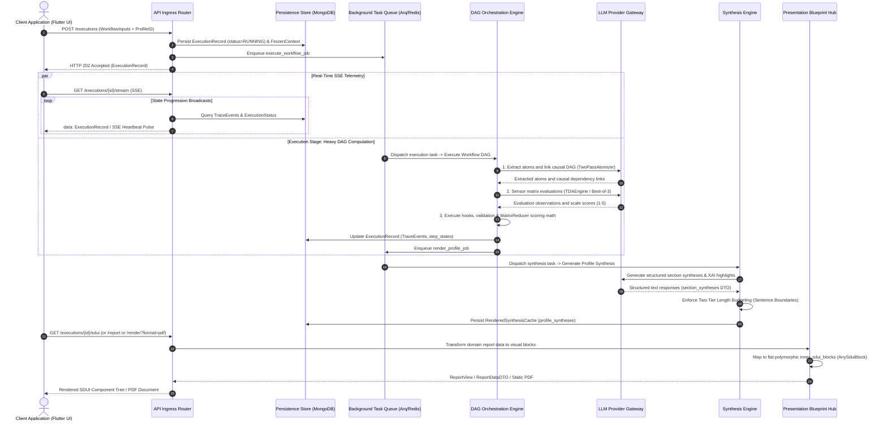

# Cognitive Orchestration Engine

## 1. Executive Summary
The **Cognitive Orchestration Engine** capability is the computational "Brain" of the Compound AI System. It is responsible for taking declarative ontology from the database (PromptBlocks, Workflows, Steps, OutputProfiles), binding it with validated user input, and executing it against foundational language models. This capability is engineered for deterministic reasoning, fault tolerance, low latency, and prefix-matching context caching, utilizing parallel consensus patterns, acyclic topological graph execution, and multi-tier output governance to guarantee robust operation across model providers.

## 2. Architectural Mechanisms & Invariants

The Cognitive Orchestration Engine combines declarative database ontology with runtime state to execute tasks against foundational language models:

### 2.1. Consensus Evaluation via Best-of-Three Flash
Critical reasoning and evaluation tasks dispatch three concurrent lightweight LLM requests (utilizing the `fast` strategy tier) wrapped in a structured `asyncio.TaskGroup`. The system aggregates the parallel responses and resolves the outcome through 2/3 majority consensus:
- **Consensus Resolution**: Requires at least two valid results out of three parallel calls, establishing consensus whenever a 2/3 majority is reached.
- **Epistemic Null Hypothesis Tie-Breaker**: For inconclusive split votes (e.g., 1 PASS, 1 FAIL, 1 ERROR), the tie is resolved using an $O(1)$ polarity mapping (`is_inverse_map`). Inverse assertions (`is_inverse=True`, evaluating the absence of error) resolve to `PASSED` under the presumption of innocence, while standard positive assertions (`is_inverse=False`, requiring affirmative proof) resolve to `FAILED` under the Null Hypothesis.
- **Forensic Guarantee**: Preserves valid evidence quotes on winning consensus while strictly forbidding quote hallucination on tie-broken or failed atoms.

### 2.2. Provider-Agnostic Static-First Context Caching
To maximize context cache survival across foundational model providers (such as Anthropic, OpenAI, and Google Vertex AI), prompt compilers assemble context payloads using a strict "Static-First, Dynamic-Last" topology. Static components (system instructions, structural schemas, performative lexicons, and source texts) are positioned at the beginning of the prompt as an unbroken, mathematically identical prefix. Dynamic data (execution variables, dynamic parameters, and atom queries) is placed at the absolute end of the payload within dedicated `<execution_parameters>` or `<user_payload>` blocks.
The caching layer computes deterministic SHA-256 composite signatures across the static prefix to verify cache hits across requests. Cache lifecycles are hoisted to the orchestrator layer (pre-caching documents before entering parallel tasks, with teardown wrapped in a `try...finally` block after task completion) to prevent premature cache eviction during concurrent execution.

### 2.3. Unified Model Multiplexing & Strategy Routing
Domain services do not hardcode specific model strings, provider SDKs, or vendor-specific API parameters. All requests route through a centralized Model Registry:
- **Abstract Strategy Tiers**: Services request performance tiers (`fast`, `reasoning`, `deep`, `synthesis`), and the registry dynamically resolves the active provider adapter, temperature, top_p, and routing configuration from database system configuration (`SystemConfigModelRegistry`).
- **Provider Adapter Encapsulation**: All vendor-specific behaviors (such as Vertex cached contents with distributed locks, Anthropic cache control headers, and OpenAI automatic caching) are encapsulated within concrete adapter implementations.
- **Pricing Registry SSOT**: Token unit rates and cost metrics are resolved strictly from the authoritative LiteLLM model pricing registry, providing unified FinOps cost accounting and savings estimates without secondary shadow pricing tables.
- **Zero Silent Fallback Guarantee**: If an API call fails or exhausts retry limits, the engine halts immediately with an explicit `AppException` rather than silently substituting an alternate model, preserving longitudinal consistency and audit baselines.

### 2.4. Two-Tier Semaphore Architecture & Concurrency Isolation
Parallel execution enforces strict concurrency bounds without recursive deadlocks:
- **Macro-Level Worker Concurrency**: Background workers acquire an isolated job semaphore governing simultaneous execution tasks.
- **Micro-Level Request Concurrency**: The LLM client manages an independent request semaphore governing outbound model requests.
This two-tier separation prevents parent pipeline tasks and nested model calls from competing for the same semaphore slots, eliminating priority inversions and thread starvation under peak loads.

### 2.5. Data Ingestion & Context Preflight
External inputs (documents, web resources, uploaded files, and chat transcripts) are processed through dedicated ingestion providers that extract, sanitize, and flatten raw text. Before model execution, context preflight validates token consumption against window constraints, applying deterministic pagination and chunking where required to ensure that model input limits are never exceeded.

### 2.6. Two-Pass Atomization & Topological DAG Execution
Complex evaluation workflows decompose tasks into atomic units through two-pass atomization:
1. **Pass 1 (Ontology Extraction)**: Extracts global domain entities, document themes, and semantic anchors.
2. **Pass 2 (Atom Extraction)**: Evaluates specific individual assertions, extracting boolean states and forensic quotes anchored to source text.
These units form a Directed Acyclic Graph (DAG) whose dependencies, edge constraints, and topological order are resolved before dispatching to specialized cognitive engines. The topological evaluator uses non-blocking task groups and per-node signaling events to execute independent nodes concurrently, immediately short-circuiting dependent children when causal preconditions fail.

### 2.7. Asynchronous Background Workers & Non-Blocking Handshake
Workflows execute completely outside the synchronous HTTP request-response cycle:
1. The API Ingress router receives the request, initializes and persists the execution record with `status=RUNNING`, persists the frozen context snapshot, and enqueues the job to an asynchronous Redis-backed task queue.
2. The router returns an immediate `HTTP 202 Accepted` response with the execution record, preventing thread blocking.
3. The client connects to an independent Server-Sent Events (SSE) stream (`/executions/{id}/stream`) to receive real-time execution progress, status updates, and trace events while background worker processes compute the graph.

### 2.8. Sensor Caching Parity (Matrix vs. Regular TDA)
The matrix sensor prompt compiler maintains $O(1)$ context cache efficiency across both regular TDA and matrix assertion evaluations. It compiles global logic, matrix theory context, and large source documents into a static cache prefix, while dynamic, batch-specific assertion data is encapsulated in the dynamic user message. Parallel evaluation batches against the same source text achieve maximum cache hit rates.

### 2.9. Synthesis Payload Compression & Token Shield Stratification
Before qualitative text synthesis, execution states are distilled into compact payloads via dedicated synthesis payload compression:
- **Metadata Stripping**: All raw context keys, internal signatures, and intermediate trace metadata are stripped from the payload.
- **Evaluation Pruning**: Evaluations are normalized into distilled evaluation models with character-length bounds derived from central settings.
- **Token Shield Stratification**: When evaluation counts exceed configured thresholds, the Token Shield protocol allocates 70% of the evaluation budget to critical deficits (`FAILED`, `UNMET`, `NON_COMPLIANT`), sorts by quote length and atom identifier to prioritize rich forensic evidence, enables dynamic spillover to strengths, and applies a final canonical sort by atom identifier to guarantee byte-for-byte deterministic JSON serialization.
- **Fail-Fast Safeguard**: If an execution payload becomes empty after compression, the system halts with an explicit validation error rather than allowing the model to hallucinate an empty report.

### 2.10. Synthesis Source Filtering & Analytical Context Protection
Step definitions declare explicit synthesis source flags (`is_synthesis_source: bool`). The synthesis distillation pipeline strictly filters available source step DTOs, omitting unparsed raw document ingestion steps (`is_synthesis_source: false`) from text synthesis prompt envelopes. This preserves prompt token budgets exclusively for analytical specialist findings, preventing token saturation and attention dilution in the synthesis model.

### 2.11. Matrix Explanation Service & Evidence Curation
Matrix evaluations and qualitative explanation assembly are isolated within a dedicated matrix explanation service:
- **Tripartite Configuration Resolution**: Resolves quote and unmet criteria limits following priority order: Output Profile configuration override -> Global settings default.
- **Evidence Curation**: Curates supporting evidence using ranked round-robin selection across behavioral claims ranked by quote length, with candidate pre-deduplication to prevent single-claim and deduplication starvation.
- **Deficit Curation**: Curates unmet criteria sorted in ascending scale score order with alphabetical tie-breaking on claim label (critical deficits first).
- **Direct Rust Serialization**: Enforces direct C/Rust serialization via a dedicated list `TypeAdapter` to eliminate double-serialization overhead in background workers.

### 2.12. Two-Tier Length Budgeting & Sentence Boundary Preservation
Output volume and semantic coherence are governed through a two-tier length budgeting architecture:
- **Tier 1 (Prompt-Level Budgeting)**: Five canonical section budgets configured on the output profile (`synthesis_length_constraint`, `matrix_graph_length_constraint`, `row_explanation_length_constraint`, `xai_length_constraint`, and `variance_length_constraint`) are compiled directly into `<section_budget>` XML boundaries at prompt generation time, instructing the model on target character counts.
- **Tier 2 (Post-Generation Sentence Boundary Guardrail)**: If generated text exceeds the maximum character budget, a dedicated length budget enforcer scans backwards within a [60%, 100%] window of the budget ceiling to locate the nearest terminal punctuation (`.`, `!`, `?`). This trims the output cleanly at a valid sentence boundary, preventing mid-sentence and mid-word slicing while strictly respecting the character ceiling. If a required section synthesis directive or budget configuration is absent for a given profile layout, the worker logs a structured warning and gracefully omits that specific synthesis generation task without halting the pipeline or falling back to hardcoded defaults.

### 2.13. Epistemic Separation in Prompt Compilation
Prompt assembly strictly separates operational directives from bibliographic metadata:
- **Operational Directives**: Standard prompt blocks extract purely operational instruction text (`ai_description`), excluding raw URLs and citations from runtime prompt bodies to prevent token bloat and attention distraction.
- **Academic Grounding**: For matrix evaluations, academic references are injected as clean semantic context blocks (`<theory_context>`), derived exclusively from `PromptBlock.theory_grounding` (`TheoryGrounding`), activating the model's pre-trained conceptual representations without including un-actionable URL strings.

### 2.14. ExecutionEngine Protocol & Strategy Dispatch
DAG node execution decouples macro-level routing from micro-level execution pipelines:
- **ExecutionEngine Protocol**: The orchestrator delegates tasks to specialized engines conforming to the `ExecutionEngine` protocol:
  - `TDAEngine`: Evaluates matrix assertions and extractive sensor rules.
  - `SynthesisEngine`: Generates structured profile syntheses and qualitative narratives.
  - `PromptEngine`: Executes standard non-matrix structured steps.
- **Orthogonal Strategy Decoupling**: Node dispatch resolves via a static strategy registry based on step type, while model tier resolution (`fast`, `reasoning`, `deep`) is handled orthogonally by the model router. Any execution engine can run with any model strategy tier without altering underlying dispatch logic. All engines communicate via strict immutable request and result DTOs with isolated concurrency controls.

### 2.15. Tripartite Prompt Architecture & Four-Layer Clean Stack
All system prompts are constructed through standardized prompt builders and static prompt modules organized into three decoupled functional tiers:
1. **Common Directives**: Shared foundational building blocks, linguistic context formatting, and structured system directives utilized across all prompt pipelines.
2. **Graph Execution Directives**: Step-level operational constraints, atom extraction prompts, causal graph linking protocols, and sensor matrix evaluation system prompts governing DAG execution.
3. **Synthesis Directives**: Qualitative reporting instructions, server-driven UI mandates, section synthesis guidelines, matrix graph narratives, row explanations, variance analysis, and explainable AI instructions governing report synthesis.

Every compiled prompt strictly adheres to the Four-Layer Clean Stack hierarchy:
- **Layer 1: Static System Directives & Mandates** (Static prefix for context caching).
- **Layer 2: Theory Grounding & Epistemic Context** (Academic references in `<theory_context>`).
- **Layer 3: Matrix Objective & Extraction Protocol** (Step-level extraction behavior).
- **Layer 4: Dynamic User Payload & Execution Variables** (Runtime text payloads, atom aliases, and dynamic inputs at the absolute tail).

All prompt-building pipelines route execution through `LLMTaskExecutor` to guarantee schema validation, token usage tracking, and model strategy multiplexing.

### 2.16. Structured Grounding & CDATA Prompt Tag Compilation
Matrix sensor prompt compilation enforces structured semantic grounding with CDATA breakout protection across all evaluation assertions:
- **Structured Semantic Tags**: Discrete assertion parameters are compiled into dedicated XML blocks: `<contrastive_grounding>` (enclosing `<acceptable>` and `<rejected>` exemplars), `<acceptance_criteria>` (ordered verification instructions), `<anti_patterns>` (disqualifying conditions), and `<syntactic_anchors>` (fast-filtering lexical tokens).
- **CDATA Breakout Shielding**: All dynamic assertion text is wrapped in `<![CDATA[...]]>` containers via `TemplateProcessor.encapsulate_payload()`, strictly preventing user-authored quotation marks, XML characters (`<`, `>`, `&`), or punctuation from escaping tag boundaries and executing prompt injection.
- **Prompt Fidelity Expansion**: Structured few-shot contrastive pairs and anti-patterns provide nuanced cognitive boundaries, expanding prompt tokens (+100–400 tokens per atom) while remaining strictly bounded within model context ceilings by `MatrixSamplingStrategy`.

## 3. Logical Data Flow & Prompt Assembly Pipeline

```mermaid
flowchart TB
    subgraph DatabaseCollections["Database Collections"]
        PB["Prompt Blocks<br/>(criteria, personas, protocols, rules)"]
        WF["Workflows<br/>(input_mappings, step graphs)"]
        ST["Steps<br/>(expected_inputs, protocols)"]
        OP["Output Profiles<br/>(sections, budgets, layouts)"]
        SC["System Config<br/>(model_registry, mcp_gateways)"]
        EX["Executions<br/>(historical context, past results)"]
    end

    subgraph StaticPromptSSOT["Static Prompt Asset SSOT"]
        direction TB
        subgraph CommonDirectives["Common Directives Tier"]
            GM["Global Mandates<br/>(GLOBAL_MANDATES_XML)"]
            LD["Linguistic Directives<br/>(build_linguistic_context)"]
            PBR["System Directive Builder<br/>(build_system_directive)"]
            HP["Hook Prompts<br/>(Interaction, Curation)"]
        end
        subgraph GraphDirectives["Graph Execution Directives Tier"]
            ME["Matrix Evaluation Directives<br/>(MATRIX_SENSOR_SYSTEM_PROMPT)"]
            AE["Atom Extraction Directives<br/>(Phase 0 & 1 System Prompts)"]
            GL["Graph Linking Directives<br/>(Linker System Prompts)"]
        end
        subgraph SynthesisDirectives["Synthesis Directives Tier"]
            SD["Synthesis Directives<br/>(SYNTHESIS_SYSTEM_PROMPT)"]
            SD2["SDUI Directives<br/>(SDUI Mandates, Section Directives)"]
            STY["Style Directives<br/>(Anti-Jargon, Dynamic Tone)"]
        end
    end

    subgraph PromptBuilders["Prompt Builders (11 Programs)"]
        PFA["1. Primary DAG Prompt Factory<br/>(Layered DAG Evaluation Prompts)"]
        MSPB["2. Matrix Sensor Prompt Builder<br/>(TDA Matrix Sensor)"]
        TPA["3. Two-Pass Atomizer<br/>(Ontology & Atom Extraction)"]
        SWL["4. Sliding Window Linker<br/>(Causal Graph Linking)"]
        WRK["5. Profile Synthesis Pipeline<br/>(Exec Summary, Sections, Rows, Variance)"]
        CPS["6. Chat Parser Service<br/>(Dialogue Reconstruction)"]
        IAH["7. Interaction Role Analyzer<br/>(User Cognitive Role)"]
        TRS["8. Translation Service<br/>(Linguistic Translation)"]
        SVS["9. Source Verification Service<br/>(Claim Extraction & Search Verification)"]
        MTL["10. MCP Tool Loop<br/>(Self-Correction & Tool Dispatch)"]
        SLS["11. Studio Lexicon Service<br/>(Slop Phrase Discovery & Translation)"]
    end

    subgraph EnginesAndGateway["Execution Engines & LLM Gateway"]
        TDA["TDAEngine<br/>(Matrix Assertions)"]
        PME["PromptEngine<br/>(Structured Steps)"]
        SYN["SynthesisEngine<br/>(Profile Synthesis)"]
        EXE["LLM Task Executor<br/>(Schema Enforcement)"]
        LLM["LLM Client<br/>(Unified Model Registry)"]
    end

    PB & WF & ST --> PFA
    GM & LD --> PFA
    PFA --> TDA & PME

    ME & GM --> MSPB
    PB --> MSPB
    MSPB --> TDA

    AE --> TPA --> TDA
    GL --> SWL --> TDA

    SD & HP & SD2 & STY --> WRK
    OP & EX --> WRK
    WRK --> SYN

    PBR & HP --> IAH
    PBR --> CPS & TRS & MTL & SLS
    SC --> SLS & MTL

    TDA & PME & SYN & CPS & IAH & TRS & SVS & MTL & SLS --> EXE
    EXE --> LLM
```

### 3.1. Prompt Builders & Data Feed Mapping

| # | Prompt Builder Program | Primary Responsibility | Database Collections Consumed | Static Prompt Assets Consumed |
|---|---|---|---|---|
| 1 | Primary DAG Prompt Factory | Multi-layer DAG evaluation prompt assembly across steps | `prompt_blocks`, `workflows`, `steps`, `system_config` | Global Mandates XML, Linguistic Context, PromptBlock operational texts |
| 2 | Matrix Sensor Prompt Builder | Segregated cacheable TDA matrix sensor evaluation | `prompt_blocks` (`MatrixPromptBlock`, `TDAAssertion`) | Global Mandates XML, Matrix Sensor System Prompt |
| 3 | Two-Pass Atomizer | Global ontology and fine-grained atom extraction | None (runtime source document chunks) | Ontology & Atom Extraction System Prompts |
| 4 | Sliding Window Linker | Causal DAG dependency extraction across sliding windows | None (runtime extracted atoms) | Linker System & User Prompts |
| 5 | Profile Synthesis Pipeline | Executive summary, section syntheses, row explanations, variance, XAI highlights | `output_profiles`, `executions`, `prompt_blocks` | Synthesis System Prompt, SDUI Mandates, Section Directives, Row & Variance Directives, Profile section budgets |
| 6 | Chat Parser Service | Unstructured conversational text reconstruction into structured turns | None (raw pasted chat text) | Module-level markdown directive via System Directive Builder |
| 7 | Interaction Role Analyzer | User cognitive role classification (Passenger to Architect) | None (runtime chat history) | Interaction Objective & Rules via System Directive Builder |
| 8 | Translation Service | Text translation preserving formatting, tone, and facts | None (raw text payload) | Linguistic Context via System Directive Builder |
| 9 | Source Verification Service | External source claim extraction and search verification | None (runtime source text + search results) | Claim Extraction & Search Verification System Directives |
| 10 | MCP Tool Loop | Tool calling, evidence injection, and claim self-correction | `system_config` (`mcp_gateways`) | Self-Correction System Instruction via System Directive Builder |
| 11 | Studio Lexicon Service | Slop phrase discovery and multilingual literal translation | `system_config` (`performative_lexicons`) | Slop Discovery & Translation Directives via System Directive Builder |

### 3.2. End-to-End Execution Lifecycle

The workflow execution pipeline is partitioned into three decoupled functional stages communicating through event-driven immutable data envelopes:

#### Execution Pipeline Overview

1. **Ingress & Asynchronous Non-Blocking Handshake:**
   - The client issues `POST /executions` with the raw input payload and target output profile identifier.
   - The API Ingress router initializes and persists the `ExecutionRecord` with `status=RUNNING`, stores the frozen context snapshot, enqueues the workflow execution job to the background task queue, and returns an immediate `HTTP 202 Accepted` response to eliminate thread blocking.
2. **Real-Time SSE Telemetry & Graph Execution (Execution Stage):**
   - The client establishes an independent Server-Sent Events stream (`GET /executions/{id}/stream`) to receive real-time state broadcasts.
   - The background worker executes the Directed Acyclic Graph, orchestrating two-pass atom extraction, causal graph linking, TDA matrix evaluation via Best-of-Three consensus, and mathematical normalization.
   - The final execution state is committed to persistence, and the worker enqueues the subsequent synthesis stage.
3. **Structured Qualitative Synthesis (Synthesis Stage):**
   - The synthesis task distills and compresses the raw DAG evaluation state, filtering out unparsed ingestion steps via `is_synthesis_source` and applying Token Shield 70% deficit stratification.
   - The synthesis engine generates structured qualitative text (Executive Summary, Matrix Sections, Row Explanations, XAI Highlights) mapped to specific layout identifiers.
   - The Two-Tier length budget enforcer verifies character ceilings, concluding text on clean sentence boundaries before persisting the result into `RenderedSynthesisCache`.
4. **On-Demand SDUI Presentation (Presentation Stage - Dumb Painter):**
   - When the client or downstream consumer requests the visual report (`GET /executions/{id}/sdui`, `GET /executions/{id}/report`, or PDF export), the presentation blueprint transformer acts as a pure "Dumb Painter", translating domain DTOs into a flat array of `inner_sdui_blocks: list[AnySduiBlock]` with zero runtime LLM calls or domain math.
