# Cognitive Orchestration Engine

## 1. Executive Summary
The **Cognitive Orchestration Engine** capability is the "Brain" of the Compound AI System. It is responsible for taking the static ontology from the database (PromptBlocks), combining it with user input, and executing it against external LLM providers (e.g., Google Vertex AI). This capability is heavily optimized for speed, deterministic output, and fault tolerance, utilizing parallel execution patterns and provider-agnostic caching topologies to eliminate the common pitfalls of naive LLM integration.

## 2. Core Architectural Invariants (The Laws)

These absolute rules (Knowledge Items) govern the global context and must NEVER be violated:

### 2.1. TDA Best-Of-Three Flash (Consensus Architecture)
- **Law:** The system forbids relying on a single, massive, slow "Pro" model call for critical reasoning or evaluation tasks due to high latency and failure rates.
- **Enforcement:** The engine utilizes a parallelized "Best-of-Three" consensus mechanism using fast, lightweight models (e.g., Gemini 2.5 Flash). Three identical prompts are dispatched concurrently. The system then aggregates the responses and enforces a strict 2/3 majority vote to determine the final output. This achieves 98%+ self-consistency while drastically reducing timeout crashes.

### 2.2. Provider-Agnostic Caching Topology (Static-First)
- **Law:** The system must maximize LLM Context Caching (Prompt Caching) hit rates to reduce token costs and latency, regardless of the underlying LLM provider (Anthropic, OpenAI, or Vertex AI).
- **Enforcement:** The PromptCompiler MUST assemble LLM payloads using a strict "Static-First" topology. All static components (System Instructions, Knowledge Items, Performative Lexicons) are compiled and placed at the absolute beginning of the prompt. All highly dynamic variables (User Queries, Opaque IDs, short-lived tokens) are appended at the absolute end. The caching layer generates deterministic **composite hash signatures** (SHA-256) of the static components to identify cache hits globally across the Orchestrator without relying on transient request IDs. Furthermore, cache lifecycle management (pre-caching and teardown) MUST be hoisted to the Orchestrator level (e.g., `EnrichedDagExecutor`) to prevent early cache destruction during parallel TaskGroup execution.

### 2.3. Unified Model Multiplexing
- **Law:** Business logic must never be hardcoded to a specific model version (e.g., `gemini-2.5-pro`).
- **Enforcement:** The orchestration engine routes all LLM requests through a dynamic Model Registry defined in the central static data vault. Operations request logical model tiers (e.g., "fast", "deep", "synthesis") rather than physical model names. This allows administrators to hot-swap models globally without altering a single line of Python code.

### 2.4. Data Ingestion & RAG Preflight
- **Law:** The engine must handle dynamic external context gracefully.
- **Enforcement:** The orchestrator utilizes a suite of Data Ingestion Providers (including Document Extraction, Web Fetching, File Drivers, and Flatteners) to acquire raw context. Before passing this context to the LLM, the system performs RAG Preflight Cache Pagination to optimize token usage and ensure context windows are not exceeded.

### 2.5. Two-Pass Atomization & Execution
- **Law:** Complex workflows require iterative decomposition and execution.
- **Enforcement:** The orchestrator employs Two-Pass Atomization to break down high-level tasks into atomic steps. These atomic units are then routed through a DAG (Directed Acyclic Graph) Engine, ensuring dependencies are resolved correctly before dispatching to the Cognitive Execution Engines (such as TDA and Synthesis engines).

### 2.6. Background Execution & Asynchronous Workers
- **Law:** Heavy cognitive executions must never block the synchronous HTTP request-response cycle.
- **Enforcement:** The system strictly decouples API entry points from LLM execution utilizing an asynchronous background worker. The synchronous FastAPI routes must instantly return an `Execution ID` or a `202 Accepted` status. The orchestration DAG, LLM multiplexing, and heavy synthesis are executed asynchronously by the worker pool, reporting state progression back via the `ExecutionStatus` enum.

### 2.7. Sensor Caching Parity (Matrix vs. Regular TDA)
- **Law:** Context Caching topology must remain intact and O(1) highly efficient even when evaluating disparate structures (Regular TDA vs. Matrix Assertion TDA).
- **Enforcement:** The `MatrixSensorPromptBuilder` enforces structural caching parity by compiling all global logic, Matrix Context, and the massive source document text into the static `build_caching_prefix()`. Highly dynamic, batch-specific data (e.g., matrix assertions wrapped in CDATA encapsulation) are strictly isolated into the dynamic execution parameters. This guarantees that parallel evaluations across the same document reliably hit the Context Cache, avoiding token waste and latency.

### 2.8. Synthesis Payload Compression & Explanation Synthesis
- **Law:** The orchestrator must never send raw, unfiltered DAG evaluation context or unstructured ingestion documents directly into text synthesis generation, nor generate biased or starved syntheses.
- **Enforcement:** Before data is passed to the Synthesis Phase, execution context is distilled into structured, compressed payloads. The pipeline purges heavy raw keys and internal runtime metadata blocks (such as hydrated references, atom quotes, and runtime execution signatures), truncates quotes and reasoning texts according to centralized configuration thresholds, and strictly validates distilled evaluation models. When evaluation ceilings are configured, the Token Shield protocol stratifies evaluations by allocating 70% of the budget to critical deficits and failed evaluations with exact evidentiary backing, allowing dynamic spillover for passed evaluations, and finalizing with a canonical sort for deterministic JSON serialization; when unbounded mode is configured, all valid evaluations are forwarded without truncation. In parallel, synthesis prompt distillation filters source steps according to declarative workflow step rules, preventing upstream raw document ingestion steps from polluting text synthesis prompts. Furthermore, claim curation employs ranked round-robin selection with candidate pre-deduplication to guarantee fair multi-category representation without category starvation, and resolves explanation thresholds via tripartite configuration resolution (output profile overrides taking precedence over global system defaults).

### 2.9. Epistemic Separation in Prompt Compilation
- **Law:** Prompt compilers must strictly decouple operational instructions from bibliographic metadata, preventing token bloat, unclickable URL noise, and attention dilution.
- **Enforcement:** When compiling standard prompt blocks (such as system rules, agent roles, and task definitions), the prompt compiler extracts exclusively operational text (`ai_description`), completely omitting academic citations and URLs to maximize instruction following and context cache determinism. When evaluating cognitive matrices, the prompt compiler injects the academic reference as a pure semantic XML block (`<theory_context>\n{citation_reference}\n</theory_context>`) to activate the model's pre-trained latent knowledge framework. Raw URL strings (`source_url`) are strictly excluded from all LLM prompts, preserving prompt purity while reserving URLs for presentation layer consumers.

### 2.10. ExecutionEngine Protocol & Strategy Dispatch Decoupling
- **Law:** DAG node strategy execution must strictly decouple macro-level step routing from micro-level execution pipelines, and engine resolution must be independent of FinOps model strategies.
- **Enforcement:** The orchestrator delegates multi-step LLM pipelines to standalone `ExecutionEngine` implementations (`TDAEngine` for matrix assertions, `SynthesisEngine` for structured profile synthesis, `PromptEngine` for non-matrix structured LLM steps) conforming to the `ExecutionEngine` protocol. Node execution delegates macro-level strategies (`LLMNodeStrategy` vs `LogicNodeStrategy`) via a static `NODE_STRATEGY_REGISTRY` factory keyed by `StepType`. Engine resolution is deduced orthogonally from the step definition and loaded prompt block ontology, while the `model_strategy` tier (`"fast"`, `"reasoning"`, `"deep"`) is forwarded purely to the model router. All engines strictly accept `EngineExecutionRequest` and return `EngineExecutionResult` DTOs, safely wrapping concurrency limiters in nullable context managers (`contextlib.nullcontext`) and isolating task running events inside acquired semaphore locks.

### 2.11. Universal Prompt-Building Architecture & Data Feeds
- **Law:** All LLM prompts across the system must be constructed through standardized prompt builders and Single-Source-of-Truth (SSOT) static prompt modules, fed exclusively by declarative ontology tables and runtime state.
- **Enforcement:** The orchestrator defines a closed set of 11 prompt-building programs across 4 functional domains (DAG Evaluation, Matrix Sensor Evaluation, Synthesis Reporting, and Internal Utility Services). These builders compile static prompt assets from `models/prompts/` (e.g. `GLOBAL_MANDATES_XML`, `MATRIX_SENSOR_SYSTEM_PROMPT`, synthesis directives, and linguistic directives) with dynamic domain data retrieved from 8 database collections (`prompt_blocks`, `workflows`, `steps`, `output_profiles`, `system_config`, `executions`, `organizations`, `users`). Every prompt-building path routes execution through `LLMTaskExecutor` (`execute_structured_task` or `execute_chat_task`) to guarantee strict Pydantic V2 schema validation, token usage tracking, and model strategy multiplexing.

## 3. Logical Data Flow & Prompt Assembly Pipeline

```mermaid
flowchart TB
    subgraph "Database Collections"
        PB["prompt_blocks<br/>(criteria, personas, protocols, rules)"]
        WF["workflows<br/>(input_mappings, step graphs)"]
        ST["steps<br/>(expected_inputs, protocols)"]
        OP["output_profiles<br/>(sections, layouts)"]
        SC["system_config<br/>(model_registry, mcp_gateways)"]
        EX["executions<br/>(historical context, past results)"]
    end

    subgraph "Static Prompt Asset SSOT"
        GM["global_mandates.py<br/>(GLOBAL_MANDATES_XML)"]
        ME["matrix_evaluation.py<br/>(MATRIX_SENSOR_SYSTEM_PROMPT)"]
        SD["synthesis_directives.py<br/>(Executive, 1D/2D/3D/Text, Row, XAI)"]
        HP["hook_prompts.py<br/>(Interaction, Curation)"]
        SD2["sdui_directives.py<br/>(SDUI Mandates, Section Directives)"]
        STY["style_directives.py<br/>(Coaching Tone, Anti-Jargon, Sparse Data)"]
        LD["linguistic_directives.py<br/>(build_linguistic_context)"]
        AE["atom_extraction.py<br/>(Phase 0 & 1 Prompts)"]
        GL["graph_linking.py<br/>(Linker Prompts)"]
        PBR["prompt_builder.py<br/>(build_system_directive)"]
    end

    subgraph "Prompt Builders (11 Programs)"
        PFA["1. PromptFactory.build()<br/>(Layered DAG Prompts)"]
        MSPB["2. MatrixSensorPromptBuilder<br/>(TDA Matrix Sensor)"]
        TPA["3. TwoPassAtomizer (Phase 0/1)<br/>(Ontology & Atom Extraction)"]
        SWL["4. SlidingWindowLinker<br/>(Causal Graph Linking)"]
        WRK["5. worker.py Synthesis Tasks<br/>(Exec Summary, Sections, Rows, Variance)"]
        CPS["6. ChatParserService<br/>(Pasted Chat Reconstruction)"]
        IAH["7. analyze_interaction_role<br/>(User Cognitive Role)"]
        TRS["8. translation_service<br/>(Linguistic Translation)"]
        SVS["9. SourceVerificationService<br/>(Claim Extraction & Search Verification)"]
        MTL["10. MCPToolLoop<br/>(Self-Correction & Tool Dispatch)"]
        SLS["11. StudioLexiconService<br/>(Slop Phrase Discovery & Translation)"]
    end

    subgraph "Execution Engines & LLM Gateway"
        TDA["TDAEngine"]
        PME["PromptEngine"]
        SYN["SynthesisEngine"]
        EXE["LLMTaskExecutor"]
        LLM["LLMClient (Model Registry)"]
    end

    PB & WF & ST --> PFA
    GM & LD --> PFA
    PFA --> TDA & PME

    ME & GM --> MSPB
    PB --> MSPB
    MSPB --> TDA

    AE --> TPA --> TDA
    GL --> SWL --> TDA

    SD & HP & SD2 & STY --> WRK
    OP & EX --> WRK
    WRK --> SYN

    PBR & HP --> IAH
    PBR --> CPS & TRS & MTL & SLS
    SC --> SLS & MTL

    TDA & PME & SYN & CPS & IAH & TRS & SVS & MTL & SLS --> EXE
    EXE --> LLM
```

### 3.1. Prompt Builders & Data Feed Mapping

| # | Prompt Builder Program | Primary Responsibility | Database Collections Consumed | Static Prompt Assets Consumed |
|---|---|---|---|---|
| 1 | `PromptFactory.build()` | Primary multi-layer DAG evaluation prompt assembly | `prompt_blocks`, `workflows`, `steps`, `system_config` | `GLOBAL_MANDATES_XML`, `build_linguistic_context()`, `PromptBlock` operational texts |
| 2 | `MatrixSensorPromptBuilder` | Segregated cacheable TDA matrix sensor evaluation | `prompt_blocks` (`MatrixPromptBlock`, `TDAAssertion`) | `GLOBAL_MANDATES_XML`, `MATRIX_SENSOR_SYSTEM_PROMPT` |
| 3 | `TwoPassAtomizer` | Phase 0 Global Ontology + Phase 1 Atom Extraction | None (runtime document text chunks) | `PHASE_0_SYSTEM_PROMPT`, `PHASE_1_SYSTEM_PROMPT` |
| 4 | `SlidingWindowLinker` | Causal DAG dependency extraction across sliding windows | None (runtime extracted atoms) | `LINKER_SYSTEM_PROMPT`, `LINKER_USER_PROMPT` |
| 5 | `worker.py` Synthesis Tasks | Executive summary, section syntheses, row explanations, variance, XAI | `output_profiles`, `executions`, `prompt_blocks` | `DEFAULT_SYNTHESIS_SYSTEM_PROMPT`, `SYNTHESIS_SDUI_MANDATES`, `EXECUTIVE_SUMMARY_DIRECTIVE`, `MATRIX_1D/2D/3D/TEXT_SYNTHESIS_DIRECTIVE`, `ROW_EXPLANATION_DIRECTIVE`, `VARIANCE_EXPLANATION_DIRECTIVE`, `XAI_EXPLANATIONS_DIRECTIVE` |
| 6 | `ChatParserService` | Unstructured chat reconstruction into structured turns | None (raw pasted chat text) | Module-level Markdown directive via `build_system_directive()` |
| 7 | `analyze_interaction_role` | User cognitive role classification (Passenger to Architect) | None (runtime chat history) | `INTERACTION_OBJECTIVE`, `INTERACTION_RULES` via `build_system_directive()` |
| 8 | `translation_service` | Text translation preserving formatting and facts | None (raw text payload) | `build_linguistic_context()` via `build_system_directive()` |
| 9 | `SourceVerificationService` | External source claim extraction and search verification | None (runtime source text + Tavily results) | Module-level XML static directives (`_EXTRACTION_SYSTEM_INSTRUCTION`, `_VERIFICATION_SYSTEM_INSTRUCTION`) |
| 10 | `MCPToolLoop` | Tool calling, evidence injection, and claim self-correction | `system_config` (mcp_gateways) | `_SELF_CORRECTION_SYSTEM_INSTRUCTION` via `build_system_directive()` |
| 11 | `StudioLexiconService` | Slop phrase discovery and multilingual literal translation | `system_config` (performative_lexicons) | `STUDIO_DISCOVER_SLOP_PHRASES`, `STUDIO_TRANSLATE_SLOP_PHRASES` via `build_system_directive()` |

