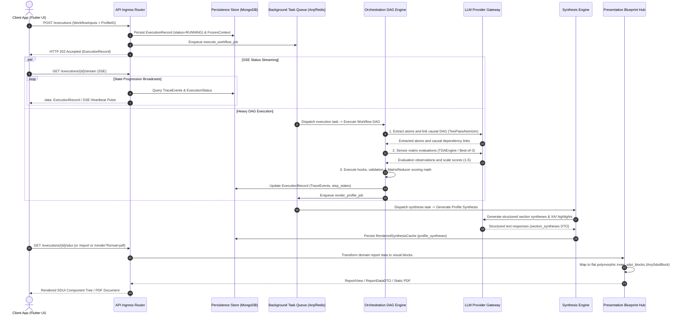

# Cognitive Orchestration Engine

## 1. Executive Summary
The **Cognitive Orchestration Engine** capability is the "Brain" of the Compound AI System. It is responsible for taking the static ontology from the database (PromptBlocks), combining it with user input, and executing it against external LLM providers (e.g., Google Vertex AI). This capability is heavily optimized for speed, deterministic output, and fault tolerance, utilizing parallel execution patterns and provider-agnostic caching topologies to eliminate the common pitfalls of naive LLM integration.

## 2. Architectural Mechanisms & Invariants

The Cognitive Orchestration Engine combines declarative database ontology with runtime state to execute tasks against foundational language models:

### 2.1. Consensus Evaluation via Best-of-Three Flash
Critical reasoning and evaluation tasks dispatch three concurrent, lightweight LLM calls (`gemini-2.5-flash`) wrapped in an `asyncio.TaskGroup`. The system aggregates the responses and determines the outcome via a 2/3 majority vote consensus. In split-vote scenarios without a majority, an epistemic Null Hypothesis tie-breaker resolves inverse versus standard assertions. This architecture provides high self-consistency without single-call timeout failures.

### 2.2. Provider-Agnostic Static-First Context Caching
To maximize context caching across LLM providers (Anthropic, OpenAI, Vertex AI), prompt compilers assemble payloads with a static-first ordering. Static components (system instructions, structural schemas, performative lexicons) are positioned at the beginning of the prompt as an unbroken prefix. Dynamic data (source texts, execution variables, opaque identifiers) is placed at the end. The caching layer generates deterministic SHA-256 composite signatures across the static prefix to verify cache hits across requests, with cache lifecycles managed at the orchestrator level to prevent premature eviction during concurrent task execution.

### 2.3. Unified Model Multiplexing & Strategy Routing
Domain services do not hardcode specific model names or provider SDKs. All requests route through a centralized Model Registry. Services request abstract performance tiers (`fast`, `reasoning`, `deep`, `synthesis`), and the registry resolves the appropriate provider adapter, pricing configuration, and execution parameters.

### 2.4. Data Ingestion & Context Preflight
External inputs (documents, web resources, uploaded files, chat logs) are processed through dedicated ingestion providers that extract, sanitize, and flatten raw text. Before LLM execution, a context preflight service validates token consumption against window constraints, applying deterministic pagination and chunking where required.

### 2.5. Two-Pass Atomization & Topological DAG Execution
Complex evaluation workflows decompose tasks into atomic units through two-pass atomization: global ontology extraction followed by individual assertion extraction. These units form a Directed Acyclic Graph (DAG) whose dependencies, edge constraints, and topological order are resolved before dispatching to specialized cognitive engines (`TDAEngine`, `SynthesisEngine`, `PromptEngine`).

### 2.6. Asynchronous Background Workers
Cognitive workflows execute outside the synchronous HTTP request-response cycle. FastAPI endpoints persist execution records with an initial state, enqueue jobs to a background task queue (Arq/Redis), and return an immediate `HTTP 202 Accepted` response. Execution progress and trace events stream to clients over Server-Sent Events (SSE) while worker processes handle graph computation and LLM requests.

### 2.7. Sensor Caching Parity (Matrix vs. Regular TDA)
The `MatrixSensorPromptBuilder` maintains $O(1)$ context cache efficiency across both regular TDA and matrix assertion evaluations. It compiles global logic, matrix theory context, and large source documents into a static cache prefix, while dynamic, batch-specific assertion data is encapsulated in the dynamic user message. Parallel evaluation batches against the same source text achieve maximum cache hit rates.

### 2.8. Synthesis Payload Compression & Claim Curation
Before qualitative text synthesis, execution states are distilled into compact payloads. Raw runtime keys, hydrated references, and internal execution signatures are stripped, and quotes are bounded by centralized thresholds. When evaluation limits are configured, the Token Shield protocol prioritizes critical deficits and failed evaluations with evidentiary backing while allowing dynamic spillover for passed findings. Claim curation applies ranked round-robin selection across matrix categories to guarantee balanced, multi-perspective representation without category starvation.

### 2.9. Epistemic Separation in Prompt Compilation
Prompt assembly strictly separates operational directives from bibliographic metadata. Standard prompt blocks extract purely operational text (`ai_description`), excluding raw URLs and citations from runtime prompt bodies to prevent token bloat and attention distraction. For matrix evaluations, academic references are injected as clean semantic context blocks (`<theory_context>`), activating the model's pre-trained conceptual representations without including un-actionable URL strings.

### 2.10. ExecutionEngine Protocol & Strategy Dispatch
DAG node execution decouples macro-level routing from micro-level execution pipelines. The orchestrator delegates tasks to specialized engines (`TDAEngine` for matrix assertions, `SynthesisEngine` for structured profile synthesis, `PromptEngine` for non-matrix structured steps) conforming to the `ExecutionEngine` protocol. Node dispatch resolves via a static strategy registry based on step type, while model tier resolution is handled orthogonally by the model router. All engines communicate via strict immutable request and result DTOs with isolated concurrency controls.

### 2.11. Tripartite Prompt Architecture & Output Governance
All system prompts are constructed through standardized prompt builders and static prompt modules, organized into three decoupled functional tiers:
1. **Common Directives:** Shared foundational building blocks, linguistic context formatting, and structured system directives utilized across all prompt pipelines.
2. **Graph Execution Directives:** Step-level operational constraints, atom extraction prompts, causal graph linking protocols, and sensor matrix evaluation system prompts governing DAG execution.
3. **Synthesis Directives:** Qualitative reporting instructions, server-driven UI mandates, section synthesis guidelines, matrix graph narratives, row explanations, variance analysis, and explainable AI instructions governing report synthesis.

Synthesis generation operates decoupled from upstream graph execution constraints, deriving analytical tone and depth directly from the configured `OutputProfile` entity. To enforce deterministic output volume, the synthesis pipeline applies 5 canonical section budgets configured on the output profile (`synthesis_length_constraint`, `matrix_graph_length_constraint`, `row_explanation_length_constraint`, `xai_length_constraint`, and `variance_length_constraint`), compiling them into `<section_budget>` boundaries at prompt generation time. If an individual section synthesis directive or budget configuration is absent for a given profile layout, the synthesis worker logs a structured warning and gracefully omits that specific synthesis generation task without halting the pipeline or resorting to silent fallback defaults. All prompt-building pipelines route execution through `LLMTaskExecutor` to guarantee schema validation, token usage tracking, and model strategy multiplexing.

## 3. Logical Data Flow & Prompt Assembly Pipeline

```mermaid
flowchart TB
    subgraph "Database Collections"
        PB["prompt_blocks<br/>(criteria, personas, protocols, rules)"]
        WF["workflows<br/>(input_mappings, step graphs)"]
        ST["steps<br/>(expected_inputs, protocols)"]
        OP["output_profiles<br/>(sections, layouts)"]
        SC["system_config<br/>(model_registry, mcp_gateways)"]
        EX["executions<br/>(historical context, past results)"]
    end

    subgraph "Static Prompt Asset SSOT"
        direction TB
        subgraph "Common Directives"
            GM["global_mandates.py<br/>(GLOBAL_MANDATES_XML)"]
            LD["linguistic_directives.py<br/>(build_linguistic_context)"]
            PBR["prompt_builder.py<br/>(build_system_directive)"]
            HP["hook_prompts.py<br/>(Interaction, Curation)"]
        end
        subgraph "Graph Execution Directives"
            ME["matrix_evaluation.py<br/>(MATRIX_SENSOR_SYSTEM_PROMPT)"]
            AE["atom_extraction.py<br/>(Atom Extraction Prompts)"]
            GL["graph_linking.py<br/>(Linker Prompts)"]
        end
        subgraph "Synthesis Directives"
            SD["synthesis_directives.py<br/>(SYNTHESIS_SYSTEM_PROMPT, Directives)"]
            SD2["sdui_directives.py<br/>(SDUI Mandates, Section Directives)"]
            STY["style_directives.py<br/>(Anti-Jargon, Sparse Data, Dynamic Tone)"]
        end
    end

    subgraph "Prompt Builders (11 Programs)"
        PFA["1. PromptFactory.build()<br/>(Layered DAG Prompts)"]
        MSPB["2. MatrixSensorPromptBuilder<br/>(TDA Matrix Sensor)"]
        TPA["3. TwoPassAtomizer<br/>(Ontology & Atom Extraction)"]
        SWL["4. SlidingWindowLinker<br/>(Causal Graph Linking)"]
        WRK["5. worker.py Synthesis Tasks<br/>(Exec Summary, Sections, Rows, Variance)"]
        CPS["6. ChatParserService<br/>(Pasted Chat Reconstruction)"]
        IAH["7. analyze_interaction_role<br/>(User Cognitive Role)"]
        TRS["8. translation_service<br/>(Linguistic Translation)"]
        SVS["9. SourceVerificationService<br/>(Claim Extraction & Search Verification)"]
        MTL["10. MCPToolLoop<br/>(Self-Correction & Tool Dispatch)"]
        SLS["11. StudioLexiconService<br/>(Slop Phrase Discovery & Translation)"]
    end

    subgraph "Execution Engines & LLM Gateway"
        TDA["TDAEngine"]
        PME["PromptEngine"]
        SYN["SynthesisEngine"]
        EXE["LLMTaskExecutor"]
        LLM["LLMClient (Model Registry)"]
    end

    PB & WF & ST --> PFA
    GM & LD --> PFA
    PFA --> TDA & PME

    ME & GM --> MSPB
    PB --> MSPB
    MSPB --> TDA

    AE --> TPA --> TDA
    GL --> SWL --> TDA

    SD & HP & SD2 & STY --> WRK
    OP & EX --> WRK
    WRK --> SYN

    PBR & HP --> IAH
    PBR --> CPS & TRS & MTL & SLS
    SC --> SLS & MTL

    TDA & PME & SYN & CPS & IAH & TRS & SVS & MTL & SLS --> EXE
    EXE --> LLM
```

### 3.1. Prompt Builders & Data Feed Mapping

| # | Prompt Builder Program | Primary Responsibility | Database Collections Consumed | Static Prompt Assets Consumed |
|---|---|---|---|---|
| 1 | `PromptFactory.build()` | Primary multi-layer DAG evaluation prompt assembly | `prompt_blocks`, `workflows`, `steps`, `system_config` | `GLOBAL_MANDATES_XML`, `build_linguistic_context()`, `PromptBlock` operational texts |
| 2 | `MatrixSensorPromptBuilder` | Segregated cacheable TDA matrix sensor evaluation | `prompt_blocks` (`MatrixPromptBlock`, `TDAAssertion`) | `GLOBAL_MANDATES_XML`, `MATRIX_SENSOR_SYSTEM_PROMPT` |
| 3 | `TwoPassAtomizer` | Global Ontology & Atom Extraction | None (runtime document text chunks) | `PHASE_0_SYSTEM_PROMPT`, `PHASE_1_SYSTEM_PROMPT` |
| 4 | `SlidingWindowLinker` | Causal DAG dependency extraction across sliding windows | None (runtime extracted atoms) | `LINKER_SYSTEM_PROMPT`, `LINKER_USER_PROMPT` |
| 5 | `worker.py` Synthesis Tasks | Executive summary, section syntheses, row explanations, variance, XAI | `output_profiles`, `executions`, `prompt_blocks` | `SYNTHESIS_SYSTEM_PROMPT`, `SYNTHESIS_SDUI_MANDATES`, `EXECUTIVE_SUMMARY_DIRECTIVE`, `MATRIX_1D/2D/3D/TEXT/GRAPH_SYNTHESIS_DIRECTIVE`, `ROW_EXPLANATION_DIRECTIVE`, `VARIANCE_EXPLANATION_DIRECTIVE`, `XAI_EXPLANATIONS_DIRECTIVE`, `OutputProfile` section budgets |
| 6 | `ChatParserService` | Unstructured chat reconstruction into structured turns | None (raw pasted chat text) | Module-level Markdown directive via `build_system_directive()` |
| 7 | `analyze_interaction_role` | User cognitive role classification (Passenger to Architect) | None (runtime chat history) | `INTERACTION_OBJECTIVE`, `INTERACTION_RULES` via `build_system_directive()` |
| 8 | `translation_service` | Text translation preserving formatting and facts | None (raw text payload) | `build_linguistic_context()` via `build_system_directive()` |
| 9 | `SourceVerificationService` | External source claim extraction and search verification | None (runtime source text + Tavily results) | Module-level XML static directives (`_EXTRACTION_SYSTEM_INSTRUCTION`, `_VERIFICATION_SYSTEM_INSTRUCTION`) |
| 10 | `MCPToolLoop` | Tool calling, evidence injection, and claim self-correction | `system_config` (mcp_gateways) | `_SELF_CORRECTION_SYSTEM_INSTRUCTION` via `build_system_directive()` |
| 11 | `StudioLexiconService` | Slop phrase discovery and multilingual literal translation | `system_config` (performative_lexicons) | `STUDIO_DISCOVER_SLOP_PHRASES`, `STUDIO_TRANSLATE_SLOP_PHRASES` via `build_system_directive()` |

### 3.2. End-to-End Execution Lifecycle

The workflow execution pipeline is partitioned into three decoupled functional stages communicating through event-driven immutable data envelopes:

#### Execution Pipeline Overview

1. **Ingress & Asynchronous Non-Blocking Handshake:**
   - The client issues `POST /executions` with the raw input payload and profile target.
   - The API Ingress router initializes and persists the `ExecutionRecord` with `status=RUNNING`, enqueues `execute_workflow_job` to the background task queue, and returns an immediate `HTTP 202 Accepted` response to prevent thread blocking.
2. **Real-Time SSE Telemetry & Graph Execution:**
   - The client establishes an independent Server-Sent Events stream (`GET /executions/{id}/stream`) to receive real-time state broadcasts.
   - The background worker executes the Directed Acyclic Graph (`DAGExecutor`), orchestrating two-pass atom extraction, causal graph linking, TDA matrix evaluation via Best-of-3 consensus, and mathematical normalization (`MatrixReducer`).
   - The final execution state is committed to the database, and the worker enqueues the subsequent synthesis stage (`render_profile_job`).
3. **Structured Qualitative Synthesis:**
   - The synthesis task distills and compresses the raw DAG evaluation state via `synthesis_distiller_hook`.
   - The `SynthesisEngine` generates structured qualitative text (Executive Summary, Matrix Sections, Row Explanations, XAI Highlights) mapped to specific layout identifiers and stores the result in `RenderedSynthesisCache`.
4. **On-Demand SDUI Presentation (Dumb Painter):**
   - When the client or downstream consumer requests the visual report (`GET /executions/{id}/sdui`, `GET /executions/{id}/report`, or PDF rendering), the presentation blueprint transformer acts as a pure "Dumb Painter", translating domain DTOs into a flat array of `inner_sdui_blocks: list[AnySduiBlock]` with zero runtime LLM calls or domain math.
