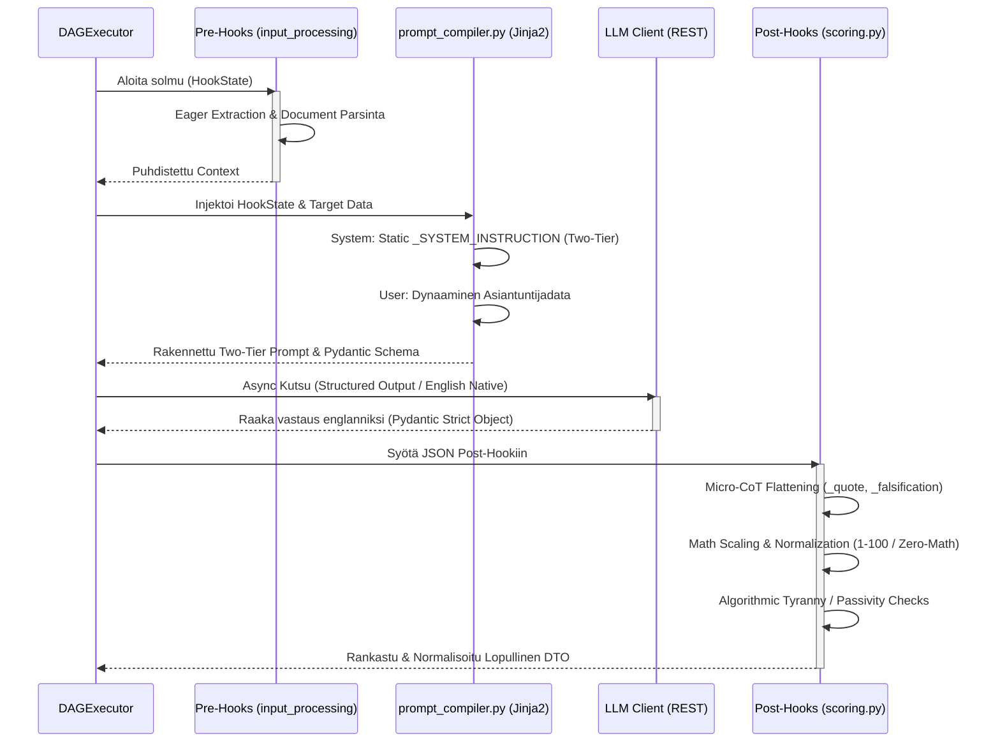

# 04: Natiivit Hookit ja Kieli-integraatiot (LLM)

Cognitive Quorum -järjestelmässä puhtaat työnkulkujen kognitiiviset lisäosat ja ulkoiset tekoälyintegraatiot on eriytetty vahvasti `hooks/` ja `llm/` kerroksiin. Tämä mahdollistaa deterministisen laadunvarmistuksen ohi LLM:n mustan laatikon hallusinaatioiden.

## The Hook Layer (`backend_v2/hooks/`)

Natiivit Python-koukut (Hooks) ovat tilattomia funktioita, joita työnkulun solmut kutsuvat ennen (Pre-Hook) tai jälkeen (Post-Hook) varsinaisen LLM-kutsun. Hookeilla on pääsy työnkulun siihenastiseen `HookState`-kontekstiin ja ne on rekisteröity järjestelmään `hook_registry.py`:n kautta.

### Keskeisimmät Hook-vastuut

1. **Scoring ja Arviointien Normalisointi (`scoring.py`):**
   * **Micro-CoT (Chain of Thought) Litistäminen:** LLM vastaa tyypillisesti monivaiheisella syy-seuraus -verkolla (esim. Quote -> Falsification -> Score). Hook purkaa (`flatten`) nämä monimutkaiset rakenteet kooditasolla atomaarisiksi `_cited_text_quote` ja `_falsification` Data-avaimiksi XAI (Explainable AI) UI-komponenteille.
   * **Nollalaskenta (Zero-Math UI):** Muuntaa karkeat AI:n antamat numeeriset matriisitulokset natiivisti `_scaled` ja `_normalized` (1-100%) arvoiksi, varmistaen ehdottoman yhteneväisen matemaattisen vertailupohjan kaikkien moduulien välille.
   * **Algorithmic Tyranny Kill Switch:** Suojamekanismi, joka tarkkailee generoituja arvoja (esim. `control_ratio` ja sanaston monimuotoisuus). Jos tekoäly tuottaa monotonista huipputulosta ilman variaatiota, hook devalvoi täysin solmun pisteet ja asettaa lokiin "Kill Switch" rangaistuksen.
   * **Passivity Penalty:** Havaitsee tilanteet, joissa LLM valitsee järjestelmällisesti arviointiasteikon pienimmän vaivan tien (minimi score), jolloin tekoälylle annetaan matemaattinen rangaistuskerroin.

2. **Integriteetti ja Turvallisuus (`integrity.py` & `security.py`):**
   * Validointihookit, jotka pysäyttävät suorituksen, jos sisältö osuu estettyihin avainsanoihin tai jos kognition palauttamat lainaukset (Citations) eivät täsmää alkuperäiseen dokumenttiin (Source Hallucination).

3. **Informaation Pre-prosessointi (`input_processing.py`):**
   * Huolehtii mm. massiivisten PDF/Word -tiedostojen ennakkojaottelusta, metatiedustelusta ja normalisoinnista "Eager Extraction" -malliin ennen kalliita LLM-kutsuja.

4. **Raportointi ja Synteesi (`reporting.py` & `synthesis.py`):**
   * Käytetään laajoissa selitys- ja PDF/tulosterakennustyönkuluissa.

5. **Konteksti ja Metatieto (`context_mapper.py`, `metadata.py` & `hydration.py`):**
   * Tilanhallinta ja datan liimaaminen.

6. **Käännökset (`translation_hook.py`):**
   * Hoitaa natiivikielen lokalisoinnin LLM-ajon jälkeen.

7. **Metriikat ja Heuristiikka (`metrics.py`):**
   * Dokumentoi objektiivisen tekstianalytiikan (sanojen määrä, lauseiden pituus), *Control Ratio* (Human vs AI -tekstisuhde), sekä käyttäytymisen heuristiikat (*Say-Do Gap*, *Automation Bias*, *Illusion of Competence*).

8. **Validointihookit (`validation.py`):**
   * Rakennetarkistuksien lisäksi huolehtii tekstien minimipituuden validoinnista (`verify_structure`) raskaalla Fail-Fast -periaatteella. Vastaa myös tuotosten kielen vuotamisen heuristisesta tarkistuksesta (`verify_output_language`).

9. **Arkistointi ja Ennakkotapaukset (`archival.py`):**
   * Sisältää `retrieve_precedent` -hookin, joka hakee aiemmat arvioinnit ("Case Law") oppimismateriaaliksi lennossa asiantuntijoille ja tekoälylle.

10. **Kielitiede ja Performativiteetti (`linguistics.py`):**
    * Vastaa tekoälyn ominaisen korusanaston (esim. "delve into", "kattava katsaus") tunnistavasta `detect_performative_patterns` -hookista. Tunnistettavien lausekkeiden laajuus on määritetty globaalissa `PERFORMATIVE_PATTERNS` -diktionaryssa.

11. **LLM Kontekstihook (`llm.py`):**
    * `configure_llm_context` -hook hakee ja injektoi kulloisenkin strategian (esim. `fast`, `reasoning`) kontekstiin ja reitittää mallin valinnan Model Registryn tietojen perusteella dynaamisesti.

## Tekoälyintegraatiot (`backend_v2/llm/`)

Kieli-integraatiokerros erottaa ulkoiset mallintarjoajat (Vertex AI, OpenAI) järjestelmän sisäisestä asynkronisesta ytimestä.

### Rakenne ja Validointi

* **`handler.py`:** Selittää sen roolin korkean tason operaatioissa, kuten mallien löytämisessä ulkoisista rajapinnoista (Google Vertex Model Garden, OpenAI) ja saatavuuden validoinnissa (`fetch_all_available_models`).
* **`mock.py` & `mock_data.py`:** Nämä mahdollistavat testauksen (Rule: `mocking_mandate_for_llm`), joka tyystin kieltää suorat LLM-HTTP-kutsut CI/CD:ssä ja yksikkötesteissä. Ne eristävät HTTP-kutsut ja palauttavat staattisia JSON-fixtuureja Pydantic-malleihin pakottaen paikallisten fixtuurien käytön verkkovikaisten / aikaa vievien asynkronisten kutsujen sijaan.
* **`client.py` & `provider.py`:** Huolehtivat rajapintatason (HTTP) kommunikaatiosta, asynkronisista aikatasauksista (Retry/Rate Limit) sekä erilaisten mallien `Parsing Mode`ista (esim. JSON Structured Output -pakotukset `GEMINI_JSON` modessa).
* **`schema_builder.py`:** Generoi natiivista Pydantic V2 `Step.output_schema` määrityksestä lennossa tekoälylle tarkan JSON-skeeman (Function Calling / Structured Output). Pakottaa LLM:n rakentamaan syntaktisesti 100% oikeaa objektidataa.
* **Abstraktion pakotus:** LLM-moduulit *eivät koskaan* rakenna työnkulun dynaamisia prompteja itse. Promptsien Jinja2-kokoaminen ja teoria-aineistojen injektointi suoritetaan erillisessä raskaassa `prompt_compiler.py` Service-kerroksen aggregaatissa (*Frozen Architectural Cornerstone*), eikä sitä muokata suoraan injektioriskien vuoksi. Tämän säännön avulla yksittäisen LLM-toteutuksen voi korvata hetkessä toisella (esim. Vertex AI -> Anthropic) ilman minkäänlaisia muutoksia kognitiivisen logiikan reititykseen, ja valmis tekstinäyte tarjoillaan puhtaana LLM-klientin suoritettavaksi.

### Injektiosuojat, Roolien Eristäminen ja Natiivikieli (Mandates)

Kaikki backendin sisäisen infrastruktuurin LLM-työkalut (kuten raakadatan parsinta tai Post-Hook -kerroksessa tapahtuvat lennosta kääntämiset) noudattavat lukittua **"Two-Tier" roolierottelua** ja **"Native English" mandaattia**. Tämä turvaa järjestelmän suorilta ja epäsuorilta Prompt Injection -hyökkäyksiltä ja maksimoi tekoälyn loogisen päättelykyvyn:

*   **Native English Generation Mandate:** LLM ei koskaan tuota alkuperäistä kognitiivista päättelyään (kuten arvioita tai työnkulkujen hypoteeseja) suoraan ei-englannin kielellä. Tämän säännön tarkoitus on välttää "Intelligence Dropping", jossa tekoäly uhraa resurssejaan kieliopilliseen kääntämiseen päättelyn sijaan. Kaikki luodaan ensin englanniksi ja mahdollinen lokalisointi suoritetaan irrallisessa Post-Hook kääntäjässä (`translation_hook.py`) lennosta ennen käyttöliittymään toimittamista.
*   **Roolien Ehdoton Eristäminen (`system` vs `user`):** LLM:ää ei koskaan ohjeisteta dynaamisella `run_chat()` -yhdistelmämerkkijonolla (esim. "Olet asiantuntija. Tässä data: [DATA]"). Kaikki infrastruktuurin parserointiohjeet eristetään tiedoston yläosaan globaaliksi `_SYSTEM_INSTRUCTION` vakioksi. Niitä EIKÄ koskaan viedä tietokantaan, jotta vältytään vahinkomuokkauksilta, jotka voisivat triggeröidä välittömän 500 Pydantic kaatumisen. Opetus välitetään mallille Pydanticin läpi yksinomaisessa `{"role": "system"}` -viestissä. Kaikki ulkopuolinen, tuntematon tuontidata työnnetään täysin erilliseen `{"role": "user"}` -viestiin (Ns. Likainen laatikko) hyödyntäen aitoa Hybrid Prompting (Markdown + XML tags) lähestymistä.
*   **Zero-Fallback ja Centralized Routing:** Sisäiset LLM-työkalut erillisine arkkitehtuurin vastuineen (esim. `chat_parser.py` tai `translation_hook.py`) eivät koskaan instansoi omia kääreitään tai käytä API-mallien suoria SDK-kutsuja. Ne kaikki hyödyntävät tismalleen samaa `LLMClient.from_strategy("fast")` reititystä (jossa `LLMClient.from_strategy()` etsii tietokannasta strategian, luo `LLMProviderConfigin`, ja estää suorat injektiot, yhteistyössä `handler.py`:n kanssa) ja `run_structured_task()` mankelia kuin järjestelmän laajat työnkulkujen (DAG) orkestroinnit. Tämä takaa, että FinOps-kustannusseuranta, itsekorjaavat (Self-Refine) Pydantic-luupit ja Rate Limitit pätevät koko järjestelmään keskitetysti.
*   **Fail-Fast Hook-Tiloissa (Frozen State):** Arkkitehtuurin suojelutradition mukaisesti ydinmallit, kuten valtion (State) siirtymäluokka `HookState`, on Pydantic V2:ssa sinetöity parametrilla `frozen=True`. Hookit saavat lukea historiadataa ohjelmoidusti, mutta ne EIVÄT VOI mutatoida sisääntulevaa sysäystilaa matkan varrella. Jos kehittäjä yrittää muuttaa tilaa (esim. `state.inputs = ...`), järjestelmä kaatuu välittömästi Error Code -ilmoitukseen (`Instance is frozen`). Tämä kieltää sivuvaikutukset (Side Effects). Datamuutokset on palautettava puhtaana `HookResult(state_delta={...})` -objektina koottavaksi isäntäsovelluksessa.
*   **Data Leak Prevention (DLP):** Riippumatta siitä, katkeaako LLM:n synteesi pahantahtoiseen injektioon vai viattomaan JSON Schema Pydantic-validaatioon, lokiin ei *koskaan* tulosteta raakaa käyttäjädataa tai dynaamisia prompteja (PII-vuotoriski / Tietoturvakompromissi). Kaikkiin backendin logfire / logger -lokeihin ja audit-tietokantaan injektoidaan virhetilanteessa vain turvallinen, RFC 7807 -yhteensopiva matemaattinen `ErrorCode` sekä palautuksen Trace ID.
