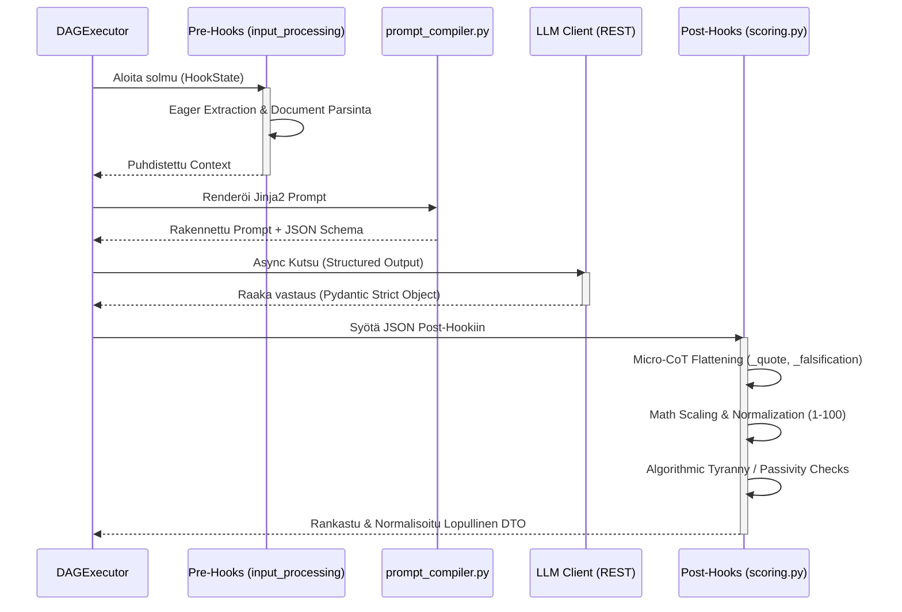

# 04: Natiivit Hookit ja Kieli-integraatiot (LLM)

Quorum V2:ssa puhtaat työnkulkujen kognitiiviset lisäosat ja ulkoiset tekoälyintegraatiot on eriytetty vahvasti `hooks/` ja `llm/` kerroksiin. Tämä mahdollistaa deterministisen laadunvarmistuksen ohi LLM:n mustan laatikon hallusinaatioiden.

## The Hook Layer (`backend_v2/hooks/`)

Natiivit Python-koukut (Hooks) ovat tilattomia funktioita, joita työnkulun solmut kutsuvat ennen (Pre-Hook) tai jälkeen (Post-Hook) varsinaisen LLM-kutsun. Hookeilla on pääsy työnkulun siihenastiseen `HookState`-kontekstiin ja ne on rekisteröity järjestelmään `hook_registry.py`:n kautta.

### Keskeisimmät Hook-vastuut

1. **Scoring ja Arviointien Normalisointi (`scoring.py`):**
   * **Micro-CoT (Chain of Thought) Litistäminen:** V2 LLM vastaa tyypillisesti monivaiheisella syy-seuraus -verkolla (esim. Quote -> Falsification -> Score). Hook purkaa (`flatten`) nämä monimutkaiset rakenteet kooditasolla atomaarisiksi `_cited_text_quote` ja `_falsification` Data-avaimiksi XAI (Explainable AI) UI-komponenteille.
   * **Nollalaskenta (Zero-Math UI):** Muuntaa karkeat AI:n antamat numeeriset matriisitulokset natiivisti `_scaled` ja `_normalized` (1-100%) arvoiksi, varmistaen ehdottoman yhteneväisen matemaattisen vertailupohjan kaikkien moduulien välille.
   * **Algorithmic Tyranny Kill Switch:** Suojamekanismi, joka tarkkailee generoituja arvoja (esim. `control_ratio` ja sanaston monimuotoisuus). Jos tekoäly tuottaa monotonista huipputulosta ilman variaatiota, hook devalvoi täysin solmun pisteet ja asettaa lokiin "Kill Switch" rangaistuksen.
   * **Passivity Penalty:** Havaitsee tilanteet, joissa LLM valitsee järjestelmällisesti arviointiasteikon pienimmän vaivan tien (minimi score), jolloin tekoälylle annetaan matemaattinen rangaistuskerroin.

2. **Integriteetti ja Turvallisuus (`integrity.py` & `security.py`):**
   * Validointihookit, jotka pysäyttävät suorituksen, jos sisältö osuu estettyihin avainsanoihin tai jos kognition palauttamat lainaukset (Citations) eivät täsmää alkuperäiseen dokumenttiin (Source Hallucination).

3. **Informaation Pre-prosessointi (`input_processing.py`):**
   * Huolehtii mm. massiivisten PDF/Word -tiedostojen ennakkojaottelusta, metatiedustelusta ja normalisoinnista "Eager Extraction" -malliin ennen kalliita LLM-kutsuja.

## Tekoälyintegraatiot (`backend_v2/llm/`)

Kieli-integraatiokerros erottaa ulkoiset mallintarjoajat (Vertex AI, OpenAI) järjestelmän sisäisestä asynkronisesta ytimestä.

### Rakenne ja Validointi

* **`client.py` & `provider.py`:** Huolehtivat rajapintatason (HTTP) kommunikaatiosta, asynkronisista aikatasauksista (Retry/Rate Limit) sekä erilaisten mallien `Parsing Mode`ista (esim. JSON Structured Output -pakotukset `GEMINI_JSON` modessa).
* **`schema_builder.py`:** Generoi natiivista Pydantic V2 `Step.output_schema` määrityksestä lennossa tekoälylle tarkan JSON-skeeman (Function Calling / Structured Output). Pakottaa LLM:n rakentamaan syntaktisesti 100% oikeaa objektidataa.
* **Abstraktion pakotus:** LLM-moduulit *eivät koskaan* rakenna työnkulun dynaamisia prompteja itse. Promptsien Jinja2-kokoaminen ja teoria-aineistojen injektointi suoritetaan erillisessä raskaassa `prompt_compiler.py` Service-kerroksen aggregaatissa, minkä jälkeen valmis tekstinäyte tarjoillaan LLM-klientin suoritettavaksi. Tämän säännön avulla yksittäisen LLM-toteutuksen voi korvata hetkessä toisella (esim. Vertex AI -> Anthropic) ilman minkäänlaisia muutoksia kognitiivisen logiikan reititykseen.

### V2026 Arkkitehtuurin Injektiosuojat ja Roolien Eristäminen (Role Segregation)

Kaikki backendin sisäisen infrastruktuurin LLM-työkalut (kuten raakadatan parsinta tai Post-Hook -kerroksessa tapahtuvat lennosta kääntämiset) noudattavat lukittua **"Two-Tier" roolierottelua**. Tämä turvaa järjestelmän suorilta ja epäsuorilta Prompt Injection -hyökkäyksiltä ja mahdollistaa äärimmäisen nopean Anthropic Ephemeral Context Caching -välimuistin hyödyntämisen:

*   **Roolien Ehdoton Eristäminen (`system` vs `user`):** LLM:ää ei koskaan ohjeisteta dynaamisella `run_chat()` -yhdistelmämerkkijonolla (esim. "Olet asiantuntija. Tässä data: [DATA]"). Kaikki infrastruktuurin parserointiohjeet eristetään tiedoston yläosaan globaaliksi `_SYSTEM_INSTRUCTION` vakioksi. Niitä EIKÄ koskaan viedä tietokantaan, jotta vältytään vahinkomuokkauksilta, jotka voisivat triggeröidä välittömän 500 Pydantic kaatumisen. Opetus välitetään mallille Pydanticin läpi yksinomaisessa `{"role": "system"}` -viestissä. Kaikki ulkopuolinen, tuntematon tuontidata työnnetään täysin erilliseen `{"role": "user"}` -viestiin (Ns. Likainen laatikko).
*   **Zero-Fallback ja Centralized Routing:** Sisäiset LLM-työkalut erillisine arkkitehtuurin vastuineen (esim. `chat_parser.py` tai `translation_hook.py`) eivät koskaan instansoi omia kääreitään tai käytä API-mallien suoria SDK-kutsuja. Ne kaikki hyödyntävät tismalleen samaa `LLMClient.from_strategy("fast")` reititystä ja `run_structured_task()` mankelia kuin järjestelmän laajat työnkulkujen (DAG) orkestroinnit. Tämä takaa, että FinOps-kustannusseuranta, itsekorjaavat (Self-Refine) Pydantic-luupit ja Rate Limitit pätevät koko järjestelmään keskitetysti.
*   **Fail-Fast Hook-Tiloissa (Frozen State):** Arkkitehtuurin suojelutradition mukaisesti ydinmallit, kuten valtion (State) siirtymäluokka `HookState`, on Pydantic V2:ssa sinetöity parametrilla `frozen=True`. Hookit saavat lukea historiadataa ohjelmoidusti, mutta ne EIVÄT VOI mutatoida sisääntulevaa sysäystilaa matkan varrella. Jos kehittäjä yrittää muuttaa tilaa (esim. `state.inputs = ...`), järjestelmä kaatuu välittömästi Error Code -ilmoitukseen (`Instance is frozen`). Tämä kieltää sivuvaikutukset (Side Effects). Datamuutokset on palautettava puhtaana `HookResult(state_delta={...})` -objektina koottavaksi isäntäsovelluksessa.
*   **Data Leak Prevention (DLP):** Riippumatta siitä, katkeaako LLM:n synteesi pahantahtoiseen injektioon vai viattomaan JSON Schema Pydantic-validaatioon, lokiin ei *koskaan* tulosteta raakaa käyttäjädataa tai dynaamisia prompteja (PII-vuotoriski / Tietoturvakompromissi). Kaikkiin backendin logfire / logger -lokeihin ja audit-tietokantaan injektoidaan virhetilanteessa vain turvallinen, RFC 7807 -yhteensopiva matemaattinen `ErrorCode` sekä palautuksen Trace ID.
