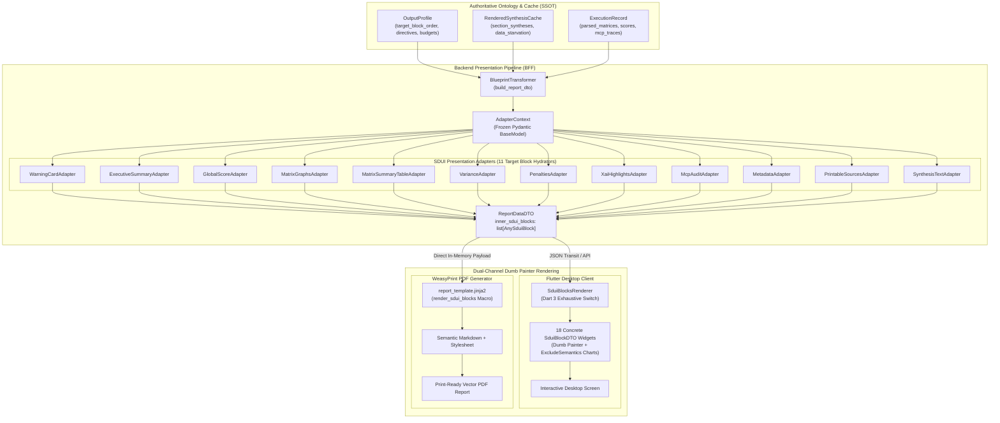

# Server-Driven UI & Presentation

## 1. Executive Summary
The **Server-Driven UI & Presentation** capability governs the user-facing "Surface" of the Compound AI System. Its foundational architectural premise is the **Dumb Painter Pattern**: the client application (Flutter desktop frontend) and the report export engine (WeasyPrint HTML-to-PDF compiler) contain zero business logic, zero layout heuristics, zero scoring math, and zero prompt compilation routines. The backend acts as the sole authoritative state machine, compiling complex cognitive graphs and evaluation models into a deterministic, flat sequence of polymorphic visual blocks (`inner_sdui_blocks`). The presentation surfaces merely paint the declarative Markdown, typography, theme tokens, and structured data payloads they receive. This architecture guarantees strict 1:1 cross-platform semantic parity between interactive desktop dashboards and static vector PDF publications.

## 2. Architectural Principles & Mechanisms

### 2.1. Dumb Painter Flat Polymorphic Pipeline (`inner_sdui_blocks`)
The presentation layer strictly enforces a flat, sequentially ordered array: `inner_sdui_blocks: list[AnySduiBlock]`. Nested macro-routing trees, layout dictionaries (`layouts`), and client-side presentation inference are permanently banned. All report sections, graphs, summaries, and narratives are flattened by the backend into this linear array. The client iterates sequentially through the blocks, dispatching each block strictly according to its discriminator variant.
Adapters assemble report sections in a strict, predictable sequential structure:
1. **Header Block**: `MarkdownBlock(text="### " + title)`
2. **Synthesis Narrative**: `ParagraphBlock(text=synthesis_narrative)`
3. **Data Visualization Component**: Dedicated chart or table (`SduiRadarChartBlock`, `SduiScatterPlotBlock`, `SduiQuadrantMatrixBlock`, `SduiMetrics1DBlock`, `SduiMatrixTableBlock`) with its internal `title` attribute explicitly set to `None` to prevent duplicate header rendering.
4. **Citations / Sources**: Localized footer blocks (`MarkdownBlock(text="#### " + localized_sources)`, `PrintableSourcesBlock`).
For text-only views, the data visualization component is omitted entirely, producing strictly `MarkdownBlock` -> `ParagraphBlock`. All scaling math, score calculations, date formatting, and static headers are pre-computed and pre-localized on the backend, ensuring client rendering remains mathematically decoupled from presentation.

### 2.2. Strict Polymorphic Serialization & Discriminated Unions (18 Block Types)
All dynamic UI layout blocks are strictly typed using polymorphic discriminated unions across both language boundaries:
- **Backend (Python Pydantic V2)**: `AnySduiBlock = Annotated[..., Field(discriminator="block_type")]` in `backend_v2/models/view/sdui.py`. Every concrete child model inherits from `SduiBlockBase`, configuring `model_config = ConfigDict(title="<block_type>", strict=True, extra="forbid")` and binding a literal discriminator field (`block_type: Literal["<block_type>"]`).
- **Frontend (Flutter Dart 3)**: Sealed class `@Freezed(unionKey: 'block_type') sealed class SduiBlockDTO` in `client_app_v2/lib/shared/models/sdui_block_dto.dart`. Every union variant enforces `@JsonSerializable(disallowUnrecognizedKeys: true)`.
- **Exhaustive Renderer Matching**: In `sdui_blocks_renderer.dart`, client-side rendering uses Dart 3 native `switch` expressions over `SduiBlockDTO` exhaustively matching all 18 concrete block types without wildcard defaults (`_ =>`):
  1. `hero_insight`: High-priority analytical takeaway with severity iconography.
  2. `paragraph`: Markdown narrative prose with theme typography.
  3. `bullet_list`: Structured bullet points with optional emphasis.
  4. `alert_box`: Themed alerts with visual intent (`VisualIntent.CRITICAL_OVERRIDE`, `WARNING`, `INFO`).
  5. `accordion`: Collapsible container for extensive analytical details.
  6. `markdown`: Raw GitHub-flavored Markdown document chunk.
  7. `quote_card`: Forensic quote citation anchored to source document fragments.
  8. `warning_card`: System alert for operational exceptions and data starvation.
  9. `n_a_card`: Explicit null-state card for un-evaluated or skipped criteria.
  10. `grid`: Dynamic multi-column layout for comparative metrics.
  11. `metadata`: Execution metadata, execution timestamp, user context, token telemetry, and financial costs.
  12. `3d_matrix`: Multi-axis radar chart for multi-dimensional competency models.
  13. `2d_compare`: Scatter plot for bivariate comparative evaluations.
  14. `quadrant_matrix`: Four-quadrant matrix for variance and authenticity analysis.
  15. `matrix_summary`: Comprehensive tabular matrix of evaluation scores, columns, and qualitative extension labels.
  16. `1d_metrics`: Linear scorecard list for individual matrix rows and indicators.
  17. `score_card`: Prominent executive scorecard displaying the aggregated global score and penalty adjustments.
  18. `audit_trail`: Immutable trace table of external tool interactions and MCP gateway invocations.
Any unexpected discriminator or malformed schema triggers an immediate Fail-Fast crash (`AppException` on the backend, caught by `AppErrorBoundary` on the frontend) rather than silently dropping elements or hiding them with empty widgets (`SizedBox.shrink()`).

### 2.3. Self-Contained SDUI Presentation Adapters
Presentation logic is modularized into isolated presentation adapters under `backend_v2/services/sdui/adapters/`. Every adapter strictly adheres to a standardized Two-Section Architecture:
- **Section 1 (Aesthetics Rules Dictionary)**: A module-level constant dictionary named `{ADAPTER_NAME}_RULES` placed prior to the class definition. This dictionary centralizes all visual styling decisions, mapping domain keys to visual properties (`severity`, `icon_name`, label keys). The adapter accesses rules via strict direct key indexing (`RULES[key]`). Missing keys trigger an immediate RFC 7807 error and an `AppException`, preventing unconfigured attributes from silently defaulting.
- **Section 2 (Adapter Class)**: An adapter class exposing a single `@staticmethod def build(context: AdapterContext) -> list[AnySduiBlock]`. It reads domain state from the context, queries visual properties from Section 1, and emits flat `AnySduiBlock` instances.
- **Immutable Context Envelope (`AdapterContext`)**: The input parameter `AdapterContext` is a frozen Pydantic V2 model (`ConfigDict(frozen=True, strict=True, extra="forbid")`) instantiated once by `BlueprintTransformer` before the dispatch loop and passed identically to all hydrators. It provides zero-cost $O(1)$ predicate helpers (such as `is_data_starved`) while prohibiting side-channel keyword argument mutations.

The adapter cluster comprises 11 canonical hydrators mapped to `TargetBlockType` enums:
1. `ExecutiveSummaryAdapter` (`EXECUTIVE_SUMMARY_BLOCK`): Transforms profile executive narratives and cognitive persona assessments into `ParagraphBlock` and `HeroInsightBlock`.
2. `GlobalScoreAdapter` (`GLOBAL_SCORE_BLOCK`): Formats the normalized, penalty-adjusted composite score into an executive `SduiScoreCardBlock`.
3. `MatrixGraphsAdapter` (`MATRIX_GRAPHS_BLOCK`): Renders evaluated matrix synthesis groups into radar charts, scatter plots, 1D metric scorecards, or text-only views with localized headers and qualitative explanations.
4. `MatrixSummaryTableAdapter` (`MATRIX_SUMMARY_TABLE_BLOCK`): Assembles evaluated axes into comprehensive comparative tables with localized column headers and extension badges.
5. `VarianceAdapter` (`VARIANCE_VALIDATION_BLOCK`): Evaluates Cartesian variance across substantive cognitive depth and mechanical jargon load, assembling quadrant matrix visualizations (`SduiQuadrantMatrixBlock`) and analytical explanations. Substantive cognitive depth is extracted strictly and deterministically from the matrix block designated by `OutputProfile.variance_target_block`.
6. `PenaltiesAdapter` (`PENALTIES_BLOCK`): Maps applied policy or security penalties into `AlertBlock` notifications.
7. `XaiHighlightsAdapter` (`GROUPED_EXTENSIONS_BLOCK`): Curates behavioral claim highlights using fair round-robin interleaving to prevent single-category presentation bias.
8. `McpAuditAdapter` (`AUDIT_TRAIL_BLOCK`): Serializes immutable MCP tool invocations into an `SduiAuditTrailBlock`.
9. `MetadataAdapter` (`METADATA_BLOCK`): Emits execution metadata, execution timing, user context, token consumption, and financial costs into `SduiMetadataBlock`.
10. `PrintableSourcesAdapter` (`PRINTABLE_SOURCES_BLOCK`): Formats bibliographic citations, academic grounding, and extracted source anchors into verifiable citation lists.
11. `SynthesisTextAdapter` (`SYNTHESIS_TEXT_BLOCK`): Translates custom markdown prefaces and qualitative narrative sections into `MarkdownBlock`.
In addition, `WarningCardAdapter` dynamically injects pre-flight system alerts and data starvation warnings at the top of the stream.

### 2.4. Database-Driven Target Block Dispatching & Visibility SSOT
The assembly sequence of SDUI blocks is 100% database-driven via `OutputProfile.target_block_order` (`list[str]`) configured in `seed_data.json` / `OutputProfile`:
- **Dynamic Reordering**: The orchestrator (`BlueprintTransformer`) iterates strictly over the array defined by the active profile, looking up the corresponding hydrator in `_target_block_hydrators`. Users freely reorder sections in the Studio interface without code modifications.
- **Text Delivery Governance**: The visibility of qualitative synthesis narratives and section titles is governed by `OutputProfile.text_delivery_mode` (`"none"`, `"titles_only"`, `"full"`). Modifying visibility is achieved by changing configuration in the database rather than inserting `if/else` logic in Python code.
- **Data Starvation Guardrail**: If an execution lacks required evaluation data or triggers data starvation (`adapter_context.is_data_starved`), the dispatch loop restricts rendering strictly to `METADATA_BLOCK` alongside a prominent `WarningCardAdapter` banner, preventing broken or empty graphs from rendering.
- **Studio-Configured Variance Target Binding**: Cartesian variance validation evaluates cognitive authenticity against performative language. The authenticity score is bound strictly and deterministically to the matrix block declared in `OutputProfile.variance_target_block`. When variance validation is active (`visible_workflow_extensions` contains `"variance_validation"` or `VARIANCE_VALIDATION_BLOCK` is present in `target_block_order`), `OutputProfile` enforces via Fail-Fast `@model_validator` that `variance_target_block` is non-null and points to an evaluated matrix. In Quorum Studio, `VarianceBlockCard` exposes a dedicated target matrix selector filtered strictly against `allowedBlockIds` declared by the active workflow's step criteria. The Arq background worker (`worker.py`) extracts the authenticity score directly from `out_content[target_block_id]` without heuristic string matching or marker guessing.

### 2.5. Asynchronous SDUI Matrix Synthesis & Arq Worker Orchestration
Qualitative report synthesis is decoupled from synchronous API endpoints and executes asynchronously within Arq background workers (`generate_profile_synthesis_and_pdf_task` in `backend_v2/worker.py`):
- **Centralized Prompt Directives SSOT**: Foundational prompt templates, Layer 1 system identities, and structural constants are imported from `backend_v2/models/prompts/synthesis/synthesis_directives.py` (`SYNTHESIS_SYSTEM_PROMPT`, `ROW_EXPLANATION_SYSTEM_PROMPT`, `VARIANCE_SYSTEM_PROMPT`, `EXECUTIVE_SUMMARY_SECTION_ID`, `SYNTHESIS_SECTION_RULES_PREFIX`, `SYNTHESIS_XAI_CURATION`).
- **Native Structured Output API**: Worker tasks invoke `LLMClient.run_structured_task(response_model=SynthesisOutputDTO)`, eliminating text-based regex JSON extraction.
- **Deterministic Cache Persistence**: Synthesized sections (`SynthesisSectionDTO`) are stored in `RenderedSynthesisCache.section_syntheses`, keyed strictly by `TargetBlockType` constants (`"executive_summary_block"`) or layout identifiers (`layout_0_2d_compare`). Adapters look up synthesis text strictly via these enum constants, permanently banning fallback key loops.
- **Modular Synthesis Gating**: The system enforces two-tier synthesis gating:
  1. *Global Executive Summary Scope*: Driven by `OutputProfile.executive_summary_directive` and emitted as `EXECUTIVE_SUMMARY_SECTION_ID`.
  2. *Matrix Group Synthesis Scope*: Driven by `OutputProfile.matrix_synthesis_groups` (`list[MatrixSynthesisGroup]`), bounded in length by `matrix_graph_length_constraint`.
  Profiles gracefully support zero-group states for non-matrix workflows, while concrete matrix groups require at least one target block (`min_length=1`), validated by `@model_validator` cross-field coherence checks. Missing profile directives log warnings and gracefully skip synthesis tasks without halting the pipeline.

### 2.6. Strict ICU Markdown Parity & Tripartite Rendering Boundary
The presentation engine enforces a strict boundary between structured data and layout rendering:
- **Zero Backend HTML/CSS**: Backend Python services are strictly forbidden from emitting HTML tags (``, ``, ` `, `
`, `<a>`), inline CSS, or manual spacing hacks (`\n\n\n`). All textual data must be semantic GitHub-flavored Markdown. Entities requiring interactive navigation use standard Markdown link syntax (`[Link Text](tda_123)`).
- **Pure Data Payloads**: Python services return pure Pydantic DTOs or discrete SDUI component blocks, never concatenating business data into synthetic ASCII or Markdown tables.
- **Client-Side ICU Message Formatting**: Parameterized system messages and static UI labels are defined as ICU message templates in Flutter message catalogs (`app_en.arb`, `app_fi.arb`) and evaluated via `AppLocalizations.of(context)`. The backend supplies raw numerical parameters, dates, and enum keys; the frontend handles pluralization and grammatical agreement deterministically. Dynamic domain strings use structured `I18nText` models.
- **Tripartite Rendering Parity**: The backend emits the identical `inner_sdui_blocks` array to both Flutter desktop and WeasyPrint Jinja (`report_template.jinja2`), verified continuously by automated parity tests (`test_sdui_semantic_parity.py` and `test_sdui_template_parity.py`) to guarantee 100% semantic and visual alignment.

### 2.7. 3rd-Party Semantic Sandboxing & Desktop Accessibility
Complex 3rd-party visual components (such as `fl_chart` radar charts, scatter plots, and multi-axis graphs) are strictly isolated from the accessibility tree:
- **`ExcludeSemantics` Boundary**: Visual charts are wrapped inside Flutter's `ExcludeSemantics()`, acting purely as decorative visual canvases. This prevents 3rd-party chart engines from polluting the screen reader tree with unlocalized coordinate spam (e.g., `"X: 0.5, Y: 1.2"`).
- **Adjacent Textual Representation**: Accessible descriptions, metric lists, and tabular summaries are rendered as standard accessible Flutter widgets (`Semantics`, `Text`) placed adjacently, driven directly by backend SDUI data.
- **Desktop Windows UI Automation (UIA) Protection**: Custom interactive widgets and expandable cards utilize `excludeSemantics: Platform.isWindows` or universal semantic sandboxing on Windows Desktop to prevent cyclical or non-standard render object trees from crashing Windows UI Automation.

### 2.8. SDUI Dynamic Schema Builder Registry Pattern
Structured output schemas for dynamic LLM steps are governed through a decentralized Strategy and Registry architecture in `backend_v2/core/registry.py`:
- **Strategy Decoupling**: Each distinct presentation type (`markdown`, `hero_insight`, `grid`) implements a dedicated `SchemaBuilderStrategy` registered via `@register_sdui_schema('type')`.
- **Central Registry SSOT**: `_SDUI_SCHEMA_REGISTRY` is the Single Source of Truth for schema resolution. Unknown schema types trigger an immediate Fail-Fast `AppException` with `ErrorCodes.INVALID_OUTPUT_SCHEMA`.
- **Single Registration Collision Defense**: The decorator validates that type keys are unique, preventing registration collisions and module import race conditions.
- **Deterministic Schema Compilation Caching**: `SchemaFactory` caches dynamically compiled Pydantic models in `_schema_cache` using composite keys (criteria IDs, document IDs, dynamic keys, schema name, locale, strictness), preventing repetitive runtime `create_model()` compilation overhead in large DAG loops.

### 2.9. Studio 3-Zone Workflow Governance & Visual Design System
The Studio interface provides visual management of workflows, steps, and output profiles:
- **3-Zone Pipeline Governance**:
  1. *Zone A (Input Anchors)*: Ingestion steps, source document bindings, and immutable input sources.
  2. *Zone B (Dynamic Specialists)*: Configurable analytical steps, prompt blocks, and upstream dependency wiring.
  3. *Zone C (Funnel Anchors)*: Downstream scoring, synthesis generation, and forensic explanation reporting with multi-source aggregation.
- **System Core Protection**: Foundational steps marked with `is_system_core: true` display locked visual indicators, hide deletion buttons, and prevent accidental mutation of core system hooks.
- **Unified Visual Design System**: All Studio management views enforce consistent Card containers (`elevation: 2`, `BorderRadius.circular(12)`), interactive `FilterChip`/`ChoiceChip` selectors, pill-shaped status badges, standardized action triggers, and 100% `Theme.of(context)` color token adherence.
- **Bilingual Editing Parity (`I18nText`)**: Dynamic ontology strings are edited simultaneously in baseline English and localized Finnish, maintaining referential integrity across locales.

### 2.10. System Audit Trail & Explainable AI (XAI) Transparency
In accordance with international AI transparency regulations (such as EU AI Act Articles 12-15):
- **Immutable MCPAuditTrace**: External tool calls, web searches, and MCP gateway interactions capture full parameter inputs, responses, latency, and status in immutable `MCPAuditTrace` records.
- **Data Leak Prevention (DLP)**: Raw user prompts, API keys, and sensitive tokens are scrubbed and sanitized before SDUI serialization.
- **Auditable Presentation**: Audit records are serialized via `McpAuditAdapter` into `SduiAuditTrailBlock` and displayed to users as structured, verifiable execution traces.
- **XAI Qualitative Extensions**: Analytical reasoning traces and evidence quotes are structured into `HighlightBoxDisplay` cards and `AlertBlock` components, providing clear provenance for every score and recommendation.

### 2.11. Desktop Pro-Tool Studio Input Architecture & Modular Component Foundation
Studio matrix and rubric authoring surfaces enforce desktop-class ergonomics, de-stringified inputs, and state loss prevention:
- **Adaptive Master Selector Navigation**: In complex editors (such as matrix scale modals), claims are isolated into single cognitive units with a lateral sticky sidebar (viewports >= 900px) or horizontal choice chip selector (< 900px), with real-time status badges and cross-claim error navigation.
- **5-Card Semantic Hierarchy**: Editor canvases group inputs into 5 visual cards (`elevation: 2`, `BorderRadius.circular(12)`, `fontSize: 20, fontWeight: FontWeight.bold`): 1. Core Hypothesis & Scope, 2. Reasoning Chain & Anti-Patterns, 3. Contrastive Calibration, 4. Lexical Anchors & Fast Falsification, 5. Aggregation & Reverse Polarity.
- **Modular SSOT Sub-Widgets**:
  - `TagChipInput`: Tokenized chip collection implementing the Dual-Shield FormField architecture. Automatically commits pending text buffers upon focus loss, `FormField.save()`, `FormField.validate()`, Enter, comma, or Tab, preventing keystroke evaporation when clicking save or triggering shortcuts (`Ctrl+S`). Enforces bounded chip layout (`maxWidth: 240px`, ellipsis, hover tooltip).
  - `DynamicItemListEditor`: Discrete numbered step cards for reasoning criteria and disqualifying anti-patterns, eliminating brittle newline delimiter splitting.
  - `ContrastivePairEditor`: Dedicated two-field editor for `ContrastivePairDTO` (`acceptable` vs `rejected`), with real-time character counters, semantic color accents, and responsive vertical stacking when pane width < 520px.
  - `LinguisticShieldBanner`: Non-blocking warning banner powered by a two-phase `LinguisticShieldDetector` (Unicode check outside Basic Latin with typographical whitelist + target-language grammatical stopword gate), alerting authors when non-English text is entered into prompt instructions without blocking submission.
- **Shared XML Prompt Preview SSOT (`PromptPreviewDialog`)**: The shared `PromptPreviewDialog` widget (`prompt_preview_dialog.dart`) and pure `PromptPreviewFormatter` utilities provide a unified, desktop-class 3-tab syntax modal (`BoxConstraints(minWidth: 600, maxWidth: 1000, minHeight: 500, maxHeight: 800)`) with monospace typography and system font fallbacks (`Courier`, `Consolas`), serving both matrix scale rubrics and workflow step simulations:
  1. *Static Directive Prefix (`previewPromptStaticTab`)*: Displays system instructions, academic theory grounding, and context documents compiled as the cacheable prefix.
  2. *Dynamic Claims & Rules (`previewPromptDynamicTab`)*: Displays CDATA-shielded criteria, anti-patterns, and contrastive examples for the active rubric or step.
  3. *Compiled Prompt & Schema (`previewPromptSchemaTab`)*: Displays expected response JSON schemas, tools configuration, and full compiled output prompts.
- **Workflow Step Simulation Architecture (`StepSimulationDialog`)**: Authoring workflow steps in `StepBuilderView` features interactive step-level dry-run simulation via `StepSimulationDialog` (`step_simulation_dialog.dart`):
  - *Dynamic Input Form Generation*: Dynamically generates dedicated `TextFormField` controls for every input key declared in `step.expectedInputs`, alongside sample context document text editing and target locale selection (`en` / `fi`).
  - *Responsive Desktop Layout*: Enforces bounded constraints (`minWidth: 640, maxWidth: 1100, minHeight: 550, maxHeight: 850`) with an adaptive two-pane layout on wide viewports (>= 900px, 380px left input config vs right tabbed preview) and single-column tabbed layout on compact viewports (< 900px).
  - *Execution Telemetry & Validation*: Displays real-time execution duration in milliseconds, estimated BPE token metrics (`~N`), and structured validation error banners when referenced prompt blocks are missing or input configurations are invalid.
- **Two-Tier Information Architecture for XAI Extensions (`XaiExtensionsBlockCard`)**: Output Profile authoring partitions XAI extension chips into two distinct semantic visual zones:
  1. *Macro Synthesis & Reporting*: Run-level extensions synthesized across the entire execution trace (`riskFlag`, `emotionalSentiment`, `theoryLink`, `confidence`, `justification`), accompanied by subtitle description.
  2. *Micro Atom Enrichments*: Observation-level enrichments extracted directly from individual matrix observations (`citation`, `coaching`, `falsification`, `remediationSteps`, `sourceId`, `missingContext`, `contextualOverride`), accompanied by subtitle description.
  Both sections mutate the single authoritative backend array `payload.visibleBlockExtensions` with zero schema fragmentation, enclosed in bounded `Wrap` widgets guaranteeing hazard-stripe-free rendering down to 360px viewports.
- **Modal Feedback & Submission Guard**: Dialogs eradicate `SnackBar` popups in favor of modal-internal error surfaces, implement in-flight atomic save debouncing (`_isSaving`), auto-scroll to invalid fields, and enforce a robust `PopScope` protocol that prompts discard confirmation if uncommitted text buffers or dirty model changes exist.

## 3. Logical Data Flow & Rendering Pipeline

