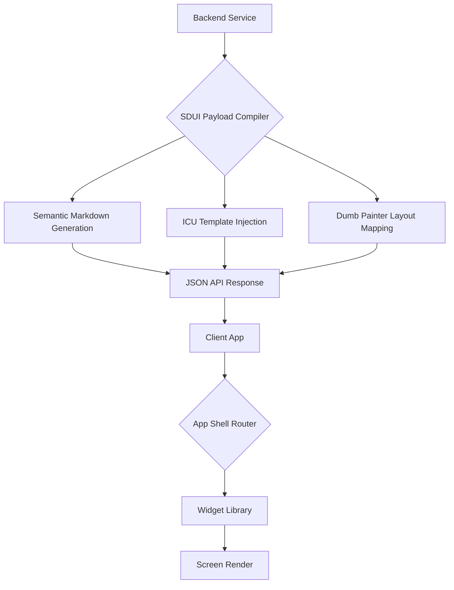

# Server-Driven UI & Presentation

## 1. Executive Summary
The **Server-Driven UI & Presentation** capability governs how the "Surface" of the Compound AI System operates. The core philosophy is that the client application (Flutter frontend) is a completely "dumb" rendering engine. It contains zero business logic, zero prompt compilation, and zero layout math. The backend strictly dictates the state, and the frontend merely paints the declarative Markdown and data blocks it receives.

## 2. Core Architectural Invariants (The Laws)

These absolute rules (Knowledge Items) govern the global context and must NEVER be violated:

### 2.1. The De-Generator Execution Paradigm
- **Law:** The UI must never directly write, edit, or understand LLM instructions or XML prompt envelopes.
- **Enforcement:** The system enforces a strict separation of concerns. The frontend application handles only flat, human-readable business logic (typically represented as Markdown text). The backend's `PromptCompiler` is exclusively responsible for injecting this flat text into system-defined XML envelopes. This prevents end-users (or rogue UI code) from manually engineering raw LLM prompts, ensuring prompt injection safety and deterministic execution.

### 2.2. Strict ICU Markdown Parity
- **Law:** The backend must never generate presentation-specific code (e.g., HTML tags, inline CSS colors, Flutter widgets) to enforce visual styles.
- **Enforcement:** The backend is restricted to serving only semantic Markdown and ICU message templates. All layout, coloring, typography, and styling are exclusively handled by the Frontend's UI component library. This absolute parity ensures that the exact same payload can be seamlessly rendered by both the Flutter interactive display and the static PDF generation engine without any platform-specific hacks.

### 2.3. Null-Safe State Synchronization
- **Law:** The frontend must never try to "guess" missing UI components using hidden fallbacks.
- **Enforcement:** The Server-Driven UI (SDUI) models sent from the backend are fully exhaustive. If the frontend expects a configuration block for a specific widget and it is missing, the frontend must rely on the explicit App Error Boundary (as defined in the Resilience capability) rather than silently returning a `SizedBox.shrink()`.

### 2.4. SDUI Component Contracts
- **Law:** The frontend must render SDUI components exactly as dictated by the backend enum mapping, avoiding manual UI overrides.
- **Enforcement:** Specific SDUI components must inherently support their required domain constraints (e.g., `n_a_card` rendering required fields directly from the context payload without separate API calls). The components defined in the backend `SDUIComponentType` (like `boolean_card`, `extracted_value_card`, `error_card`, `n_a_card`) are absolute boundaries.

### 2.5. UI Editing Parity for Dynamic Text
- **Law:** Forms mutating localized dynamic strings must encapsulate `I18nText` object handling natively.
- **Enforcement:** When the Studio UI interacts with a localized string from the Ontology, it MUST use the standard translation component rather than a generic text input. This component safely extracts, updates, and repackages the underlying `I18nText` schema in real-time, preventing developers from manually unpacking maps or defaulting to fallback string inputs that would break schema parity with the backend.

### 2.6. BFF SDUI Translation
- **Law:** The backend must translate complex domain models into explicit Server-Driven UI payloads before sending them to the frontend.
- **Enforcement:** Utilizing the Backend-for-Frontend (BFF) pattern, dedicated mappers translate domain objects into exact layout structures (e.g., rows, columns, cards). The frontend consumes this strictly typed structure, avoiding any complex logic processing on the client side.

### 2.7. 3-Part UI Layout Block Editor
- **Law:** Editing interfaces for layout components must enforce strict structural constraints across all views.
- **Enforcement:** The UI editing mechanism for layout blocks enforces a rigid three-part architecture (Header, Body, Footer). This standardization ensures that both the interactive canvas editor and the final rendered view follow identical structural rules, maintaining 100% parity across edit and display states.

### 2.8. Dumb Painter Flat Polymorphic Block Pipeline
- **Law:** The frontend must never map semantic business models directly into layout arrays, parse macro-layout containers, nor perform scaling math or localization translation for score and report presentation.
- **Enforcement:** All structural UI elements (including charts, matrices, summaries, and text blocks) are strictly mapped into a single, flat `inner_sdui_blocks` array by the backend. The frontend iterates sequentially through this flat polymorphic array, rendering each block based on its specific variant (e.g., `grid`, `accordion`, `header`, `markdown`, `radar_3d`). Layout grouping is declaratively structured via `matrix_synthesis_groups` rather than legacy containers. All mathematical evaluations of scores (e.g., displaying "5.0 / 10.0" versus "-"), currency formatting, dates, and static section headers are pre-computed and pre-localized on the backend via dedicated presentation adapters and injected as clean Dumb Painter payloads. The frontend strictly paints these pre-computed strings, preserving deterministic rendering parity across interactive Flutter screens and static PDF exports.

### 2.9. Strict SDUI Polymorphic Serialization & Extension Protocol
- **Law:** Dynamic UI block arrays must never rely on unstructured dictionaries or duck-typing.
- **Enforcement:** All dynamic UI layout blocks MUST be strictly typed using the polymorphic `AnySduiBlock` (Python Pydantic discriminated union across all 17 distinct block types) and `SduiBlockDTO` (Flutter Freezed sealed class). Every block MUST possess a discrete `block_type` discriminator. If an unrecognized `block_type` is received, both the Jinja PDF generator and the Flutter Freezed parser MUST fail-fast (triggering `AppException` and `AppErrorBoundary`) rather than silently dropping or misinterpreting the block, ensuring 100% schema fidelity across boundaries. Extension of SDUI blocks strictly adheres to the 4-Layer Extension Protocol (Backend Domain, PDF Template, Flutter Renderer, and Parity Test Fixtures).

### 2.10. Self-Contained SDUI Presentation Adapters
- **Law:** Presentation logic must be strictly decoupled from raw execution states using isolated, modular presentation adapters.
- **Enforcement:** Every SDUI presentation adapter acts as a self-contained builder with co-located aesthetic rules and strict input validation. Adapters employ fair round-robin distribution to interleave multi-category findings (such as XAI explanation highlights) without primacy bias or category starvation, ensuring balanced and deterministic visual presentations.

### 2.11. Studio 3-Zone Workflow Governance & Step Lifecycle Protection
- **Law:** Workflow step creation, configuration, and visualization in the management studio must maintain strict structural boundaries and prevent unauthorized tampering with foundational pipeline operations.
- **Enforcement:** The workflow studio partitions pipeline step governance into three dedicated architectural zones:
  1. **Zone A (Input Anchor):** Governs initial raw document ingestion with immutable execution bindings, locked deletion controls, and explicit input source tracking.
  2. **Zone B (Dynamic Specialists):** Facilitates specialist analytical steps configured from custom blueprints, managing upstream dependency wiring and report inputs.
  3. **Zone C (Funnel Anchors):** Governs downstream scoring, synthesis generation, and forensic explanation reporters with locked deletion controls and automated multi-source aggregation.
  Foundational steps marked with system core protections display locked visual indicators, hide deletion controls, and prevent mutation of foundational hooks.

## 3. Logical Data Flow

