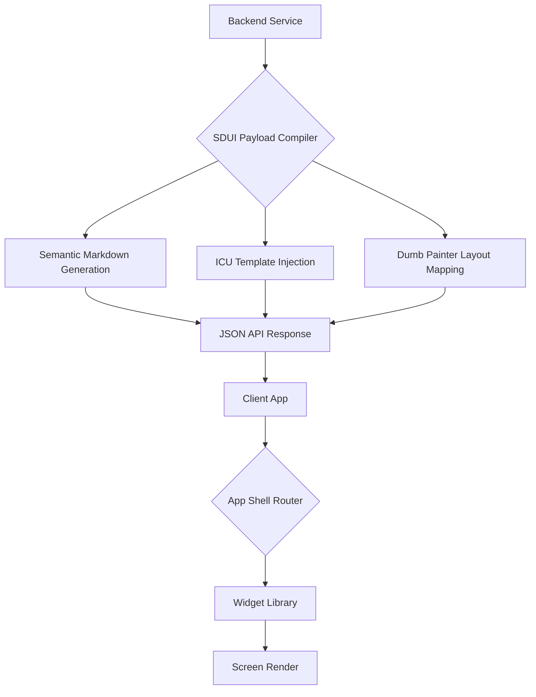

# Server-Driven UI & Presentation

## 1. Executive Summary
The **Server-Driven UI & Presentation** capability governs how the "Surface" of the Compound AI System operates. The core philosophy is that the client application (Flutter frontend) is a completely "dumb" rendering engine. It contains zero business logic, zero prompt compilation, and zero layout math. The backend strictly dictates the state, and the frontend merely paints the declarative Markdown and data blocks it receives.

## 2. Architectural Principles & Implementation

The Server-Driven UI architecture enforces client-side purity, deterministic layout rendering, and presentation parity:

### 2.1. Server-Side Prompt Isolation
The frontend application never constructs, edits, or inspects raw LLM prompt envelopes. The client manages human-readable inputs (such as Markdown text), while the backend `PromptCompiler` handles the encapsulation of dynamic text into secure system envelopes. This preserves prompt injection defense boundaries and ensures deterministic execution.

### 2.2. Strict ICU Markdown Parity
The backend emits only semantic Markdown and ICU message format templates, avoiding presentation-specific styling (such as HTML tags, inline colors, or widget definitions). Typography, color schemes, and visual layout are governed by client theme definitions. This separation guarantees that identical report payloads render with 100% semantic fidelity across interactive Flutter screens and static PDF documents.

### 2.3. Null-Safe Component Synchronization
Server-Driven UI models emitted by the backend are fully exhaustive. If expected widget configuration is absent or malformed, the client isolates the error via dedicated `AppErrorBoundary` widgets rather than hiding components with empty fallback widgets (`SizedBox.shrink()`).

### 2.4. SDUI Component Type Contracts
The client renders SDUI components strictly according to backend enum mappings (`SDUIComponentType`). Specific components inherently resolve their required presentation fields directly from the payload without secondary client-side API requests.

### 2.5. Bilingual Editing Parity (I18nText)
When the studio interface edits localized dynamic strings from the ontology, it interacts with the structured `I18nText` object natively. The translation editor inspects and updates both baseline (`en`) and target translations simultaneously, preventing malformed string packing or schema drift.

### 2.6. Backend-for-Frontend (BFF) Presentation Mapping
Dedicated presentation services translate complex domain entities into explicit Server-Driven UI structures (cards, grids, accordions, markdown blocks) before network transit. The client renders this strictly typed hierarchy without performing domain transformation logic.

### 2.7. Three-Part Layout Block Structure
Layout editing interfaces enforce a standardized three-part architecture (Header, Body, Footer) across all component views, maintaining structural parity between the studio configuration canvas and the rendered report.

### 2.8. Dumb Painter Flat Polymorphic Pipeline
All visual elements (charts, matrices, summaries, text blocks) are mapped by the backend into a single, flat `inner_sdui_blocks` array. The frontend iterates sequentially through this polymorphic collection, rendering each block according to its discriminator variant. Scaling math, score calculations, date formatting, and static headers are pre-computed and pre-localized on the backend, ensuring that client rendering is deterministic and mathematically decoupled from presentation.

### 2.9. Strict Polymorphic Serialization & Extension Protocol
Dynamic UI layout blocks are strictly typed using `AnySduiBlock` (Python Pydantic discriminated union across all 17 block types) and `SduiBlockDTO` (Flutter Freezed sealed class). Unknown or malformed block discriminators trigger fast-fail exceptions (`AppException` and `AppErrorBoundary`) rather than silent dropping. Block additions follow a 4-layer extension protocol across backend domain, PDF template, Flutter widget, and parity fixtures.

### 2.10. Self-Contained SDUI Presentation Adapters
Presentation logic is encapsulated within isolated adapters under `services/sdui/adapters/`. Adapters co-locate aesthetic rules with strict input validation, employing fair round-robin interleaving across multi-category findings (such as XAI explanation highlights) to prevent presentation bias.

### 2.11. Studio 3-Zone Workflow Governance
The workflow studio partitions pipeline step governance into three dedicated architectural zones:
1. **Zone A (Input Anchor):** Governs initial document ingestion with immutable execution bindings and input source tracking.
2. **Zone B (Dynamic Specialists):** Facilitates specialist analytical steps configured from custom blueprints, managing upstream dependency wiring.
3. **Zone C (Funnel Anchors):** Governs downstream scoring, synthesis generation, and forensic explanation reporting with multi-source aggregation.
Core pipeline steps marked with system protections display locked visual indicators, hide deletion controls, and prevent accidental mutation of foundational hooks.

## 3. Logical Data Flow

