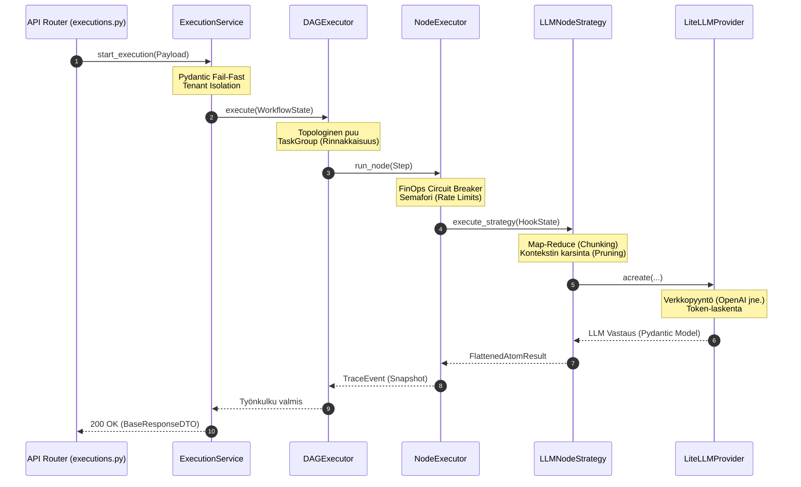
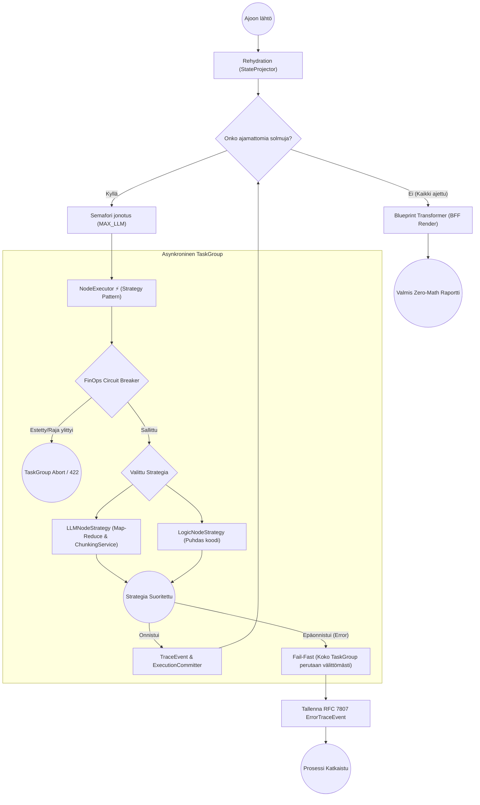

# 03: Palvelukerros ja DAG-moottori (Business Services)

Cognitive Quorumin `backend_v2/services/` -hakemisto sisältää järjestelmän ydinälyn. Kaikki liiketoimintalogiikat, työnkulkujen (DAG) suoritus ja "Backend-For-Frontend" (BFF) -raporttigenerointi suoritetaan tässä kerroksessa turvallisesti eristettynä HTTP-rajapinnoista (Routers).

## Execution Service (Orkestraation portinvartija)

`execution.py` (`ExecutionService`) toimii järjestelmän primäärinä portinvartijana työnkulkujen (DAG) käynnistämiselle ja jatkamiselle (`start_execution`, `resume_execution`). Palvelu ohjaa laajasti asynkronista suoritusta ja tulosten hallintaa:
* **Ingress ja Validointi:** Suorittaa raskaat "Fail-Fast" Pydantic-validoinnit työnkulun ingress-vaiheessa ja generoi dynaamiset käyttöliittymän vihjeet (SDUI) vastaustilan hallintaan.
* **Asynkroninen Raportointi (Epic 14):** Tukee asynkronista raportointia (`render_execution` -> `render_profile_job` Arq jonoon). Tämä ehkäisee käyttöliittymän "infinite loop" -kyselyitä luomalla deterministisen työtunnisteen jota käyttöliittymä voi pollausturvallisesti kuunnella.
* **Force Re-render:** Tarjoaa `clear_profile_synthesis` -funktion, jolla käyttäjä voi pakottaa yksittäisen output profiilin (ja siihen kytketyn PDF:n) tuhoamisen ja uudelleengeneroinnin tietokannasta.
* **Tenant Isolation:** Rajaa tiedon tiukan "Tenant Isolation" -periaatteen mukaisesti. Rajoite on vahvistettu kaikissa perustoiminnoissa (`list_executions`, `get_execution`, `delete_execution`), estäen ristiinlukemisen.
* **FinOps:** Valvoo puitebudjettia "Circuit Breaker" -rajoitteilla yhteistyössä `usage_service.py`:n kanssa suojellakseen osakkaiden kukkaroita karkaavalta AI-kulutukselta.

## Pyynnön Elinkaari ja Kognitiivinen Kuorma (Call Stack)

Yhden LLM-pyynnön matka HTTP-rajapinnasta varsinaiseen kielimalliin on jaettu useaan tiukkaan vastuualueeseen (Single Responsibility). Tämä eristys on teknisesti välttämätön skaalautuvuuden, tietoturvan ja virheiden hallinnan vuoksi, mutta se tekee koodin seuraamisesta aluksi hidasta.

Alla oleva sekvenssikaavio havainnollistaa täydellisen kutsuketjun (`Call Stack`), jotta koodikannassa navigoiminen helpottuisi:

**Abstraktioiden oikeutus:**
1. **API Router** on tyhmä ("Anemic Router") – se hoitaa vain HTTP-liikenteen.
2. **ExecutionService** vastaa käyttöoikeuksista ja tietokantatransaktioista.
3. **DAGExecutor** ymmärtää verkkorakenteen, mutta ei tiedä mitä yksittäinen solmu tekee.
4. **NodeExecutor** vastaa yhden solmun rahankäytön (FinOps) rajoittamisesta ja virheiden nappaamisesta.
5. **LLMNodeStrategy** vastaa pelkästään promptien kääntämisestä (PromptCompiler) ja kontekstin rajaamisesta.
6. **LiteLLMProvider** on fyysinen verkkokerros, joka voi vaihtua lennosta (OpenAI -> Anthropic).

## DAG-moottori: Arkkitehtuuri ja Asynkronisuus

Työnkulkujen orkesterointi on keskitetty `services/orchestrator/dag_executor.py` -moduuliin. Moottori ei ylläpidä paksua ajonaikaista muistitilaa vaan perustuu puhtaalle Event Sourcing -mallille. Arkkitehtuuri on pilkottu neljään eristettyyn komponenttiin:

1. **DAGCompilerService (Shift-Left Pre-Flight Compilation):** 
   * Esivalmistelee ja validoi ylätason riippuvuudet staattisen analytiikan avulla jo työnkulkujen tallennusvaiheessa.
   * Etsii DFS-algoritmilla syklisiä riippuvuuksia (Infinite Loops) ja varmistaa topologisen analyysin (Kahn's iteration) avulla, että eteenpäin suunnatut muuttujaviittaukset (`$inputs`, `$steps`) ovat varmasti saatavilla suorituksen aikana. Tämä Shift-Left -validointi estää API-kustannuksia tuhlaavat myöhäisvaiheen kaatumiset ja umpikujat (Deadlocks).
2. **DAGExecutor (Orkestraattori):** 
   * Vastaa verkon topologian (Dependency Graph) varmistamisesta ja solmujen rinnakkaisajosta. Ennen topologian aloitusta suoritetaan Pre-Hydration: moottori kutsuu Hook-rekisterin `input_processing` -tilaa eristetyllä `HookState`lla purkaakseen ja esikäsitelläkseen datan ajoa varten.
   * Suorittaa solmut (StepRule) natiiveina `asyncio.TaskGroup` -kapselointeina. Jos yksikin solmu sadoista kaatuu asynkronisen ajon aikana palamattomasti, `TaskGroup` perutaan ja ajon resurssit (esim. tekeillä olevat roikkuvat HTTP-pyynnöt LLM:lle) tapetaan automaattisesti taaten täydellisen "Fail-Fast" nollavuototilan.
   * Hallinnoi ajonaikaista rinnakkaiskattoa vahvan semaforin (`SystemConcurrency.MAX_CONCURRENT_LLM_STEPS`) avulla suojellakseen ulkoisia API-rajoitteita (Rate Limiting).
   * Lukee työnkulun `strictness_level` -parametrin DTO:sta ja reitittää sen eteenpäin koko verkon topologian läpi, jotta jokainen `LLMTaskExecutor` -solmu toimii samassa vaatimustilassa.
3. **NodeExecutor (Yksittäisen tason äly - Strategy Pattern):** 
   * Kapseloi askeleen ajologiikan (`LLMNodeStrategy` tai `LogicNodeStrategy`) täyteen eristykseen. `LLMNodeStrategy` ei ole vain putki, vaan itsessään laaja Map-Reduce -orkestraattori, joka ottaa vastaan rajattoman atomisen matriisin (`MATRIX_SAMPLING_LIMIT = 0`), pilkkoo sen `ChunkingService`:n avulla turvallisiin **Semantic Micro-Batching** -paloihin (max 10 atomia) välttyäkseen Token-ylikuormalta ja "Lost in the Middle" -ilmiöltä. Palat ajetaan vahvasti rinnakkain modernin `asyncio.TaskGroup` ja rajoitinsäätimien (Semaphore & Token Bucket) alaisuudessa. Lopulta Reducer yhdistää tulokset absoluuttisen deterministisesti lajittelemalla ne takaisin staattiseen järjestykseen ennen matemaattista reduktiota.
   * **Dead Letter Queue (DLQ) Arq Fallback Logic:** Rinnakkaiset `ChunkWorker`-prosessit on suojattu "Fail-Fast DLQ Routing" -logiikalla, joka estää massiiviset Arq-tason retry-myrskyt Pydantic `ValidationError` (esim. `max_length` ylitys) tai API-virhetilanteissa. Worker nappaa virheet (`max_logical_retries = 1`) ja hiljentää ne Arqin suuntaan. Sen sijaan worker palauttaa orkestraattorille sanakirjan `{"_dlq_status": "FAILED/DLQ", "reason": "<error>"}`. Tämä mahdollistaa chunkin tyylikkään siirtämisen Dead Letter Queueen auditoitavaksi ("Duct Tape Ban" -säännön puitteissa) kaatamatta koko asynkronista puuta.
   * Välittää `validation_context`:in (esim. ankaruustason) Pydantic V2 `.model_validate_json()` -metodille. Tämä mahdollistaa dynaamisen, kontekstuaalisen Pydantic-validoinnin (esim. Exhaustive Chain-of-Thought -pakotukset ja Pydantic Aliakset numeerisilla etuliitteillä) heti datan saapuessa kielimallilta.
   * Suorittaa ns. "FinOps Circuit Breaker" -tarkistuksen ennen kutsua taatakseen, ettei asiakas ylitä budjettia sadoilla käskyillä.
   * Ei itse tallenna tietoa tietokantaan, vaan palauttaa `TraceEvent` tai virtuaalisesti siepatun `ErrorTraceEvent` -lokituksen deterministisestä lopputulemasta.
4. **ExecutionCommitter (Event Sourcing -tallennin):** 
   * Ottaa vastaan ajonaikaisen JSON-lokijonon ja puskee "Snapshotit" (`execution_trace` / `step_states`) alastomana Pydantic-datana tuettuihin tallennuskerroksiin (`repository.py`).
   * Pysyy täysin tietämättömänä itse logiikasta varmistaen vain nopeimmat asynkroniset tietokantasiirrot ajon edetessä "Optimistic UI" tukea varten.

### Orkestraattorin apukomponentit

* **`prompt_compiler.py`:** Dynaamisten Pydantic-skeemojen ("Two-Tier schema") lennosta generoiva käännin V2 Structured Outputs -käyttöön. Käännin sisältää "Self-Healing citation" -logiikan, joka korjaa LLM:n palauttamat puolittaiset viitetekstit oikeiksi sallittujen lähteiden perusteella. Ehkäisee Pydantic-käännösten räjähtämisen suurissa yli 200 askeleen DAG-ajoissa hyödyntämällä LRU-välimuistia.
* **`atomizer.py`:** Vastaa "Deep Atomization" -käsittelystä tallennusvaiheessa. Purkaa LLM:n avulla evaluointikriteerit täsmälleen 15 mikrootomiin ja obfuskoi asiantuntijatermit (Scaffolded exceptions) estääkseen kontekstipakoilua (Context Drift).
* **`chunk_accumulator.py`:** Kokoaa turvallisesti yhteen Map-Reduce -suoritusten LLM-palaset (chunks). Pakottaa arkkitehtuurin "No Naked Dicts in State" -säännön siirtämällä sanakirjojen hallinnan ja stringien (esim. `reasoning_trace`) yhdistämisen orkestraattorin pääsilmukasta testattavaan erilliskomponenttiin.
* **`context_router.py`:** Eristää UI-lähtöisen reitityksen ja datan karsinnan (`route_and_prune`). Poimii raskaasta suorituspuusta (`trace_event`) täsmälleen vain ne XAI-laajennokset, joita käyttöliittymän valittu `OutputProfileConfig` eksplisiittisesti vaatii. Toimii myös "Fail-Fast" portinvartijana muuttujien reitityksessä (`normalize_and_validate_variable`), hyläten välittömästi orvot viittaukset (Orphaned Steps) sekä vanhentuneet V1-tyyliset `.output`-polut (`400 Bad Request`). Enää ei sallita "duck-typing"-oikoteitä, vaan kaikki polut ohjataan ja validoidaan noudattamaan puhdasta V2-nomenklatuuria (Code is Truth).

> **Syväsukellus NodeExecutorin kerrokseen:** Tarkempi arkkitehtuurikuvaus yksittäisen tason älystä ja kontekstin rakentamisesta löytyy dokumentista [03b: Orchestraattoristrategiat ja Kontekstin Rakennus](./03b_orchestrator_strategies.md).

### Rehydration (Kesken jääneen työn jatkaminen)
DAG-moottorin nojatessa Event Sourcingiin (aiemmin mainittu `execution_trace`), pystyy prosessi tarvittaessa toipumaan mistä tahansa ulospäin näkyvästä konesaliradasta:
1. Orkestraattori hakee lukitun työn tietokannasta ("Rehydration").
2. `StateProjector` -luokka pyöräyttää kaikki vanhat muistiinkirjatut taustalokit järjestyksessä kerralla muokatakseen sisäisen "Virtual State"n haluttuun pisteeseen.
3. NodeExecutor herättää eloon vain ne solmut, joiden tila oli lokitettu arvoon `pending` tai `failed`, pakoen sokeita massaoletuksia.

## Admin Studio Service (Ideointi ja mallinnus)

`studio.py` (`Admin Studio Service`) hallinnoi koko järjestelmän domain-malleja (Workflows, Steps, PromptBlocks, OutputProfiles) sekä ylätason `SystemConfig` tiedostoja. Tämä palvelu kapseloi sisäänsä keskitetyn järjestelmänhallinnan logiikan:
* Suorittaa raskaampia graafioperaatioita, kuten työnkulkujen "Shallow-Deep Copy" kloonauksia, säilyttäen tiukan rakenteellisen eheyden.
* Tarjoaa `simulate_workflow()` -graafivalidoinnin etukäteen tapahtuvalle simulaatiolle.
* Valvoo ohi reitittimien kulkevia RBAC-tarkastuksia ja laajoja päivityksiä Admin Studio -toiminnoille.

## Tiedostojen renderöinti, BFF ja Ulkoiset (MCP) Palvelut

`backend_v2/services/blueprint.py` on järjestelmän näkyvin "Backend-For-Frontend" kerroksen muotoilija. Koska Frontendissä vaikuttaa tiukka nollalaskennan "Zero-Math UI" -sääntö, kaikki graafiset pisteytyslokiikat on sidottu yksinomaan tänne.

* Ajossa `BlueprintTransformer` lukee valitun `OutputProfile` -konfiguraation (esim. Executive Summary -näkymä vs. Syvällinen 3D-verkkokuvio). Se analysoi työnkulun lopullisen "FrozenContextin".
* **Zero-Math sääntö:** Blueprint paketoi numeeriset skaalaimet ja värimuunnokset valmiiseen `ReportLayoutDTO` -mallistoon (Akselit, pisteet ja XAI "Missing Context" liputukset). Käyttöliittymä, tai PDF-generaattori ei joudu koskaan miettimään miten x/y korrelaatio ratkaistaan saati mistä teksti pöllittiin (Citation Integrity/Hallucination Flag), sillä ne kaikki ovat puhtaasti palvelimen päättelemässä DTO-putkessa.

**Virtuaaliset Järjestelmäaskeleet ja Raportin Generointi (Arq Worker)**
Suorituksen (Execution) matemaattinen pisteytys ja loppuraportin renderöinti on irrotettu DAG-verkosta omiin **Virtuaalisiin Järjestelmäaskeleisiin** (esim. `sys_render_<profile>`). Kun LLM-työnkulku valmistuu, taustajärjestelmä siirtää vastuun Arq Workerille (`render_profile_job`). 
Tämä työntekijä lukee `OutputProfile`:n ja syöttää tarvittavat `strictness_level` ja `scoring_strategy` -arvot matemaattisille moottoreille lennosta, luoden `ReportDataDTO`:n. Työntekijä hallinnoi virtuaalisen askeleen `status`-päivityksiä (running, completed, failed) suoraan tietokantaan mahdollistaen tarkan seurannan (Server-Sent Events) ennen koko ExecutionRecord-tilan sulkemista.

**PdfReportService (`pdf_generator.py`)**
Toimii BlueprintTransformer-luokan rinnalla ja hyödyntää samaista Layout DTO -pohjaa dynaamisten PDF-tiedostojen rakentamisessa (Jinja2 & WeasyPrint). Palvelu toimii puhtaana datamuuntimena palauttaen PDF-tavuvirran, kun taas asynkroninen Arq-työntekijä ja `Storage_driver` hoitavat lopullisen tiedostojen tallennuksen ja tietokannan päivityksen rinnakkaisesti työnkulun ajon kanssa.

**Machine Control Protocol (MCP)**
Järjestelmään sisältyy `mcp/` -hakemisto, joka toimii agenttisten verkkohakujen ja tekoälyn ulkoisten toimintojen rajapintana. Palvelut kuten `mcp_tool_loop.py` ja luokat kuten `tavily_search_client.py` kykenevät tekemään itsenäistä verkkohakua ulkopuolisista viitekehyksistä, laajentaen suppeaa staattista kontekstia merkittävästi. Moottori käyttää näitä LLM:n orkestroimana asynkronisesti tarvittavan tiedon hakemiseen.

## Tukipalvelut ja Apuohjelmat (Utility Services)

Järjestelmän taustalla toimii joukko erikoistuneita apupalveluita (Utilities), jotka noudattavat V2-arkkitehtuurin Fail-Fast -sääntöjä:

* **`chat_parser.py` (ChatParserService):** Erottaa LLM:n (ChatParser-strategia) avulla ihmisen ja tekoälyn välisen keskustelun puhtaaksi Pydantic `ChatHistoryDTO`:ksi. Siivoaa esimerkiksi selaimeen copy-pastetetun ChatGPT-keskustelun turhasta UI-roskasta, soveltaen Fail-Fast -validointia sekaviin syötteisiin.
* **`localization.py` (LocalizationService):** Hoitaa SDUI-skeemojen palvelinpuolen käännökset (esim. `x-ui-label` ja `label`). Hyödyntää `ContextVar`-pohjaista kielen valintaa pyynnön elinkaaren aikana. Noudattaa tiukkaa "No Fallbacks" -sääntöä käännösten suhteen nostamalla virheen, jos sanastoa ei löydy, taaten datan eheyden käyttöliittymäkerroksessa.
* **`flattener.py` (FlatFileService):** Muuntaa nested-muotoisen DAG:n monimutkaisen suoritustuloksen yksiulotteiseksi tietorakenteeksi (esim. `[step_id]_[key] = value`) analytiikkaa ja CSV-vientiä varten hyödyntämällä `StateProjector.fold_trace` ominaisuutta.
* **`progress.py` (ProgressTracker):** Hallinnoi asynkronisten prosessien edistymistä vakiomuotoisella tilakoneella (`started`, `running`, `completed`, `failed`). Toteuttaa Strategy-tyyppisen kuvion, joka skaalautuu erilaisiin tallennustarpeisiin (`DatabaseProgressTracker` DAG-ajoille, `InMemoryProgressTracker` API-testeille, `ProgressService` Redis-tapahtumille).
* **`pii_analyzer.py` (PIIAnalyzerService):** Vastaa tietoturvasta hyödyntäen Microsoft Presidiota ja SpaCyä PII-datan maskaukseen. Singleton-palvelu on optimoitu "Lazy Loading" -tekniikalla, eli raskas kielimalli ladataan muistiin vasta kun tietoturvamaskaus aktivoidaan, mikä säästää kallista RAM-muistia järjestelmän käynnistyksessä.
* **`usage_service.py` (UsageService):** Vastaa LLM-tokenien kulutuksen ja kustannusten (LiteLLM) kirjaamisesta immutaabelisti. Toimii lisäksi "FinOps Circuit Breaker" -komponenttina, joka tarkistaa dynaamisesti organisaation kiintiöt (`quota_limit`) ja katkaisee (Fail-Fast) lisäajot yli sallitun budjetin.
* **`drivers/`:** Tiedostoajurien rajapinta, joka sisältää tuen lokaalille tiedostojärjestelmälle (`local_file_driver.py`) sekä pilvitallennukselle (`gcs_file_driver.py`) abstrahoiden säilytyskerroksen ydinlogiikasta.

## IAM ja Identiteetti

`services/auth.py` valvoo ja todentaa pyynnöt erillisten Custom Claims tai Firebase SDK -tokentapaisten puitteissa (JWT). Moduulissa käsitellään organisaation vaihto-operaatiot (Tenant Isolation), tuetaan sisäänrakennettuina "Bring Your Own Key" (BYOK) hallintoa ja varmennetaan, etteivät ristiin organisaatiot tallenna dataa väärillä `org_` prefikseillä. Lokaalissa "Mock_DB"-tilassa tämä osio ohitetaan ylikuormittavien HTTP-viiveiden estämiseksi ja valtuutetaan keinotekoinen rooli rajapintatestejä varten.

# Orchestraattoristrategiat ja Kontekstin Rakennus

Tämä dokumentti syventää `03_business_services_and_dag.md` -kuvausta purkamalla työnkulkumoottorin strategiakerroksen (`backend_v2/services/orchestrator/strategies/`). Strategiakerros vastaa työnkulkujen yksittäisten solmujen (Step) täytäntöönpanosta NodeExecutorin alaisuudessa.

Arkkitehtuuri perustuu Strategy-suunnittelumalliin, jossa solmun tyyppi (esim. `llm` tai `logic`) määrittää käytettävän suoritusstrategian. Kerros noudattaa tiukasti Quorumin Fail-Fast -periaatteita: virheet nostetaan välittömästi ja tila on vahvasti tyypitetty.

## `BaseNodeStrategy` (base.py)
Kaikkien strategioiden kantaluokka, joka määrittelee solmun suorituksen rajapinnan ja jakaa yhteiset operaatiot.

- **Hookien suoritussilmukka:** Abstrahoi Pre- ja Post-hookien suorituksen (`run_pre_hooks`, `run_post_hooks`) ulos ydinlogiikasta. Silmukka iteroi solmun (Blueprint) määrittämät hookit ja yhdistää (deep merge) niiden palauttaman tilamuutoksen askeleen tilaan.
- **`HookState` ja `HookDependencies` injektio:** Hookeille injektoidaan aina vahvasti tyypitetty `HookState` (sisältäen instanssikohtaiset muuttujat, kuten `execution_id` ja `inputs`) sekä `HookDependencies` (joka tarjoaa pääsyn esim. repository-kerrokseen).
- **Fail-Fast ja Circuit Breaker:** Sisältää `assert_quota`-metodin ("Denial of Wallet" -suoja), joka tarkistaa organisaation token-rajat ennen ajoa. Jos raja ylittyy, luokka lokittaa ensin virheen (`logger.warning`) ja heittää välittömästi `AppException`-poikkeuksen. Myös hookien palauttama `success=False` lokitetaan varoituksena RFC 7807 -jäljitettävyyden takaamiseksi.

## `LLMNodeStrategy` (llm.py)
Vastaa tekoälysolmujen (LLM Step) raskaasta orkestroinnista dynaamisen mallintamisen ja token-optimoinnin avulla.

- **Schema Map -rakentaminen:** Työnkulun ajon yhteydessä rakennetaan dynaaminen `schema_map`. Se lukee tietokannasta kaikki PromptBlockit ja tunnistaa matriisiblokit (`_SCHEMA_BLOCK_MATRIX`) sekä tavalliset tekstiblokit (`_SCHEMA_BLOCK_TEXT`). Tämän lisäksi järjestelmä rekisteröi täydellisen "Code is Truth" -periaatteen mukaisesti kaikki sallitut lisäkentät (dynaamiset XAI-kentät `output_extensions`-listasta) reititystokenilla `_SCHEMA_BLOCK_EXTENSION` ja globaalit järjestelmäavaimet tokenilla `_SCHEMA_BLOCK_SYSTEM`. Tämä poistaa kaiken duck-typing-arvailun ja muodostaa aukottoman sallintalistan (allowlist) datan karsinnalle. Huomioitavaa: SSOT-säännön nojalla perusarvioinnin pakolliset ydinkentät on koodattu natiiviin Pydantic-malliin, eikä niitä luetella dynaamisessa listassa.
- **PromptBlock Fail-Fast Validointi:** Hakee askeleen vaatimat PromptBlockit tietokannasta ja validoi ne heti. Mikäli blokkia ei löydy, strategia ei yritä luoda oletusarvoja vaan heittää välittömästi `AppException`-virheen.
- **Map-Reduce Orkestraatio ja Micro-Batching:** Kun askeleessa on matriisiblokkeja ja deterministisesti lajiteltu syöte (satunnainen sekoitus on kielletty), LLM-solmu jakaa datan `ChunkingService`:n avulla Semantic Micro-Batch -paloihin (max 10 atomia). Palat ajetaan asynkronisesti rinnakkain `asyncio.TaskGroup`in ja FinOps-semaforien alla. Tulokset validoidaan Fail-Fast Pydantic -säännöillä (mukaan lukien Exhaustive CoT -etuliitteet, esim. `step_1_reasoning_trace`), minkä jälkeen MatrixReducer ja ChunkAccumulator lajittelevat ja yhdistävät (Reduce) ne matemaattisesti Three-State Logicin (PASSED, FAILED, DLQ) mukaisesti täydellisellä osumatarkkuudella.

## `LogicNodeStrategy` (logic.py)
Käsittelee puhtaasti ohjelmalliset askeleet (Native/Logic Step) delegoimalla varsinaisen suorituksen Hook Registrylle.

- **Hook Lookup:** Hakee solmuun kytketyn logiikka-hookin nimen suoraan `hook_registry`:stä Blueprintin perusteella.
- **Tilan evaluointi:** Evaluoi nykyisen tilan (`$inputs` / `$steps`) StateProjectorista ja kokoaa sen tiukasti tyypitettyyn `HookState`:en ennen logiikkahookin asynkronista kutsumista.
- **Fail-Fast:** Jos primaarisen logiikkahookin suoritus palauttaa `success=False`, `LogicNodeStrategy` lokittaa välittömästi kriittisen tason virheen (`logger.error`) ja heittää `AppException`-virheen (ErrorCodes.AGENT_EXECUTION_CRITICAL). Hiljaisia epäonnistumisia ("silent fallbacks") ei sallita ohjelmallisessa logiikassa.

## `ContextBuilder` (context_builder.py)
Vastaa LLM-kontekstin rakentamisesta, muuttujamappausten resoluutiosta ja datan karsimisesta ennen token-vientiä.

- **`schema_map`-pohjainen karsinta (Allowlist):** LLM-kontekstin rakentamisessa sovelletaan tiukkaa Fail-Fast -sallintalistaa. Vain `schema_map`-sanakirjaan eksplisiittisesti rekisteröidyt avaimet päästetään läpi. Jos avainta ei löydy rekisteristä (esim. massiiviset `evaluations`- tai `shuffled_atoms`-taulukot), se pudotetaan säälimättä (Ruthless Pruning). Tämä takaa, ettei LLM-konteksti ylitä 100 000 tokenin turvarajaa.
- **`_process_trace_event` Arkkitehtuuri:** Tämä ydinmetodi käsittelee askeleen (Step) aiemman output-lokituksen. Jos solmun tietotyyppi on `MATRIX`, metodi varmistaa, että data on kelvollinen sanakirja parsien sen tiukalla `LightweightMatrixOutput`-skeemalla, ja käyttää `ContextRouter.route_and_prune` -funktiota datan rajaamiseen ulostuloprofiilin (Output Profile) mukaisesti. Kaikki rakenteelliset poikkeamat kaatuvat Fail-Fast -periaatteen mukaisesti.
- **Fail-Fast -ehdottomuus:** Kaikki oletukset ovat ohjelmallisesti kiellettyjä. LLM-kontekstiin lisättävät metadatat (kuten `reasoning_trace` tai `_step_metadata`) pääsevät läpi ainoastaan, jos ne on eksplisiittisesti määritelty joko Pydanticin natiiveina ydinkenttinä, erillisinä vapaaehtoisina XAI-laajennuksina (`output_extensions`) tai kiinteinä globaaleina järjestelmäavaimina. Tuntemattomien avainten passthrough-ohitukset eivät ole sallittuja.

## Arkkitehtoninen Rajoite: Täyden Asynkronisuuden Illuusio (The CPU Trap)

Vaikka `DAGExecutor` hyödyntää `asyncio.TaskGroup`-kapselointeja ja modernia asynkronista rinnakkaisajoa, järjestelmässä on tehty tietoinen arkkitehtoninen päätös pitää tietyt komponentit (kuten `PromptCompiler`) puhtaasti synkronisina.

### 1. CPU-pullonkaulan Harha (The CPU Trap)
Asynkronisuus (`async/await`) nopeuttaa ainoastaan I/O-operaatioita (kuten verkko- tai tietokantahakuja). `PromptCompiler.py` on massiivinen komponentti, jonka ydinlogiikka koostuu raskaasta merkkijonojen manipuloinnista, regex-etsinnästä ja synkronisesta Pydantic-validoinnista. Nämä ovat täysin **CPU-riippuvaisia** tehtäviä. Vaikka `PromptCompiler` muutettaisiin asynkroniseksi, sen suorittama raskas tekstinmurskaus blokkaisi Pythonin tapahtumasilmukan (GIL) silti. Asynkronisuus toisi vain illuusion rinnakkaisuudesta, mutta lisäisi coroutine-overheadia. 

Vaihtoehdot: Jos CPU-pullonkauloja halutaan tulevaisuudessa todella hajauttaa, raskaat tekstikokoamiset pitää siirtää joko natiiviin Rust-kerrokseen (jota Pydantic V2 osittain tekee) tai omiin eristettyihin Multiprocessing-säikeisiin, ei asynkronisiin rutiineihin.

### 2. Virheiden Hallinnan Monimutkaisuus (Fail-Fast Rinnakkaisuudessa)
Täysin asynkronisen (100% async) I/O- ja CPU-arkkitehtuurin toinen rajoittava tekijä on "Fail-Fast" -periaatteen monimutkaisuus vapaassa rinnakkaisuudessa. Jos järjestelmä ajaa useita asynkronisia alitehtäviä rinnakkain ja yksi niistä kaatuu Pydantic-validointiin, kaikkien muiden orpojen tehtävien turvallinen peruuttaminen (cancel) vaatii rutiineja, jotta muisti ja yhteyspoolit eivät vuoda. Tästä syystä rinnakkaisuus on järjestelmässä keskitetty tiukasti valvottuihin `TaskGroup`-semaforeihin orkestraattorin juurella, eikä asynkronisuutta "tartuteta" syvälle synkronisiin datamuuntimiin.

 

➡️ **Seuraavaksi:** Nyt kun tiedät, miten DAG-verkko etenee solmusta toiseen, lue [05_llm_and_hooks.md](./05_llm_and_hooks.md). Se sukeltaa yksittäisen solmun sisään ja selittää, miten Hookit ohjaavat sokeaa tekoälyä.
