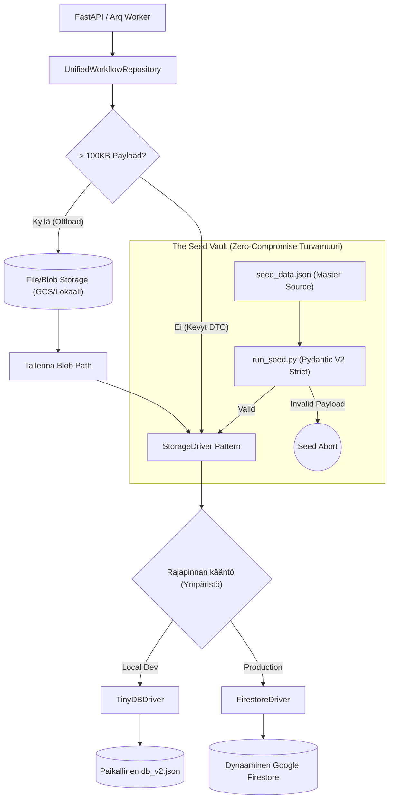

# 05: Tietokanta, Storage Driver ja Repository (Persistence)

Cognitive Quorum hylkää suorat tietokantakohtaiset rutiinit tai perinteiset paksut ORM:t (Object-Relational Mapping). Järjestelmä operoi asynkronisen **Storage Driver Pattern** -arkkitehtuurin kautta, joka mahdollistaa koodin saumattoman siirrettävyyden pilven ja lokaalin koneen välillä (Environment Sovereignty) ilman pienimpiäkään muutoksia liiketoimintalogiikkaan.

## 1. Unified Workflow Repository

Kaikki backendin datakutsut (FastAPI-reiteiltä ja Arq-taustatyöntekijöiltä) reititetään `backend_v2/database/repository.py`:ssä sijaitsevan `UnifiedWorkflowRepository` -instanssin läpi. Tämä luokka ohjaa asynkronisten I/O-operaatoiden säännöstelyn ja pakottaa datan lataan ottamalla abstraktisti injektiona asetauluksi joko `TinyDBDriver` (Local Dev) tai `FirestoreDriver` (Tuotanto).

### Raskaiden Blobien Offload (Firestore Limits)
Tapahtumaperusteisen historiikin (Event Sourcing) myötä tietokantaan syntyy massiivisia Data Transfer -objekteja (`execution_trace`). Koska Googlen Firestore rajoittaa yhden tiedoston koon maksimissaan yhden (1) megatavun suuruiseksi, repository ratkaisee rajoitteen abstraktisti lennossa:
* `_offload_payloads()` -metodi huomaa, jos avainkentät (esim `execution_trace` tai `frozen_context`) lähestyvät 100 kilotavun soft-rajaa. Mikäli raja ylittyy, Abstrakti Repository ohjaa valtavan JSON-merkkijonon tiedostopalvelimelle (GCS Bucket tai lokaali levy) pelkkänä binääripakettina, tallentaen itse päätietokantaan vain polkureferenssin (`..._storage_path`).
* Kun data haetaan API:lle (`_hydrate_payloads()`), repository lataa ja liimaa Blobien sisällön takaisin alkuperäiseen rakenteeseen saumattomasti.

## 2. API ja Pydantic (SSOT Validation)

Järjestelmä noudattaa tarkkaa rajapintaeristystä (Controller-Service-Repository).
Repository-kerros siirtää luetun tiedon Service-kerrokselle muodossa `dict[str, Any]`. Rajapinnassa data pakotetaan FastAPI:n response_model:illa Pydantic V2 -tyypitykseen (`Model.model_validate()`). Fail-Fast -säännön perusteella odottamattomat kentät (`extra="forbid"`) katkaisevat pyynnön 500/400 Server Errorilla ennemmin kuin sallisivat virheellisen järjestelmätiedon valua UI:n puolelle haamuvikoina.

## 3. The Seed Vault (Nollatoleranssi)

Globaalien järjestelmäkonfiguraatioiden (PromptBlocks, Workflow DAGs, Output Profiles) perustiheys on irrotettu tuotantokannasta turvalliseen **Seed Vault** -järjestelmään (`backend_v2/seed/`).

* **Manuaalinen muokkauskielto:** `.db` tai `db_v2.json` (TinyDB lokalisoitu) suora manuaalinen muokkaus kehittäjien tai tekoälyn toimesta on ehdottoman kielletty järjestelmätason direktiiveissä. Tämä sääntö suojaa "Opaque Stripe IDs" rikkoutumiselta (solmujen topologia-avainten sekoittumiselta). Järjestelmä valvoo tätä vahvasti eikä tekoäly voi suoraan muuttaa näitä tiedostoja ohi `seed_data.json`:ia sorkkivien python-skriptien (modify_seed.py).
* **Source of Truth:** Lokaalit tai globaalit testidata ja vakiot asuvat pelkästään ihmisluettavassa mastertiedostossa `backend_v2/seed/seed_data.json`.
* **Evoluution kulku:** Jos työnkulkujen arkkitehtuuria pitää muuttaa (esim. uusi Bipolar Matrix skaala lisätään AI:lle), tekoäly luo deterministisen päivitysskriptin hakemistoon (esim. `patch_epic11.py`). Tekoäly lukee mastertiedoston, päivittää arvon turvallisesti ja kirjoittaa takaisin, suojellen JSON-korruptioilta.
* Data astuu virallisesti voimaan vasta kun "seeding"-komento (`uv run python backend_v2/seed/run_seed.py local`) puhdistaa olemassaolevat taulut ja ajaa `seed_data.json`:in tiukimpien mahdollisten Pydantic-mallien läpi nollavirhein tallentaen sen takaisin kantaan. Yksikin ylimääräinen tuntematon JSON-avain tai muutos pysäyttää Seed-prosessin kokonaan ja pakottaa koodarin/tekoälyn korjaamaan mallit ennen jatkamista.
