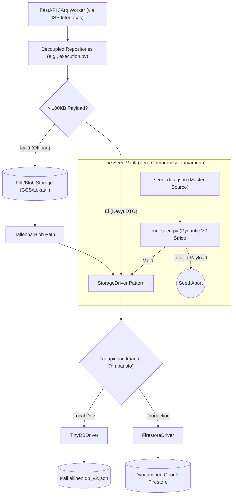

# 05: Tietokanta, Storage Driver ja Repository (Persistence)

Cognitive Quorum hylkää suorat tietokantakohtaiset rutiinit tai perinteiset paksut ORM:t (Object-Relational Mapping). Järjestelmä operoi asynkronisen **Storage Driver Pattern** -arkkitehtuurin kautta, joka mahdollistaa koodin saumattoman siirrettävyyden pilven ja lokaalin koneen välillä (Environment Sovereignty) ilman pienimpiäkään muutoksia liiketoimintalogiikkaan.

## 1. Interface Segregation and Unified Repository

Kaikki backendin datakutsut reititetään ISP-yhteensopivien rajapintojen (Interface Segregation Principle) kautta. Service-kerros ei koskaan tunne "God Class" -monolyyttiä, vaan injektoi ainoastaan omia, tiukasti rajattuja interface-abstraktioitaan (esim. `IWorkflowRepository`, `IExecutionRepository`, `ISystemRepository`, `IIdentityRepository`, `IComponentRepository`). Taustalla asynkronisista I/O-operaatioista ja Storage Driver -logiikasta vastaa erikoistuneet rinnakkaisluokat, jotka injektoivat ajuriksi joko `TinyDBDriver` (Local Dev) tai `FirestoreDriver` (Tuotanto).

### Phase 9: "Big Bang" Repository Decoupling (Huhtikuu 2026)
Vanha arkkitehtuuri nojasi yhteen raskaaseen `AbstractWorkflowRepository` / `UnifiedWorkflowRepository` -luokkaan, joka vastasi kaikista CRUD-operaatioista koko järjestelmässä. Tämä "God Class" -anti-pattern aiheutti massiivisia riippuvuusongelmia ja rikkoi yksittäisvastuuperiaatetta (SRP).
Phase 9 -päivityksessä koko järjestelmä refaktoroitiin noudattamaan ISP-eristystä (Interface Segregation Principle):
1. **Decoupled Repositories:** Vanha monolyytti on pilkottu roolipohjaisiin abstrakteihin rajapintoihin, jotka sijaitsevat `database/repositories/` -hakemistossa (esim. `audit.py`, `execution.py`, `identity.py`, `system.py`, `workflow.py`).
2. **Riippuvuuksien Injektointi (Dependency Injection):** API-palvelut ja Service-kerros luottavat nyt yksinomaan näihin tiukasti rajattuihin rajapintoihin yhden valtavan tietokantaluokan sijaan. Tämä eristys varmistaa 100% Pydantic V2 -rakenteellisen eheyden (Structural Integrity) koko arkkitehtuurissa.
3. **HookDependencies (The Contract):** Koukuille (Hooks) ei enää injektoida yleistä `repository`-oliota, vaan tiukasti tyypitetty `HookDependencies` -luokka, josta jokainen abstrahoitu instanssi (`exec_repo`, `workflow_repo`, `comp_repo` jne.) löytyy omasta nimiavaruudestaan.
4. **Pydantic V2 Strict Mocks:** Testiautomaatio on pakotettu käyttämään täydellisiä mock-toteutuksia `MagicMock`/`AsyncMock` -luokkien sijaan, silloin kun arkkitehtuuri odottaa täyttä Pydantic V2 -oliota tai tarkasti tyypitettyä sanakirjaa (dictionary). Tämä estää ValidationError-kaatumiset testien ja ajonaikaisen suorituksen välillä. Lisäksi arkkitehtuuri on kokonaan hylännyt erilliset fyysiset mock-tietokannat (kuten poistetun `db_mock_v2.json` ja vanhan `run_mock.bat` -laukaisijan) siirtyen täysin nopeutettuun, in-memory testaukseen (Deterministic Testing Delegation). Ainoa sallittu LLM-mockaus tapahtuu ohjatusti `backend_v2/llm/mock_data.py` -vakiovastausten avulla testiautomaatiossa.

### Raskaiden Blobien Offload (Firestore Limits)
Tapahtumaperusteisen historiikin (Event Sourcing) myötä tietokantaan syntyy massiivisia Data Transfer -objekteja (`execution_trace`). Koska Googlen Firestore rajoittaa yhden tiedoston koon maksimissaan yhden (1) megatavun suuruiseksi, repository ratkaisee rajoitteen abstraktisti lennossa:
* `_offload_payloads()` -metodi huomaa, jos avainkentät (`execution_trace`, `frozen_context` tai `context_variables`) lähestyvät 100 kilotavun soft-rajaa. Mikäli raja ylittyy, Abstrakti Repository ohjaa valtavan JSON-merkkijonon tiedostopalvelimelle (GCS Bucket tai lokaali levy) pelkkänä binääripakettina, tallentaen itse päätietokantaan vain polkureferenssin (`..._storage_path`).
* Kun data haetaan API:lle (`_hydrate_payloads()`), repository lataa ja liimaa Blobien sisällön takaisin alkuperäiseen rakenteeseen saumattomasti.

### Decoupled MCP Audit Trails
Ennen mahdollisia Blob-siirtoja `_offload_payloads()` poimii `frozen_context` -paketista erilleen tekoälyn työkalukutsut (`mcp_tool_audit`). Tämä data voi työnkulun aikana paisua valtavaksi. Blob-storagen sijaan nämä MCP-lokit ohjataan tallennettavaksi täysin erillisinä dokumentteina natiiviin tietokantaan `executions/{doc_id}/audit_trails` -alakokoelmaan. Tämä eristys ohittaa normaalin JSON-Blob siirron ja mahdollistaa yksittäisten työkalukutsujen rakenteelliset haut ja selaamiset tietokantatasolla ohittaen muun datan.

### Työnkulkujen Versiointi (System Sovereignty)
Backend API:sta tulevat päivityspyynnöt (kuten työnkulkujen tai agenttien muokkaus) ohjataan `AppendOnlyRepository` -luokan kautta, joka perii uuden roolipohjaisen ISP-abstraktion (kuten `IWorkflowRepository`). Tämä toteuttaa tiukan **Append-Only** -protokollan forensisen jäljitettävyyden vaalimiseksi. Sen sijaan että data ylikirjoitettaisiin, vanha tietue merkitään `{"is_latest": False}` ja uusi tietue luodaan vanhan ID:n pohjalta käyttämällä `_increment_version` -metodia (esim. liittämällä `_v2`, `_v3` jne. alkuperäiseen tunnisteeseen). Tämä arkkitehtuurillinen System Sovereignty varmistaa, että vanhat ajot pysyvät pysyvästi kytkettyinä juuri niihin historiallisiin konfiguraatioihin, joilla ne alunperin suoritettiin.

## 2. API ja Pydantic (SSOT Validation)

Järjestelmä noudattaa tarkkaa rajapintaeristystä (Controller-Service-Repository).
Repository-kerros on jo kehittynyt validoimaan kriittisen datan lennossa: esimerkiksi `get_execution()` ja `get_workflow_definition()` palauttavat natiivisti Pydantic V2 -objekteja (`ExecutionRecord`, `WorkflowDefinition`). Listahakujen kohdalla (kuten `get_all_executions()`) repository-kerros soveltaa Graceful Degradation -mallia: korruptoituneet yksittäiset tietueet lokitetaan (`ErrorCodes.VALIDATION_FAILED`) ja ohitetaan, jottei yksi viallinen dokumentti kaada koko listausta 500/400 Server Errorilla. Yksittäisten hakujen ja API-rajapinnan rajalla odottamattomat kentät (`extra="forbid"`) katkaisevat edelleen pyynnön Fail-Fast -säännön mukaisesti ennemmin kuin sallisivat virheellisen järjestelmätiedon valua UI:n puolelle haamuvikoina.

## 3. The Seed Vault (Nollatoleranssi)

Globaalien järjestelmäkonfiguraatioiden (PromptBlocks, Workflow DAGs, Output Profiles) perustiheys on irrotettu tuotantokannasta turvalliseen **Seed Vault** -järjestelmään (`backend_v2/seed/`).

* **Manuaalinen muokkauskielto (Seed Mutation Protocol):** `.db` tai `db_v2.json` (TinyDB lokalisoitu) suora manuaalinen muokkaus kehittäjien tai tekoälyn toimesta on ehdottoman kielletty. Tämä koskee myös `seed_data.json` -tiedostoa: jopa pienet muutokset (kuten `HistoricalContextMode.DISABLED` korvaaminen Boolean-arvoksi) tehtynä teksti-editorilla tai etsi-korvaa-toiminnolla aiheuttavat tuhoisan skeema-driftin. Pydantic-validointi ei ehdi väliin manuaalisessa muokkauksessa, jolloin ohjelmisto kaatuu vasta ajonaikana.
* **Source of Truth:** Lokaalit tai globaalit testidata ja vakiot asuvat pelkästään mastertiedostossa `backend_v2/seed/seed_data.json`.
* **Kielto sed/awk -käytölle:** JSON-dataa ei saa koskaan muokata lennosta terminaalikomennoilla (esim. `sed`, `awk` tai bash-tulkit) edes `seed_data.json` -tiedostossa.
* **Backup & Scripting Mandatory:** Jokainen rakenteellinen datamuutos `seed_data.json` -tiedostoon TEHDÄÄN AINA erillisellä lyhytikäisellä Python-skriptillä (esim. `backend_v2/seed/scripts/patch_x.py`). Skriptin on ladattava JSON (`json.load()`), otettava varmuuskopio `backend_v2/seed/backups/` -hakemistoon, muokattava dataa ja lopuksi kirjoitettava se muotoon `json.dump(data, f, indent=2)`. Skriptin ajon yhteydessä datan on läpäistävä Pydantic V2 -mallien validointi ennen kuin muutokset katsotaan onnistuneiksi. Vain tämä lukitsee eheyden.
* **Atomization Cache (Suorituskyky):** Seeder (`run_seed.py`) hyödyntää `atomization_cache.json` -tiedostoa matriiseja sisältävien `PromptBlock`-objektien optimoinnissa. Seeder laskee Pydantic-mallista dumpatun tekstin perusteella MD5-tiivisteen, ja mikäli tiiviste löytyy välimuistista, hidasta LLM-pohjaista matriisiatomisaatiota ei suoriteta lokaalissa ympäristössä. Tämä on kriittinen komponentti nopean kehityssyklin turvaamisessa.
* **Opaque Stripe IDs:** Kaikissa luoduissa tunnisteissa on seurattava ehdotonta Opaque ID -mallia (esim. `usr_x8f9a2b1` tai `wf_cd3p1k`). Ihmisluettavia semanttisia avaimia (`new_user_1`) on kielletty käyttämästä. Opaque-mallit varmistavat aukottoman globaalin tason tietokantaintegritaation ja eristävät dataobjektien viittaukset nimien muutoksista.
* **Tietokannan Rakenteellinen Koskemattomuus (The One SSOT Architecture):** 
  - Järjestelmän tietomalli nojaa tiukasti relaatiomaiseen Single Source of Truth -malliin. Esimerkiksi **Tulostusprofiilit (Output Profiles)** asuvat *ainoastaan* globaalissa `output_profiles`-Pääkokoelmassa.
  - Vaikka kooditason Pydantic-mallit (kuten `Workflow`) esittelisivät rakenteita kuten `EmbeddedOutputProfile`, näitä upotettuja rakenteita **EI KOSKAAN** saa fyysisesti tallentaa tai siirtää `seed_data.json` -tiedostoon tekoälyn toimesta. 
  - Backendin Service-kerros (`_stitch_profiles_to_workflows`) on vastuussa datan dynaamisesta kokoamisesta (injektoinnista) lennossa silloin kun käyttöliittymä sitä pyytää. Frontend käyttää koottua JSON-näkymää, mutta fyysinen tallennusarkkitehtuuri on ja pysyy erillisten taulujen mallissa.
* **Tietokannan Resetointistrategiat (Hard vs Soft):** Arkkitehtuuri on jaettu kahteen eri nollausmalliin.
  - **Hard Reset (`run_seed.py`):** Pudottaa brutaalisti kaikki tietokannan taulut (`db.drop_tables()`) ja rakentaa arkkitehtuurin puhtaalta pöydältä luomalla uudet Validoidut Pydantic-oliot `seed_data.json`-lähteestä. Tuhoaa prosessin aikana automaattisesti myös kaikki fyysiset artifaktit (PDF:t, JSON-tallenteet) poistamalla lokaalin tallennushakemiston (`data/files/executions`) jotta levyasema pysyy puhtaana "orvoista" tiedostoista.
  - **Soft Reset (`wipe_user_data.py`):** Kirurginen resetointi, joka tyhjentää ainoastaan käynnissä olevat dynaamiset suoritukset ja työnkulut (esim. `data["executions"] = {}`), säilyttäen järjestelmäkonfiguraatiot koskemattomina. Tärkeänä yksityiskohtana se myös tuhoaa fyysiset orvot tiedostot (`data/files/executions`), toimien yhdenmukaisesti Hard Resetin kanssa fyysisen siisteyden osalta. Tarkoitettu vikakorjaussykleihin (debugging), joissa halutaan säilyttää käsin muokatut Seed-vakioarvot.
* **Tietokannan Sadonkorjuustrategia (Inverse Merge):** Koska kehittäjät rakentavat dynaamisia järjestelmäkomponentteja (kuten Output Profiles) visuaalisesti Admin Studion UI:n kautta lokaaliin kantaan, nämä muutokset "sadonkorjataan" (harvest) ohjelmallisesti takaisin koodikannan mastertiedostoon.
  - **Surgical Extraction (`harvest_output_profile.py`):** Tämä skripti lukee yksinomaan halutun taulun lokaalitiokannasta (esim. `output_profiles`), suorittaa tarvittaessa konversiot (kuten legacy `3d_complex` -> `3d_matrix`) ja injektoi datan takaisin `seed_data.json` -tiedostoon ohittaen käsin muokkaamisen riskit. Tämä takaa "Single Truth" -datan siirtymisen käyttöliittymästä versionhallintaan täysin turvallisesti estäen Pydantic-kaatumiset.
* Data astuu virallisesti voimaan vasta kun komento (`uv run python backend_v2/seed/run_seed.py local`) puhdistaa ja todentaa `seed_data.json`:in Pydantic-mallien läpi nollavirhein.
